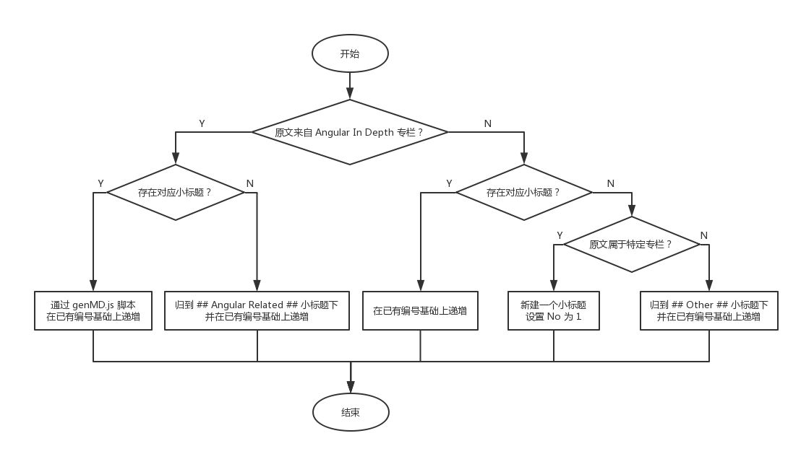

# 关于贡献

## 如何上传/更新文章

* 目录：

    * 文章置于 `articles` 目录下。
    * 图片等资源置于 `assets` 目录下。
    * 为了方便管理，我们需要以当前文章的**编号**为名创建一个文件夹，当中存放相关的图片资源。

* 文章的命名格式：编号. +[类型]+文章名称

    * 编号：`<TODO小标题>-<No>` e.g. `angular-related-1` 即 `Angular Related` 小标题下表格中 No.1 的文章的编号
    * 类型：翻译/原创
    * 名称：中英文之间使用 `-` 链接，空格使用 `-` 替代

## 关于 Pull Request

* 关于分支：每个成员为自己专门建一条分支，而无需为每次的 PR 新建一条临时的分支，最终都是 merge 到 master 。
* 关于 PR 的 Review：随便一位 member review 后即可 merge 。

## 翻译规则

* 行文格式：中英文之间需要加一个空格。
* 文内源码：对于文中代码示例，尽可能加上 [StackBlitz](https://stackblitz.com/) 代码示例连接（需要译者自行创建 demo），可方便读者实践运行代码和加深理解。
* 译文规格：译文开头加上原文链接，隔行加上译者（初始翻译者）和校对者（后续修改校对者，自行按照校对时间顺序加入到校对者列表里）。如下所示：

```markdown
> 原文链接：[Original Article Title](original-link)
> 
> 原文作者：[Original Author](home-page-of-original-author)
> 
> 译者：[译者昵称](译者主页)；校对者：[校对者甲昵称](校对者甲主页)，[校对者乙昵称](校对者乙主页)
```

P.S. 来自 Max 的文章经与原作者沟通，在上述基础上需要添加如下内容：

```markdown
> 原技术博文由`Max Koretskyi`撰写发布，他目前于[ag-Grid](https://angular-grid.ag-grid.com/?utm_source=medium&utm_medium=blog&utm_campaign=angularcustom)担任开发大使
> 译者按：开发大使负责确保其所在的公司认真听取社区的声音并向社区传达他们的行动及目标，其作为社区和公司之间的纽带存在。
```

## TODO 文件的使用规则

- 翻译前，如果文章还不在 TODO.md 中，那么你需要按照以下流程更新 TODO.md ：

    

- 翻译时

    - 开始时

        1. `译者` 处填写上 `[自己的名字](个人链接)` P.S. 小组成员直接写`名字`即可
        2. `进度` 处改为 `翻译中`

    - 完成时

        1. 提交 pr

            1. articles/ 放 md 文件
            2. assets/ 放图片等资源
            3. 更新 README.md 中的文章列表

        2. `进度` 处改为 `校验中`
        3. `译文` 处附上链接，e.g. `[中文标题](链接)`

- 转载时

    1. 必须通过原作（译）者的同意
    2. `转载` 处填写 `[转载出处](链接)`
    3. `译文` 处填写 `[转载](链接)`

> P.S. `Angular`,`RxJS`,`NgRx` 下的表格项（即原文）可能存在重复，出现重复的情况下优先更新靠上的表格项，冗余的表格项做软删除（即添加~~删除线~~）处理。

## 关于转载

> P.S. 在已经存在对应译文的情况下，期望优先转载，避免重复劳动。

若转载已经翻译好的译文，可以在评论或者私信里请求译者的同意。模板如下：

```markdown
你好，请问可以转载么？（顺便借楼插下硬广 :P）我们计划在 https://github.com/AngularInDepth/angularindepth 这个项目下陆续翻译 angular in depth 里的文章，以造福国内的 Angular 开发者。我们热爱前端，力求深耕 Angular，欢迎交流讨论和贡献翻译～
```

在征得译者同意后，上传文章[同上](#%E5%A6%82%E4%BD%95%E4%B8%8A%E4%BC%A0%E6%9B%B4%E6%96%B0%E6%96%87%E7%AB%A0)，TODO 文件的修改详见[TODO 文件的使用规则小节](#todo-%E6%96%87%E4%BB%B6%E7%9A%84%E4%BD%BF%E7%94%A8%E8%A7%84%E5%88%99)。
