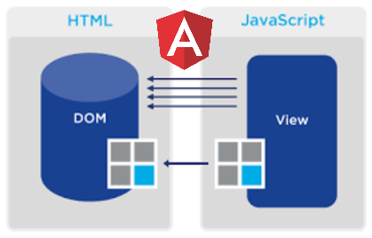

# [译] Angular DOM 更新机制

> 原文链接：**[The mechanics of DOM updates in Angular](https://blog.angularindepth.com/the-mechanics-of-dom-updates-in-angular-3b2970d5c03d)**

> 译者：**[Sunny Liu](https://segmentfault.com/u/lx1036/articles)**；校对者：**[Sunny Liu](https://segmentfault.com/u/lx1036/articles)**



由模型变化触发的 DOM 更新是所有前端框架的重要功能，当然 Angular 也不例外。定义一个如下模板表达式：

```html
<span>Hello {{name}}</span>
```

或者类似下面的属性绑定：

```html
<span [textContent]="'Hello ' + name"></span>
```

当每次 `name` 值发生变化时，Angular 会神奇般的自动更新 DOM 元素（注：最上面代码是更新 **[DOM 文本节点](https://developer.mozilla.org/en-US/docs/Web/API/Text)**，上面代码是更新 **[DOM 元素节点](https://developer.mozilla.org/en-US/docs/Web/API/Element)**，两者是不一样的，下文解释）。这表面上看起来很简单，但是其内部工作相当复杂。而且，DOM 更新仅仅是 Angular **[变更检测机制](https://hackernoon.com/everything-you-need-to-know-about-change-detection-in-angular-8006c51d206f)** 的一部分，变更检测机制主要由以下三步组成：

* DOM updates（注：即本文将要解释的内容）
* child components `Input` bindings updates
* query list updates

本文主要探索变更检测机制的渲染部分（即 DOM updates 部分）。如果你之前也对这个问题很好奇，可以继续读下去，绝对让你茅塞顿开。

在引用相关源码时，假设程序是以生产模式运行。让我们开始吧！

## 程序内部架构
在探索 DOM 更新之前，我们先搞清楚 Angular 程序内部究竟是如何设计的，简单回顾下吧。

### 视图
从我的这篇文章 **[Here is what you need to know about dynamic components in Angular](https://blog.angularindepth.com/here-is-what-you-need-to-know-about-dynamic-components-in-angular-ac1e96167f9e)** 知道 Angular 编译器会把程序中使用的组件编译为一个工厂类（factory）。例如，下面代码展示 Angular 如何从工厂类中创建一个组件：

```ts
const factory = r.resolveComponentFactory(AComponent);
componentRef: ComponentRef<AComponent> = factory.create(injector);
```

Angular 使用这个工厂类来实例化 **[ViewDefinition](https://github.com/angular/angular/blob/7.0.4/packages/core/src/view/types.ts#L51-L73)** ，然后使用 **[viewDef](https://github.com/angular/angular/blob/7.0.4/packages/core/src/view/view.ts#L23-L152)** 函数来 **[创建视图对象](https://github.com/angular/angular/blob/7.0.4/packages/core/src/view/view.ts#L227-L243)**。**Angular 内部把一个程序看作为一颗视图树**，一个程序虽然有众多组件，但使用一个公共的视图接口来定义由组件生成的视图结构，当然 Angular 使用每一个组件对象来创建对应的视图，从而由多个视图组成视图树。

### 组件工厂
组件工厂大部分代码是由编译器生成的不同视图节点组成的，这些视图节点是通过模板解析生成的。假设定义一个组件的模板如下：

```html
<span>I am {{name}}</span>
```

编译器会解析这个模板生成包含如下类似的组件工厂代码：

```ts
function View_AComponent_0(l) {
    return jit_viewDef1(0,
        [
          jit_elementDef2(0,null,null,1,'span',...),
          jit_textDef3(null,['I am ',...])
        ], 
        null,
        function(_ck,_v) {
            var _co = _v.component;
            var currVal_0 = _co.name;
            _ck(_v,1,0,currVal_0);
```

上面代码描述了视图的结构，并在实例化组件时会被调用。`jit_viewDef_1` 其实就是创建视图的 **[viewDef](https://github.com/angular/angular/blob/7.0.4/packages/core/src/view/view.ts#L23-L152)** 函数。

**viewDef** 函数的第二个参数 **[nodes](https://github.com/angular/angular/blob/7.0.4/packages/core/src/view/types.ts#L102-L152)** 有些类似 html 中节点的意思，但却不仅仅如此。上面代码中第二个参数是一个数组，其第一个数组元素 `jit_elementDef_2` 是元素节点定义，第二个数组元素 `jit_textDef_3` 是文本节点定义。Angular 编译器会生成很多不同的节点定义，节点类型是由 **[NodeFlags](https://github.com/angular/angular/blob/7.0.4/packages/core/src/view/types.ts#L154-L202)** 设置的。稍后我们将看到 Angular 如何根据不同节点类型来做 DOM 更新。

本文只对元素和文本节点感兴趣：

```ts
export const enum NodeFlags {
    TypeElement = 1 << 0, 
    TypeText = 1 << 1
```

让我们简要撸一遍。

> 注：上文核心就是，**程序是一堆视图组成的，而每一个视图又是由不同类型节点组成的。而本文只关心元素节点和文本节点，至于还有个重要的指令节点在另一篇文章。**

### 元素节点的结构定义
**[元素节点结构](https://github.com/angular/angular/blob/7.0.4/packages/core/src/view/types.ts#L243-L265)** 是 Angular 编译每一个 html 元素生成的节点结构，它也是用来生成组件的，如对这点感兴趣可查看 **[Here is why you will not find components inside Angular](https://blog.angularindepth.com/here-is-why-you-will-not-find-components-inside-angular-bdaf204d955c)**。元素节点也可以包含其他元素节点和文本节点作为子节点，子节点数量是由 `childCount` 设置的。 

所有元素定义是由 **[elementRef](https://github.com/angular/angular/blob/7.0.4/packages/core/src/view/element.ts#L58-L149)** 函数生成的，上文工厂函数中的 `jit_elementDef_2()` 就是这个函数。`elementRef()` 主要有以下几个一般性参数：

Name | Description
---| ---
childCount | specifies how many children the current element have
namespaceAndName | the name of the html element（注：如 'span'）
fixedAttrs | attributes defined on the element

还有其他的几个具有特定性能的参数：

Name | Description
--- | ---
matchedQueriesDsl | used when querying child nodes
ngContentIndex | used for node projection
**bindings** | **used for dom and bound properties update**
outputs, handleEvent | used for event propagation

本文主要对 **bindings** 感兴趣。

> 注：从上文知道视图（view）是由不同类型节点（nodes）组成的，而元素节点（element nodes）是由 **[elementRef](https://github.com/angular/angular/blob/7.0.4/packages/core/src/view/element.ts#L58-L149)** 函数生成的，元素节点的结构是由 **[ElementDef](https://github.com/angular/angular/blob/7.0.4/packages/core/src/view/types.ts#L243-L265)** 定义的。


### 文本节点的结构定义
**[文本节点结构](https://github.com/angular/angular/blob/7.0.4/packages/core/src/view/types.ts#L300)** 是 Angular 编译每一个 **[html 文本](https://developer.mozilla.org/en/docs/Web/API/Node/nodeType#Constants)** 生成的节点结构。通常它是元素定义节点的子节点，就像我们本文的示例那样（注：`<span>I am {{name}}</span>`，`span` 是元素节点，`I am {{name}}` 是文本节点，也是 `span` 的子节点）。这个文本节点是由 **[textDef](https://github.com/angular/angular/blob/7.0.4/packages/core/src/view/text.ts#L12-L51)** 函数生成的。它的第二个参数以字符串数组形式传进来（注： Angular v7.* 是第三个参数）。例如，下面的文本：

```html
<h1>Hello {{name}} and another {{prop}}</h1>
```

将要被解析为一个数组：

```
["Hello ", " and another ", ""]
```

然后被用来生成正确的绑定：

```
{
  text: 'Hello',
  bindings: [
    {
      name: 'name',
      suffix: ' and another '
    },
    {
      name: 'prop',
      suffix: ''
    }
  ]
}
```

在脏检查阶段会这么用来生成文本：

```ts
text
+ context[bindings[0][property]] + context[bindings[0][suffix]]
+ context[bindings[1][property]] + context[bindings[1][suffix]]
```

> 注：同上，文本节点是由 **[textDef](https://github.com/angular/angular/blob/7.0.4/packages/core/src/view/text.ts#L12-L51)** 函数生成的，结构是由 **[TextDef](https://github.com/angular/angular/blob/7.0.4/packages/core/src/view/types.ts#L300)** 定义的。既然已经知道了两个节点的定义和生成，那节点上的属性绑定， Angular 是怎么处理的呢？

### 节点的绑定
Angular 使用 **[BindingDef](https://github.com/angular/angular/blob/7.0.4/packages/core/src/view/types.ts#L204-L211)** 来定义每一个节点的绑定依赖，而这些绑定依赖通常是组件类的属性。在变更检测时 Angular 会根据这些绑定来决定如何更新节点和提供上下文信息。具体哪一种操作是由 **[BindingFlags](https://github.com/angular/angular/blob/7.0.4/packages/core/src/view/types.ts#L213-L224)** 决定的，下面列表展示了具体的 DOM 操作类型：

Name | Construction in template
--- | ---
TypeElementAttribute | attr.name
TypeElementClass | class.name
TypeElementStyle | style.name

元素和文本定义根据这些编译器可识别的绑定标志位，内部创建这些绑定依赖。每一种节点类型都有着不同的绑定生成逻辑。


## 更新渲染器
最让我们感兴趣的是 `jit_viewDef_1` 中最后那个参数：

```
function(_ck,_v) {
   var _co = _v.component;
   var currVal_0 = _co.name;
   _ck(_v,1,0,currVal_0);
});
```

这个函数叫做 **[updateRenderer](https://github.com/angular/angular/blob/7.0.4/packages/core/src/view/types.ts#L78)**。它接收两个参数：`_ck` 和 `_v`。`_ck` 是 `check` 的简写，其实就是 **[prodCheckAndUpdateNode](https://github.com/angular/angular/blob/7.0.4/packages/core/src/view/services.ts#L327-L335)** 函数，而 `_v` 就是当前视图对象。`updateRenderer` 函数会在 **[每一次变更检测时](https://hackernoon.com/everything-you-need-to-know-about-change-detection-in-angular-8006c51d206f#bbd8)** 被调用，其参数 `_ck` 和 `_v` 也是这时被传入。

`updateRenderer` 函数逻辑主要是，从组件对象的绑定属性获取当前值，并调用 `_ck` 函数，同时传入视图对象、视图节点索引和绑定属性当前值。重要一点是 Angular 会为每一个视图执行 DOM 更新操作，所以必须传入视图节点索引参数（注：这个很好理解，上文说了 Angular 会依次对每一个 view 做模型视图同步过程）。你可以清晰看到 `_ck` 参数列表：

```ts
function prodCheckAndUpdateNode(
    view: ViewData, 
    nodeIndex: number, 
    argStyle: ArgumentType, 
    v0?: any, 
    v1?: any, 
    v2?: any,
```

`nodeIndex` 是视图节点的索引，如果你模板中有多个表达式：

```html
<h1>Hello {{name}}</h1>
<h1>Hello {{age}}</h1>
```

编译器生成的 `updateRenderer` 函数如下：

```ts
var _co = _v.component;

// here node index is 1 and property is `name`
var currVal_0 = _co.name;
_ck(_v,1,0,currVal_0);

// here node index is 4 and bound property is `age`
var currVal_1 = _co.age;
_ck(_v,4,0,currVal_1);
```

---

## 更新 DOM
现在我们已经知道 Angular 编译器生成的所有对象（注：已经有了 view，element node，text node 和 updateRenderer 这几个道具），现在我们可以探索如何使用这些对象来更新 DOM。

从上文我们知道变更检测期间 `updateRenderer` 函数传入的一个参数是 `_ck` 函数，而这个函数就是 **[prodCheckAndUpdateNode](https://github.com/angular/angular/blob/7.0.4/packages/core/src/view/services.ts#L327-L335)**。这个函数在继续执行后，最终会调用 **[checkAndUpdateNodeInline](https://github.com/angular/angular/blob/7.0.4/packages/core/src/view/view.ts#L420-L438)** ，如果绑定属性的数量超过 10，Angular 还提供了 **[checkAndUpdateNodeDynamic](https://github.com/angular/angular/blob/7.0.4/packages/core/src/view/view.ts#L440-L455)** 这个函数（注：两个函数本质一样）。

`checkAndUpdateNodeInline` 函数会根据不同视图节点类型来执行对应的检查更新函数：

```ts
case NodeFlags.TypeElement   -> checkAndUpdateElementInline
case NodeFlags.TypeText      -> checkAndUpdateTextInline
case NodeFlags.TypeDirective -> checkAndUpdateDirectiveInline
```

让我们看下这些函数是做什么的，至于 `NodeFlags.TypeDirective` 可以查看我写的文章 **[The mechanics of property bindings update in Angular](https://medium.com/@maximus.koretskyi/the-mechanics-of-property-bindings-update-in-angular-39c0812bc4ce)** 。

> 注：因为本文只关注 `element node 和 text node`。

### 元素节点
对于元素节点，会调用函数 **[checkAndUpdateElementInline](https://github.com/angular/angular/blob/7.0.4/packages/core/src/view/element.ts#L204-L220)** 以及 **[checkAndUpdateElementValue](https://github.com/angular/angular/blob/7.0.4/packages/core/src/view/element.ts#L230-L257)**，`checkAndUpdateElementValue` 函数会检查绑定形式是否是 `[attr.name, class.name, style.some]` 或是属性绑定形式：

```ts
case BindingFlags.TypeElementAttribute -> setElementAttribute
case BindingFlags.TypeElementClass     -> setElementClass
case BindingFlags.TypeElementStyle     -> setElementStyle
case BindingFlags.TypeProperty         -> setElementProperty;
```
 
然后使用渲染器对应的方法来对该节点执行对应操作，比如使用 `setElementClass` 给当前节点 `span` 添加一个 `class`。

### 文本节点
对于文本节点类型，会调用 **[checkAndUpdateTextInline](https://github.com/angular/angular/blob/7.0.4/packages/core/src/view/text.ts#L64-L97)** ，下面是主要部分：

```ts
if (checkAndUpdateBinding(view, nodeDef, bindingIndex, newValue)) {
    value = text + _addInterpolationPart(...);
    view.renderer.setValue(DOMNode, value);
}
```

它会拿到 `updateRenderer` 函数传过来的当前值（注：即上文的 `_ck(_v,4,0,currVal_1);`），与上一次变更检测时的值相比较。视图数据包含有 **[oldValues](https://github.com/angular/angular/blob/7.0.4/packages/core/src/view/types.ts#L359)** 属性，如果属性值如 `name` 发生变化，Angular 会使用最新 `name` 值合成最新的字符串文本，如 `Hello New World`，然后使用渲染器更新 DOM 上对应的文本。

> 注：更新元素节点和文本节点都提到了渲染器（renderer），这也是一个重要的概念。每一个视图对象都有一个 **[renderer](https://github.com/angular/angular/blob/master/packages/core/src/view/types.ts#L345)** 属性，即是 **[Renderer2](https://github.com/angular/angular/blob/master/packages/core/src/render/api.ts#L146)** 的引用，也就是组件渲染器，DOM 的实际更新操作由它完成。因为 Angular 是跨平台的，这个 Renderer2 是个接口，这样根据不同 Platform 就选择不同的 Renderer。比如，在浏览器里这个 Renderer 就是 DOMRenderer，在服务端就是 ServerRenderer，等等。**从这里可看出，Angular 框架设计做了很好的抽象。**

## 结论
我知道有大量难懂的信息需要消化，但是只要理解了这些知识，你就可以更好的设计程序或者去调试 DOM 更新相关的问题。我建议你按照本文提到的源码逻辑，使用调试器或 debugger 语句一步步去调试源码。


