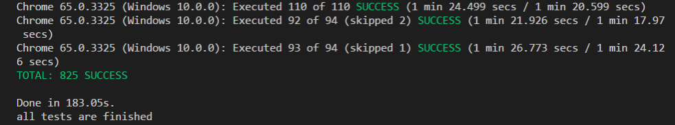

# [译] Angular 单元测试性能提升

> * 原文连接：**[Angular Unit Testing performance](https://blog.angularindepth.com/angular-unit-testing-performance-34363b7345ba)**
> * 译者：**[Sunny Liu](https://segmentfault.com/u/lx1036/articles)**；
> * 校对者：


> 注：这篇文章提出了两个优化测试性能很精巧的方式，尤其是每个测试套件内重用编译结果的优化方式。翻译出来供大家结合自己的项目，参考学习并使用。如果你的 Angular 项目还没有测试，且是个长期维护的项目，别偷懒了，赶紧加上代码测试吧。

如今有大量的测试框架和工具，如：Jasmine、Mocha、Chai、Karma 和 Wallaby.JS。尽管有些工具会更加受欢迎，如 Jest，但是我们不得不慎重决定使用哪一套测试工具，针对我们的企业级软件，这是个艰难又复杂的问题。

本文我将以我们项目中使用的 Jasmine 和 Karma（**Angular 官方默认的**）为例，谈谈如何提升 Angular 测试代码的性能。

## 普遍实践
我不会深入讨论该写哪些测试，以及你该如何测试你的 Angular 组件，很多文章都讨论过如何去做，如 Viktor Savkin（注：@angular/router 等 Angular 核心包的作者）写的这篇文章 **[Three Ways to Test Angular Components](https://vsavkin.com/three-ways-to-test-angular-2-components-dcea8e90bd8d)** （注：科学上网），如果你还没读过，强烈建议你读一读。

回到我们的测试性能话题，我们的软件重度使用了组件测试和集成测试，当然我们也有服务层的隔离测试和单元测试，但是我们的软件项目尽可能多写集成测试，少写 E2E 测试。

那么我们该如何去写这些测试呢？**[Angular 官网](https://angular.cn/guide/testing)** 一般建议这样写：

```
describe('BannerComponent', () => {
  let component: BannerComponent;
  let fixture: ComponentFixture<BannerComponent>;

  beforeEach(async(() => {
    TestBed.configureTestingModule({
      declarations: [ BannerComponent ]
    })
    .compileComponents();
  }));

  beforeEach(() => {
    fixture = TestBed.createComponent(BannerComponent);
    component = fixture.componentInstance;
    fixture.detectChanges();
  });

  it('should create', () => {
    expect(component).toBeDefined();
  });
})
```

这个示例很简单，初看起来觉得一切都没问题，TestBed 对象会编译模块和组件。

但是假设一个测试套件内有几十个测试，且被测试的组件很庞大，逻辑也很复杂，那运行每一个测试都需要重新编译组件，这会导致测试时间急剧上升。当上升到一定值后，大约 75% 的时间被浪费在了编译组件上，而不是花在测试运行上。

我们能解决这个问题吗？可以，但是首先我们需要了解这个问题的根源在哪。

## Testbed
首先我们需要知道，Angular 在启动测试初始时，会执行如下代码（注：查看 **[L18-L28](https://github.com/angular/angular/blob/7.0.4/packages/core/testing/src/before_each.ts#L18-L28)**）：

```ts
import {resetFakeAsyncZone} from './fake_async';
import {TestBed} from './test_bed';
declare var global: any;
const _global = <any>(typeof window === 'undefined' ? global : window);
// Reset the test providers and the fake async zone before each test.
if (_global.beforeEach) {
  _global.beforeEach(() => {
    TestBed.resetTestingModule();
    resetFakeAsyncZone();
  });
}
```

从上文中可看出，在运行每一个测试前，Angular 会重置测试模块。那么 `TestBed.resetTestingModule()` 实际做了哪些事（注：可查看 **[L321-L353](https://github.com/angular/angular/blob/7.0.4/packages/core/testing/src/test_bed.ts#L321-L353)**）：

```ts
resetTestingModule() {
    clearOverrides();
    this._aotSummaries = [];
    this._templateOverrides = [];
    this._compiler = null !;
    this._moduleOverrides = [];
    this._componentOverrides = [];
    this._directiveOverrides = [];
    this._pipeOverrides = [];

    this._isRoot = true;
    this._rootProviderOverrides = [];

    this._moduleRef = null !;
    this._moduleFactory = null !;
    this._compilerOptions = [];
    this._providers = [];
    this._declarations = [];
    this._imports = [];
    this._schemas = [];
    this._instantiated = false;
    this._activeFixtures.forEach((fixture) => {
      try {
        fixture.destroy();
      } catch (e) {
        console.error('Error during cleanup of component', {
          component: fixture.componentInstance,
          stacktrace: e,
        });
      }
    });
    this._activeFixtures = [];
}
```

该函数会清除所有的 `overrides, modules, module factories, active fixtures`，如果可以保存编译后的模块工厂对象，就可以不用通过重新编译模块就能获得组件和服务对象了。

现在让我们回顾下：我们想要 Angular 在每个测试套件内只对组件编译一次，然而 Angular 实际上会在每个测试开始前重置模块，从而导致每个组件重新编译。**如果能够迫使 Angular 不清除编译结果而是重用，就可以解决性能问题了，当然仍然得清除其他对象，使得测试具有隔离性。**

如果仔细研究 **TestBed** 对象的其他方法，就会发现大多数共有方法内有个有趣的变量 **[_instantiated](https://github.com/angular/angular/blob/7.0.4/packages/core/testing/src/test_bed.ts#L254)**（或者 **[_initIfNeeded()](https://github.com/angular/angular/blob/7.0.4/packages/core/testing/src/test_bed.ts#L391-L428)** 方法内最终还是会检查这个变量）：

```ts
get(token: any, notFoundValue: any = Injector.THROW_IF_NOT_FOUND) {
    this._initIfNeeded();
    if (token === TestBed) {
      return this;
    }
    const result = this._moduleRef.injector.get(token, UNDEFINED);
    return result === UNDEFINED ? this._compiler.injector.get(token, notFoundValue) : result;
  }

…

compileComponents(): Promise<any> {
    if (this._moduleFactory || this._instantiated) {
      return Promise.resolve(null);
    }
   const moduleType = this._createCompilerAndModule();
    return this._compiler.compileModuleAndAllComponentsAsync(moduleType)
        .then((moduleAndComponentFactories) => {
          this._moduleFactory = moduleAndComponentFactories.ngModuleFactory;
        });
  }
```

**我们想要在上一个测试运行完能够保留编译后的组件工厂对象，貌似 `_initIfNeeded()` 方法可以帮我们做到这一点。** 如果 **_instantiated** 变量是 false，TestBed 会重新创建测试所需要的组件、新的 zone 对象和模块对象，但是如果模块工厂对象已经存在了，就不会再重新创建这些对象了：

```ts
private _initIfNeeded() {
    if (this._instantiated) {
      return;
    }
    if (!this._moduleFactory) {
      try {
        const moduleType = this._createCompilerAndModule();
        this._moduleFactory =
this._compiler.compileModuleAndAllComponentsSync(moduleType).ngModuleFactory;
      } catch (e) {
        const errorCompType = this._compiler.getComponentFromError(e);
        if (errorCompType) {
          throw new Error(
              `This test module uses the component ${stringify(errorCompType)} which is using a "templateUrl" or "styleUrls", but they were never compiled. ` +
              `Please call "TestBed.compileComponents" before your test.`);
        } else {
          throw e;
        }
      }
    }
    for (const {component, templateOf} of this._templateOverrides) {
      const compFactory = this._compiler.getComponentFactory(templateOf);
      overrideComponentView(component, compFactory);
    }
    const ngZone = new NgZone({enableLongStackTrace: true});
    const providers: StaticProvider[] = [{provide: NgZone, 
useValue: ngZone}];
    const ngZoneInjector = Injector.create({
      providers: providers,
      parent: this.platform.injector,
      name: this._moduleFactory.moduleType.name
    });
    this._moduleRef = this._moduleFactory.create(ngZoneInjector);
    (this._moduleRef.injector.get(ApplicationInitStatus) as any).runInitializers();
    this._instantiated = true;
 }
```

我们前端团队经过了激烈讨论，并参考了 Github issues 上有关测试性能的讨论 **[TestBed performance discussion](https://github.com/angular/angular/issues/12409)** （注：这个 issue 2016 年就在讨论如何改进测试性能，最后还是本文作者 2018 年提出的这个优化技巧一锤定音），最后我们想出了通过以下方式来给 TestBed 打补丁来解决问题：

> 注：该优化方式，一句话解释就是在每一个 test suite 的 beforeAll() 内使用 compileComponents() 只编译一次 module 和 component 为 ModuleFactory 和 ComponentFactory，因为这个编译过程是最耗时的，然后在该 test suite 内的所有 test case 都重用编译的结果 ModuleFactory 和 ComponentFactory，然后在 afterAll() 内恢复现场。

> 更简单的解释就是 **[_moduleFactory](https://github.com/angular/angular/blob/7.1.0/packages/core/testing/src/test_bed.ts#L395)** 不要在每一个 test case 运行完后被重置。

> 实际山，就是这段编译过程代码 **[L395-L410(最耗时代码)](https://github.com/angular/angular/blob/7.1.0/packages/core/testing/src/test_bed.ts#L395-L410)** 在每一个 test suite 只运行一次。

```ts
/**
 * Reconfigures current test suit to prevent angular components compilation after every test run.
 * Forces angular test bed to re-create zone and all injectable services by directly
 * changing _instantiated to false after every test run.
 * Cleanups all the changes and reverts test bed configuration after suite is finished.
 */
export const configureTestSuite = () => {
  const testBedApi: any = getTestBed();
  const originReset = TestBed.resetTestingModule;

  beforeAll(() => {
    TestBed.resetTestingModule();
    TestBed.resetTestingModule = () => TestBed;
  });

  afterEach(() => {
      testBedApi._activeFixtures.forEach((fixture: ComponentFixture<any>) => fixture.destroy());
      testBedApi._instantiated = false;
  });

  afterAll(() => {
      TestBed.resetTestingModule = originReset;
      TestBed.resetTestingModule();
  });
};
```

让我们做个小 demo 比较下效果咋样，我准备了一个测试套件，包含9个测试，代码如下：

```ts
describe('#productions Production wizard bates settings', () => {

    beforeEach(done => (async () => {
        TestBed.configureTestingModule({
            imports: modules,
            providers: [defaultGlobalProvidersForTests]
        });

        TestBed.overrideModule(ProductionsModule, overrides);

        await TestBed.compileComponents();
    })().then(done).catch(done.fail));

    describe('number component ', () => {
        let ctx: TestCtx<BatesNumberHostComponent>;
        let page: BatesNumberPage;

        beforeEach(async(async () => {
            ctx = await TestBedHelper.createContext(BatesNumberHostComponent);
            page = new BatesNumberPage(ctx.fixture);
        }));

// actual tests go below
....
```

我的机器配置：


总共花费了 ~24 秒跑完了测试：


现在加上补丁代码，看看效果咋样。关键有两点：在测试套件内调用 `configureTestSuite()`；使用 `beforeAll` 替换 `beforeEach` 来为测试套件配置初始数据（注：当前 test suite 内所有 test case 都是使用同一个临时的 Testing Module，所以写在 beforeAll 里，而不是 beforeEach 里）。现在代码如下：

```ts
describe('#productions Production wizard bates settings', () => {

    configureTestSuite();

    beforeAll(done => (async () => {
        TestBed.configureTestingModule({
            imports: modules,
            providers: [defaultGlobalProvidersForTests]
        });

        TestBed.overrideModule(ProductionsModule, overrides);

        await TestBed.compileComponents();
    })().then(done).catch(done.fail));

    describe(' number component ', () => {
        let ctx: TestCtx<BatesNumberHostComponent>;
        let page: BatesNumberPage;

        beforeEach(async(async () => {
            ctx = await TestBedHelper.createContext(BatesNumberHostComponent);
            page = new BatesNumberPage(ctx.fixture);
        }));
 ...
```

现在花费时间大约 ~8 秒：


**性能提升有 3 倍之多**，但是记住最终结果依据测试套件数量而定，**你的测试套件越多，你就越能感觉到这个方案的强大之处**。

现在已经向前迈了一大步，我们的测试性能也更高，但是我们还可以做得更好。

## Karma 并行运行测试
如果 Karma 能够并行运行测试，那就前进一大步了，很可惜，Karma 开箱不支持。

然而，社区真是太棒了，提供了很多插件，**[karma-parallel](https://www.npmjs.com/package/karma-parallel)** 插件就是我们一直心心向往的。尽管这个插件比较新，但值得一试。

原理上，该插件在单个 Karma 服务器上创建多个浏览器对象（注：Karma 内部是 Client/Server 结构，有兴趣可查看 **[karma 测试框架的前世今生](http://taobaofed.org/blog/2016/01/08/karma-origin/)**），每个浏览器对象下载所有的测试文件，但是某个测试代码块需要运行时，根据某种分配算法决定使用哪个浏览器对象去运行该测试代码块，从而不需要改变编译过程，就可以把测试代码分割成多个部分，运行在多个浏览器对象上。

我们仅仅需要稍稍修改 Karma 配置文件，就可以运行了：

```js
...
    frameworks: [
        'parallel',
        'jasmine'
    ],
    plugins: [
        "karma-jasmine",
        "karma-chrome-launcher",
        "karma-junit-reporter",
        "karma-spec-reporter",
        "karma-parallel"
    ],
    parallelOptions: {
        executors: (Math.ceil(require('os').cpus().length / 2)),
        shardStrategy: 'round-robin'
    },
    ...
```

用我们的实际项目来验证下，共有 825 个测试（注：有大约 5 倍的速度提升）：

**优化前：**


**优化后：**




## 总结
本文我使用了两种方式来提高组件测试的性能，测试工具针对 Jasmine + Karma + Angular 测试工具：
* 第一种方式是通过给 Angular 的 TestBed 打补丁的方式，可以在每一个测试套件内运行测试时，缓存并重用编译结果
* 第二种方式是通过使用 **karma-parallel** 插件，在 Karma 内并行运行测试

你可以只使用某一种方式，但是两个都使用岂不是更好。

最后，我把本文的优化方式的代码做了个 npm 包 **[ng-bullet](https://www.npmjs.com/package/ng-bullet)**，这个包里的代码经过了细致打磨，还添加了一些辅助方法来简化你的测试，希望你能喜欢。（注：本文的优化方式比较精巧，但是工作量不大，原理也比较好懂，不需要在自己项目里引入它的这个包，直接自己写就行，就几个函数而已，且这个包的 TypeScript 源码还没有放在 Github 上，作者说这是公司需要不便于公开，只能看到编译后的 JS 代码）

