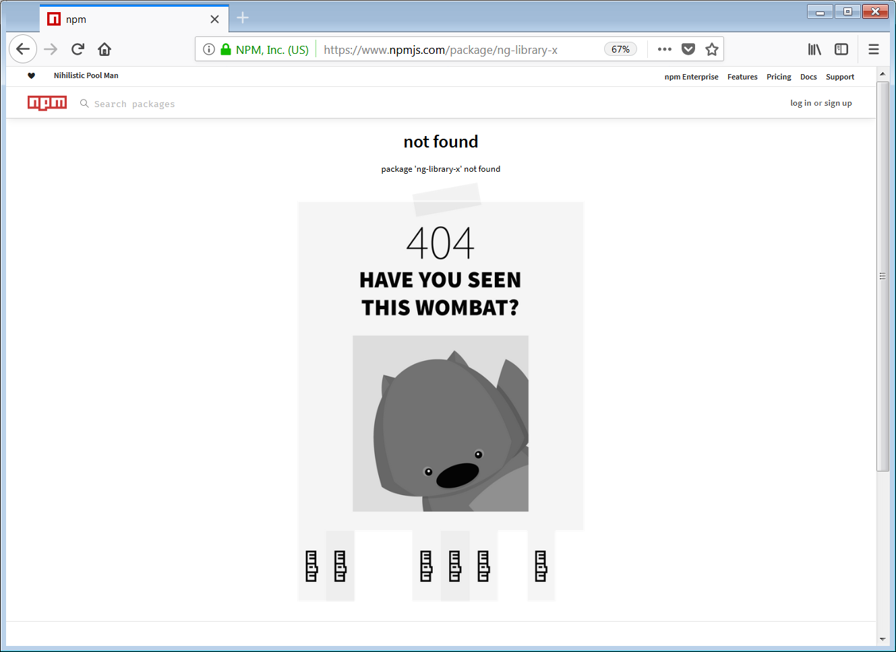
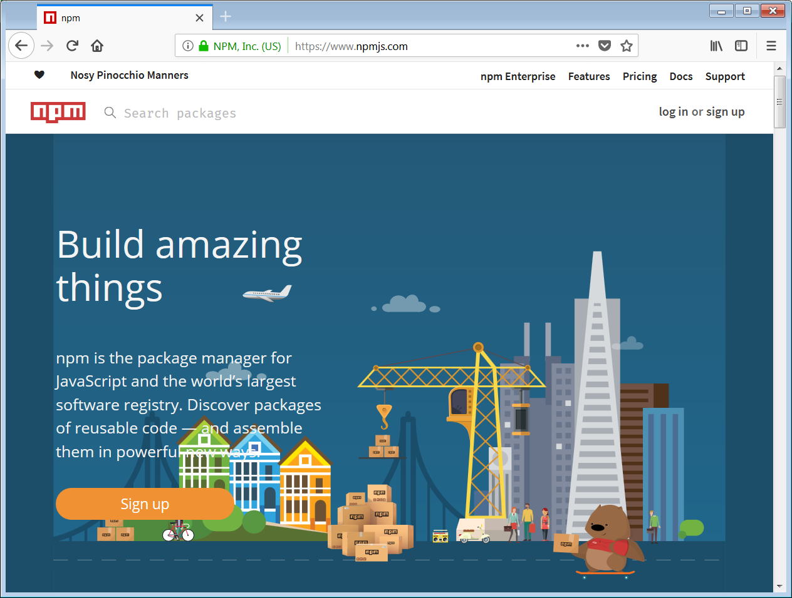

# [翻译] Angular Libary 系列之 发布

在 npm 上 发布你的 Angular 库。

> 原文链接： [The Angular Library Series — Publishing](https://blog.angularindepth.com/the-angular-library-series-publishing-ce24bb673275)

> 原文作者： [Todd Palmer](https://blog.angularindepth.com/@palmer_todd?source=post_header_lockup)

> 译者按：本文使用 库 指代 Angular Library 的概念。
> 
> 本文是 Angular Libaray 系列的第三篇文章，本系列共有三篇文章，涵盖从创建到打包再到发布的全套流程。
> 
> 为了行文方便，以下均以我/我们指代原作者。

<p align="center"> 
    
</p>

迄今为止，如果按部就班你应该已经创建并构建了属于你自己的 Angular 库。在我们开讲包的依赖这一部分之前我想说点轻松的让大家在这个系列中喘口气，我将会在本篇中教你如何通过 [npm](https://www.npmjs.com/) 向世界分享你的 Angular 库。

## Angular 库系列

本文是我的 **Angular 库系列文章** 的第三篇。在你阅读这篇文章之前，你需要对系列的前两篇文章有一个基本的了解：

1. [Angular Library 系列之使用 Angular CLI 创建 Library](https://github.com/sawyerbutton/angularindepth/blob/master/articles/angular-78.%5B%E7%BF%BB%E8%AF%91%5D-Angular-Library-%E7%B3%BB%E5%88%97%E4%B9%8B%E4%BD%BF%E7%94%A8-Angular-CLI-%E5%88%9B%E5%BB%BA-Library.md)
2. [Angular Library 系列之构建和打包]()
3. [Angular Library 系列之发布]()

## 一个例子

按照之前 **Angular Library 系列**文章中的教程，我成功创建了一个 Angular 库： **ng-example-library**。

这个库的源代码在我的 [Github](https://github.com/t-palmer/ng-example-library) 上。

在本文中我会展示我是如何将这个库发布到 npm 的 [这个页面](https://www.npmjs.com/package/ng-example-library)上的。

## 给你的 Angular 库命名

为了将你的 Angular 库发布到 npm 上你需要给你库起一个**独一无二的**名字。在你使用 Angular CLI 创建新的库之前，最好先在 npm 上检查一下。因为如果你已经在 Angular 工作区之中创建并命名了一个库，但是之后你发现 npm 上已经有了同名的 npm 包而你必须修改自己的库的名字时，你的表情肯定会是这样😭。

为了检查你想给库起的名字是否已经被使用，你需要前往 npm 的 package 页面。举例来说，如果你想给你的库起个名字 **ng-library-x**，你需要检查这个 url 链接：

[https://www.npmjs.com/package/ng-library-x](https://www.npmjs.com/package/ng-library-x)

比较理想的情况是 该链接展示如下页面：

<p align="center"> 
    
</p>

这代表着这个名字还没有在 npm 上被使用。

当然，有人会说你可以在 npm 上搜索包名而不用这样繁琐。但是直接搜索包名并不会搜索到被弃用的包。事实上，一旦包名在 npm 的注册表中注册，即使这个包已经被弃用，这个包名也不能被其他人使用了。所以让我们在我们的规则中再增加一条：

> 注意：在你创造 Angular 工作区之前，总是先查看你构思的库名称是否已经在 npm 上被使用了。

## package.json 文件太多啦！

提醒一下：你应该还记得当我们创建 Angular 库时，在我们的工作区内至少有三个 **package.json** 文件存在。

- **工作区根目录下的 package.json 文件**
  
  这是我们工作区根目录中的**主 package.json** 文件。

- **库项目 package.json 文件**

  该文件位于 **projects\ng-example-library** 目录下，并且通知 **ng-packagr** 什么信息会添加进与 构建我们的库 息息相关的**package.json** 文件中。

- **用于发布的库的  package.json 文件**

  当构建我们的库时，该 package.json 文件将会由 **ng-packagr** 创建于 **dist\ng-example-library** 目录下。

如果上述有任何内容对你而言并不是很清楚，请查看我的上一篇文章[构建和打包](https://blog.angularindepth.com/creating-a-library-in-angular-6-part-2-6e2bc1e14121)中的 **package.json** 相关内容。

## 指定库的版本

现在看看我们的**库项目的 package.json文件**。我的文件如下所示：

```json
{
  "name": "ng-example-library",
  "version": "1.0.0",
  "peerDependencies": {
    "@angular/common": "^6.0.0-rc.0 || ^6.0.0",
    "@angular/core": "^6.0.0-rc.0 || ^6.0.0"
  }
}
```

我们对名称和版本的栏目比较感兴趣。现在暂时地，我们可以先忽略 `peerDependencies`，我们会在下一篇文章讨论这个部分。

注意 npm 只允许你一次发布一个 由指定名称和版本构成的组合。因此，每次在 npm 上对你的库发布更新时，都需要更改版本号。一般来说，除非你有非常合理的理由去做自定义修正，否则都应当遵守 [Semantic Versioning (SemVer) ](https://semver.org/) 规则。

> 推荐：根据 SemVer 的准则对你的库进行版本更新。

当你构建你的库时，你会在 **dist** 文件夹下对应的 库文件夹 中 **对应的 package.json** 文件中看到版本号被更新。注意，这个 package.json 文件将与你的库一起打包并且对公众可见。在构建库之后，对外发布的库的相关 **package.json** 文件如下所示：

```json
{
  "name": "ng-example-library",
  "version": "1.0.0",
  "peerDependencies": {
    "@angular/common": "^6.0.0-rc.0 || ^6.0.0",
    "@angular/core": "^6.0.0-rc.0 || ^6.0.0"
  },
  "main": "bundles/ng-example-library.umd.js",
  "module": "fesm5/ng-example-library.js",
  "es2015": "fesm2015/ng-example-library.js",
  "esm5": "esm5/ng-example-library.js",
  "esm2015": "esm2015/ng-example-library.js",
  "fesm5": "fesm5/ng-example-library.js",
  "fesm2015": "fesm2015/ng-example-library.js",
  "typings": "ng-example-library.d.ts",
  "metadata": "ng-example-library.metadata.json",
  "sideEffects": false,
  "dependencies": {
    "tslib": "^1.9.0"
  }
}
```

## README 和 License 文件

将你将库发布到 npm 时，npm 会在库的根目录中查找 README 文件。如果 npm 找到了 README 文件，那么它将会使用该文件作为库在 npm 上的首页展示。

记得在上一篇文章[构建和打包](https://blog.angularindepth.com/creating-a-library-in-angular-6-part-2-6e2bc1e14121)中我们在**工作区的 package.json** 创建了一个 npm 脚本 `package`。这个脚本命令用于构建和打包我们的库。但是在执行这个命令之前，我们希望将 **README.md** 文件和 **LICENSE** 复制到 **dist 包** 中。

所以我创建了另一个名为 **copy-files** 的 npm 脚本用于在真正构建之前将上述文件拷贝到相应的文件目录下。这些脚本命令是基于 windows 平台设计的，所以你可能需要根据你的平台对命令进行修改。我的命令如下所示：

```json
"scripts": {
  ...
  "build_lib": "ng build ng-example-library",
  "copy-license": "copy .\\LICENSE .\\dist\\ng-example-library",
  "copy-readme": "copy .\\README.md .\\dist\\ng-example-library",
  "copy-files": "npm run copy-license && npm run copy-readme",
  "npm_pack": "cd dist/ng-example-library && npm pack",
  "package": "npm run build_lib && npm run copy-files && npm run npm_pack",
  ...
},
```

请注意，上述包脚本命令做了三件事：

1. 构建 lib

   构建 Angular 库

2. 复制文件

   复制 **README.md** 和 **LICENSE** 文件到 **dist\ng-example-library** 文件夹中。

3. npm 打包

   将 **dist\ng-example-library** 文件夹打包为 **.tgz** 文件。

## package.json 文件中的更多信息

如果我们现在发布库到 npm 上并在 npm 上查看我们的库，在 **License** 里面我们什么都看不到。这是因为即使在上传的库中有 **License 文件**，但是我们没有在 package.json 文件中涉及任何有关 License 的信息。

事实上，我们有很多内容可以添加到库的 package.json 文件中。npm 在 [npm 中 package.json 文件的种种细节](https://docs.npmjs.com/files/package.json) 一文中给出了完整的文档教程。在此我就不对全文多加赘述了。但是，我会对库发布过程中几个重要的细节进行强调。

记住！我们永远都不应该对**发布版本的 package.json 文件**进行修改。所以如果你想要向发布版本的 package.json 文件中添加内容，你需要将内容添加到**库项目的 package.json** 文件中。

我将会添加如下内容：

- License
  
  License 文件的引用

- Repository

  指向 GitHub 仓库

- Description
- Key words
- Home page

  指向本文

所以现在我的 **库项目的 package.json** 文件如下所示：

```json
{
  "name": "ng-example-library",
  "version": "1.2.0",
  "description": "This is a simple example Angular Library published to npm.",
  "keywords" :["Angular","Library"],
  "license" : "SEE LICENSE IN LICENSE",
  "repository": {
    "type" : "git",
    "url" : "https://github.com/t-palmer/ng-example-library"
  },
  "homepage" :"https://medium.com/@palmer_todd/the-angular-library-series-publishing-ce24bb673275",
  "peerDependencies": {
    "@angular/common": "^6.0.0-rc.0 || ^6.0.0",
    "@angular/core": "^6.0.0-rc.0 || ^6.0.0"
  }
}
```

## 在 npm 上注册

你可以从 npm 上安装任何你想安装的内容。但是如果你想要向 npm 上发布你自己的库/包，你需要创建一个 npm 账户。注册只需提供你的名字，一个用户名和密码以及一个可用的 email 地址。

<p align="center"> 
    
</p>

在注册完成后，记得检查你的邮件进行相关的邮箱验证。

## 登录 npm

npm 提供了 [完整的指引](https://docs.npmjs.com/packages-and-modules/contributing-packages-to-the-registry) 帮助你发布你的包/库。为了你自己考虑你应当去好好读一读这篇指引。为了你的方便考虑，我将关键的步骤抽出来在这里展示给你：

在发布到 npm 之前你需要先通过命令行的方式登录 npm：

```bash
npm login
```

这一命令将会提示你输入你的认证信息和 email 地址。你可以通过如下指令验证你是否登录成功：

```bash
npm whoami
```

## 发布

最后，我们已经做好准备去发布我们的包啦。值得注意的是：我们已经使用了 npm pack 指令，所以我们只需要发布我们的 **.tgz** 文件即可。我的话使用如下指令：

```bash
npm publish ./dist/ng-example-library/ng-example-library-1.2.0.tgz
```

然后我们就可以在 npm 的[这个 URL 上查看已发布的包](https://www.npmjs.com/package/ng-example-library)。

<p align="center"> 
    
</p>

## 即将到来的内容

我希望很快放出 **Angular 库系列**的第四篇文章，其中我们将会讨论 `Dependencies` 的相关内容。