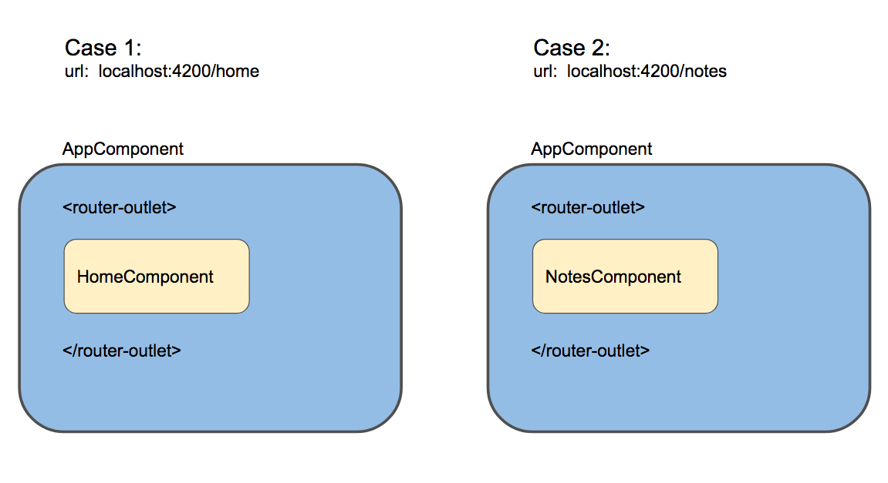
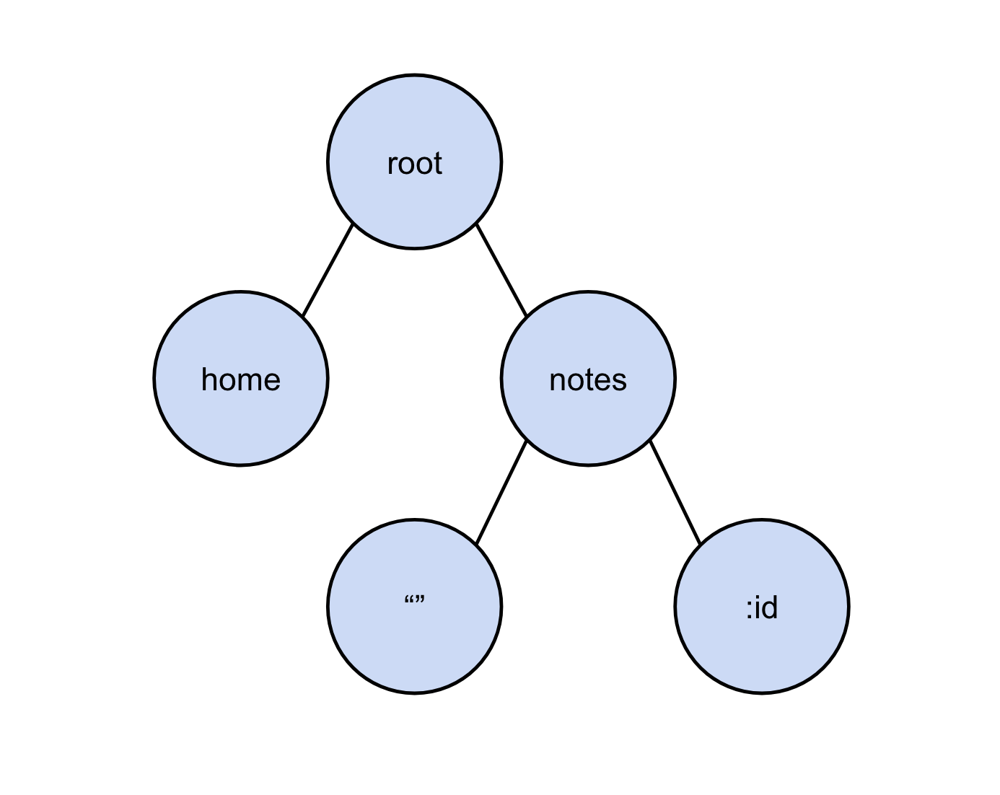
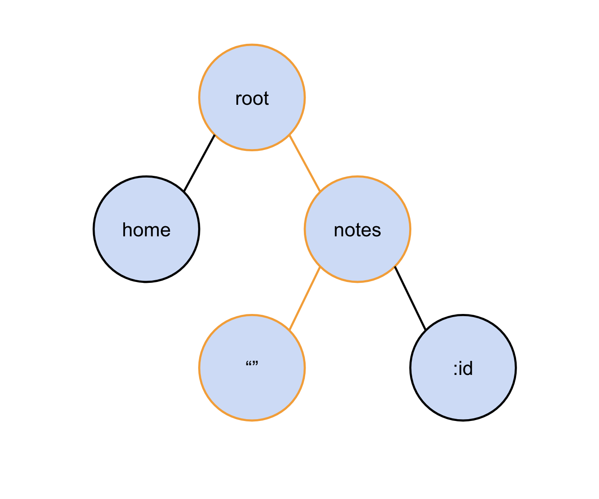

# [翻译] Angular 路由器系列三部曲之概览

> 原文连接：**[The Three Pillars of Angular Routing. Angular Router Series Introduction.](https://blog.angularindepth.com/the-three-pillars-of-angular-routing-angular-router-series-introduction-fb34e4e8758e)**
> 原文作者: **[Nate Lapinski](https://blog.angularindepth.com/@natelapinski)**
> 译者: **[Sunny Liu](https://segmentfault.com/u/lx1036/articles)**；校对者：


**[Angular 路由器](https://angular.io/guide/router)** 是软件工程学的一项奇迹，从导航到路由守卫，到模块懒加载，Angular 路由器对于大多数程序是必不可少的。然而，对于大多数开发者来说，其内部机制依然是个神秘的东西。**本系列会试图带你深入了解路由的内部工作原理**。本文会概括性介绍路由模块的基本架构和一些有用的思维模型，以便理解其工作原理。本系列其他部分会深入讲解路由架构的每一个部分。

深入理解路由会帮你根据你的业务需求去二次开发路由模块，你曾今需要改变路由的一些默认行为吗？谁知道呢，但是**[理解路由模块架构会帮你解决工作中遇到的一些难题](https://youtu.be/pERhnBBae2k?t=328)**。

## A Tree of States
Angular 程序是一棵组件树，有一些组件，如根组件，在整个程序中位置不变。**然而，我们需要动态渲染组件，其中一种方式是使用路由器**。通过使用路由模块的 **[router-outlet 指令](https://angular.io/api/router/RouterOutlet)**，可以根据当前 url 在程序中某个位置渲染一些组件。例如，一个简单地笔记程序，对于一个 Case1 url 你需要渲染 HomeComponent，对于另一个 Case2 url，你可能需要渲染 NotesComponent 展示笔记列表：



路由内部会把这些*可被路由*的组件称为路由状态，路由器会把程序中可被路由的组件作为 **[一棵路由状态树](https://github.com/angular/angular/blob/7.1.3/packages/router/src/router_state.ts)**，上面的示例中，home 页是一个 router state，笔记列表页也是一个 router state。

**路由的核心功能是可以在程序内进行组件导航，并且需要路由器在页面的某个出口处渲染组件，url 还得随渲染状态进行对应的修改**。为此路由器需要把相关 url 和加载的组件绑定到一起，它通过让开发者自定义路由状态，根据指定 url 来渲染对应的组件。

通过在程序内导入 **[RouterModule](https://angular.io/api/router/RouterModule)** 并在 **forRoot** 方法内定义 **[Route](https://github.com/angular/angular/blob/7.1.3/packages/router/src/config.ts#L372-L398)** 对象数组，来定义路由状态，例如，一个简单程序的路由数组定义如下：

```ts
import { RouterModule, Route } from '@angular/router';

const ROUTES: Route[] = [
  { path: 'home', component: HomeComponent },
  { path: 'notes',
    children: [
      { path: '', component: NotesComponent },
      { path: ':id', component: NoteComponent }
    ]
  },
];

@NgModule({
  imports: [
    RouterModule.forRoot(ROUTES)
  ]
})
```

传入的路由对象数组会被构造成如下的一棵路由状态树：



重要的是，任何时候，一些路由状态（即组件的组合）会根据当前的 url 展示在用户屏幕上，该组合就是所谓的 ActivatedRoute。一个 ActivatedRoute 仅仅是所有路由状态树的子树而已，比如，**/nodes** url 会被表示为如下的 ActivatedRoute：



有关路由配置有两个有趣的点：
1. **RouterModule** 有一个 **forChild** 方法，也可以传入 **Route** 对象数组，然而尽管 **forChild** 和 **forRoot** 方法都包含路由指令和配置，但是 **forRoot** 可以返回 **Router** 对象，由于 **Router** 服务会改变 **[浏览器 location 对象](https://developer.mozilla.org/zh-CN/docs/Web/API/Location)**，而 location 对象又是一个全局单例对象，**[所以 Router 服务对象也必须全局单例](https://blog.angularindepth.com/avoiding-common-confusions-with-modules-in-angular-ada070e6891f)**。这就是你必须在根模块中只使用一次 **forRoot** 方法的原因，特性模块中应当使用 **forChild** 方法。 
2. 当匹配到路由路径时，路由状态 **component** 属性定义的组件会被渲染在 **[router-outlet 指令](https://angular.io/api/router/RouterOutlet)** 挂载的地方，即渲染激活组件的动态元素。被渲染的组件会作为 **router-outlet** 元素的兄弟节点而不是子节点，**router-outlet** 元素也可以层层嵌套，形成父子路由关系。

> 注：**[@angular/common/src/location](https://github.com/angular/angular/blob/7.1.3/packages/common/src/location/index.ts)** 提供了更高层级的抽象，不单单针对浏览器平台，提供了很多好用的 API，并暴露了 **[PlatformLocation](https://github.com/angular/angular/blob/7.1.3/packages/common/src/location/platform_location.ts#L32-L48)** 接口供不同平台具体实现；针对具体的浏览器平台，**[BrowserPlatformLocation](https://github.com/angular/angular/blob/7.1.3/packages/platform-browser/src/browser/location/browser_platform_location.ts)** 实现了该接口，并在程序初始化时针对浏览器平台 **[指定对应的 PlatformLocation 实现](https://github.com/angular/angular/blob/7.1.3/packages/platform-browser/src/browser.ts#L29)**

**程序内部导航时，路由器对象会捕捉导航的 url，并与路由状态树中的某个路由状态进行匹配**。比如，上文提到的路由状态树配置：

```ts
const ROUTES: Route[] = [
  { path: 'home', component: HomeComponent },
  { path: 'notes',
    children: [
      { path: '', component: NotesComponent },
      { path: ':id', component: NoteComponent }
    ]
  },
];
```

**localhost:4200/notes/15** url 会被匹配并加载 **NoteComponent** 组件，通过使用其提供的对象如 ActivatedRoute，**NoteComponent** 组件能够访问到参数 **15** 并显示正确的笔记。带有冒号前缀的路径值，如 **:id**，也是一个必选参数，会匹配几乎所有值（本例中是 **15**），但是 **localhost:4200/iamerror** 会匹配失败而报错。

**任意时刻，当前 url 表示当前程序激活路由状态的序列化形式**。路由状态的改变会触发 url 的改变，同时，url 的改变也会触发当前激活路由状态的改变，它们表示的是同一个东西。

**[在本系列的下一篇文章中，我们将看到路由器对象根据路径匹配路由的内部算法](https://blog.angularindepth.com/angular-routing-series-pillar-1-router-states-and-url-matching-12520e62d0fc)**。现在，我们只需要知道它使用的是最先匹配策略，内部实现采用的是第一层级搜索，匹配 url 的第一个路径。

Angular 的路由器如何把程序中所有路由构造为一棵路由状态树是第一步。第二步是导航，描述如何从一个路由状态导航到另一个路由状态。

## 路由器的生命周期
与组件生命周期相同，路由器在每一次路由状态切换时也存在生命周期：


**在每一次导航周期内，路由器会触发一系列事件**。路由器对象也提供了监听路由事件的 observable 对象，用来定义一些自定义逻辑，如加载动画，或辅助调试路由。值得关注的事件有：
* NavigationStart：表示导航周期的开始。
* NavigationCancel：表示取消本次导航，比如，路由守卫拒绝导航到特定的路由。
* RoutesRecognized：当 url 匹配到对应的路由。
* NavigationEnd：导航成功结束。

每一个路由事件都是 **RouterEvent** 的子类，完整的路由事件列表可查看 **[这里](https://github.com/angular/angular/blob/7.1.3/packages/router/src/events.ts#L25-L304)**。

```ts
const ROUTES: Route[] = [
  { path: 'home', component: HomeComponent },
  { path: 'notes',
    children: [
      { path: '', component: NotesComponent },
      { path: ':id', component: NoteComponent }
    ]
  },
];
```

根据上面定义的路由状态，当 url 导航到 **http://localhost:4200/notes/42**，看看发生什么有趣的事情。总体上来说主要包括以下几步：
* 第一步，任何重定向会被优先处理。因为只有将最终稳定的 url 匹配到路由状态才有意义，而本示例中没有重定向，所以 url **http://localhost:4200/notes/42** 就是最终稳定的。
* 第二步，路由器使用最先匹配策略来匹配 url 和路由状态。本示例中，会优先匹配 **path:'notes'**，然后就是 **path:':id'**，匹配的路由组件是 **NoteComponent**。
* 第三步，由于匹配到了路由状态，所以路由器会检查该路由状态是否存在阻止导航的路由守卫。比如，只有登录用户才能看到笔记列表，而本示例中，没有路由守卫。同时，也没有定义 **[resolvers](https://angular.cn/guide/router#emresolveem-pre-fetching-component-data)** 预先获取数据，所以路由器会继续执行导航。
* 第四步，路由器会激活该路由状态的路由组件。
* 第五步，路由器完成导航。然后它会等待下一次路由状态的改变，重复以上过程。

可以通过在 **forRoot** 方法内开启 **enableTrace: true** 选项，这样可以在浏览器控制台里看到打印的事件：

```ts
RouterModule.forRoot([
  ROUTES,
  {
    enableTracing: true
  }
]),
```

同理，组件可以通过注入路由器对象来访问到路由事件流，并订阅**[该事件流](https://github.com/angular/angular/blob/7.1.3/packages/router/src/router.ts#L242)**：
```ts
constructor(private router: Router) {
  this.router.events.subscribe( (event: RouterEvent) => console.log(event))
}
```

你也可以查看该 **[StackBlitz Demo](https://stackblitz.com/edit/router-navigation-lifecycle?embed=1&file=src/app/app.component.html)**，切换视图，然后查看控制台里输出的路由事件。

**本系列的路由导航文章将会深度探索路由器的生命周期和路由事件。**

如果路由器仅仅是管理导航周期和定义程序的路由状态，就已经很厉害了。然而，在本系列第三篇文章，将会探讨路由器还会更进一步，容许我们来加载特性模块。

## 懒加载特性模块
Angular 路由器系列第三部分是有关**懒加载模块**。随着程序越来越大，很多功能会被封装在单独的特性模块中，比如，一个卖书的网站可能包括书籍、用户等模块。**问题是程序首次加载时不需要展示所有数据，所以没必要在主模块中包含所有模块**。否则这会导致主模块文件膨胀，并导致程序加载时加载时间过长。最好的解决方案是当用户导航到某些模块时再按需加载这些模块，而 Angular 路由器的懒加载功能就可以做到这一点。

懒加载模块的示例如下：

```ts
// from the Angular docs https://angular.io/guide/lazy-loading-ngmodules#routes-at-the-app-level
{
  path: 'customers',
  loadChildren: 'app/customers/customers.module#CustomersModule'
}
```

传给 **loadChildren** 属性的值类型是字符串，而不是组件对象引用。在导入模块时，注意避免引用任何懒加载模块，否则会在编译时依赖该模块，导致 Angular 不得不在主代码包中把它编译进来，破坏了懒加载目的。

路由器在导航周期的重定向和 url 匹配阶段内，会开始加载懒加载模块：

```ts
/**
 * Returns the `UrlTree` with the redirection applied.
 *
 * Lazy modules are loaded along the way.
 */
export function applyRedirects(
    moduleInjector: Injector, configLoader: RouterConfigLoader, urlSerializer: UrlSerializer,
    urlTree: UrlTree, config: Routes): Observable<UrlTree> {
  return new ApplyRedirects(moduleInjector, configLoader, urlSerializer, urlTree, config).apply();
}
```

正如源码文件 **[config.ts](https://github.com/angular/angular/blob/7.1.3/packages/router/src/config.ts#L259-L261)** 所描述的：

> The router will use registered NgModuleFactoryLoader to fetch an NgModule associated with 'team'.Then it will extract the set of routes defined in that NgModule, and will transparently add those routes to the main configuration.

> 路由器会使用注册的 **NgModuleFactoryLoader** 来加载与 'team' 相关的模块，并把该懒加载模块中定义的路由集合，添加到主配置里。

在懒加载模块中定义的路由会被加载到主配置里，从而可以进行路由匹配。本系列将会稍后大量聊聊懒加载。

本系列剩余部分会提供该系列三部曲的深入实现细节，先以路由状态和路径匹配开始吧。请等候后续好文！

## 系列三部曲
* **[Router States and URL Matching](https://blog.angularindepth.com/angular-routing-series-pillar-1-router-states-and-url-matching-12520e62d0fc)**

* **[The Router’s Navigation Cycle](https://blog.angularindepth.com/angular-router-series-pillar-2-navigation-d050286bf4fa)**

* **[Lazy Loading and Preloading](https://blog.angularindepth.com/angular-router-series-pillar-3-lazy-loading-aot-and-preloading-a23a046c51f0)**

> 注：该系列三部曲正在翻译中。