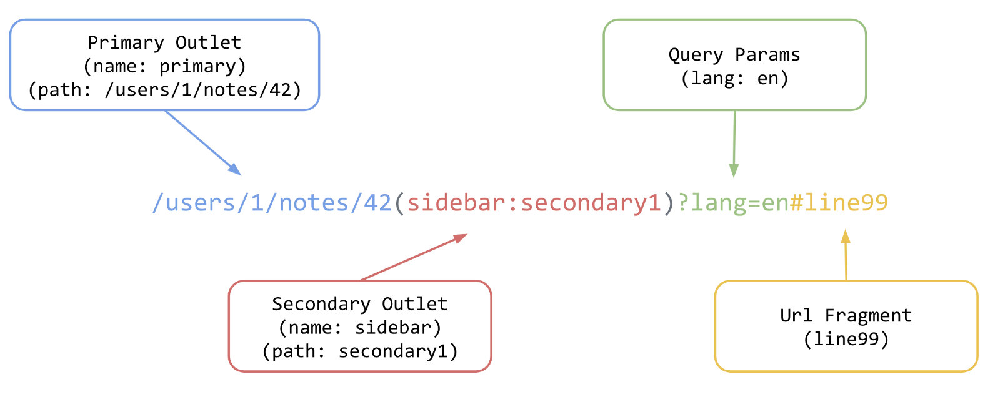
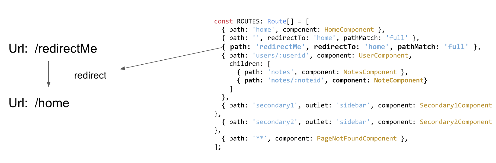
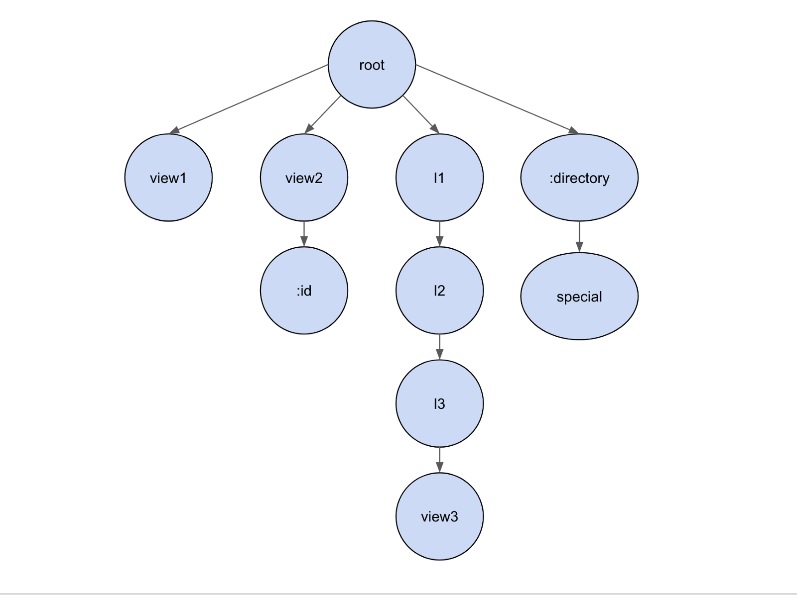
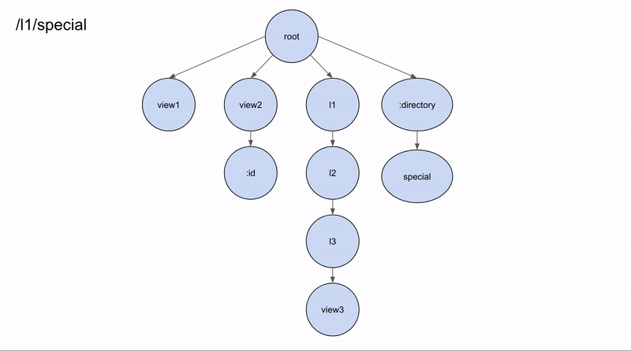
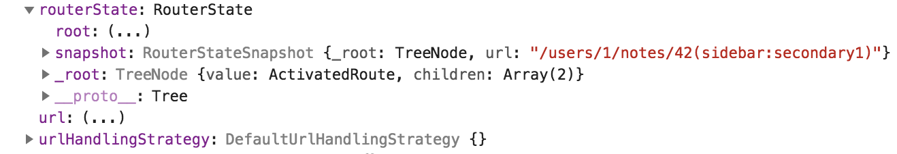

# [翻译]Angular 路由器三部曲之路由状态及 URL 匹配

> 原文连接：**[The Three Pillars of the Angular Router — Router States and URL Matching](https://blog.angularindepth.com/angular-routing-series-pillar-1-router-states-and-url-matching-12520e62d0fc)**


在本系列的概括文章中，我们学习了 Angular 路由器的基本架构，并定义了路由器的三大步：**router states**，**navigation**，和 **lazy loading**。本文会深入第一步，讨论路由器如何将 URL 与配置中的 **{path:'',...}** 对象进行匹配，而这些配置表示了整个程序的路由器状态。**本文目的是深入学习路由器从 URL 到成功匹配路由的整个过程。** 本文将会按照如下话题展开：

1. URL 结构
2. URL 重定向
3. 匹配 URL 到对应的路由对象
4. 路由器状态、激活路由和路由快照

## A Tree of States
本系列概括文章中谈到，路由器会把 **[路由配置对象](https://angular.io/api/router/Route)** 中可以被路由到的部分，当做一棵路由器状态树：

```
{ path: '...', component: ...}
```

程序内导入 **[RouterModule](https://angular.io/api/router/RouterModule)** ，并在 **RouterModule.forRoot()** 方法中传入 **[Route](https://github.com/angular/angular/blob/master/packages/router/src/config.ts#L362)** 数组对象，从而来配置路由器。看看下面示例中的配置，在 **ROUTES** 数组中传入路由对象数组：

```
const ROUTES: Route[] = [
  { path: 'home', component: HomeComponent },
  { path: '', redirectTo: 'home', pathMatch: 'full' },
  { path: 'redirectMe', redirectTo: 'home', pathMatch: 'full' },
  { path: 'users/:userid', component: UserComponent, 
    children: [
      { path: 'notes', component: NotesComponent },
      { path: 'notes/:noteid', component: NoteComponent}
    ]
  },
  { path: 'secondary1', outlet: 'sidebar', component: Secondary1Component },
  { path: 'secondary2', outlet: 'sidebar', component: Secondary2Component },
  { path: '**', component: PageNotFoundComponent },
];
```

路由对象（Route）定义了程序中路由器状态和 URL 的关系。路由对象的结构很简单，大多数情况下，一旦 **path** 与一段 URL 相匹配，就会加载 **path** 对应的 **component**，后面我们将知道，组件会被渲染在 **[router-outlet](https://angular.io/api/router/RouterOutlet)** 指令处。程序也可以包含命名的 **router-outlet** 指令，称为二级路由出口。如果你对二级路由出口感兴趣，我写了一篇短文介绍它的原理 **[Angular Router Series: Secondary Outlets Primer](https://blog.angularindepth.com/angular-router-series-secondary-outlets-primer-139206595e2)**。

本文结尾处，我们会看到下图如何展示了一个 URL 与路由配置集合相匹配的：


你可以在该 **[StackBlitz Demo](https://stackblitz.com/edit/router-pillar1-demo-final)** 内通过点击链接，来切换不同 URL，以便玩玩上图中的 **ROUTES**。

**我们的首要任务是理解路由器内部是如何处理 URL 的。**

## Urls and UrlSegmentGroups
首先需要理解 URL 的不同部分，以及路由器内部是如何表示的。比如下面一个简单的 URL：

```
/users/1/notes/42
```

上面的 URL 是由四个单独部分组成的：**users**，**1**，**notes** 和 **42**。它不包含任何参数或二级路由出口。

由于该 URL 很简单，我们可能希望路由器内部以字符串形式存储该 URL。**但是，由于 URL 是路由器状态的序列化形式，而路由器状态又是很复杂的，所以路由器内部需要一个复杂结构来存储 URL。**

比如下面这个 URL 就包含二级路由出口（secondary outlet），查询参数（query parameters）和段落（fragment）：



我们可以使用路由器对象（Router）提供的 API 来分割这个 URL：

```ts
const url = '/users/1/notes/42(sidebar:secondary1)?lang=en#line99';
const tree = this.router.parseUrl(url); // '/users/1/notes/42(sidebar:secondary1)?lang=en#line99'

const fragment = tree.fragment;         // line99
const queryParams = tree.queryParams;   // lang=en
const primary: UrlSegmentGroup = tree.root.children[PRIMARY_OUTLET];  // gets the UrlSegmentGroup for the primary router outlet
const sidebar: UrlSegmentGroup = tree.root.children['sidebar'];       // gets the UrlSegmentGroup for the secondary router outlet (sidebar)
const primarySegments: UrlSegment[] = primary.segments;   // returns all UrlSegments for the primary outlet. ['users','1','notes','42']
const sidebarSegments: UrlSegment[] = sidebar.segments;   // returns all UrlSegments for the secondary outlet. ['secondary1']
```

你可以在该 **[StackBlitz Demo](https://stackblitz.com/edit/angular-router-url-segment)** 内玩一玩，我建议你花些时间看看控制台内的 URL 数据结构。

其中，第二行的 **router.parseUrl(url)** 会把 URL 字符串转换为如下的树形结构：


1. 整个 URL 字符串会被解析为 **[UrlTree](https://github.com/angular/angular/blob/7.1.4/packages/router/src/url_tree.ts#L76-L129)** 对象。
2. 树的 **[内部节点（nodes）](https://github.com/angular/angular/blob/7.1.4/packages/router/src/url_tree.ts#L113-L114)** 又是用 **[UrlSegmentGroups](https://github.com/angular/angular/blob/7.1.4/packages/router/src/url_tree.ts#L131-L166)** 来表示，并且每一个节点又可以包含 **[嵌套子节点](https://github.com/angular/angular/blob/7.1.4/packages/router/src/url_tree.ts#L153-L154)**。
3. 叶子节点（即无子节点）使用 **[UrlSegment](https://github.com/angular/angular/blob/7.1.4/packages/router/src/url_tree.ts#L169-L216)** 对象来表示。一个 **UrlSegment** 可以表示 URL 中两个斜线间任意部分，比如 **/users/1/notes/42** 有四个 **UrlSegment**，分别为 **users**、**1**、**notes** 和 **42**。**这些将会和 ROUTES 中定义路由对象的 path 属性进行匹配**。**UrlSegment** 也可以包含**矩阵参数**，矩阵参数是由 **;** 来分割，比如 **/users;name=nate;type=admin/**。
4. 根节点为每一个路由出口都包含一个子 **UrlSegmentGroup**，本示例中，有两个路由出口：一个是默认的路由出口（名字为 **primary**）；另一个是二级路由出口（名字为 **sidebar**)。其内部，路由器会序列化 URL 括号内的二级路由，比如 **(secondary_outlet_name:secondary_path_name)**，然后与包含 **outlet** 属性的路由进行匹配，比如 **{path: ‘secondary_path_name’, outlet: ‘secondary_outlet_name'}**。**稍后我们会看到路由出口会相互独立导航。**
5. 段落和查询参数是 **UrlTree** 对象的属性。

每次 URL 发生变化时，就会生成新的 **UrlTree** 对象，且创建过程是同步的，独立于 URL 与 **ROUTES** 数组对象匹配过程。**这个特性相当重要，因为匹配过程可能是异步的**。比如，匹配 URL 时，可能需要路由器异步从服务器获取懒加载模块的路由配置。下一节我们将看到重定向相关内容。

## Applying Redirects
每当 URL 变化时，路由器会与 **ROUTES** 数组对象进行匹配。**然而，路由器需要做的第一件事情是为 URL 的每一部分进行重定向。**
**重定向**仅仅是使用其他内容去替换 URL 的一个部分（或者是整个重定向，替换整个 URL）。其内部会因为该重定向，创建一个新的 **UrlTree** 对象。你可以通过在路由配置里指定 **{redirectTo: 'some_path'}** 来定义重定向：



为什么需要重定向呢？因为它会在 URL 在与路由状态进行匹配前发生，这对格式化 URL 或代码重构帮助很大。比如，想要 **legacy/user/name** 和 **user/name** 渲染相同组件？仅仅使用一个重定向就可以格式化 URL：

```ts
// normalize a legacy url
[
  { path: 'legacy/user/:name', redirectTo: 'user/:name' },
  { path: 'user/:name', component: UserComponent}
]
```

其内部，路由器会调用 **[applyRedirects](https://github.com/angular/angular/blob/7.1.4/packages/router/src/apply_redirects.ts#L53-L62)** 函数处理重定向：

```ts
function applyRedirects(
    moduleInjector: Injector, configLoader: RouterConfigLoader, urlSerializer: UrlSerializer,
    urlTree: UrlTree, config: Routes): Observable<UrlTree> {
  return new ApplyRedirects(moduleInjector, configLoader, urlSerializer, urlTree, config).apply();
}
```

貌似这个函数需要很多参数才能完成重定向呢！让我们看看其中重点的参数。
* **configLoader**：这是 **[RouterConfigLoader](https://github.com/angular/angular/blob/7.1.4/packages/router/src/router_config_loader.ts#L22-L60)** 对象实例，用来编译和加载任意懒加载模块。**匹配的 URL 可能需要还没加载的模块，这谁知道呢**。加载器会导入懒加载模块的路由配置（可以查看 **[load(parentInjector: Injector, route: Route)](https://github.com/angular/angular/blob/7.1.4/packages/router/src/router_config_loader.ts#L28-L45)** 函数）。
* **urlSerializer**：我们之前遇到过这个对象，用来相互转换 URL 字符串和 **UrlTree** 对象。
* **urlTree**：用来表示 URL 的 Tree 数据结构。
* **config**：这是我们传入 **forRoot** 方法内的路由对象数组，路由器将会把 URL 和它进行匹配。

对于任意 URL 分段，**路由器不会提前知道是否需要重定向**，所以对于 URL 分段与 **path** 属性相匹配的路由，会检查该路由对象是否包含 **redirectTo** 属性。在每一级路由器配置树都可以重定向，但是每一级只可以发生一次，**这是为了避免无限重定向**：

```ts
if (allowRedirects && this.allowRedirects) {
    return this.expandSegmentAgainstRouteUsingRedirect(
        ngModule, segmentGroup, routes, route, paths, outlet);
  }
```

比如：

```
{ path: 'redirectMe', redirectTo: 'home', pathMatch: 'full' }
```

如果设置了 **redirectTo**，并且 **path** 属性值又与当前 URL 分段匹配，就会调用 **[expandSegmentAgainstRouteUsingRedirect](https://github.com/angular/angular/blob/7.1.4/packages/router/src/apply_redirects.ts#L195-L205)** 执行重定向。

**pathMatch** 属性值可以是 **full** 或 **prefix**，并决定路由器该如何匹配 URL 分段和 **path** 属性值。下一节我们将谈到匹配算法，但现在我们只需知道：**prefix** 是默认值，检查 URL 分段前缀是否与 **path** 属性值前缀匹配；**full** 值会检查 URL 分段是否与**path** 属性值完整匹配。对于重定向，通常使用 **full**，因为我们经常需要把空路径 **path:''** 重定向到其他某个路由。如果使用 **prefix**，**path:''** 会匹配所有 URL 路径，因为空字符串是任何字符串的前缀。**[你可以查看官方文档上关于两者区别的说明](https://angular.io/guide/router#redirecting-routes)**。

一旦执行了重定向，就会生成一个新的 **UrlTree** 对象来匹配路由配置：

```ts
private applyRedirectCreateUrlTree(
    redirectTo: string, urlTree: UrlTree, segments: UrlSegment[],
    posParams: {[k: string]: UrlSegment}): UrlTree {
  const newRoot = this.createSegmentGroup(redirectTo, urlTree.root, segments, posParams);
  return new UrlTree(
      newRoot, this.createQueryParams(urlTree.queryParams, this.urlTree.queryParams),
      urlTree.fragment);
}
```

**路由重定向的输入是一个 UrlTree 对象，输出也是一个 UrlTree 对象。**

现在我们知道一个 URL 是如何使用一个 UrlTree 对象来表示的，以及重定向如何构造一个新的 UrlTree 对象。接下来让我们看看 URL 是如何与一个路由对象进行匹配的。

## URL Matching
路由器核心依赖于一个强大的 URL 匹配引擎。**如果不能把 URL 与对应的渲染组件联系到一起，程序内就不会发生导航**。

对于 URL 匹配这块，我们将使用下面的 **ROUTES** 对象数组为示例，这会让我们清晰看到其匹配算法的细节：

```ts
const ROUTES = [
  { path: 'view1', component: View1Component },
  { path: 'view2', component: View2Component,
    children: [
      { path: ':id', component: DisplayIdComponent }
    ]
  },
  { path: 'l1',
    children: [
      { path: 'l2',
        children: [
          { path: 'l3',
            children: [
              { path: 'view3', component: View3Component }
            ] }
        ] }
    ]
  },
  { path: ':directory',
    children: [
      { path: 'special',
        component: SpecialComponent
      }
    ]
  }
]
```

一个路由对象内的属性主要包含如下几个部分：
1. **path** 属性表示如何匹配 URL 分段。
2. **component** 或 **children** 或 **outlet** 等属性，决定一旦匹配成功后，应该做什么。

这里存在关注点分离原则，匹配 URL 的任务被从当前路由中解耦出来了。

上面定义的 **ROUTES** 对象数组可以表现为一棵树：



**ROUTES** 对象数组可以表现为一棵树，而 URL 也可以表现为一棵树，这可不是巧合嗷。因为 **ROUTES** 对象数组构成了一棵路由状态树，URL 也仅仅是路由状态的序列化形式，所以 URL 也是一棵树。URL 与路由状态相匹配，等同于 **UrlTree** 对象的各个分段与 **ROUTES** 对象数组中的 **path** 属性值相匹配。

其内部，路由器使用 **[Recognizer](https://github.com/angular/angular/blob/7.1.4/packages/router/src/recognize.ts#L31-L156)** 对象来匹配 url 片段和 **path** 属性值。

路由器默认使用 **[DefaultUrlMatcher](https://github.com/angular/angular/blob/7.1.4/packages/router/src/recognize.ts#L193)**，如下摘抄的 **[匹配算法](https://github.com/angular/angular/blob/7.1.4/packages/router/src/shared.ts#L130-L143)** ：

```ts
// Check each config part against the actual URL
for (let index = 0; index < parts.length; index++) {
  const part = parts[index];
  const segment = segments[index];
  const isParameter = part.startsWith(':');
  if (isParameter) {
    posParams[part.substring(1)] = segment;
  } else if (part !== segment.path) {
    // The actual URL part does not match the config, no match
    return null;
  }
}

return {consumed: segments.slice(0, parts.length), posParams};
```

当视图匹配 URL 和路由时，路由器会检查 URL 未匹配部分，并视图查找能匹配的 `path` 或消费它。这是对 `ROUTES` 数组配置的最先匹配算法。

一旦 URL 的所有部分都已经被消费，可以说一次成功的匹配达成。比如，上面的配置中，URL 会按照下面步骤被消费使用：
1. 路由器遍历 `ROUTES` 数组，第一个对象的 `path` 属性值是 `view1`，而 `view1` 不等于 `l1`，所以继续匹配，`view2` 不等于 `l1`，所以仍然继续匹配，`l1` 等于 `l1`，所以 URL 的一段 `l1` 可以被匹配或消费。
2. 由于 URL 没有被完全消费（URL 还有好几段呢 `l2/l3/view3`），路由器会继续向下匹配 `{path: 'l1'}` 的 `children` 部分。
3. 最终会依次匹配成功剩余的几段，`l2` 等于 `l2`，`l3` 等于 `l3`，`view3` 等于 `view3`。所以，`View3Component` 会在 `primary` 路由出口处被渲染。


有时路由器会在匹配时回滚，比如，对于路径为 `l1/special`，此时匹配过程为：
1. 路由器会遍历 `ROUTES`，`view1` 不等于 `l1`，所以继续匹配，`view2` 不等于 `l1`，所以继续匹配，`l1` 等于 `l1`，所以 URL 的 `l1` 分段能被匹配或消费。
2. 由于 URL 未被完全匹配完（仍然有 `special` 部分），路由器会向下匹配 `{path: 'l1'}` 的 `children` 属性值。
3. 然而本实例中，并不会匹配任何子路径，因为 URL 的下一个分段是 `l2`，与 `special` 不匹配，路由器会回滚到上一层级并继续匹配，看看是否还有其他值能匹配 `l1`。
4. 本实例中，路由器会把 `:directory` 作为下一个可能的路径，带有前置冒号的路径可以匹配任何字符串，所以 `:directory` 可以匹配 `l1`。
5. 由于 URL 还没有被完全消费（还有 `special`），路由器会向下遍历 `children` 属性值。
6. `path: special` 会匹配 `special` 分段，所以现在 URL已经被完全匹配，`SpecialComponent` 会在 `primary` 路由出口处被渲染。



路由器采用深度优先匹配原则来依次匹配 URL 中的各个分段。这表示路由数组中的哪个 `path` 值最先匹配成功，哪个路由就优先胜出。所以你必须注意你的路由配置的结构，因为路由中不存在哪一个更特殊或更重要，总是最先匹配的胜出。**顺序很重要。**

URL 还存在 **[二级路由出口](https://angular.io/guide/router#secondary-routes)**，比如：

```
'/users/1/notes/42(sidebar:secondary1)?lang=en#line99'
```

路由出口相互独立，所以从 `secondary1` 导航到 `secondary2` 不会影响 `primary` 路由出口中的 URL `/users/1/notes/42`。你可以看看 **[stackblitz demo](https://stackblitz.com/edit/router-pillar1-demo-final)**


## Router States
如果 URL 被成功匹配，被路由的组件将会在 `router-outlet` 指令挂载的地方被渲染。**这操作还有个额外的好处——RouterState 对象及其快照对象的创建。**

路由导航发生时，我们可能想要知道 URL 以及被导航组件的一些相关信息——这就是所谓的 **router state**。术语 `router state` 被过度滥用了，因为 `ROUTES` 数组中的对象也被称为程序的所有可能的 `router states`，这表示对于某一个 URL 可以被导航的组件集。然而，`routerState` 也是 `Router` 服务对象的一个属性。这里所谈的 `router state` 指的是 `Router` 服务对象的属性，可以让我们访问当前匹配 URL 和组件的信息。

比如，我们想要访问查询参数，或者在组件或服务内访问 URL 中被编码的某个数据。`Router` 服务对象提供了 **[routerState: RouterState](https://angular.io/api/router/RouterState)** 属性，可以让你访问路由器当前状态的所有信息。`routerState` 有两个有趣的属性：`snapshot` 和 `root`



`snapshot` 和 `root` 都是树形结构，表示当前路由器状态（包含被路由的组件，以及当前 URL 的分段和参数），但是它们有个重要的区别：`snapshot` 是 **[ActivatedRouteSnapshot](https://angular.io/api/router/ActivatedRouteSnapshot)** 对象树，这是静态的；而 `root` 是 `ActivatedRoute` 对象树，这是动态的。

有时路由器状态的快照就足以解决问题了，但是有时候，你可能还想要订阅并监听路由器状态流。

比如，当 URL 从 `/users/15/notes/41` 切换为 `/users/15/notes/42`，路由器会识别到只有参数 `:noteid` 发生变化，所以 **[路由器会重用组件集，不会新建快照树](https://angular.io/guide/router#observable-parammap-and-component-reuse)**。这时，最好使用 `observable` 流方法来订阅路由参数变化。

当 **[URL 分段与路由路径进行匹配时](https://github.com/angular/angular/blob/7.2.1/packages/router/src/recognize.ts#L128-L137)**，`ActivatedRoutes` 对象会在 **[processSegmentAgainstRoute](https://github.com/angular/angular/blob/7.2.1/packages/router/src/recognize.ts#L110-L156)** 函数中被创建，该函数会在导航匹配阶段被调用：

```ts
const result: MatchResult = match(rawSegment, route, segments);
consumedSegments = result.consumedSegments;
rawSlicedSegments = segments.slice(result.lastChild);

snapshot = new ActivatedRouteSnapshot(
  consumedSegments, result.parameters, Object.freeze({...this.urlTree.queryParams}),
  this.urlTree.fragment !, getData(route), outlet, route.component !, route,
  getSourceSegmentGroup(rawSegment),
  getPathIndexShift(rawSegment) + consumedSegments.length,  getResolve(route));
```

注意，对于每一个路由出口，一个 `router state` 一次可以有多个 `ActivatedRoutes` 树。
**所以，这里就是我们常说的，URL 仅仅是路由状态的序列化形式。**

我们已经知道 URL 会如何被构造为 UrlTree 对象，路由器如何匹配 URL 和路由，以及如何创建 `ActivatedRoutes` 树。下一篇文章，我们将会介绍路由器内部如何渲染组件，以及同时执行路由守卫或数据获取器。欢迎到时阅读！
