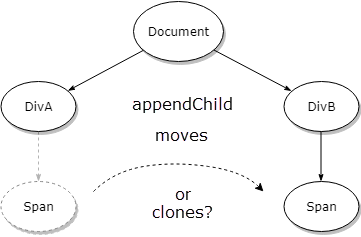
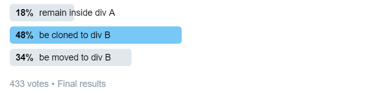
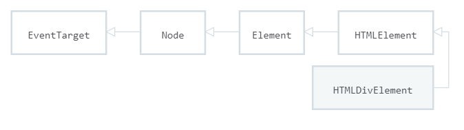
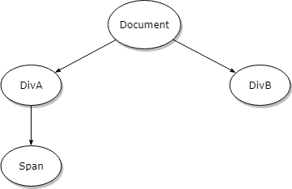
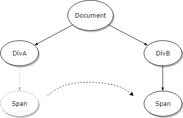

# [翻译] appendChild 会在父节点间移动 DOM 节点的原因

> 原文链接: **[Here is why appendChild moves a DOM node between parents](https://blog.angularindepth.com/here-is-why-appendchild-moves-a-dom-node-instead-of-cloning-it-f8ef7a31735c)**
>
> 原文作者: [Max Koretskyi](https://blog.angularindepth.com/@maxim.koretskyi)
>
> 原技术博文由`Max Koretskyi`撰写发布，他目前于[ag-Grid](https://angular-grid.ag-grid.com/?utm_source=medium&utm_medium=blog&utm_campaign=angularcustom)担任开发大使
> 译者按：开发大使负责确保其所在的公司认真听取社区的声音并向社区传达他们的行动及目标，其作为社区和公司之间的纽带存在。
>
> 译者: [dreamdevil00](https://github.com/dreamdevil00)

通过一个富有洞察力的测验稍微介绍下 DOM 基础知识。



我坚信有必要了解web基础知识。因此，我偶尔会问一些与 web 开发架构或者是 web 平台 API 相关的有趣问题。这些问题帮助我理解开发人员对他们的工作有多热情; 候选者的求知欲有多浓厚。

于是， 上周 <a style="border-bottom: 2px solid" target="_blank" href="https://twitter.com/maxim_koretskyi/status/1039785415358722048">我在 Twitter 上问了下面的问题</a>:

有以下 HTML

```html
<div class="a">
    <span></span>
</div>
<div class="b"></div>
```
以及 使用 `appendChild` 方法的 JavaScript

```javascript
const span = document.querySelector(‘span’); 
const divB = document.querySelector(‘.b’); 
divB.appendChild(span);
```

子元素 `span` 将会:

- 留在 div A 中
- 被克隆到 div B
- 被移动到 div B

我得到了相当有趣的结果:



大多数回答我问题的开发者认为 span 元素会被克隆， 说实话，对此我并没有感到很意外。我经常在求职面试期间提出这个问题, 这是我得到的最普遍的回答。但是我能看到这个回答背后的逻辑。这确实是个棘手的问题。

<span style="color: black; background-image: linear-gradient(to bottom, rgba(255, 215, 198, 1), rgba(255, 215, 198, 1))">正确答案是 `span` 会被移动到新的 父 div B， 而不是被克隆过去。</span> 您可以通过简单地访问 MDN 然后阅读关于 `appendChild` 方法的文档来轻松了解这一点。 这是文档所述:

> The `Node.appendChild()` method adds a node to the end of the list of children of a specified parent node. If the given child is a reference to an existing node in the document, `appendChild()` <span style="color: black;background-image: linear-gradient(to bottom, rgba(255, 215, 198, 1), rgba(255, 215, 198, 1))">**moves it from its current position to the new position**</span> (there is no requirement to remove the node from its parent node before appending it to some other node).

(翻译: `Node.appendChild` 方法添加节点到指定父节点的子节点列表末尾。如果给定的子节点是对文档中已存在节点的引用， `appendChild()` 将它<span style="color: black;background-image: linear-gradient(to bottom, rgba(255, 215, 198, 1), rgba(255, 215, 198, 1))">**从当前位置移动到新的位置</span>**(将其附加到其他节点前，并没要求首先将其从父节点中移除)。)

到这里我们就可以停下了。 但是，我喜欢深入钻研，我想给出详细的解释，并在此过程中教给你一些 DOM 概念。

## DOM 节点
我们从 DOM 节点开始。当你导航到某个网站时发生了什么? 浏览器发出请求， 然后获取到总是包含 HTML 的响应。 HTML 就是简单的文本， 那么在 JavaScript 中如何使用它 ? 浏览器的渲染引擎会解析 HTML， 然后**创建 对应于 HTML 标签的 JavaScript 对象**。 这正是其名称 "文档 **对象模型**"(通常被称为 DOM) 的由来。 **每出现一个 HTML 标签就会有一个 JavaScript 对象的实例**。

因此， 使用问题中的 HTML:

```html
<div class="a">
    <span></span>
</div>
<div class="b"></div>
```
浏览器会创建两个 <a target="_blank" href="https://developer.mozilla.org/en-US/docs/Web/API/HTMLDivElement" style="border-bottom: 2px solid">HTMLDivElement</a> 实例和一个 <a target="_blank" href="https://developer.mozilla.org/en-US/docs/Web/API/HTMLSpanElement" style="border-bottom: 2px solid">HTMLSpanElement</a> 实例。如果你想模拟浏览器所做的工作， 可以这样做:

```javascript
// <div class="a">
const divA = document.createElement(‘div’);
divA.classList.add('a');
// <div class="b"></div>
const divB = document.createElement(‘div’);
divB.classList.add('b');
// <span></span>
const span = document.createElement(‘span’);
// a few checks
divA.className; // "a"
divB.className; // "b"
divA instanceof HTMLDivElement // true
divB instanceof HTMLDivElement // true
span instanceof HTMLSpanElement // true
```

## 节点树

好了， 我们现在有了 JavaScript 对象。 这些对象存在于内存中， 被引用为节点。 重要的是， 节点并不会单独存在。 他们会形成一种特殊的数据结构 —— **树**。

如何得知? 开发人员使用的大多数东西都是由规范定义的。 JavaScript 由 <a target="_blank" href="https://www.ecma-international.org/publications/standards/Ecma-262.htm" style="border-bottom: 2px solid">EcmaScript</a> 规范定义， web 平台由 <a target="_blank" href="https://spec.whatwg.org/" style="border-bottom: 2px solid">whatwg</a> 规范定义。

因此， 如果我们 <a target="_blank" href="https://dom.spec.whatwg.org/#node-trees" style="border-bottom: 2px solid">去查阅</a> 规范， 我们可以在这里找到:

> `Document`, `DocumentType`, `DocumentFragment`, `Element`, `Text`, `ProcessingInstruction`, and `Comment` objects (simply called nodes) 
**participate in a tree**, simply named the node tree.

(翻译: `Document`, `DocumentType`, `DocumentFragment`, `Element`, `Text`, `ProcessingInstruction` 以及 `Comment` 对象(简称节点) 参与到一颗树中, 简称节点树。)

注意： `div` 和 `span` 元素都是 `Element` 节点。 这是其类层次结构图:



这里是 <a target="_blank" style="border-bottom: 2px solid" href="https://dom.spec.whatwg.org/#trees">规范对树的定义</a>：

> A tree is a finite hierarchical tree structure… An object that participates in a tree has a parent, which is either null or an object, and has children…

(翻译: 树是有限层次树结构... 参与到树中的对象有一个父节点(可以是 null， 也可以是对象)， 有些子节点...)

在 web 中， 我们有一种称之为 <a target="_blank" style="border-bottom: 2px solid" href="https://dom.spec.whatwg.org/#document-trees">文档树</a> (Document tree) 的特殊类型的节点树:

> A document tree is a node tree whose root is a document.

(翻译: 文档树是根为文档的节点数)

这就是 **文档** 对象模型(DOM) 中的 ***文档*** 部分 的由来。

## 创建文档树

我们之前已经单独创建了 DOM 节点。 现在我们可以通过将 div 元素添加到 Document， 将 span 元素添加到 Div A 的方式，将他们组合成一颗树。

```javascript
document.appendChild(divA);
document.appendChild(divB);
divA.appendChild(span);
```

这会形成这样的树:



在我提出的问题中， 我们想移动节点到其他父节点:



使用 appendChild 方法:

```javascript
divB.appendChild(span);
```

## 为什么节点没有被克隆?
假设节点可能被克隆是合理的。但是，有一些可能的结果使得这种情况极不可能发生:

- 通过 appendChild 克隆节点会导致其没有直接的引用：

```javascript
const span = document.querySelector(‘span’); 
const divB = document.querySelector(‘.b’);
divB.appendChild(span);
```

在上述代码中， 如果节点被克隆， `span` 变量要不指向克隆的实例， 要不指向原先的实例， 那么， 我们就会丢失对原先的节点实例或者新 DOM 节点的引用

- 如果要移动的元素有一个嵌套很深的子树，会不清楚该怎么办。它也应该被克隆吗? 对对象进行深度克隆是非常昂贵和复杂的，特别是在涉及到循环引用的情况下。

- 克隆节点会导致重复的 ID。

## 为什么节点不会变成两个父节点的子节点

好吧， 如果我们再次返回到树的定义，重新阅读， 我们就会看到答案:

> … An object that participates in a tree **has a parent, which is either null or an object,** and has children…

<span style="color: black; background-image: linear-gradient(to bottom, rgba(255, 215, 198, 1), rgba(255, 215, 198, 1))">所以树中除了根节点之外的每个节点，都 **恰好有一个** 向上连接到父节点的连接。</span> 并没有很多， 仅仅是 0 个或者 1 个。

**这意味着， 如果我们将节点移动到另一个不同的父节点，需要首先将其从之前的父节点中移除， 因为一个节点不能有两个父节点!**

---
**本文是 web 基础知识系列教程的首篇文章。 我会在 Twitter 上问一些有趣的问题， 然后以短文的形式提供深入的解析。我们将浏览规范并探索 web 框架构建的基础**

**和我一起参加学习基本知识的旅程 —— 在 <a target="_blank" style="border-bottom: 2px solid" href="https://twitter.com/maxim_koretskyi">Twitter</a> 和 <a target="_blank" style="border-bottom: 2px solid" href="https://medium.com/@maxim.koretskyi">Medium</a> 上关注我**