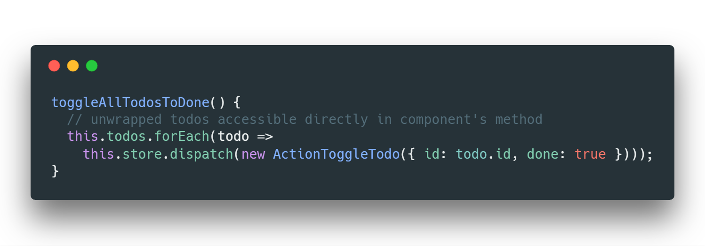

# Angular开发常见问题：subscribe()  还是 | async 管道 ? 终极答案就在这里

> 原文链接：[The Ultimate Answer To The Very Common Angular Question: subscribe() vs | async Pipe](https://blog.angularindepth.com/angular-question-rxjs-subscribe-vs-async-pipe-in-component-templates-c956c8c0c794)
>
> 作者：[Tomas Trajan](https://blog.angularindepth.com/@tomastrajan)
>
> 译者：[vaanxy](https://github.com/vaanxy)；校对者：[Ice Panpan](http://www.github.com/TanYiBing)

Original 📷 by [louis amal](https://unsplash.com/photos/OLRriY0bQa0?utm_source=unsplash&utm_medium=referral&utm_content=creditCopyText)

大多数流行的Angular状态管理库如NgRx，都是以状态对象流(a stream of state objects)的形式来揭露应用的状态。这通常都是使用RxJS Obserbables来实现的。

> 状态的更新被推送至组件(components)，使其重新渲染组件的模板(templates)以显示最新的应用状态。

我们有很多种方式能够消费(consume)这些由组件更新的状态流 observable，以下是两种最常见的方法：

1. 使用 `subscribe()` 方法获取状态对象并将其存储在组件实例之中， `todos$.subscribe(todos => this.todos = todos)`...
2. 使用 `| async` 管道直接在组件模版中解包(unwraps)状态对象，  `<li *ngFor=”let todo of todos$ | async”></li>`...

> 长久以来我一直在思考这个问题，究竟如何权衡以上两种方法。我曾更倾向于使用subscribe() ，但也无法一一列举其缘由。

正是如此，我们亟需制定一份能够兼顾所有的优劣之处的指南，帮助我们在任何情况下都能做出客观公正的决策。

在进一步深入探讨之前，我想要感谢 [simply10w](https://github.com/simply10w) 以及 [Tim Deschryver](https://medium.com/@timdeschryver) ，他们提供了有非常棒的建议和反馈 ([PR](https://github.com/tomastrajan/angular-ngrx-material-starter/pull/354)) ，并且在[Angular NgRx Material Starter](https://github.com/tomastrajan/angular-ngrx-material-starter) 项目中实践了本文所讨论的相关想法。

### 话题

请注意，以下几点内容会对该问题的最终答案产生很大的影响：

- `| async` 管道处理集合(collection)与处理单个对象(singular objects)的方式方法
- 使用 `*ngIf` "as" 语法的可能性(该语法从Angular 4开始支持)
- 状态处理逻辑所处的位置(component’s class vs template)

> OK，让我们开始吧！

### 案例 1: 在ngOnInit方法中使用subscribe()

~~~typescript
@Component({
  /* ... */
  template: `
    <ul *ngIf="todos.length > 0">
      <li *ngFor="let todo of todos">{{todo.name}}</li>
    </ul>   
  `
})
export class TodosComponent implements OnInit, OnDestroy {
  private unsubscribe$ = new Subject<void>();
      
  todos: Todo[];

  constructor(private store: Store<State>) {}

  ngOnInit() {
    this.store
      .pipe(select(selectTodos), takeUntil(this.unsubscribe$)) // unsubscribe to prevent memory leak
      .subscribe(todos => this.todos = todos);            // unwrap observable
  }

  ngOnDestroy(): void {
    this.unsubscribe$.next();
    this.unsubscribe$.complete();
  }
}
~~~

通过在组件的 **ngOnInit** 方法中解包获取 observable 中的 todos 对象并在模板中使用该属性来消费 observable 流的简单例子。

### 👍 使用subscribe()的好处

1. 被解包出来的属性可以在模版的多处使用，无需依赖一些变通的方法，我们会在例2中演示这些方法。
2. 被解包出来的属性可在组件的任意一处被获取。这意味着这些属性能**够直接在组件的方法**中使用，而不需要从模板中将其传递进来。那样便能将所有的状态保留在组件之中。

模版只需负责触发该方法(如: 使用 **(click)="toggleAllTodosToDone()"** )

### 👎 使用 subscribe() 的坏处

1. 使用 `subscribe()` 我们必须在组件的生命周期结束时取消订阅来防止内存泄露。开发者通常需要手动取消订阅。更RxJS式的做法(声明式的方法)是使用  `takeUntil(unsubscribe$)` 操作符来实现取消订阅，如下图所示。该解决方案十分冗余并且容易发生错误，因为我们很容易忘记去实现 `ngOnDestroy`  方法，不这么做并**不会**导致任何错误，但会产生一处不为人知的内存泄露。
2. 在 `ngOnInit()` 中手动订阅observable会使得 `OnPush` change detection strategy 失效。我们可以在订阅中手动调用 `this.cd.markForCheck()` 方法以令其重新生效，但这仍然是一个易忘易错的方案。

> OnPush change detection strategy 的问题成为了压垮我继续使用我曾最爱的 "subscribe()" 方法来处理Angular组件中observable数据源的最后一根稻草。

------

### 案例 2: 在组件模板中使用 | async pipe

~~~typescript

@Component({
  /* ... */
  template: `
    <ul *ngIf="(todos$ | async).length">
      <li *ngFor="let todo of todos$ | async">{{todo.name}}</li>
    </ul>   
  `
})
export class TodosComponent implements OnInit {  
  todos$: Observable<Todo[]>;

  constructor(private store: Store<State>) {}

  ngOnInit() {
    this.todos$ = this.store.pipe(select(selectTodos))
  }
}
~~~

在组件模板中使用| async pipe 来消费 observable 流中 todos 对象的简单示例

### 👍 使用 | async pipe 的好处

1. 能配合 `OnPush` change detection 开箱即用的解决方案！只要保证你所有的业务逻辑(如 reducer, service)是不可变的(immutable)并总是返回新的对象。无论如何，这是使用NgRx的首要目的，所以我认为我们可以假定不可变的数据。
2. Angular 能够为我们自动处理 `| async`  管道所产生的订阅，我们无需在组件的 `ngOnDestroy` 中手动取消订阅。这让我们的代码更简洁也更不容易犯错。耶 😸

> [在Twitter上关注我](https://twitter.com/tomastrajan) 以获取最新的Angular博文和有趣的前端逸闻!🐤

### 👎 使用 | async pipe 的坏处

1. 单个对象必须在模板中使用如下语法解包 `*ngIf="something$ | async as something"`。 而解包collection则可以使用以下这种更直接的方法 `*ngFor="let something of somethings$ | async"`。
2. 在单个模板中多处要使用解包出来的对象会潜在的产生多次解包过程. 当然这可以通过在外套一层包装元素(a dedicated wrapper element)来避免该问题，但这也意味着将状态管理这件事交给了`DOM`结构来控制，这种做法也显得十分奇怪。
3. 使用 `*ngIf` 或 `*ngFor` 解包出来的属性**无法**在组件方法中获取。这意味着我们必须从模板中将这些属性做为方法参数传递到方法之中，这么做将进一步切分模板和组件之间的逻辑。

使用 | async 管道进行多处订阅 vs 使用包装元素配合 ***ngIf "as"** 语法

我们也可以使用 `<ng-container>` 来替代 `
`，使得包装元素不会出现在最终生成的 `DOM` 中， 但这仍无法避免其出现在模板的源代码中。

非常感谢 [Martin Javinez](https://medium.com/@matzecremer) 所提供的解决方案，以实现多个 `| async` 管道 resolved 至一个变量之中…

非常感谢 [Ward Bell](https://medium.com/@wardbell) 除了使用 `<ng-container></ng-container>` 包装元素外，还有另外一种方法可以避免由于在模板中使用了多个 | async 从而产生多个订阅的问题。

 `something$ = sourceOfSomething$.pipe(ReplaySubject(1));` 像这样，将我们的 observable 流 pipe 至 `ReplaySubject`  中可以解决该问题。

------

### 最终裁决 🥊

`OnPush` change detection strategy 对应用的性能提升帮助很大，因此我们应该尽量多使用`| async` 管道。此外，我们也可认为，在应用中坚持利用这些特性能够简化应用，因为开发者总能假设单向数据流并能实现订阅的自动化管理。

>  | async pipe 获胜

### 一些思考

`subscribe()` 解决方案 **确实** 提供了一些益处。例如template可读性和简易性。如果我们没有在使用并且将来也不打算使用 `OnPush` change detection strategy，那么 `subscribe()` 是一个正确的解决方案。

其次，看一下 [Tim Deschryver ](https://medium.com/@timdeschryver) 提供的相关贴士。如果我们发现自己的模板中充斥着各种复杂臃肿的 `| async` 管道来解包许许多多对象，那么我们应当尝试拆分该组件，将其拆分成一个"聪明"的包装组件和多个哑视图组件(dumb view components)。

之后，你便能像这样 `<dumb [prop]="value$ | async"></dumb>` 轻松地将未包装的属性传递至哑组件中。这样既能使得 `OnPush` 继续生效，同时还能享受 "在哑组件的潜在复杂模板中使用未包装的对象" 这一益处。

对于复杂的模板，将其部分内容提取拆分成多个独立的哑组件是有道理的。这样我们既能在哑组件中直接使用这些未包装的对象还能享受 **OnPush** change detection strategy 的益处。

### 今天我们就讨论到这儿！

我希望你们能喜欢这篇文章，也希望本文能帮助大家建立一个思维模型，利用该模型来决策在你们的Angular应用中是使用 `subscribe()` 还是 `| async` 管道！

欢迎通过 👏👏👏 来支持本指南，也希望大家能够转发本文让更多的人看到 🙏。如果有任何疑问，欢迎在文末交流区给我留言，或者在Twitter中 [@tomastrajan](https://twitter.com/tomastrajan)。