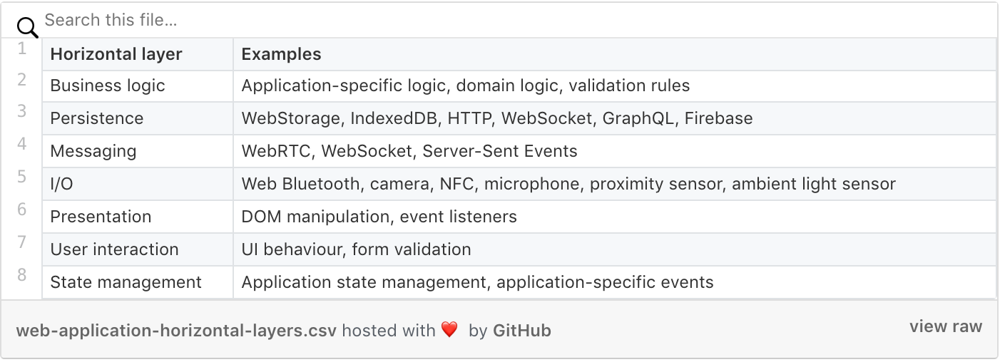
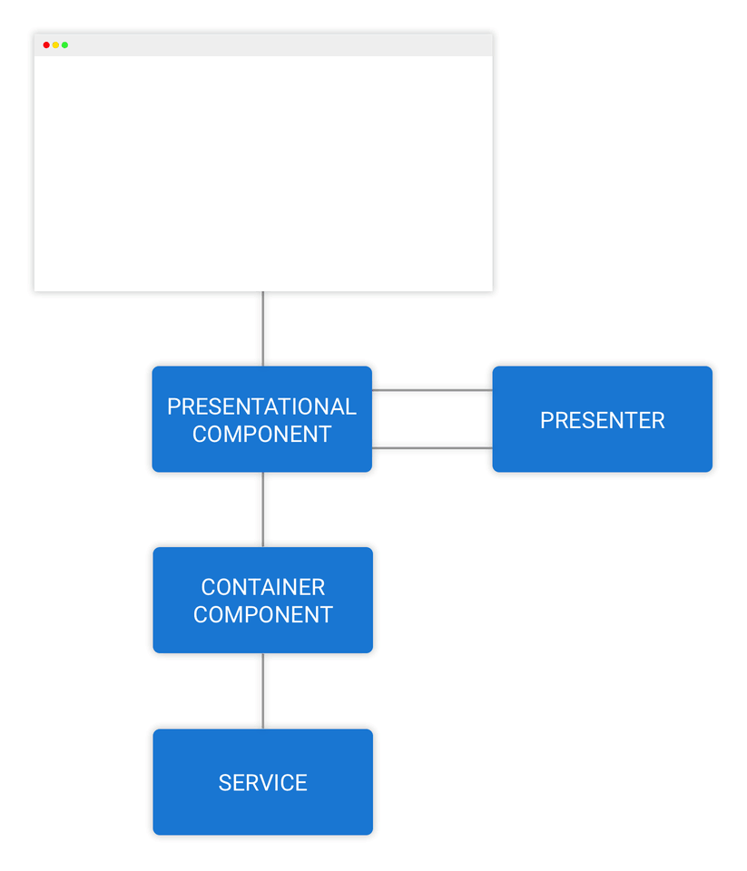
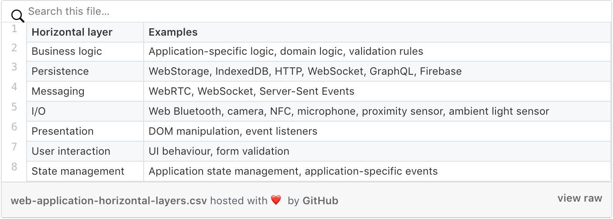

# Angular 中的容器组件

> 原文链接：[Container Components with Angular](https://blog.angularindepth.com/container-components-with-angular-11e4200f8df)
>
> 作者：[Lars Gyrup Brink Nielsen](https://blog.angularindepth.com/@LayZeeDK)
>
> 译者：[尊重](https://github.com/sawyerbutton)；校对者：[]()

<p align="center"> 
    
</p>

随着 [MVP](https://blog.angularindepth.com/model-view-presenter-with-angular-3a4dbffe49bb) 设计模式的出现和发展，使用诸如 **redux 风格的状态容器 NGRX Store** 或 **在 [Angular 英雄之旅教程](https://angular.io/tutorial) 中涉及的简单直白的老式服务** 的应用状态管理库/模式 变得越发容易。

容器组件‘坐落’于应用展示层的边界上，用于将应用的 UI 和状态整合在一起。容器组件主要服务于两个目的：

1. 容器组件提供用于展示的数据流
2. 容器组件将组件特定的事件翻译为应用的状态命令或置于 Redux/NgRx Store 中的 actions

容器组件同样将 UI 与其他非展示层的内容（如 I/O层 或 通知层）整合在一起。

在本文中，我们将会领略从一个混合组件中抽取出其容器组件的过程（也就是组件解耦的过程）。

## 容器组件

容器组件之所以称之为容器组件，是因为其包含所有其子组件视图所需要的应用状态信息。除此之外，容器组件的视图中只包含其子组件，没有任何展示性质的内容。一个容器组件的模版内容应完全由其子组件和相关数据绑定组成。

换另一个角度来思考容器组件，可以将其理解为集装箱 - 容器组件是完全自洽的并且能够在组建模版中随意移动，因其没有任何的输入（input）和输出（output）属性。

容器组件处理了贯穿组件树多层结构的 事件和属性戽链性问题，这一现象也在 [React 社区中被称为  prop drilling](https://blog.kentcdodds.com/prop-drilling-bb62e02cb691)。

译者注：上述问题可以理解为，属性和事件在应用的不同层级都存在耦合状况，当应用较小时可能耦合并不会成为问题，但是当应用的逻辑和代码逐渐增加之后，耦合将会变成横亘在面前的大坑。

## 简单的例子

让我们由 Angular 官方提供的英雄之旅项目中的 `DashboardComponent` 组件开始。

```typescript
import { Component, OnInit } from '@angular/core';

import { Hero } from '../hero';
import { HeroService } from '../hero.service';

@Component({
  selector: 'app-dashboard',
  styleUrls: ['./dashboard.component.css'],
  templateUrl: './dashboard.component.html',
})
export class DashboardComponent implements OnInit {
  heroes: Hero[] = [];

  constructor(private heroService: HeroService) {}

  ngOnInit() {
    this.getHeroes();
  }

  getHeroes(): void {
    this.heroService.getHeroes()
      .subscribe(heroes => this.heroes = heroes.slice(1, 5));
  }
}
```

### 确定混合的问题

我们可以看到组件中存在上述介绍性文字中描述的混合问题，组件横跨了应用的多个层级。

<p align="center"> 
    
</p>

首先让我们关注展示层。展示层包含一个用于在组件模版中展示的由 heroes 构成的数组。

```html
<h3>Top Heroes</h3>
<div class="grid grid-pad">
  <a *ngFor="let hero of heroes" class="col-1-4"
      routerLink="/detail/{{hero.id}}">
    <div class="module hero">
      <h4>{{hero.name}}</h4>
    </div>
  </a>
</div>

<app-hero-search></app-hero-search>
```

展示层是 UI 组件中值得关注的点，此混合组件同样也与状态管理紧密地耦合在一起。在一个 NgRx 应用中，这个组件可能注入了一个 Store 并使用 state 选择器查询应用的某个状态。在英雄之旅的项目中，组件注入了一个 `HeroService` 并通过一个 observable 查询英雄的状态，之后将获取的数组切割成一个子数组并将其引用存入组件的 `heroes` 属性中。

### 生命周期钩子

需要指出的是，我们的混合仪表盘组件挂载在其生命周期的 `OnInit` 时刻。在这个生命周期钩子内，组件订阅了由 `HeroService#getHeroes` 返回的 observable。在 `OnInit` 生命周期钩子中进行这样的操作是最合适的，因为订阅一个 observable 会触发 [一个我们在构造函数或属性初始化器中不需要的副作用](http://misko.hevery.com/code-reviewers-guide/flaw-constructor-does-real-work/)。

特别是，当我们订阅由 `HeroService#getHeroes` 返回的 observable 时会触发一个 HTTP 请求。通过将异步的代码从构造器和属性初始化器隔离出去，我们的组件将会更容易测试和理解。

如果你对 Rxjs 的 observables 的概念并不是特别清楚，可以去阅读 Gerard Sans 所写的技术博客 [Angular — Introduction to Reactive Extensions (RxJS)](https://medium.com/google-developer-experts/angular-introduction-to-reactive-extensions-rxjs-a86a7430a61f)

### 拆分一个混合组件

为了拆分混合组建的多层级耦合问题，我们将混合组件拆分为两个组件，一个容器组件一个展示组件。

容器组件负责将 UI 和 应用的非展示层（比如应用的状态管理和维护层）整合。

当我们合理地区分出混合组件的非展示逻辑后，就可以将这些逻辑从混合组件中隔离和抽取出来组成容器组件，隔离和抽取的过程主要通过将混合组件的 model 的源代码剪切出来并复制到容器组件的 model 中。

```typescript
import { Component, OnInit } from '@angular/core';

import { Hero } from '../hero';
import { HeroService } from '../hero.service';

@Component({
  selector: 'app-dashboard',
  styleUrls: ['./dashboard.component.css'],
  templateUrl: './dashboard.component.html',
})
export class DashboardComponent implements OnInit {
  heroes: Hero[] = [];

  constructor(private heroService: HeroService) {}

  ngOnInit() {
    this.getHeroes();
  }

  getHeroes(): void {
    this.heroService.getHeroes()
      .subscribe(heroes => this.heroes = heroes.slice(1, 5));
  }
}
```

Dashboard：原始的混合组件model

```typescript
import { Component } from '@angular/core';

import { Hero } from '../hero';

@Component({
  selector: 'app-dashboard',
  templateUrl: './dashboard.component.html',
  styleUrls: [ './dashboard.component.css' ]
})
export class DashboardComponent {
  heroes: Hero[] = [];
}
```

Dashboard：抽取出容器组件后的混合组件

在将相关的逻辑移动到容器组件之后，还有一些步骤用于将混合组件转换为展示组件。这些步骤的细节将会在之后的文章中解释说明，这些细节还包括标签的重命名以及在容器组件的模板中进行数据绑定 API 的配对更新。

### 隔离和提取层整合

```typescript
import { ChangeDetectionStrategy, Component } from '@angular/core';
import { Observable } from 'rxjs';
import { map } from 'rxjs/operators';

import { Hero } from '../hero';
import { HeroService } from '../hero.service';

@Component({
  changeDetection: ChangeDetectionStrategy.OnPush,
  selector: 'app-dashboard',
  templateUrl: './dashboard.container.html',
})
export class DashboardContainerComponent {
  topHeroes$: Observable<Hero[]> = this.heroService.getHeroes().pipe(
    map(heroes => heroes.slice(1, 5)),
  );

  constructor(private heroService: HeroService) {}
}
```

Dashboard：容器组件的 model

我们抽取出了 `HeroService` 的依赖并创建了一个数据流，该流与之前的混合组件中的数据流是一致的。该数据流其实就是名为 `topHeroes$` 的 observable 属性，该属性是由 `HeroService#getHeroes` 返回的 observable 管道处理之后生成的。

top heroes 数据流将跟随被订阅的 hero service 的节奏抛出数据。之后我们映射被抛出的 heroes 数组以获得用于向用户展示的 heroes 数组的子数组。

### 通过数据绑定连接展示组件

在将应用的状态集成逻辑从混合组件中抽取出来后，我们能将 dashboard 组件视为一个展示组件并假设它将会包含一个名为 `heores` 的输入属性，该输入属性就是前述的 dashboard 容器组件模板中看到的部分。

抽取容器组件的最后一个步骤是通过 **数据绑定** 将容器组件与展示组件连接在一起，比如在容器组件模板中的属性绑定和事件绑定。

```html
<app-dashboard-ui
  [heroes]="topHeroes$ | async"
  title="Top Heroes">
</app-dashboard-ui>
```

Dashboard：容器组件模板。

`app-dashboard-ui` 是转换为展示组件的 dashboard 组件的标签名。我们使用 `async` 管道操作符将 `topHeroes$` observable 对象与 `heroes` 输入属性连接在一起。

我同样将混合组件的头部文字信息也抽取出来并将其定义于容器组件模板的 `title` 属性中。我将在后文的展示组件相关内容中解释其缘由。

现在，展示性质的 dashboard 组件就可能在应用的不同部分重新利用起来了，并使用标题头描述我们提供给他的不同 heroes 子集信息。

### 由谁管理订阅？

现在，让我们摆脱 `ngOnInit` 生命周期钩子。容器组件的 model 准备了 top heroes 的数据流，该数据流由根据现存的 observable 对象管道操作得来，保证了数据流操作无副作用（比如：订阅）。

现在有个疑问，订阅在组件的何处初始化呢？事实上，Angular 帮助我们管理订阅相关的功能。我们声明式地指示 Angular 通过在容器组件的模板中使用 `async` 管道操作符订阅 top heroes observable 对象。

这样操作的结果是订阅跟随着展示 dashboard 组件的生命周期并将 heroes 数据抛入 `heroes` 输入属性中。

很高兴我们可以摆脱手动管理订阅的桎梏，手动管理订阅实在是乏味且容易出错。如果我们忘记对一个永不完结的 observable 对象进行取消订阅，我们可以在应用程序执行的剩余时间内运行多个订阅导致应用的内存泄露。 

### 数据从容器组件向下流动

<p align="center"> 
    
</p>

将 dashboard 功能配合到图1的流程图中，我们可以看到容器组件的 heroes 数据信息是如何被通知的，而该数据通过一个 observable 对象由 hero 服务请求得来。

容器组件计算用于传递给展示组件输入属性的 top heroes 数据。在最终于 DOM 中展示给用户之前， heroes 数组可以通过一个演示器进行传递，但是容器组件并不知道这件事，因为容器组件只知道展示组件的数据绑定。

## 高阶示例

让我们移步到英雄之旅项目中的 `HeroesComponent` 组件去了解更高阶的示例。

```typescript
import { Component, OnInit } from '@angular/core';

import { Hero } from '../hero';
import { HeroService } from '../hero.service';

@Component({
  selector: 'app-heroes',
  styleUrls: ['./heroes.component.css'],
  templateUrl: './heroes.component.html',
})
export class HeroesComponent implements OnInit {
  heroes: Hero[];

  constructor(private heroService: HeroService) {}

  ngOnInit() {
    this.getHeroes();
  }

  add(name: string): void {
    name = name.trim();
    if (!name) { return; }
    this.heroService.addHero({ name } as Hero)
      .subscribe(hero => {
        this.heroes.push(hero);
      });
  }
  delete(hero: Hero): void {
    this.heroes = this.heroes.filter(h => h !== hero);
    this.heroService.deleteHero(hero).subscribe();
  }

  getHeroes(): void {
    this.heroService.getHeroes()
      .subscribe(heroes => this.heroes = heroes);
  }
}
```

### 隔离层整合

初见之时，组件看上去 **too simple，naive**，但是仔细观察之后，这个组件存在许多问题。就像之前的例子中那样，`ngOnInit` 生命周期钩子和 `getHeroes` 方法与查询应用的一部分状态有关。

<p align="center"> 
    
</p>

`delete` 方法用于处理持久的状态，它使用被剔除相关 hero 的数组替换了 `heroes` 属性。该方法还涉及应用的持久性，因为它还通过 hero service 从服务器状态中删除了一个英雄。

最后，`add` 方法用于处理用户交互，其在创建 涉及应用状态层和持久性的 hero 之前先进性校验。

### 提取层集成

现在让我们通过将多层耦合抽取到容器组件中的方式摆脱那些多层系统的问题。

```typescript
import { Component, OnInit } from '@angular/core';

import { Hero } from '../hero';
import { HeroService } from '../hero.service';

@Component({
  selector: 'app-heroes',
  templateUrl: './heroes.container.html',
})
export class HeroesContainerComponent implements OnInit {
  heroes: Hero[];

  constructor(private heroService: HeroService) {}

  ngOnInit() {
    this.getHeroes();
  }

  add(name: string): void {
    this.heroService.addHero({ name } as Hero)
      .subscribe(hero => {
        this.heroes.push(hero);
      });
  }

  delete(hero: Hero): void {
    this.heroes = this.heroes.filter(h => h !== hero);
    this.heroService.deleteHero(hero).subscribe();
  }

  getHeroes(): void {
    this.heroService.getHeroes()
      .subscribe(heroes => this.heroes = heroes);
  }
}
```

在上面的示例代码中，我们将 `HeroService` 的依赖抽取放置到容器组件中，并在可变的 `heroes` 属性中维护 heroes 的状态。

这样的抽取解耦方式将会遵循基本的变更检测策略，但是我希望通过使用 `OnPush` 变更检测策略提高应用的效能，这样需要一个 observable 对象去管理 heroes 的状态。

hero service 返回的内容是 抛出 heroes 数组的 observable 对象，但是我们同样需要支持添加和移除heroes的操作。解决方案之一是使用 `BehaviorSubject` 创建一个有状态的 observable 对象。

然而为了使用 subject， 我们需要订阅会造成副作用的 hero service observable 对象。如果该 observable 对象在抛出数据后没有完结，那我们就需要去手动管理其订阅以避免内存泄漏。

除此之外，在添加或删除 hero 时我们必须减少英雄的状态。这将会使得逻辑变得越来越复杂。

### 管理状态

为了以响应式的方式追踪应用的状态，我创建了一个 [名为 `rxjs-multi-scan` 的微型库](https://github.com/LayZeeDK/rxjs-multi-scan)。`multiScan` 混合操作符通过一个 scan 操作符计算当前的状态融合多个 observable 对象，但是对于每个 observable 源都有一个很小的 reducer 方法进行处理。运算符作为最后一个参数传递 observable 对象的初始状态。

除了初始状态的参数外，每个奇数参数都是一个 observable 源，其后续的偶数参数是用于其扫描态的 reducer 函数。

```typescript
import { ChangeDetectionStrategy, Component } from '@angular/core';
import { noop, Observable, Subject } from 'rxjs';
import { multiScan } from 'rxjs-multi-scan';

import { Hero } from '../hero';
import { HeroService } from '../hero.service';

@Component({
  changeDetection: ChangeDetectionStrategy.OnPush,
  selector: 'app-heroes',
  templateUrl: './heroes.container.html',
})
export class HeroesContainerComponent {
  private heroAdd: Subject<Hero> = new Subject();
  private heroRemove: Subject<Hero> = new Subject();

  heroes$: Observable<Hero[]> = multiScan(
    this.heroService.getHeroes(),
    (heroes, loadedHeroes) => [...heroes, ...loadedHeroes],
    this.heroAdd,
    (heroes, hero) => [...heroes, hero],
    this.heroRemove,
    (heroes, hero) => heroes.filter(h => h !== hero),
    []);

  constructor(private heroService: HeroService) {}
  add(name: string): void {
    this.heroService.addHero({ name } as Hero)
      .subscribe({
        next: h => this.heroAdd.next(h),
        error: noop,
      });
  }

  delete(hero: Hero): void {
    this.heroRemove.next(hero);
    this.heroService.deleteHero(hero)
      .subscribe({
        error: () => this.heroAdd.next(hero),
      });
  }
}
```

在使用用例中，初始状态时一个空的数组。当由 `HeroService#getHeroes` 返回的 observable 对象抛出 heroes 的数组时，抛出的数据与当前状态相链接。

我为每种用户交互创建一个 RxJS `subject` 对象，一个用于添加一个 hero，一个用于移除一个 hero。当一个 hero 通过私有的 `heroAdd` 属性抛出时，相应的存在于 `multiScan` 中的 reducer 函数将其添加到当前的状态中。

当一个 hero 被移除的时候，通过 `heroRemove` subject 抛出的 hero 触发了根据特定 hero 对象的的过滤，根据其规则触发对当前 heroes 属性的过滤。

### 持续性更新策略

我们允许在公共方法的 `add` 和 `delete` 中进行添加和删除 hero 的操作。当 hero 被添加时，我们使用悲观的更新策略，首先通过 hero service 将 hero 持久化操作到服务器的状态中，并当相应为 success 时更新 heroes$ 的持续性状态。

目前为止，我们还没处理更新服务器状态时可能会遇到的错误。在 `subscribe` 的观察者参数中错误处理器是 `noop`。当我们希望向用户展示一个提示信息或者重试操作符时，我们可以在 `error` 处理器中进行操作。

当删除一个 hero 时，采取乐观更新的策略首先从持续状态移除指定的 hero，之后再从服务器状态中删除之。如果删除操作失败，我们则依托将之前删除的 hero 通过 `heroAdd` subject 添加回来的方式回滚持续性状态。

这是对初始实现的一次优化，在初始实现中没有对删除 hero 提供对应的服务器错误处理。