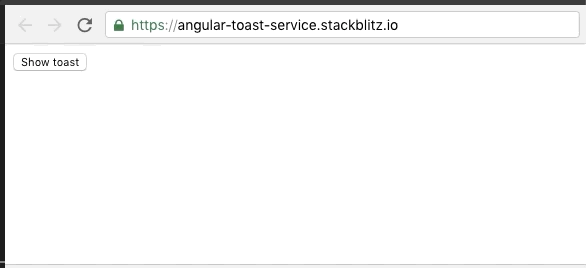

# [翻译]-使用 Angular CDK 技术来创建一个消息推送服务(toast service)

> 原文：[Creating a toast service with Angular CDK](https://blog.angularindepth.com/creating-a-toast-service-with-angular-cdk-a0d35fd8cc12)  
>
> 作者：**[Adrian Fâciu](https://blog.angularindepth.com/@adrianfaciu?source=post_header_lockup)**
>
> 译者：**[秋天](https://github.com/jkhhuse)**； 校对者：**[尊重](https://github.com/sawyerbutton)**


> 手持手机照片由[Jamie Street](https://unsplash.com/@jamie452?utm_source=medium&utm_medium=referral) 发布在 [Unsplash](https://unsplash.com/?utm_source=medium&utm_medium=referral)

首先，这个 toast 不是祝酒词的意思，而是代表了其他的意思（注：toast service，类似安卓中提供的消息提示推送服务）。做好准备，这篇文章比较长，它将从头开始，讲述一个完备的，可以直接用在生产环境中的消息推送服务。

[Angular Material](https://material.angular.io/) 是优秀的 `meterial UI design` 的 Angular 实现。[CDK](https://material.angular.io/cdk/categories) (Component Development Kit) 中抽象出了一组实现共同交互的工具，例如 layout、accessibility、grid、tree等。

你可以使用 CDK 来开发自定义组件，在这篇文章中，我们将探讨如何利用 CDK 来创建一个 toast 服务，用来展现整个应用的消息。

## 安装

首先在项目中增加 CDK 依赖：

```bash
yarn add @angular/cdk
```

或者使用 npm 来安装：

```bash
npm install @angular/cdk
```

现在，我们可以使用 CDK 提供的功能了，本文我们主要使用 [overlay](https://material.angular.io/cdk/overlay/overview) 工具，它能够帮助我们在屏幕内部构建可浮动的面板，我们将用它来展示推送的消息。此外，`overlay` 包中用到了 `portal` 包，这个包用来控制动态生成内容。

## Toast Component

我们首先从基本的内容开始，创建一个组件：

```ts
import { Component } from '@angular/core';

@Component({
  selector: 'app-toast',
  template: `
    <div>This is a toast message</div>
  `
})
export class ToastComponent { }
```

这可能是最简单的组件了，一个选择器和一个包含有文字信息的 `<div>` 标签。之后，我们将扩展它以满足我们的需求。当前，我们将专注于在屏幕上显示它。

首先，把组件添加到 `NgModule` 中，本文的例子中，我们不会直接在模板中使用组件，所以，我们必须在 `entryComponents` 列表中注册组件，否则编译器会认为它没有被使用，从而不会把它打包进最终的打包文件中。

我们可以像创建一个 Angular 库一样，为 ToastComponent 创建一个 module 文件：

```ts
import { NgModule } from '@angular/core'

import { ToastComponent } from './toast.component';

@NgModule({
  declarations: [ToastComponent],
  entryComponents: [ToastComponent]
})
export class ToastModule { }
```

对于这个模块，唯一要做的事情，就是在工程的 app.module 的 imports 属性中添加它。

## Toast service

现在，我们的消息推送服务已经有了一个组件和模块，我们可以思考接下来要做什么。对于我们的应用，我们需要以编程的方式实现在需要显示推送服务时再显示它。那么，最好的选择就是把这段逻辑写在 service 中：

```ts
import { Injectable } from '@angular/core';

@Injectable({
  providedIn: 'root'
})
export class ToastService {
  show() { }
}
```

到目前为止，我们有了一个简单的 service，并且包含有一个 show 方法（目暂时这个方法还为空）。唯一需要注意的事情就是，我们在 `@Injectable`  装饰器中使用了 `providedIn` 属性（Angular 6 支持），并且指定 `root` 为它的值。这表明这个 service 将会被注册为一个单例，并且不需要再在 `providers` 属性中添加这个 service。

这也意味着，这个 service 现在也可以支持摇树优化了，如果我们的应用中定义了一个 service，但是它没有在其他地方被引用，那么它不会被打包到最终的打包文件中。而在 `NgModule` 中的 `providers` 选项中注册的 service 则不会被摇树优化。Angular 自身都开始把内置的 service 改为这种方式注册，所以我建议你也可以这样做。

现在，对于我们 ToastService 对 show 方法而言：我们将需要去获取 overylay service 的实例，来创建我们的 toast 组件实例，并可以在屏幕上的任意位置上展示它。

我们可以使用下面三行代码实现这个需求：

```ts
const overlayRef = this.overlay.create();
const toastPortal = new ComponentPortal(ToastComponent);
overlayRef.attach(toastPortal);
```

首先，我们使用 overlay service 中的 [create](https://material.angular.io/cdk/overlay/api) 方法来创建一个 overlay 实例。这将会在应用中创建一个容器，作为我们的消息推送服务的宿主存在，而 create 方法返回的是就是这个容器的引用。

其次，我们需要创建一个 toast 组件的实例，因为我们想要动态地渲染组件，所以我们使用 portal 来实现它。我们从 `@angular/cdk/portal` 中引入 **ComponentPortal** 类，并把组件作为参数传递给它。这样就创建了我们组件的实例，并且得到一个可以用来处理它的包装器。

最后，我们需要把 `toastPortal` 依附到 `overlayRef` 容器中，这样就可以看到我们的消息推送服务效果了。

现在，如果我们调用 `ToastService` 中的 show 方法，我们将会发现 `div` 中的内容被添加到了应用中。然而，它并不像一个浮动的容器或者消息推送通知。好，我们来快速解决这个问题。

`overlay` 默认使用的位置类（译者注：用于指定容器在窗口中的位置）。因为 CDK 中已经导出了它们，我们可以引入它们，也可以自己自定义。由于我总是赞成重用一些功能，所以，我将直接导入现有的功能。

我们可以在 `styles.css` 文件中导入 `prebuild` css 文件：

```css
@import "~@angular/cdk/overlay-prebuilt.css";
```

如果我们使用 scss ，我们必须调用 mixin 方法，否则 css 规则会无效：

```scss
@import "~@angular/cdk/overlay";
@include cdk-overlay();
```

这个时候，如果调用我们定义的方法，会发现消息浮动在左上角。如果我们多次调用这个方法，我们会发现，它仅仅展示一条消息，而之前的描述中，这些消息是一条接着一条展示的。其实，这里我们仅能看到一条消息，是因为默认情况下，它们会堆叠在一起（译者注：实际上还是多条消息，只不过消息重叠显示在一个区域，看起来只像是一条消息）。

为了让这个程序效果看起来更像是消息推送服务，我们需要添加一些样式（就像 bootstrap 的样式那样），并且使用 Angular Material 提供的图标。

现在，我们的 ToastComponent 看起来会更复杂些了：

```ts
<div class="toast">
  <mat-icon>done</mat-icon>
  <div>This is a toast message</div>
  <mat-icon (click)="close()">close</mat-icon>
</div>
```

我们再定义一个 css 类，来让它看起来更逼真一点：

```css
.toast {
  position: relative;
  display: flex;
  justify-content: space-around;
  margin-bottom: 20px;
  padding: 10px 15px 10px 48px; 
  width: 290px;
  background: #fff;
  border-width: 1px;
  border-style: solid;
  border-color: #dddddd #d6d6d6 #cfcfcf;
  box-shadow: 0 2px 4px rgba(0, 0, 0, 0.11);
}
```

我希望我们推送的消息不要像现在这样总是单一地显示为：‘This is a toast message’。因而，我们需要把显示的文字做成可以配置的方式，并通过调用 show 
方法来传递要显示的内容。（译者注：为了方便理解上文示例，先放一个半成品以方便读者理解，[demo](https://stackblitz.com/edit/angular-toastservice-simplest)）

我想要后续方便地扩展这个应用，因而需要创建一个接口来定义我们需要传递的内容：

```ts
export interface ToastData {
  text: string;
}
```

这样，就定义好了这个数据结构了。同样，我们也需要更新 service 中的 show 方法：

```ts
toastService.show({ text: 'Everything is ok!' });
```

随后，我们将传递这个文本内容到我们的 ToastComponent 中，我们使用 Angular 的 DI 机制来完成这个部分。在 ToastComponent 组件中我们添加它到构造函数中：

```ts
export class ToastComponent {
  constructor(readonly data: ToastData) { }
}
```

然后就可以在这个组件的 template 中使用它：

```ts
<div>{{ data.text }}</div>
```

我们需要把这个 data 添加到组件的 injector 中，所以还需要对 ToastService 做一些改造。幸运的是，在我们创建 component portal 时，我们可以向它传递一个 injector 实例。 Angular CDK 提供了一个 [PortalInjector class](Phttps://github.com/angular/material2/blob/47de296116b4fdc9ee813a923a9e6a8534e18ee5/src/cdk/portal/portal-injector.ts#L16)，它扩展了 Angular 提供的 Injector，我们将使用它。

首先，我们创建了一个 map ，并向 map 中添加了一些自定义的数据。我们想把它们加入到 injector 中，并实例化 PortalInjector：

```ts
const tokens = new WeakMap();
tokens.set(ToastData, data);
const injector = new PortalInjector(parentInjector, tokens);
```

（译者注：PortalInector 其实就是一个 injector.get()，目的是为了获取到一个基于 tokens 的 injector 实例）

PortalInjector 的第一个参数是一个 parent injector，我们可以通过它来获得当前使用服务的实例。这将用来获得任何没有添加自定义 tokens 的依赖，我们在 ToastComponet 使用这种方式。

随后，我们可以创建我们的 component portal，并附加了我们定义的 injector：

```ts
const toastPortal =
    new ComponentPortal(ToastComponent, null, injector);
```

但是，如果我们尝试着这样去做，我们会发现它并无法运行。`ToastData` 是一个接口，对于 map 数据结构来说，它并不是一个正确的数据格式。这里有两个选择，其一是我们把它修改为 class 类型，其二是我们自定义一个 [InjectToken](https://angular.cn/api/core/InjectionToken)，并且利用它来把数据放入 map。

如果我们想要使用 injection token 方式，那么我们这样创建它：

```ts
const TOAST_DATA = new InjectionToken<ToastData>('TOAST_DATA');
```

在 map 中使用：

```ts
tokens.set(TOAST_DATA, data);
```

我们还需要更新 ToastComponent 的 constructor 写法，使用 inject 装饰器：

```ts
constructor(@Inject(TOAST_DATA) readonly data: ToastData) { }
```

现在我们的 toast 服务就是一个可配置的状态了，我可以传递给它任意的文本内容。(译者注：为了帮助读者理解，我在这里加一个半成品 [demo](https://stackblitz.com/edit/angular-toastservice-simplest-1))

这个做法的另外好处就是，它将会足够容易地配置我们将要显示的内容的格式，例如它可以很容易扩展满足展示图片的需求。

在这里，我们还想为我们的消息推送服务增加一些类型，我们定义消息的类型为 success、info 和 warning 三种，这里没有 error 类型，是因为它对用户体验不友好，毕竟在推送服务中展示错误不是那么可取。

我们可以创建一个 TypeScript 联合类型来表示这些信息：

```ts
export type ToastType = 'warning' | 'info' | 'success';
```

我们还需要扩展我们的 ToastData 来支持这个类型：

```ts
export class ToastData {
  text: string;
  type: ToastType;
}
```

这时，当我们想要去展示一个消息时，我们也应当要设置消息的类型：

```ts
toastService.show({ text: 'Everything is ok!', type: 'success'});
```

你可以使用任意图标，但是在这里，我们将会使用 Material 的那一套东西。如果我们项目中还没有添加这些依赖，那么首先要添加 Material 模块的依赖：

```ts
yarn add @angular/material
```

此外，我们还需要使用 icon font，把下面代码插入到我们的 HTML 代码中：

```ts
<link href="https://fonts.googleapis.com/icon?family=Material+Icons"
      rel="stylesheet">
```

添加 Material icon 模块到 imports 属性中：

```ts
import { NgModule } from '@angular/core'
import { OverlayModule } from '@angular/cdk/overlay';
import { MatIconModule } from '@angular/material/icon';

import { ToastComponent } from './toast.component';

@NgModule({
  imports: [OverlayModule, MatIconModule],
  declarations: [ToastComponent],
  entryComponents: [ToastComponent]
})
export class ToastModule { }
```

最后，我们展示图片的方法为：

```ts
<mat-icon>info</mat-icon>
```

我们要展示的图标，对于 warning 和 info，都在 google web font 中存在相同名称到图标，但是 success 类型不存在，我们需要把它用 done 图标来展示。对于这种情况，我们可以很容易解决，我们可以创建一个变量，在 constructor 中初始化时进行转化：

```ts
this.iconType = data.type === 'success' ? 'done' : data.type;
```

更新图标类型到使用：

```ts
<mat-icon> {{ iconType }} </mat-icon>
```

很不错，现在这个推送服务又更完善了一些。现在我们要继续完善它，我们需要给这个服务添加一个自动关闭的逻辑，并且允许它在界面中以及提供编程方式来关闭消息。

为了让我们能够在界面上关闭，我们给这个应用添加了一个关闭按钮：

```ts
<mat-icon (click)="close()">close</mat-icon>
```

说真的，我们如何关闭消息？它看起来并不是很复杂的样子。我们之前使用了 overlay，并创建了 overlay，并获得了它的实例引用。我们能够用它做很多事情，包括调用 dispose 方法来销毁它：

```ts
this.overlayRef.dispose();
```

类似于我们创建 overlay 并获得实例引用那样，我们也希望我们的消息推送服务，也能够被创建，并返回它的实例引用。要实现这样，我们可以这样做：

```ts
import { OverlayRef } from '@angular/cdk/overlay';

export class ToastRef {
  constructor(readonly overlay: OverlayRef) { }

  close() {
    this.overlay.dispose();
  }
}
```

我们传递了 overlay 引用，并对外暴露出 close 方法，这个方法用于销毁当前的 overlay。我们一开始就在两个地方用到了它。并且我们从 ToastService 的 show 方法返回它给用户。我们还传递它给 ToastComponent 以便它可以关闭这个消息：

```ts
import { Injectable, Injector } from '@angular/core';
import { Overlay } from '@angular/cdk/overlay';
import { ComponentPortal, PortalInjector } from '@angular/cdk/portal';

import { ToastComponent } from './toast.component';
import { ToastData } from './toast-config';
import { ToastRef } from './toast-ref';

@Injectable({
  providedIn: 'root'
})
export class ToastService {
  constructor(private overlay: Overlay, private parentInjector: Injector) { }

  showToast(data: ToastData) {
    const overlayRef = this.overlay.create();
    
    const toastRef = new ToastRef(overlayRef);
    const injector = this.getInjector(data, toastRef, this.parentInjector);
    const toastPortal = new ComponentPortal(ToastComponent, null, injector);

    overlayRef.attach(toastPortal);

    return toastRef;
   }

   getInjector(data: ToastData, toastRef: ToastRef, parentInjector: Injector) {
    const tokens = new WeakMap();

    tokens.set(ToastData, data);
    tokens.set(ToastRef, toastRef);
    
    return new PortalInjector(parentInjector, tokens);
   }
}
```

通过传递 overlay 的引用来实例化，并用于创建 injector。

在 ToastComponent 中，我们实现了 close 方法。当用户点击 close 图标时，我们使用一个 setTimeout 方法来实现一段时间后自动隐藏：

```ts
import { Component, OnInit, OnDestroy } from '@angular/core';

import { ToastData } from './toast-config';
import { ToastRef } from './toast-ref';

@Component({
  selector: 'app-toast',
  templateUrl: './toast.component.html',
})
export class ToastComponent implements OnInit, OnDestroy {
  iconType: string;

  private intervalId: number;

  constructor(readonly data: ToastData, readonly ref: ToastRef) {
    this.iconType = data.type === 'success' ? 'done' : data.type;
  }

  ngOnInit() {
    this.intervalId = setTimeout(() => this.close(), 5000);
  }

  ngOnDestroy() {
    clearTimeout(this.intervalId);
  }

  close() {
    this.ref.close();
  }
}
```

很棒！我们再继续做出一些改进，实现多个消息的情况下，能够按序显示，避免堆叠在一起。

## 推送多条消息

由于我们想要让推送的消息由上至下排列，并且最新的消息在最下面。这样记住最新一条的消息对于创建下一条消息更有用，所以，我需要创建一个私有变量 *lastToast* 用于存储最新一条消息的引用。

现在，我们有了这个引用，我们需要添加另外一个方法，它允许我们获得消息在屏幕中的位置：

```ts
getPosition() {
    return this.overlay.overlayElement.getBoundingClientRect();
}
```

我们已经有了 overlay 的实例，它包含了 `overlayElement` 属性，它是真实的 HTML 元素。我们则可以使用 [getBoundingClientRect](https://developer.mozilla.org/en-US/docs/Web/API/Element/getBoundingClientRect) 方法获得当前元素的大小及位置。我们使用它来知道显示在屏幕上的最后一条消息，并在正确的位置上显示下一个元素。

让我们来配置 ToastService 来让它按我们的需求来展示。当调用 overlay service 上的 create 方法时，我们可以传递一个 [cofing 对象](https://github.com/angular/material2/blob/master/src/cdk/overlay/overlay-config.ts)。

这是 overlay service 提供的便捷方法，它有一个 position 方法，暴露了一个可以提供多种设置选项的 API。例如，如果我们想要在屏幕的右侧展示我们的消息，相对于全局的窗口，我们可以这样做：

```ts
const positionStrategy = this.overlay.position().global().right();
```

随后，在调用 overlay service 的 create 方法时，传入这个配置：

```ts
const overlayRef = this.overlay.create({
    positionStrategy,
});
```

为了像压入堆栈那样，让消息依次排列，我们需要增加一个 top 位置并且计算它。我们使用 `getPosition` 方法，并把它加入到 toastRef 类中：

```ts
getPosition() {
  const position = this.lastToast ?     
     this.lastToast.getPosition().bottom : 0;
return position + 'px';
}
```

如果这里存在最后一条消息，那么我们获得它的 bottom 位置，如果不存在，则使用 0 作为默认的值。由于最终需要设置 CSS 样式，所以我们添加了 `px` 来把整个结果转化为一个字符串。

把它加到最初到位置创建策略中：

```ts
onst position = this.overlay.position()
  .global()
  .right()
  .top(this.getPosition())
```

很酷！所有到消息都可以按照顺序很好地展示。

## 动态内容

肯定会出现这样情况：推送的消息无法用简短的文本进行描述。也许我们需要显示一个链接、按钮甚至一些更复杂的元素，对于这种场景，我们对模版添加了一些支持：

首先，我们扩展了 `ToastData` 对象，传递给 ToastService 的 `show` 方法，以便我们能够展示文字或者模板的引用以及存在一个可选的上下文对象：

```ts
export class ToastData {
  type: ToastType;
  text?: string;
  template?: TemplateRef<any>;
  templateContext?: {};
}
```

我们标记了 text、template、templateContext 都为可选属性，所以我们可以传递他们中的任意一个。不过，当没有传递任何内容时，也应该有相应的处理方法。

有了这个，我们必须更新我们的消息推送服务的模板，以便能够处理传递过来的 templateRef 情况。为了具备这个能力，我们使用了 Angular 提供的 [ng-template](https://blog.angularindepth.com/use-ng-template-c72852c37fba) 方法：

```html
<ng-container *ngIf="data.text; else templateRef">
  {{ data.message }}
</ng-container>

<ng-template #templateRef>
  <ng-container *ngTemplateOutlet="data.template; context: data.templateContext">
  </ng-container>
</ng-template>
```

我们有了一个 container（容器），它在我们存在 text 属性时显示，否则的话，显示下面带有上下文对象的模板。

好了，这一节告一段落了，现在我们也可以将 TemplateRef 传递给我们的 Toastservice 了。

## 动画

虽然这一切都已经很不错了，但是我们还可以让我们的消息推送服务更加惊艳。如何做到呢？那就是添加一些动画效果！

Angular 的动画 API 用起来非常简单，你可以快速地基于它来创建一些不错的动效。详细的介绍，可以通过[官方文档](https://angular.io/guide/animations)获取。

在我们的例子中，我们将要添加两个简单的淡入与淡出效果。

为了让它能够正常运行，我们需要导入 [BrowserAnimationsModule](https://angular.io/api/platform-browser/animations/BrowserAnimationsModule)：

```ts
import { BrowserAnimationsModule } from '@angular/platform-browser/animations';
@NgModule({
  imports: [ BrowserAnimationsModule ]
)}
export class CoreModule {}
```

导入后，我们就可以创建一些动画了。我发现把不同的功能放到不同的文件中是一种更好的实践，所以我在指定的文件中定义了我们的动画：

```ts
import {
    AnimationTriggerMetadata,
    trigger,
    state,
    transition,
    style,
    animate,
} from '@angular/animations';

export const toastAnimations: {
    readonly fadeToast: AnimationTriggerMetadata;
} = {
    fadeToast: trigger('fadeAnimation', [
        state('in', style({ opacity: 1 })),
        transition('void => *', [style({ opacity: 0 }), animate('{{ fadeIn }}ms')]),
        transition(
            'default => closing',
            animate('{{ fadeOut }}ms', style({ opacity: 0 })),
        ),
    ]),
};

export type ToastAnimationState = 'default' | 'closing';
```

如果我们忽略了占用代码一半的 import 部分，那么剩下的逻辑并不复杂。

我们有一个 `toastAnimations` 对象，它存在 `fadeToast` 属性。我们使用了 trigger 方法来指定动画的名称以及有关它的一些元数据。

首先，我们指定我们想要在默认状态下拥有的样式，主要为我们希望透明度（opacity）为1。然后，我们指定我们需要关注的两个状态转换：第一，当要显示元素时，可以使用 void => * 表达式；第二，状态从默认转换为关闭。我们也可以尝试使用反向的状态表达式： * => void，这也是有效的，不过它不会对我们有特别大的帮助，因为元素已经被移除了，所以动画也不会被展示出来。

在 `animate` 方法中，我们指定了动画的持续时间，但是我们想要让这个时间可以配置，我们使用了一种类似插值的方式实现它：

```ts
animate('{{ fadeIn }}ms')
```

最后，我们定义了一个联合类型来指定动画的状态，即：default 与 closing。

在我们 toast component 内部，我们需要把定义的动画类添加到组件的 `animations` 数组中，并且定义一个 `animationState` 属性来保存当前值：

```ts
import { toastAnimations, ToastAnimationState } from './toast-animation';
...
animations: [toastAnimations.fadeToast],
...
animationState: ToastAnimationState = 'default';
```

在这里，我们可以更新模板来应用动画：

```html
div class="toast"
     [@fadeAnimation]="{value: animationState, params:
        { fadeIn: 1000, fadeOut: 1000 }}">
  <mat-icon>{{ iconType }}</mat-icon>
  <div>{{ data.text }}</div>
  <mat-icon (click)="close()">close</mat-icon>
</div>
```

我们需要使用我们定义动画用的 trigger 的名称，在我们的应用中，`fadeAnimation` 绑定了一个对象，与属性的绑定类似。在这个对象内部，我们指定了两个属性：一个是绑定到我们组件属性中的动画的状态；另一个是动画类中依赖的两个可配置的插值。

剩下要做的事情就是继续更新代码，让淡出效果也可以展示出来。即，我们从屏幕中删除元素后，手动地更新动画的状态。

当我们的组件初始化时，我们创建了一个定时器来放置消息，我们想要做的是开启动画的运作：

```ts
ngOnInit() {
  this.intervalId =
    setTimeout(() => this.animationState = 'closing', 5000);
}
```

目前为止，我们需要动画完成后，就会关闭当前这个消息，现在我们在模版中添加一个动画执行完毕的回调事件：

```ts
(@fadeAnimation.done)="onFadeFinished($event)"
```

并创建一个处理这个任务的函数：

```ts
onFadeFinished(event: AnimationEvent) {
    const { toState } = event;
    const isFadeOut = (toState as ToastAnimationState) === 'closing';
    const itFinished = this.animationState === 'closing';

    if (isFadeOut && itFinished) {
        this.close();
    }
}
```

作为额外收获，你可以自己实现在消息上移动鼠标时，可以重置淡出时间。

## 全局配置

或许我们想要让我们的消息推送服务出现屏幕的右上角，或者调整淡入淡出的动画时间。我们应该以一种简单一致的方式来提供给用户来配置这些行为。

绝佳的放置全局配置的位置是 toast 的 NgModule，我们创建了一个 *forRoot* 方法并允许用户指定一个配置对象。

首先，我们应该定义一个这个配置对象为一个接口：

```ts
export interface ToastConfig {
    position?: {
        top: number;
        right: number;
    };
    animation?: {
        fadeOut: number;
        fadeIn: number;
    };
}
```

我们应当提供一些默认值，这样在使用的时候，不用担心没有设置这些配置：

```ts
export const defaultToastConfig: ToastConfig = {
    position: {
        top: 20,
        right: 20,
    },
    animation: {
        fadeOut: 2500,
        fadeIn: 300,
    },
};
```

现在回到我们的 module 文件，我们可以去实现 *forRoot* 方法，它接收一个 *ToastConfig* 类型的参数，并把它添加到 `provider` 属性中：

```ts
public static forRoot(config = defaultToastConfig): ModuleWithProviders {
  return {
      ngModule: ToastModule,
      providers: [
          {
              provide: TOAST_CONFIG_TOKEN,
              useValue: { ...defaultToastConfig, ...config },
          },
      ],
  };
}
```

如果我们不传递这些参数，我们也会有默认的值来作为配置。如果我们传递了某些内容，它可能只是我们要覆盖的配置的一部分，例如位置信息。因此，当我们构造默认的配置时，它们可以被用户指定的配置所覆盖。

当我们在 providers 里面设置了后，我们可以把它注入到 ToastService 中了，并且在 ToastComponent 的构造函数中，我们也可以使用这些值：

```ts
@Inject(TOAST_CONFIG_TOKEN) readonly toastConfig: ToastConfig
```

随后，我们需要修改 position 方法来使用 top/right 配置，以及 ToastComponent 模板中的动画：

```ts
[@fadeAnimation]="{value: animationState,
  params: {
    fadeIn: toastConfig.animation.fadeIn,
    fadeOut: toastConfig.animation.fadeOut
  }
}
```

这样我们就可以为我们的消息推送服务设置一个非常友好的全局配置方式了，此外，也很容易为我们的服务提供扩展，例如添加其他的属性，从而可以稍微改造就能适应多种场景的需求。

作为一个不同且可能会更简洁的方案，你可以创建一个单独的 overlay 以及将要展示在这个 overlay 中的 container component。所有的消息推送服务都可以添加到这个 container component 中，模板将会是一个 **ngIf** 指令。这样的做法可以让位置与动画更容易被使用。感谢 [Alex Okrushko](https://medium.com/@alex.okrushko) 提供的反馈与建议。

希望这篇文章能提供一些帮助并能够想尽方法读到这里。😉

下面时我们的消息推送服务的最终效果：



最后是放在 [StackBlitz](https://stackblitz.com/edit/angular-toast-service) 中的整个工程代码！