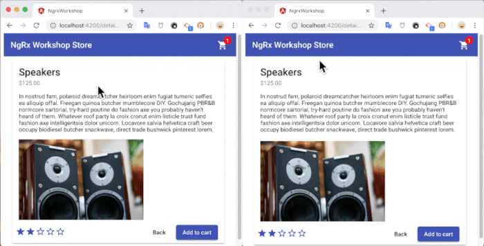
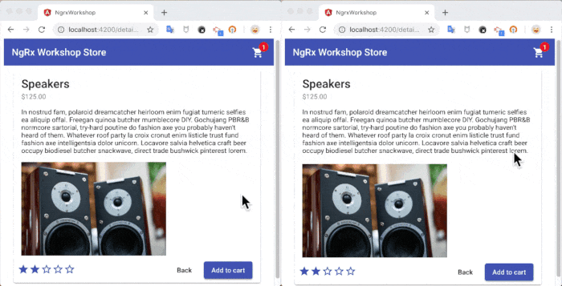

# [翻译] 使用 NgRx 改善用户体验的 5 个技巧

> [原文链接] **[5 Tips to improve User Experience of your Angular app with NgRx](https://blog.angularindepth.com/5-tips-to-improve-user-experience-of-your-angular-app-with-ngrx-6e849ca99529)**
>
> 原文作者: [Alex Okrushko](https://blog.angularindepth.com/@alex.okrushko)
>
> 译者: [dreamdevil00](https://github.com/dreamdevil00); 校对者: [sawyerbutton](https://github.com/sawyerbutton)


Web 应用的性能很重要。 当公司的财务状况依赖于这些让用户和网站互动并留住用户的应用时，这会更加重要。 [研究A](https://www.thinkwithgoogle.com/marketing-resources/the-google-gospel-of-speed-urs-hoelzle/), [研究B](https://www.thinkwithgoogle.com/marketing-resources/experience-design/mobile-page-speed-load-time/) 表明， 糟糕的加载时间和应用的整体响应缓慢状况会导致用户流失率增加并降低用户的整体满意度。

众所周知， Angular 的 `OnPush` 变更检测策略(ChangeDetectionStrategy) 可以显著提高应用的性能， 而 NgRx 的不可变状态(immutable state)特性和 `OnPush` 相得益彰。 因此， 在本文中，我会**针对有关 API 调用所引入的应用缓慢和错误场景展示 NgRx 如何帮助改善用户体验**。 特别是:

- 错误处理

- 提供缓存的临时数据(页面间场景/返回应用场景)

- 乐观更新或删除(与按钮以及对话框或者表单互动)

## 技巧 #1 错误处理

当你提交表单或者是导航到页面内的某个位置时， 你经历了多少次 “加载中”, 却发现显示 `加载中` 旋转器(spinner) 一直显示并不会消失。 打开控制台， 你看到的是请求失败的日志。 **作为开发者， 我们经常忘记处理这样的错误情况—— 我们在开发过程中时常乐观地认为程序可以正常运行，然而这些错误场景发生后才会意识到。**

NgRx 也不能避免未处理的错误; 但是， 它有很多**既定的模式(established patterns)**， 可以帮助你克服这些容易出错的场景。此外， 由于所有的 API 调用都是在 **Effects** 中完成的， 未处理错误的代价更高—— effects 将停止侦听之后的任何 Actions。

这里有个在 Effect 中进行 API 调用的简单例子:

```typescript
@Effect()
fetchProducts: Observable<Action> = this.actions$.pipe(
  ofType<actions.FetchProducts>(actions.FETCH_PRODUCTS),
  switchMap(() =>
    this.productService.getProducts().pipe(
      map(products => new actions.FetchProductsSuccess(products)),
      catchError(() => of(new actions.FetchProductsError()))
    )
  )
);
```

`catchError` 操作符不仅是这个 Effect 的一部分，而且其位置也非常重要——它应该位于 `switchMap` 管道中(或[另一个 *Map 扁平操作符](https://blog.angularindepth.com/switchmap-bugs-b6de69155524))。而且这样的使用方式其实和 NgRx 的内容并无关系，其只是遵循着 RxJS 的工作方式： 一旦产生错误，`catchError` 就会处理掉并关闭流。

任何 Effects 都必须生成 Action, 除非明确告知不要这样做。 这意味着即使是 `catchError` 也必须生成 `Action`。 这就引出了一个模式，该模式中任何API调用都需要三种 Actions:

- 触发 Effect 的 Action

- 封装成功结果的 Action(通常后缀是 `Success`)

- 反映错误响应的 Action(通常后缀是 `Error`)

在本文所描述⬇️的进一步的改进中， 这种模式也会变得非常方便。

## 提供缓存的数据

有两个不同的用例。第一个是当用户在页面之间导航时提供数据，第二个是当用户返回到应用时提供数据。我们来详细地看一下。

### 技巧 #2. 存储(Store) 作为缓存

让我们使用 “商店” 应用程序作为示例。它有三个页面：包含产品列表的 “主页(home)” 页面、包含具体产品信息及将具体产品添加到购物车的的 “产品详情(product details)” 页面，以及提供添加到购物车的所有产品概览的 “购物车(cart)” 页面。这里的示例大多与 “主页” 和 “产品详情页”及其交互有关。

考虑以下场景：用户打开 “主页” 页面，该页面调用 API 来获取产品列表。然后，用户单击其中一个产品并进入到 “产品详情” 页面。稍后，他们单击 back 返回到产品列表。

下述对比动画是上文所提及的返回操作在不同实现下的最后一个动画场景：右边的动画使用 NgRx store 作为缓存，**在我们等待新的 fetch API 调用完成时， 显示之前的产品列表**, 同时使用不确定的进度条显示数据仍可能改变。



这种方法给用户提供了即时反馈，让人觉得该应用非常快速、响应迅速。

⚠️ 但是，应该小心使用它，并评估是否可以显示可能过时的数据(在等待新内容时)。例如，如果数据经常变化，这种方法就不好用了——想想 Facebook 或 Twitter 的帖子发布。在这些情况下，[使用动画的 ghost 元素](https://blog.angularindepth.com/https-medium-com-thomasburleson-animated-ghosts-bfc045a51fba) 将是更好的选择。

有人可能会说，要实现这种改进，并不需要 NgRx ——实际上，有状态服务(stateful service)也可以实现。然而，我们随后又回到了应用状态分布在许多这种有状态服务中的情况。而这正是我们从一开始就试图避免的。无状态服务更易使用。

另一种仅使用服务更难实现的场景是：用户打开用于显示产品列表的 “主页” 并选择其中一个产品。`FetchProducts` API 调用的响应只包含 “主页” 显示所需的**最少信息**。例如，每个产品信息都没有 “产品描述” 来减少响应负载(response payload)的大小。另一方面，`GetProduct(id)` 调用返回关于产品的所有信息，包括 “产品描述”。

看起来是这样子:


在左边, 我们正等待 `GetProduct(id)` API 的调用返回信息, 而在右侧, 已经显示了保存在 Store 中关于此产品的部分信息， 此信息来自于`FetchProducts` API 的调用，一旦 `GetProduct(id)` API 的调用返回新的数据(包括“产品描述”), 我们将这两部分信息进行合并。

令人兴奋的部分是不需要更改 `ProductDetailsComponent`。它只是用相同的选择器从 Store 中选择数据。

```typescript
@Component({...})
export class ProductDetailsComponent {
  product$ = this.store.select(selectors.getCurrentProduct);

  constructor(
    private readonly store: Store<{}>,
  ) {
    this.store.dispatch(new actions.FetchCurrentProduct());
  }
}
```

处理 `FetchCurrentProduct` Actions 的 Effect 大体上是符合 Effect 标准的： 它以当前的产品 id 为参数(由 [router-store](https://ngrx.io/guide/router-store) 提供), 调用 `productService.getProduct(id)` API。

```typescript
@Effect()
  fetchProduct: Observable<Action> = this.actions$.pipe(
    ofType(actions.FETCH_CURRENT_PRODUCT),
    withLatestFrom(
      this.store.select(selectors.getCurrentProductId)
    ),
    switchMap(id =>
      this.productService.getProduct(id).pipe(
        map(product => new actions.FetchProductSuccess(product)),
        catchError(() => of(new actions.FetchProductError()))
      )
    )
  );
```

使上述内容生效的核心在 reducer 中。当我们处理 `FetchProductsSuccess`(包含产品列表的响应到达时产生的 Action)时，我们更新包含它们的整个状态。然而，当 `FetchProductSuccess` 被派发(dispatched) 时，我们只更新特定的产品。

这是使用 [ngrx/entity](https://ngrx.io/guide/entity) 封装产品列表完成上述操作的 reducer。

```typescript
export function reducer(
  state: ProductState = initState,
  action: actions.All
): ProductState {
  switch (action.type) {
    ...
    case actions.FETCH_PRODUCTS_SUCCESS: {
      return {
        // addAll 使用新的列表替代了当前的产品列表
        products: productAdapter.addAll(action.payload, state.products),
        isLoading: false,
      };
    }

    case actions.FETCH_PRODUCT_SUCCESS: {
      return {
        ...state,
        // upsertOne 使用负载(payload)数据添加或更新单个产品
        products: productAdapter.upsertOne(action.payload, state.products),
      };
    }
  ...
  }
}
```

### 技巧 #3. 从 localStorage 获取存储状态 🚰

在应用的不同页面之间跳转时，页面快速加载是件非常酷的事情。甚至你可以将这种快速加载应用到跨应用的场景中——当用户从另一个网站跳转到你的应用时也可以快速加载页面。

在下述两个应用的比较中，我们可以明显地感觉到右边的页面加载速度更快。这是因为我们没等待 `FetchProducts` 响应返回，而是显示上次访问站点时保存在浏览器 localStorage 中的数据。


这里有几点要注意:

- 🚫 不要在 localStorage 中存储敏感数据

- ⚠️ 存储在 localStorage 中的数据可能并不能满足时效性的需求，需要小心评估将其显示是否有意义

那么我们如何将数据同步到本地存储或者从本地存储同步数据❓ NgRx 提供了一种方便的方法来提供中间件, 可以监听所有应用中执行的 actions/state 配对——称之为[meta-reducers](https://ngrx.io/guide/store/metareducers)。

下述代码描述了如何从本地存储获取持久化的产品状态或者将产品状态持久化到本地存储:

```typescript
export function productSync(reducer: ActionReducer<{ product: ProductState }>) {
  return (state, action) => {
    let reducedState = reducer(state, action);
    if (action.type === INIT) {
      const data = window.localStorage.getItem('productData');
      if (data) {
        reducedState = {
          ...reducedState,
          product: JSON.parse(data),
        };
      }
    } else if (action.type !== UPDATE) {
      window.localStorage.setItem(
        'productData',
        JSON.stringify(reducedState.product)
      );
    }
    return reducedState;
  };
}

@NgModule({
  imports: [
    StoreModule.forRoot(
      { product: productReducer },
      { metaReducers: [productSync] }
    ),
  ],
})
export class SomeModule {}
```

在 `productSync` meta-reducer 中， 我们检查了 NgRx 自身派发的两个特殊的 Actions:

- [INIT](https://ngrx.io/api/store/INIT) 派发于 Store 初始化时(包括任何不是懒加载(lazy-loaded) 的 `forFeature` 部分)

- [UPDATE](https://ngrx.io/api/store/UPDATE) 派发于 feature reducers 添加或删除时

出于我们的目的，我们可以忽略 UPDATE actions，从 **INIT** action 中**读取** localStorage 数据，并用这些数据对**其他 action**进行相应的**写**操作。当然, 这是个过于简单化的解决方案, 像 [ngrx-store-localstorage](https://github.com/btroncone/ngrx-store-localstorage) 这样的库可能更好涉及一些边界情况(⚠️免责声明: 我没有使用过此库, 所以不能对它进行保证)。

## 乐观更新或删除

"乐观" 更新是什么意思❓

在用户与最终会调用某些 API 请求的 UI 进行交互的场景中，我们在请求成功之前通常通常不会更新任何 UI 内容。通常，我们会显示一个旋转器(spinner)，这样用户就会知道某些内容正在更新，现在还没有结果。

当等待响应的唯一目的是确保服务器接收到更新时，我们可以采取“乐观”的方法。这意味着我们假定服务器会处理请求而不会出错，我们会立即更新 UI。如果发生错误，我们将回滚更新。

### 技巧 #4. 和 UI 的乐观交互

让我们看一下商店应用的一个例子。当用户单击鼠标将产品添加到购物车时，我们乐观地假设该添加操作在后台会成功执行，并立即将该产品添加到购物车列表中。随后，购物车的物品数量也会一并增加， 但是上述操作是在收到服务器的响应之前进行的。



我们可以看到右边采取了 “乐观” 更新的应用，其响应速度要比左边要快得多。

如果服务器返回了错误，我们会将商品从商店应用的购物车中移除，甚至可能用 snackbar 或者 toast 向用户解释发生了什么。

乐观更新的全部 “魔法” 在 effect 或 reducer 的实现中—其余部分保持不变。在这种情况下，`AddItem` Action 不仅用于触发 effect，还用于将商品推到 reducer 中的列表中。另一方面，`AddItemSuccess` Action 通常会被 reducer 忽略(除非使用 isLoading 标志，否则应该将其转换为false)。最后，`AddItemError` Action 应该将乐观添加的项从 reducer 的状态中删除。Effect 通常在错误负载(payload)中传递 itemId。

Effect 看起来是这样的:

```typescript
@Effect()
addCartItem: Observable<Action> = this.actions$.pipe(
  ofType<cartActions.AddItem>(cartActions.ADD_ITEM),
  concatMap(({ itemId }) =>
    this.cartService.addToCart(itemId).pipe(
      // 注意， 什么都没传递给 Success
      map(() => new cartActions.AddItemSuccess()),
      // 传递 itemId 给 Error, 所以它可以被恢复
      catchError(() => of(new cartActions.AddItemError(itemId)))
    )
  )
);
```

不是使用 @ngrx/entity 而是用 ID 处理的 reducer

```typescript
export function reducer(
  state: CartState = initState,
  action: cartActions.All
): CartState {
  switch (action.type) {
    case cartActions.ADD_ITEM: {
      // 将 id 连接到列表中
      const newCartItemsIds = [...state.cartItemsIds, action.itemId];
      return {
        cartItemsIds: newCartItemsIds,
      };
    }
    case cartActions.ADD_ITEM_ERROR: {
      const indexOfItemId = state.cartItemsIds.indexOf(action.itemId);
      // 强制数组成为"不可变的(immutable)" (拷贝状态中的项).
      const newCartItemsIds = [...state.cartItemsIds];
      // 移除元素
      state.cartItemsIds.splice(indexOfItemId, 1);
      
      return {
        cartItemsIds: newCartItemsIds,
      };
    }
...
  } 
  return state;
}
```

⚠️️就像其他改进技术, **小心使用它**。在重构所有代码以使用它之前，确保满足以下条件:

- 该 API 有很小的可能会失败或者拒绝(rejection)

- 在后续的操作执行前，API 的响应结果并不重要

例如，“将商品添加到购物车” 就是这种改进的一个很好的候选。**然而，“点击购买按钮完成购买”并不是**——它不符合上面列出的任何要求，如果它失败了，你将不得不把商品放回购物车，导航到那里，然后你的“祝贺您！购买完成” 信息看起来真的不合适。就我个人而言，我可能会远离这种“商店”应用程序。

### 技巧 #5. 对话框或者表单提交的乐观更新

好了，现在我们了解了如何在用户单击按钮时进行乐观更新。但是，我们可以继续推动乐观更新策略的应用，将其用于处理对话框和表单的相关内容。这里的主要区别是，如果请求失败，Effect 的错误处理部分将不得不导航或者重新打开对话框。而且，除了显示错误消息之外，还应该**设置用户之前输入的所有值**。

我演示的 “商店” 应用程序没有任何表单或对话框，所以我将用一个通用的对话框和特效(effect)来演示。例如，假设你可以通过单击 “添加评论” 按钮向产品添加评论，该按钮将弹出一个带有输入字段的对话框。

组件本身并不知道该对话框，而 “添加评论” 按钮只是分派 `ShowAddCommentDialog` Action。

`AddCommentDialog` 已经尝试通过指定评论为必填字段来防止发送不必要的请求。这是一个好的开始。但是，后端可能会因为各种其他原因拒绝评论相关的请求，例如用户的“滥用”(发布了太多的评论)，或者评论中含有亵渎的内容。

好的，我们来看看对话框组件:

```typescript
@Component({
  templateUrl: './add_comment_dialog.ng.html',
  changeDetection: ChangeDetectionStrategy.OnPush,
})
export class AddCommentDialog {
  comment: FormControl;

  constructor(
      readonly dialogRef: MatDialogRef<AddCommentDialog>,
      @Optional() @Inject(MAT_DIALOG_DATA) readonly errorPayload?:
          AddCommentErrorPayload,
  ) {
    this.comment = new FormControl('', [Validators.required]);
    if (this.errorPayload) {
      this.comment.setValue(this.errorPayload.errorComment);
    }
  }
}
```

发生了好几件事。首先，评论本身是一个具有必需(required)校验(validation)的 FormControl。其次，将 `@Optional` 装饰的 errorPayload 注入到对话框中。如果提供了 errorPayload，它将携带先前输入的 `errorComment`和 `errorMessage` 本身，说明为什么没有提交该评论。

现在，让我们分解使用这个对话框的三个 Effects

```typescript
@Effect()
showAddCommentDialog: Observable<Action> = this.actions.pipe(
    ofType(actions.SHOW_ADD_COMMENT_DIALOG),
    withLatestFrom(
        this.store.select(selectors.getCurrentProductId)),
    concatMap(
        ([{payload}, productId]) =>
            this.dialog.open(AddCommentDialog, {data: payload})
                .afterClosed()
                .pipe(
                    map(comment => comment ?
                            new actions.AddComment({comment, productId}) :
                            new actions.AddCommentDialogCancelled()))),
);
```

第一个 Effect 侦听最初从对话框发出的 `ShowAddCommentDialog`，它可以携带可选的 payload(但从对话框发出时不会)。在此过程中，我们还获取当前的产品 id(通常来自路由(router)的当前状态)。然后我们进入我们实际打开的对话框并等待其关闭。根据是否输入了评论或单击了“cancel” 按钮，我们相应地分派 `AddComment` 或 `AddCommentDialogCancelled` 。

注意，即使我们在等待对话框关闭，我们根本没有等待 API 响应。**我们甚至没有发送请求，而是乐观地关闭了对话框。** 这就引出了第二个 Effect。

```typescript
@Effect()
addComment: Observable<Action> = this.actions.pipe(
    ofType(actions.ADD_COMMENT),
    concatMap(
        ({payload}) =>
            this.commentsService.add(payload.productId, payload.comment)
                .pipe(
                    map(response => new actions.AddCommentSuccess()),
                    catchError(
                        error =>
                            of(new actions.AddCommentError(
                                {error, errorComment: payload.comment}))),
                    )),
);
```

这就是 API 调用实际触发的地方，我们乐观地使用新评论更新 UI，类似于我们在技巧 #4 中所做的。

> 💭有多个可能的拒绝(rejection)实现。一种方法(实际上是首选方法)是从服务器返回带有错误负载的 200 响应。另一种方法是对错误负载(error payload)设置非 200 响应状态。为了简单起见，我们假设这里就是这种情况。

注意， 我们同时将错误和评论传给了 `AddCommentError` 负载(payload)。

最后， 第三部分:

```typescript
@Effect()
handleAddCommentError: Observable<Action> = this.actions.pipe(
    ofType(actions.ADD_COMMENT_ERROR),
    map(({payload}) => new actions.ShowAddCommentDialog(payload)),
);
```

在这里，我们将 `AddCommentError` Action 转换回了 `ShowAddCommentDialog` Action，在本例中，它实际上包含了带有后端传回的评论失败相关信息的负载。当处理该 Action 时，它将重新打开对话框，并使用之前输入的评论和错误消息填充该对话框。

⚠️除了在 API 请求本身错误率低和 API 本身响应状态并不硬性要求成功的条件下, 还请考虑错误情况下这种方法可能引入的任何负面的体验。如果在特定的情况下，这对用户来说交互过多了，那么就不要使用这种技术。考虑周全，设身处地为用户着想。

## 总结

关于如何改进用户体验，有许多妙招。在本文中，我们研究了在涉及 API 调用时使应用程序感觉更快的一些方法。无论是错误处理、缓存还是乐观更新或删除，NgRx 都能很好地处理，而且工作量很小。但是，在使用这些技巧的同时还请注意可能带来的副作用。