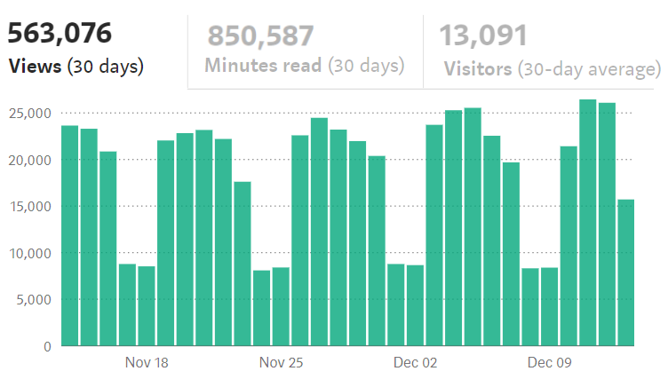

# [翻译] 2018年度 Angular In Depth 专栏最佳文章大赏
## 真正值得阅读的Angular文章

> 原文链接：[Best stories of 2018 on Angular-In-Depth](https://blog.angularindepth.com/best-stories-of-2018-on-angular-in-depth-80a1dfa17fd5)
>
> 原文作者：[Max Koretskyi，aka Wizard](https://blog.angularindepth.com/@maxim.koretskyi?source=post_header_lockup)
>
> *原技术博文由 [`Max Koretskyi`](https://twitter.com/maxim_koretskyi) 撰写发布，他目前于 [ag-Grid](https://angular-grid.ag-grid.com/?utm_source=medium&utm_medium=blog&utm_campaign=angularcustom) 担任开发大使。*
>
> 译者按：开发大使负责确保其所在的公司认真听取社区的声音并向社区传达他们的行动及目标，其作为社区和公司之间的纽带存在。
> 
> 译者：[尊重](https://github.com/sawyerbutton)；校对者：[xx](https://github.com/xx)
>
> 本文为原 Angular In Depth 频道2018年度总结及年度文章大赏。
>
> 译者按：为了行文方便，以下以**我**指代原作者，以**我们**指代 Angular In Depth 英文专栏

 
    

本文标志着 Angular-In-Depth 专栏已经正式成立两周年了。[去年这个时候](https://blog.angularindepth.com/top-10-angular-articles-in-2017-from-angularindepth-you-really-want-to-read-153ae6e497d4)我们只有6千个粉丝，总观看次数只有50万次左右。但是今年的我们交出了难以置信的答卷，50万次这个数字现在只是我们每个月的阅读量而已🤗。如果你对我们的年阅读总量感到好奇，我很自豪地宣布，这一数字是500万！是的，这个数字是5后面跟着6个0！而这只是我们的热身而已。在这里特别感谢所有读者对我们的支持😊！

 
    

我对于这样的成绩单的喜悦是难以描述的，任何的喜悦之词都不过是轻描淡写。但是除此之外，更让我高兴的是贡献了一半的文章浏览总量的文章们是由 Angular-in-Depth(AiD) 的成员而不是我所贡献的。这意味着并不只有我在努力让 AiD 变得成功。 AiD现在是一个拥有许多杰出的工程师的大型社区了。我非常感谢愿意向 AiD 投稿和合作的每个贡献者，但我特别感谢我们中最活跃的成员们 [Tim Deschryver](https://medium.com/@timdeschryver)，[Nate Lapinski](https://medium.com/@natelapinski)，[Todd Palmer](https://medium.com/@palmer_todd)，[Alex Okrushko](https://medium.com/@alex.okrushko)，[Uri Shaked](https://medium.com/@urish) 和 [Nicholas Jamieson](https://medium.com/@cartant)。我非常确信如果没有他们的贡献和热情，AiD 绝难达成今日的成绩。

但是，我们还有许多事要做。明年我们的目标是每个月1百万的浏览量，年总计1千500万的浏览量。为了达成这样的目标，我们非常需要你的帮助。**我们正在积极寻找新的贡献者**。如果你有想要分享的经验，想要解释的功能，或者受到启发挖掘出的 Angular 内部知识，请直接在 [twitter](https://twitter.com/maxim_koretskyi) 上给我发信息，或者发送邮件到 **m.koretskyi@gmail.com**。我们有专家可以帮助你完善你的想法并为你提供技术审核，在帮助我们的同时也帮助你😉。

就像去年那样，今年我再次组织了一份2018年度十大最受欢迎文章的清单。我建议你将每一篇文章都阅读一遍因为他们将会显著地帮助你拓宽 Angular 相关知识。去年的清单主要是我的文章和几篇由 [Uri Shaked ](https://medium.com/@urish) 和 [Nicholas Jamieson](https://medium.com/@cartant) 贡献的文章组成。我非常高兴今年清单中的大部分文章由 AiD 的成员所贡献。祝大家读的开心😁。

> 我现在正以开发大使的身份在 [ag-Grid](https://angular-grid.ag-grid.com/?utm_source=medium&utm_medium=blog&utm_campaign=angularcustom)工作。如果你想要学习数据栅格 （data-grids）并正在寻找最佳的 Angular 数据栅格方案，试试这篇指引 [五分钟了解 Angular 数据栅格](http://blog.ag-grid.com/index.php/2018/08/13/get-started-with-angular-grid-in-5-minutes/?utm_source=medium&utm_medium=blog&utm_campaign=getstartedangular)。我很乐意回答你的任何相关问题。关注[我](https://twitter.com/maxim_koretskyi)以获得最新的信息。

以下是今年的文章清单：

**[RxJS：避免 switchMap 的相关 bug ](https://blog.angularindepth.com/switchmap-bugs-b6de69155524)** 撰写由 [Nicholas Jamieson](https://medium.com/@cartant)

当需要展平/打平操作符时，通常建议将 RxJS 操作符 `switchMap` 作为首选，但是这个方案并不一定在所有应用场景中都是安全的。本文演示了使用 `switchMap` 可能会引入的竞争状况，并演示了在特定场景下如何使用其他更安全的选项轻松替换 `switchMap` 操作符。

**[开始使用 ngrx/effects ](https://blog.angularindepth.com/start-using-ngrx-effects-for-this-e0b2bd9da165)** 撰写由 [Nate Lapinski](https://medium.com/@natelapinski)

你可能只是通过触发一个 NgRx action 的 effect 的方式使用 ngrx/effects 的功能去处理与外部资源的交互这样的需求。但是 ngrx/effects 的作用并不仅仅如此。本文演示了 effects 的一些用例包括：控制一个对话框，控制一个通知机制，甚至是执行路由。

**[理解路由的导航周期](https://blog.angularindepth.com/angular-router-series-pillar-2-navigation-d050286bf4fa)** 撰写由 [Nate Lapinski](https://medium.com/@natelapinski)

本文解释了当你在一个 Angular 应用程序中点击一个链接后真正发生的事情。你将会从中学到在导航期间及其之后路由如何构建和使用以 `ActivatedRouteSnapshot` 对象构成的树 以及 如何使用 `<router-outlet>` 指令渲染内容。

**[指数规避场景下 RxJS 的妙用](https://blog.angularindepth.com/power-of-rxjs-when-using-exponential-backoff-a4b8bde276b0)** 撰写由 [Alex Okrushko](https://medium.com/@alex.okrushko)

本文描述并解释了应对于错误重试和减少请求次数场景下指数规避技术的效果，并介绍了自定义 RxJS 操作符（以 RxJS 序列的方式）以方便地实现指数规避策略。

**[使用 Angular CLI 创造一个库](https://blog.angularindepth.com/creating-a-library-in-angular-6-87799552e7e5)** 撰写由 [Todd Palmer](https://medium.com/@palmer_todd)

本文将带你领略创造 Angular 库过程中的细节。它引入了工作区的概念，并解释了库项目和应用项目之间的区别。你将会从中学到如何配置需要的 Angular CLI 文件以及那些可以保障 Angular 库正常起步的规则。

**[深入 Ivy：探索新的 Angular 编译器](https://blog.angularindepth.com/inside-ivy-exploring-the-new-angular-compiler-ebf85141cee1)** 撰写由 [Uri Shaked](https://medium.com/@urish)

Ivy 是一个新的 Angular 渲染引擎，你可能已经听过不少关于它的内容了。本文描述了 Ivy 编译器及其输出的内容。它会教你如何阅读生成的代码，手动装配一个编译后的 Angular 组件并运行之。

**[有关依赖注入树你需要知道的](https://blog.angularindepth.com/angular-dependency-injection-and-tree-shakeable-tokens-4588a8f70d5d)** 撰写由 [Alexey Zuev](https://medium.com/@a.yurich.zuev)

本文是一个有关 Angular 依赖注入树的全面概述。它介绍了 上由 root App 模块的注入器 下至由指令创建的单个注入器 的 注入器树的概念。本文包含大量的图表和代码示例以帮助你领会其实现。

**[有关 subscribe() 和 async pipe 的终极回答](https://blog.angularindepth.com/angular-question-rxjs-subscribe-vs-async-pipe-in-component-templates-c956c8c0c794)** 撰写由 [Tomas Trajan](https://medium.com/@tomastrajan)

RxJS已经成为了 Angular开发中的一个标准。组件通常以 Observable 流的形式获取数据。本文解释了最流行的两个从流中读取数据的方式（订阅流和将流传递给异步管道）之间的优劣关系。

**[使用 Angular CDK 创建一个 toast 服务](https://blog.angularindepth.com/creating-a-toast-service-with-angular-cdk-a0d35fd8cc12)** 撰写由 [Adrian Fâciu](https://medium.com/@adrianfaciu)

本文描述了如何实现一个自定义的 toast 讯息功能。该实现主要依赖于 **CDK** 的 `overlay` 包。当你跟随指示实现功能后，本文将会展示如何为其增加动画以实现美妙的视觉效果。

**[Angular 中的容器组件概念](https://blog.angularindepth.com/container-components-with-angular-11e4200f8df)** 撰写由 [Lars Gyrup Brink Nielsen](https://medium.com/@LayZeeDK)

本文介绍了容器组建的概念。它解释了容器组件的意义以及其在 Angular 中的实现并展示了如何使用其进行状态管理以及与不可变数据的合作。

_不幸的是，当我从我们的贡献者中选出了十篇最棒的文章后，我发现在清单中已经没有位置放置我自己的文章了。 所以我决定稍微作弊一点，在最后掺杂一点‘私货’😁：_

> 以下文章均由[ Max Koretskyi, aka Wizard ](https://blog.angularindepth.com/@maxim.koretskyi?source=post_header_lockup) 撰写

**[关于 Angular 变更检测不那么硬核的介绍](https://blog.angularindepth.com/a-gentle-introduction-into-change-detection-in-angular-33f9ffff6f10)** [中文翻译链接](https://zhuanlan.zhihu.com/p/51935121)

本文给出了有关 Angular 变更检测机制的概述：用于展示组件的内部数据结构，绑定的角色以及作为流程的一部分所执行的操作。他同样涉及了 zones 的概念并准确说明其如何在 Angular 中启用自动变更检测。如果你希望成为 Angular 变更检测机制的专家，那本文将会是你的第一块垫脚石。

**[操作 DOM：意外的行为和优化的技术](https://blog.angularindepth.com/working-with-dom-in-angular-unexpected-consequences-and-optimization-techniques-682ac09f6866)**

本文将会教你如何在 Angular 中操作 DOM。本文循序渐进，从使用模板和DOM查询等基础知识的简单例子到使用动态组件这样高端技巧用例，逐步深入介绍相关内容。通过一系列实践练习，你将能够更快地学习和巩固学到的新知识。

**[Angular 中拦截器的真相和 HttpClient 内部机制](https://blog.angularindepth.com/insiders-guide-into-interceptors-and-httpclient-mechanics-in-angular-103fbdb397bf)** [中文翻译链接](https://zhuanlan.zhihu.com/p/52827695)

本文是阅读次数最多的文章之一，其观看次数超过8万次。本文深入研究了 HttpClient 服务的内部机制特别是拦截器相关内容。我将展示如何自定义实现 自定义中间件链 并注入一个自定义后端服务。我同样解释了为何绝大多数从 HttpClient 模块导出的类如 `HttpRequest`，`HttpResponse` 都是不可变类型的。

> 假如，你同样对 React 感兴趣，我已经开启了 [React-In-Depth](https://medium.com/react-in-depth) 专栏。有兴趣的话去看看有关于 React 的第一篇文章 [内部纤维：深入介绍 React 中的新协调算法](https://medium.com/react-in-depth/inside-fiber-in-depth-overview-of-the-new-reconciliation-algorithm-in-react-e1c04700ef6e)

> 翻译组写在最后：本文涉及的top系列文章将会在后续一个月至一个半月间逐渐放出，敬请期待。