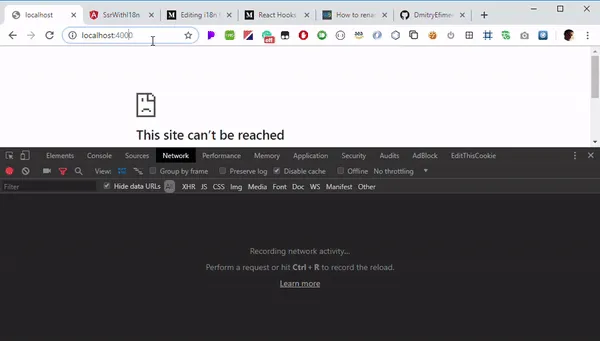

# [翻译] 于服务端（SSR）环境下实现多语种Angular应用

> 原文链接：[Implementing multi-language Angular applications rendered on a server (SSR)](https://indepth.dev/implementing-multi-language-angular-applications-rendered-on-server/)
> 作者：**[Dmitry Efimenko](https://indepth.dev/author/dmitry/)**
> 译者：**[sawyer](https://github.com/sawyerbutton)**

**本文描述了：SSR场景下多语种Angular应用的可复用落地方式**

## 背景

即使是作为一个有超过10年业内工作经验的工程师，在我深入了解i18n之前，我完全不知道i18n是什么，以及为什么在i和n两个字母之间会有一个18。事实上这其中没什么奇妙的地方，只是在单词"internationalization"的 i 和 n 之间有18个字母而已，所以 i18n 就是 internationalization 国际化。 i8n 的[定义](https://www.w3.org/International/questions/qa-i18n)中有这样的描述

> The design and development of a product, application or document content that enables easy localization for target audiences that vary in culture, region, or language

通过阅读上述链接中的i18n定义，将会发现 i18n 涉及到许多领域的开发工作，但是在本文中，我们只会侧重于以下的部分

> Separating localizable elements from source code or content, such that localized alternatives can be loaded or selected based on the user’s international preferences as needed.

事实上，从代码的层面上考虑，任何需要被多语种展示的内容应当从代码中隔离出来以确保其可维护性。

本文将会探索如何在强可维护性的的规则下实现应用字段的翻译，允许应用仅载入需要的资源，并支持浏览器记忆选择的语种。之后我们将会实践多语种Angular应用的SSR落地，并给出相关问题的解决方案。

本文将会分隔成下述部分：

1. 塑造应用
2. 将SSR添加到应用中
3. 解决方案1 - 向server提供一个分隔的 i18nModule 模块
4. 解决方案2 - 在一个单个的模块中提供所有内容
5. 使用 TransferState 提高效率
6. 抵达目标

在本文的第一阶段，我们将会简单地构建一个Angular应用并添加i18n的能力。初学者请从第一部分开始阅读，有经验的开发者请看一下第一部分最后的代码，然后进入第二部分以了解添加SSR后将会出现的问题以及如何解决他们。

## 塑造应用

为了实现本文的目标，我们将会全程使用 Angular CLI 进行应用的创建。首先，使用下述 CLI 命令创建一个基本的 Angular 应用：

```bash
ng new ssr-with-i18n
```

使用下述指令创建两个演示用的组件

```bash
ng g c comp-a
ng g c comp-b
```

现在，使用创建的两个组件替换 app.component.html 文件中的内容

```html
<h1>Welcome to {{ title }}!</h1>

<app-comp-a></app-comp-a>
<app-comp-b></app-comp-b>
```

*** 上述代码位于本[仓库](https://github.com/DmitryEfimenko/ssr-with-i18n/tree/step-1-a)

## 将SSR添加到应用中

在应用中使用SSR的方式有很多，一开始我打算使用框架无关的 i18n 库 [i18next](https://www.i18next.com/)的 Angular 封装 [angular-i18next](https://github.com/Romanchuk/angular-i18next)。然而 i18next 存在一个重要的限制：在使用过程中无法进行语言的切换，无法满足我们的诉求。

在本文中，我们将会使用著名的 [ngx-translate](https://github.com/ngx-translate/core)。

> Note: The concepts of organizing modules and code described in this article do not apply just to ngx-translate. An application can use the new and shiny transloco library, which was released the date of writing this article (8/15/2019). The reader might even be trying to solve an issue that has nothing to do with translations. Therefore, this article is helpful for anybody who’s trying to solve a SSR related issue.

ngx-translate 将翻译的字句存储于不同的 JSON 文件中（一个语种一个文件），并且每个字句会使用键值对的方式进行展示：key 是字句的识别码，value是字句的翻译文本。

1. 安装依赖

除了安装 core library 之外，我们还将会安装 http-loader 以满足按需加载翻译内容的诉求。

```bash
npm install @ngx-translate/core @ngx-translate/http-loader --save
```

2. 添加代码

ngx-translate 的官方指南中推荐将相关的代码全部添加到 AppModule 中。 但是让我们做的更解藕一些，创建一个单独的模块以封装 i18n 的相关逻辑。

```bash
ng g m i18n --module app
```

该指令会添加一个新的文件 /i18n/i18n.module.ts，并将引入到 app.module.ts 文件中。

根据[官方文档](https://github.com/ngx-translate/core#configuration)修改 i18n.module.ts 文件

```typescript
import { NgModule } from '@angular/core';
import { HttpClient, HttpClientModule } from '@angular/common/http';
import { TranslateLoader, TranslateModule, TranslateService } from '@ngx-translate/core';
import { TranslateHttpLoader } from '@ngx-translate/http-loader';

@NgModule({
  imports: [
    HttpClientModule,
    TranslateModule.forRoot({
      loader: {
        provide: TranslateLoader,
        useFactory: translateLoaderFactory,
        deps: [HttpClient]
      }
    }),
  ],
  exports: [TranslateModule]
})
export class I18nModule {
  constructor(translate: TranslateService) {
    translate.addLangs(['en', 'ru']);
    const browserLang = translate.getBrowserLang();
    translate.use(browserLang.match(/en|ru/) ? browserLang : 'en');
  }
}

export function translateLoaderFactory(httpClient: HttpClient) {
  return new TranslateHttpLoader(httpClient);
}
```

上述代码中，我们添加 TranslateModule 并配置其使用 HttpClient 加载翻译，导出 TranslateModule 模块确保 translate 管道在 AppModule 和 HTML 模版中可用，在构造器中，我们指定了可用的翻译语言并使用 ngx-translate 提供的方法获取和使用浏览器的默认语言。

默认情况下，TranslateHttpLoader 将会从 /assets/i18n/ 文件夹中加载翻译内容，让我们在相关位置添加一些文件。

/assets/i18n/en.json

```json
{
  "compA": "Component A works",
  "compB": "Component B works"
}
```

/assets/i18n/ru.json

```json
{
  "compA": "Компонент А работает",
  "compB": "Компонент Б работает"
}
```

注意：在本例子中，我们使用一种语言一个文件的方式；在更复杂的应用程序中，我们根据区域设置创建文件是更合理的方案，比如：en-US.json, en-Gb.json，但是其本质并没有发生改变，仍将是被视为单独的翻译处理。

通过上述配置，我们可以使用翻译模版字符串而不是硬编码文本更新我们的组件模板了：

```html
// comp-a.component.html
<p>{{'compA' | translate}}</p>

// comp-b.component.html
<p>{{'compB' | translate}}</p>
```

运行程序将会发现应用使用了en.json的翻译。现在创建一个组件以控制语种之间的切换。

```bash
ng g c select-language --inlineStyle --inlineTemplate
```

更新组件内的相关内容

```typescript
import { Component } from '@angular/core';
import { TranslateService } from '@ngx-translate/core';

@Component({
  selector: 'app-select-language',
  template: `
    <select #langSelect (change)="translate.use(langSelect.value)">
      <option
        *ngFor="let lang of translate.getLangs()"
        [value]="lang"
        [attr.selected]="lang === translate.currentLang ? '' : null"
      >{{lang}}</option>
    </select>
  `,
})
export class SelectLanguageComponent {
  constructor(public translate: TranslateService) { }
}
```

ngx-translate 库允许我们使用 translate.use() 函数去切换所选语言，也同样支持使用 translate.currentLang 属性获取当前选择的语言。

在 app.component.html 文件中的 h1 tag 后加入我们的新组建

```html
<h1>Welcome to {{ title }}!</h1>
<app-select-language></app-select-language>
<app-comp-a></app-comp-a>
<app-comp-b></app-comp-b>
```

运行应用，现在可以观察到语言可以在运行时被切换了。选择一个不同的语言将会请求相应的 .json 文件



现在，让我们选择 ru 的语种后刷新页面，我们仍将看到页面以 en 语种被选中的方式被加载。浏览器没有记忆选中语言的机制，我们需要弥补这一问题。

## 记忆选中的语种

Angular 社区提供了不少扩充 ngx-translage 的[插件](https://github.com/ngx-translate/core#plugins), 其中的 [ngx-translate-cache](https://github.com/jgpacheco/ngx-translate-cache) 正是我们所需要的。跟随指南，我们首先安装相关的包

```bash
npm install ngx-translate-cache --save
```

并在 i18n 的模块中使用之，

```typescript
import { TranslateCacheModule, TranslateCacheSettings, TranslateCacheService } from 'ngx-translate-cache';

@NgModule({
  imports: [
    TranslateModule.forRoot(...), // unchanged
    TranslateCacheModule.forRoot({
      cacheService: {
        provide: TranslateCacheService,
        useFactory: translateCacheFactory,
        deps: [TranslateService, TranslateCacheSettings]
      },
      cacheMechanism: 'Cookie'
    })
  ]
})
export class I18nModule {
  constructor(
    translate: TranslateService,
    translateCacheService: TranslateCacheService
  ) {
    translateCacheService.init();
    translate.addLangs(['en', 'ru']);
    const browserLang = translateCacheService.getCachedLanguage() || translate.getBrowserLang();
    translate.use(browserLang.match(/en|ru/) ? browserLang : 'en');
  }
}

export function translateCacheFactory(
  translateService: TranslateService,
  translateCacheSettings: TranslateCacheSettings
) {
  return new TranslateCacheService(translateService, translateCacheSettings);
}
```

现在，如果我们选择了 ru 语种并且刷新了浏览器，我们会发现浏览器记住了我们之前的语种选择。注意：我们选择了 ‘cookie’ 作为我们存储选中语种的地方。 cacheMechanism 的默认选择为 ‘LocalStorage’， 但是 LocalStorage 无法在服务端访问。作为一篇用来提供SSR解决方案的长文，我们在这里先做出一些前述的行动并将选择的语种添加进服务端可以读取的地方。

直到目前，本文没有什么特别之处，我们仅仅是跟随着各种文档将 i18n 的相关逻辑封装在一个独立的模块中。而向项目中添加SSR则有许多有趣的部分，让我们继续向下。

*** 上述代码位于本[仓库](https://github.com/DmitryEfimenko/ssr-with-i18n/tree/step-1-b)
