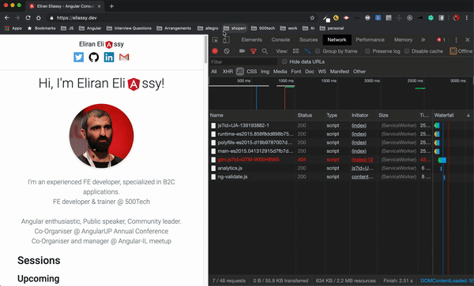
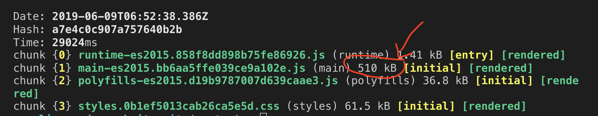
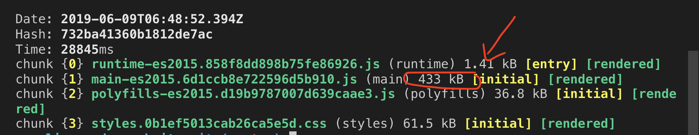
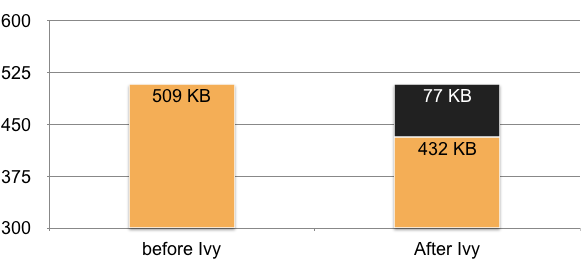
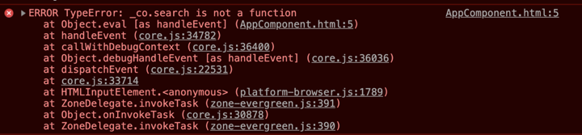
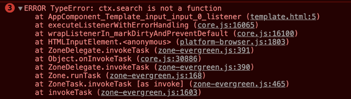
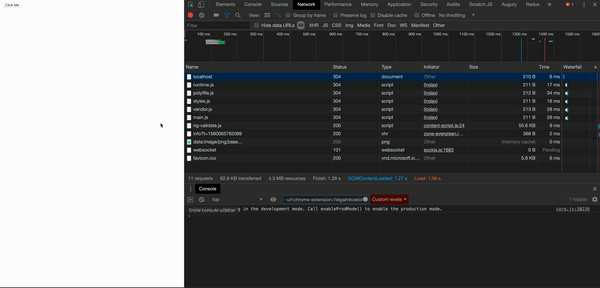
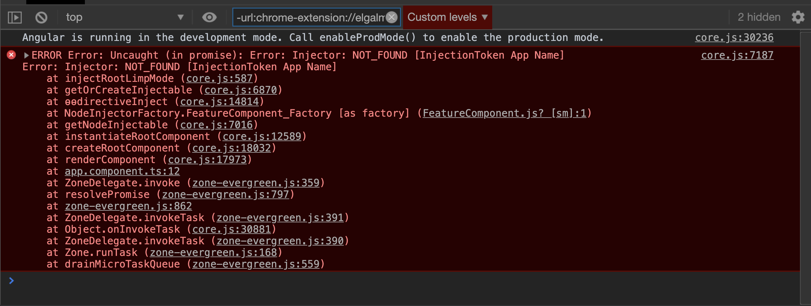
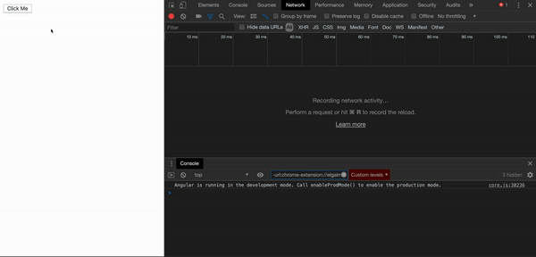
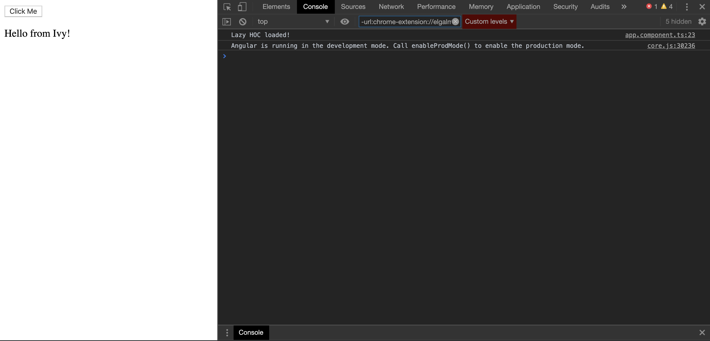

# 关于Ivy，Angular的新引擎

更小的 bundle，更快的编译，更好的调试，动态加载模块和组件以及例如高阶组件这样的先进概念 - Angular Ivy。本文将提供第三代 Angular 渲染引擎的指南。

[原文链接](https://medium.com/angular-in-depth/all-you-need-to-know-about-ivy-the-new-angular-engine-9cde471f42cf)

原作者:[Eliran Eliassy](https://medium.com/@eliranels)

译者:[尊重](https://www.zhihu.com/people/yiji-yiben-ming/posts)


大约一年前，Angular 核心组在 [ng-conf](https://www.youtube.com/watch?v=dIxknqPOWms) 大会上宣布，他们正在创造 Angular Ivy，即使 Ivy 尚未100％投入生产中，我仍然觉得这是一个深入研究这个 Angular 新渲染器的好时机。

长久的等待之后，[Angular V8 来了](https://blog.angular.io/version-8-of-angular-smaller-bundles-cli-apis-and-alignment-with-the-ecosystem-af0261112a27)

V8 是一个大版本的发布，其中包含了许多有趣和重要的新功能，比如 Differential Loading, New builder API, Web-Workers 支持。

但是其中最重要的是， Ivy 终于显露真容了。

## 为什么要创造 Ivy

首先是为了移动设备。

虽然可能听起来很不可思议，但是美国63%的在线流量来自智能手机和平板电脑。到今年年底，预计80％的互联网使用量将来自移动设备。[数据来源](https://techjury.net/stats-about/mobile-vs-desktop-usage/)


作为前端开发人员，面临的最大挑战之一就是尽快加载我们的网站,越快越好。不幸的是，移动设备经常会遇到诸如网络连接不良或速度缓慢的问题，使得上述挑战更为艰巨。

但是另一方面，我们也拥有许多解决方案以更快地加载我们的应用程序，例如：使用CDN从最近的云服务中获取文件，使用 PWA 技术缓存 assets 及其他文件。但是作为开发者而言，我们能掌握的最大机会其实是减少应用的 bundle 大小。

## 减少 Bundle 大小

让我们通过实例来理解。我们使用我的个人网站 [eliassy.dev](https://eliassy.dev/) 作为案例。这是一个很简单的使用 Angular 制作的网站，虽然看着简单但是其背后使用了许多核心功能。其使用了 Angular PWA 以支持离线功能，使用了 Angular Material 的 Animation Module 以实现动画。



在使用 Ivy 之前，网站的 main-bundle 大小超过500kb。



现在让我们使用 Ivy 替换 View Engine。编辑 `tsconfig.app.json` 文件，向 `angularComplierOption` 添加一个新属性 `enableIvy` 并将其设置为 `true`。对于使用新 Angular CLI 的项目，可以在 `ng new` 脚本进行创建项目时通过添加 `--enableIvy` 标识的方式启用 Ivy。

```JSON
{
  "extends": "../tsconfig.json",
  "compilerOptions": {
    "outDir": "../out-tsc/app",
    "types": []
  },
  "exclude": [
    "test.ts",
    "**/*.spec.ts"
  ],
  "angularCompilerOptions": {
    "enableIvy": true
  }
}
```

现在让我们重新使用 `ng build --prod` 指令构建应用



我们可以看到通过 Ivy 构建的 bundle 缩小了77KB，约为旧 bundle 大小的15％，这意味着网站的加载时间将缩短15％。



某些人可能会对仅仅缩减了 15% 的 bundle 大小感到失望。原因是，即使用作样本的网站是一个很小的项目，它仍然依赖于许多核心功能，而Ivy主要削减的是生成的代码，而不是削减框架本身。

[Stephen Fluin 发推表示](https://blog.angular.io/its-time-for-the-compatibility-opt-in-preview-of-ivy-38f3542a282f) Angular 核心团队仍然在致力于缩小构建出的 bundle 大小。

> 我们现在正在努力降低 Angular 框架的大小，以确保在将 Ivy 设置为默认引擎之前，几乎每种情况下都做到降低真实世界应用的 bundle size。当我们提供新的 bootstarpping 方式后，将会从 main bundle 中移除更多的 Angular 框架代码。

## Ivy 如何工作？

那么，在水面之下，Ivy 是如何工作的？
为了理解 Ivy 的工作机制，我们需要深入到编译器的内部。让我们首先创建一个简单地 component 

```typescript
import { Component } from '@angular/core';

@Component({
  selector: 'app-root',
  template: `
    <div>
      <span>{{title}}</span>
      <app-child *ngIf="show"></app-child>
    </div>
  `,
  styles: []
})
export class AppComponent {
  title = 'ivy-tree-shaking';
  show: boolean;
}
```

运行 `ngc` 命令生成编译代码：

1. 对于 view-engine 渲染器：`node_modules/.bin/ngc`

```typescript
/**
 * @fileoverview This file was generated by the Angular template compiler. Do not edit.
 *
 * @suppress {suspiciousCode,uselessCode,missingProperties,missingOverride,checkTypes}
 * tslint:disable
 */
import * as i0 from "@angular/core";
import * as i1 from "./child.component.ngfactory";
import * as i2 from "./child.component";
import * as i3 from "@angular/common";
import * as i4 from "./app.component";
var styles_AppComponent = [];
var RenderType_AppComponent = i0.ɵcrt({ encapsulation: 2, styles: styles_AppComponent, data: {} });
export { RenderType_AppComponent as RenderType_AppComponent };
function View_AppComponent_1(_l) { return i0.ɵvid(0, [(_l()(), i0.ɵeld(0, 0, null, null, 1, "app-child", [], null, null, null, i1.View_ChildComponent_0, i1.RenderType_ChildComponent)), i0.ɵdid(1, 114688, null, 0, i2.ChildComponent, [], null, null)], function (_ck, _v) { _ck(_v, 1, 0); }, null); }
export function View_AppComponent_0(_l) {
    return i0.ɵvid(0, [(_l()(),
        i0.ɵeld(0, 0, null, null, 4, "div", [], null, null, null, null, null)), (_l()(),
        i0.ɵeld(1, 0, null, null, 1, "span", [], null, null, null, null, null)), (_l()(),
        i0.ɵted(2, null, ["", ""])), (_l()(),
        i0.ɵand(16777216, null, null, 1, null, View_AppComponent_1)),
        i0.ɵdid(4, 16384, null, 0, i3.NgIf, [i0.ViewContainerRef, i0.TemplateRef], { ngIf: [0, "ngIf"] }, null)],
        function (_ck, _v) { var _co = _v.component; var currVal_1 = _co.show; _ck(_v, 4, 0, currVal_1); },
        function (_ck, _v) { var _co = _v.component; var currVal_0 = _co.title; _ck(_v, 2, 0, currVal_0); });
}
export function View_AppComponent_Host_0(_l) { return i0.ɵvid(0, [(_l()(), i0.ɵeld(0, 0, null, null, 1, "app-root", [], null, null, null, View_AppComponent_0, RenderType_AppComponent)), i0.ɵdid(1, 49152, null, 0, i4.AppComponent, [], null, null)], null, null); }
var AppComponentNgFactory = i0.ɵccf("app-root", i4.AppComponent, View_AppComponent_Host_0, {}, {}, []);
export { AppComponentNgFactory as AppComponentNgFactory };
//# sourceMappingURL=app.component.ngfactory.js.map
```

2. 对于 Ivy：`node_modules/.bin/ngc -p tsconfig.app.json`

```typescript
import { Component } from '@angular/core';
import * as i0 from "@angular/core";
import * as i1 from "@angular/common";
import * as i2 from "./child.component";
const _c0 = [4, "ngIf"];
function AppComponent_app_child_3_Template(rf, ctx) { if (rf & 1) {
    i0.ɵɵelement(0, "app-child");
} }
export class AppComponent {
    constructor() {
        this.title = 'ivy-tree-shaking';
    }
}
AppComponent.ngComponentDef = i0.ɵɵdefineComponent({ type: AppComponent, selectors: [["app-root"]], 
factory: function AppComponent_Factory(t) { return new (t || AppComponent)(); }, consts: 4, vars: 2, 
template: function AppComponent_Template(rf, ctx) { if (rf & 1) {
        i0.ɵɵelementStart(0, "div");
        i0.ɵɵelementStart(1, "span");
        i0.ɵɵtext(2);
        i0.ɵɵelementEnd();
        i0.ɵɵtemplate(3, AppComponent_app_child_3_Template, 1, 0, "app-child", _c0);
        i0.ɵɵelementEnd();
    } if (rf & 2) {
        i0.ɵɵselect(2);
        i0.ɵɵtextBinding(2, i0.ɵɵinterpolation1("", ctx.title, ""));
        i0.ɵɵselect(3);
        i0.ɵɵproperty("ngIf", ctx.show);
    } }, directives: [i1.NgIf, i2.ChildComponent], encapsulation: 2 });
/*@__PURE__*/ i0.ɵsetClassMetadata(AppComponent, [{
        type: Component,
        args: [{
                selector: 'app-root',
                template: `
    <div>
      <span>{{title}}</span>
      <app-child *ngIf="show"></app-child>
    </div>
  `,
                styles: []
            }]
    }], null, null);
//# sourceMappingURL=app.component.js.map
```

生成的编译代码村大不少变化，但是最重要的不同还是下述两点：

1. Ivy 不再生成 factory 文件，所有的装饰器被转化为静态函数。在我们的例子中， `@Component` 被转化为了 `ngComponentDef`。
2. the set of instructions 发生了改变，现在其可以被摇树优化，其 bundle 也会更小。

## 不仅仅是更小的 bundles

查看一下 `ngIf` 部分编译成的代码：

```JavaScript
i0.ɵdid(4, 16384, null, 0, i3.NgIf, [i0.ViewContainerRef, i0.TemplateRef], { ngIf: [0, "ngIf"] }, null)],
```

出于某种原因，我的 app component 与 `ViewContainerRef` 和 `TemplateRef` 有关。这两者其实是 `NgIf` [指令实现](https://github.com/angular/angular/blob/master/packages/common/src/directives/ng_if.ts#L152)的依赖。

而在 Ivy 中，这一过程变得更加简单，每个组件现在通过更清晰的公共 API 引用子组件和指令。这意味着当我们改变某些内容，比如：修改对于 `NgIf` 的实现时，我们不需要重新编译所有内容，我们只需要重新编译 `NgIf` 而不是整个 `AppComponent` 类。

通过 Ivy，我们获得的不仅仅是更小的 bundle，还有更快的编译速度，也使像诸如 向 NPM 上传 library 这样的动作更简单。

## 调试 Ivy

Ivy 同样提供了更简单的调试 API。

让我们写一个 input 标签，创建一个 `(input)` 事件并将其绑定到一个名为 `search` 但是实际并不存在的方法上。

```typescript
import { Component } from '@angular/core';

@Component({
  selector: 'app-root',
  template: `
    <input (input)="search($event)">
  `,
  styles: []
})
export class AppComponent {

}
```

在使用 Ivy 之前，当我们尝试在 Input 标签内键入内容时，我们会在控制台中得到如下信息：



在使用 Ivy 之后，我们将会查看到更多信息，帮助我们定位问题的源头。



这就是 Ivy 向我们提供的又一个好处：更好地模板调试。

## 动态加载

假设我们现在有一个简单的 App，有两个模块，app module 和 feature module。 Feature module 会通过路由进行懒加载，并展示 feature component。所以，当我点击 click me 按钮时，将会通过网络获取 feature module 的数据包。

```html
<button routerLink="/feature">Click Me</button>
<router-outlet></router-outlet>
```

[Demo 地址](https://ivy-example.stackblitz.io)

Angular 8 提供了用于加载模块的新 API，现在 API 支持 ES6 动态引入。

Angular 8之前：

```typescript
const routes: Routes = [
  {
    path: 'feature',
    loadChildren: './feature/feature.module#FeatureModule'
  }
];
```

Angular 8：

```typescript
const routes: Routes = [
  {
    path: 'feature',
    loadChildren: () => import('./feature/feature.module')
      .then(({ FeatureModule }) => FeatureModule)
  }
];
```

既然现在可以使用动态引入了，为什么不尝试一下直接引入组件呢？

```typescript
import { Component } from '@angular/core';

@Component({
  selector: 'my-app',
  templateUrl: './app.component.html',
  styleUrls: [ './app.component.css' ]
})
export class AppComponent  {
    loadFeature() {
    import('./feature/feature/feature.component')
    .then(({FeatureComponent}) => FeatureComponent)
  }
}
```

[Demo 地址](https://ivy-example-dynamic-component-load.stackblitz.io)

结果是：



在组件内直接引入 component 的方式可行的！但是，有一点不对劲。我们加载了一个组件，但是却没有在模块中申明它。所以，我们还是否应当在 module 中申明组件？或者说，模块现在是可选项了吗？我们之后在回答这个问题，但是首先，让我们尝试把这个引入的组件加入到视图中。

为了将刚刚引入的组件加入到视图中，我们需要使用 `ɵrenderComponent` 函数：

```typescript
export class AppComponent {
  loadFeature() {
    import('./feature/feature/feature.component')
      .then(({ FeatureComponent }) => {
        ɵrenderComponent(FeatureComponent);
      });
  }
}
```

这样的操作会产生一个异常，很好理解，我们想要将引入的 component 加入到视图中，但是并没有告知其宿主元素是谁。



在这我们有两个选择，第一个 - 在 DOM 增加一个 `FeatureComponent` 选择器，这样 Angular 将会在选择器所在的位置渲染组件：

```html
<button (click)="loadFeature()">Click Me</button>
<app-feature></app-feature>
<router-outlet></router-outlet>
```

或者通过 `renderComponent` 进行配置设置一个宿主元素。我们甚至可以添加一个不存在的宿主元素，而 Ivy 会将组件添加于其上：

```typescript
loadFeature() {
    import('./feature/feature/feature.component')
      .then(({ FeatureComponent }) => {
        ɵrenderComponent(FeatureComponent, { host: 'my-container' });
      });
  }
```

### Module 是否还需要呢？

如刚刚的功能所示，我们不需要在模块中申明被动态引入的组件，这不禁让我们怀疑是否还需要 Modules？为了回答这个问题，让我们创建另一个应用场景，现在 `FeatureComponent` 将注入一个配置，该配置将会被申明和提供于 `AppModule`：

```typescript
export const APP_NAME: InjectionToken<string> =
  new InjectionToken<string>('App Name');
  
@NgModule({
  ...,
  providers: [
    {provide: APP_NAME, useValue: 'Ivy'}
  ],
  bootstrap: [AppComponent]
})
export class AppModule { }
```

`FeatureComponent`:

```typescript
import { Component, OnInit, Inject } from '@angular/core';
import { APP_NAME } from 'src/app/app.module';

@Component({
  selector: 'app-feature',
  template: `
  <p>
    Hello from {{appName}}!
  </p>
  `,
  styleUrls: ['./feature.component.scss']
})
export class FeatureComponent implements OnInit {

  constructor(@Inject(APP_NAME) public appName: string) { }

  ngOnInit() {
  }

}
```

现在，如果我们尝试去加载组件，将会触发一个异常，因为我们的组件缺少一个注入器（injector）：


不在 module 中申明组件也有坏处，实际上我们没有在组件中使用 injector。尽管如此， `renderComponent`配置也允许我们声明一个Injector:

```typesscript
export class AppComponent {
  constructor(private injector: Injector) {}
  loadFeature() {
    import('./feature/feature/feature.component')
      .then(({ FeatureComponent }) => {
        ɵrenderComponent(FeatureComponent, { host: 'my-container', injector: this.injector });
      });
  }
}
```



这下，一切正常工作了。

## 高阶组件 High Order Component

正如我们所看到的那样，Angular 越来越动态化了，并且允许开发者使用更高阶的概念，比如 HOC。

### HOC 是什么

HOC 本质是一个函数，其接受一个组件作为入参，并返回一个组件作为出参，该函数在过程中影响组件。

> HOC is a function which gets a component and returns a component but also affecting the component in between.

现在让我们创建一个基本的 HOC，将其作为一个装饰器添加到 `AppComponent` 上。

```typescript
import { Component, ɵrenderComponent, Injector } from '@angular/core';

@HOC()
@Component({
  selector: 'app-root',
  templateUrl: './app.component.html',
  styleUrls: ['./app.component.scss']
})
export class AppComponent {
  constructor(private injector: Injector) { }
  loadFeature() {
    import('./feature/feature/feature.component')
      .then(({ FeatureComponent }) => {
        ɵrenderComponent(FeatureComponent, { host: 'my-container', injector: this.injector });
      });
  }
}

export function HOC() {
  return (cmpType) => {
    const originalFactory = cmpType.ngComponentDef.factory;
    cmpType.ngComponentDef.factory = (...args) => {
      const cmp = originalFactory(...args);
      console.log(cmp);
      return cmp;
    };
  };
}
```

现在，让我们利用 HOC 和动态导入的概念来创建一个 Lazy Component：

```typescript
import { Component, ɵrenderComponent, Injector, ɵɵdirectiveInject, INJECTOR } from '@angular/core';

@LazyComponent({
  path: './feature/feature/feature.component',
  component: 'FeatureComponent',
  host: 'my-container'
})
@Component({
  selector: 'app-root',
  templateUrl: './app.component.html',
  styleUrls: ['./app.component.scss']
})
export class AppComponent {
  constructor(private injector: Injector) { }
  loadFeature() {
    import('./feature/feature/feature.component')
      .then(({ FeatureComponent }) => {
        ɵrenderComponent(FeatureComponent, { host: 'my-container', injector: this.injector });
      });
  }

  afterViewLoad() {
    console.log('Lazy HOC loaded!');
  }
}


export function LazyComponent(config: { path: string, component: string, host: string }) {
  return (cmpType) => {
    const originalFactory = cmpType.ngComponentDef.factory;
    cmpType.ngComponentDef.factory = (...args) => {
      const cmp = originalFactory(...args);

      const injector = ɵɵdirectiveInject(INJECTOR);

      import(`${config.path}`).then(m =>
        ɵrenderComponent(m[config.component], { host: config.host, injector }));

      if (cmp.afterViewLoad) {
        cmp.afterViewLoad();
      }
      return cmp;
    };
    return cmpType;
  };
}
```

分析有两点：

1. 如何在没有 Angular DI 的基础上获取 injector？还记得 `ngc` 命令吗？我是用这个命令去检查 Angular 如何将 构造器的注入功能转化为编译后文件，并由此发现了 `directiveInject` 方法:

```
const injector = ɵɵdirectiveInject(INJECTOR);
```

2. 我使用 HOC 方法创建了一个新的 `life cycle` 函数命名为 `afterViewLoad`, 如果该函数存在于原始组件中，就将会在 Lazy 组件渲染后被触发。



## 总结

快速回顾一下我们学到了什么：

1. Ivy，第三代 Angular 编译器已经可以使用了。在向后兼容的基础上，使用 Ivy 可以获得更小的打包，更容易 debug 的 API，更快的编译以及模块/组件的动态加载。
2. 拥有 Ivy 的 Angular 提供了例如 HOC 这样的新功能。
3. Ivy 为 Angular Elements 的发展奠定了基础。
4. 自己尝试一下 Ivy，只需要将 `enableIvy` 标签位置为 `true` 即可。