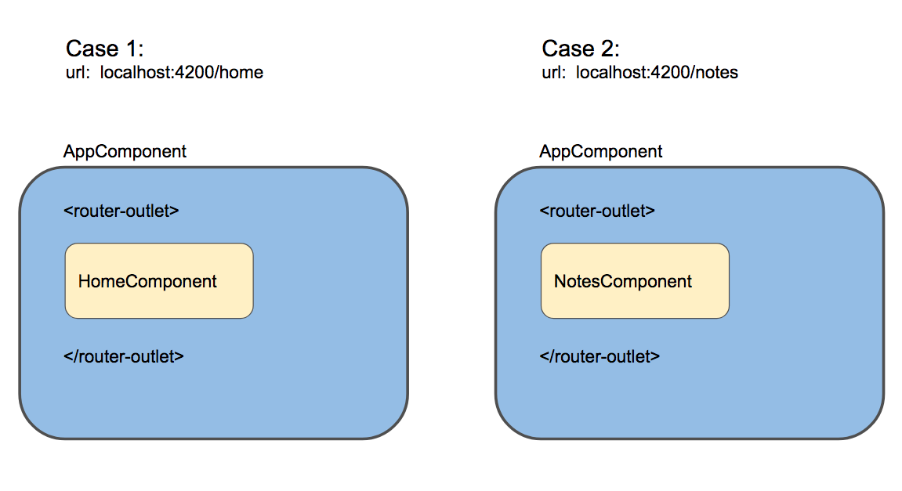

# 关于Ivy，Angular的新引擎

更小的 bundle，更快的编译，更好的调试，动态加载模块和组件以及例如高阶组件这样的先进概念 - Angular Ivy。本文将是第三代 Angular 渲染引擎的全面指南。

[原文链接](https://medium.com/angular-in-depth/all-you-need-to-know-about-ivy-the-new-angular-engine-9cde471f42cf)

原作者:[Eliran Eliassy](https://medium.com/@eliranels)

译者:[尊重](https://www.zhihu.com/people/yiji-yiben-ming/posts)


大约一年前，Angular 核心组在 [ng-conf](https://www.youtube.com/watch?v=dIxknqPOWms) 大会上宣布，他们正在创造 Angular Ivy，即使 Ivy 尚未100％投入生产中，我仍然觉得这是一个深入研究这个 Angular 新渲染器的好时机。

长久的等待之后，[Angular V8 来了](https://blog.angular.io/version-8-of-angular-smaller-bundles-cli-apis-and-alignment-with-the-ecosystem-af0261112a27)

V8 是一个大版本的发布，其中包含了许多有趣和重要的新功能，比如 Differential Loading, New builder API, Web-Workers 支持。

但是其中最重要的是， Ivy 终于显露真容了。

## 为什么要创造 Ivy

首先是为了移动设备。

虽然可能听起来很不可思议，但是美国63%的在线流量来自智能手机和平板电脑。到今年年底，预计80％的互联网使用量将来自移动设备。[数据来源](https://techjury.net/stats-about/mobile-vs-desktop-usage/)



作为前端开发人员，面临的最大挑战之一就是尽快加载我们的网站,越快越好。不幸的是，移动设备经常会遇到诸如网络连接不良或速度缓慢的问题，使得上述挑战更为艰巨。

但是另一方面，我们也拥有许多解决方案以更快地加载我们的应用程序，例如：使用CDN从最近的云服务中获取文件，使用 PWA 技术缓存 assets 及其他文件。但是作为开发者而言，我们能掌握的最大机会其实是减少应用的 bundle 大小。

## 减少 Bundle 大小

让我们通过实例来理解。我们使用我的个人网站 [eliassy.dev](https://eliassy.dev/) 作为案例。这是一个很简单的使用 Angular 制作的网站，虽然看着简单但是其背后使用了许多核心功能。其使用了 Angular PWA 以支持离线功能，使用了 Angular Material 的 Animation Module。


在使用 Ivy 之前，网站的 main-bundle 大小超过500kb。


现在让我们使用 Ivy 替换 View Engine。编辑 `tsconfig.app.json` 文件，向 `angularComplierOption` 添加一个新属性 `enableIvy` 并将其设置为 `true`。对于使用新 Angular CLI 的项目，可以在 `ng new` 脚本进行创建项目时通过添加 `--enableIvy` 标识的方式启用 Ivy。

```JSON
{
  "extends": "../tsconfig.json",
  "compilerOptions": {
    "outDir": "../out-tsc/app",
    "types": []
  },
  "exclude": [
    "test.ts",
    "**/*.spec.ts"
  ],
  "angularCompilerOptions": {
    "enableIvy": true
  }
}
```

现在让我们重新使用 `ng build --prod` 指令构建应用


我们可以看到通过 Ivy 构建的 bundle 缩小了77KB，约为旧 bundle 大小的15％，这意味着网站的加载时间将缩短15％。


某些人可能会对仅仅缩减了 15% 的 bundle 大小感到失望。原因是，即使这个网站是一个很小的项目，它仍然依赖于许多核心功能，而Ivy主要削减的是生成的代码，而不是削减框架本身。

[Stephen Fluin 发推表示](https://blog.angular.io/its-time-for-the-compatibility-opt-in-preview-of-ivy-38f3542a282f) Angular 核心团队仍然在致力于缩小构建出的 bundle 大小。

> 我们现在正在努力降低 Angular 框架的大小，以确保在将 Ivy 设置为默认引擎之前，几乎每种情况下都做到降低真实世界应用的 bundle size。当我们提供新的 bootstarpping 方式后，将会从 main bundle 中移除更多的 Angular 框架代码。

## Ivy 如何工作？