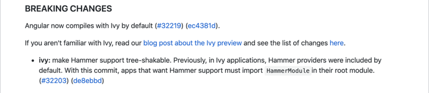
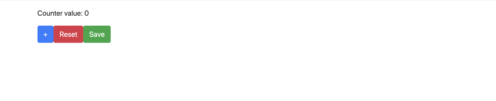
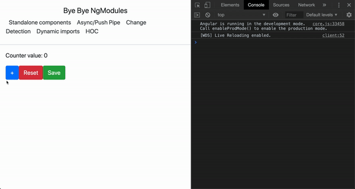
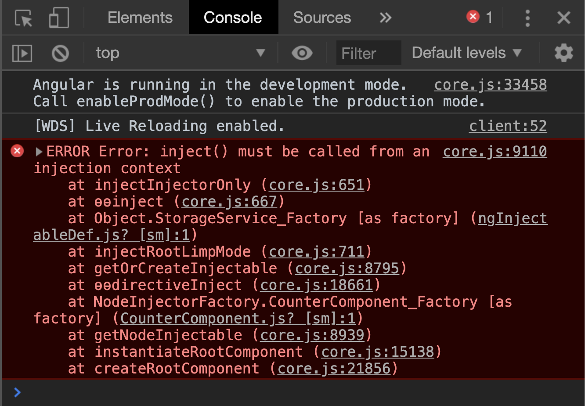
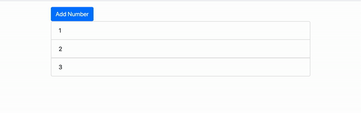
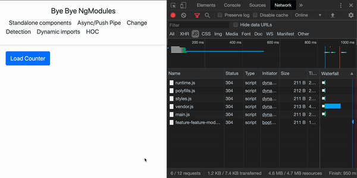
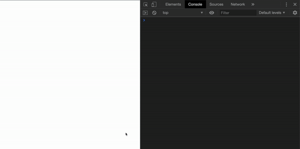
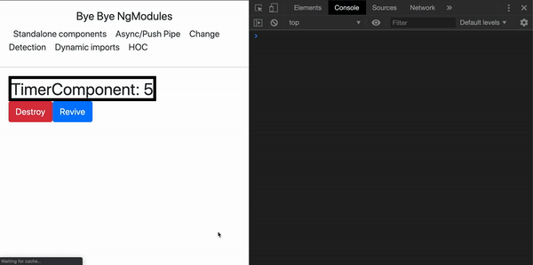

# Ivy发布后的独立组件的未来

Angular Ivy 已经于 Angular 9 rc 版本中发布了。现在正是一个好机会去了解 何为Ivy，学习相关的新 API 并且思考独立组件背后的理念。

[原文链接](https://medium.com/angular-in-depth/the-future-of-standalone-components-in-the-post-ivy-release-days-e7ed9b9b4dcd)

原作者：[Eliran Eliassy
](https://medium.com/@eliranels?source=post_page-----e7ed9b9b4dcd----------------------)

译者:[尊重](https://www.zhihu.com/people/yiji-yiben-ming/activities)


本文不会解释什么是 Angular Ivy。 如果你想要了解关于 Angular Ivy 的基本内容，请查看我的前一篇[技术博客](https://blog.angularindepth.com/all-you-need-to-know-about-ivy-the-new-angular-engine-9cde471f42cf)

本文中大部分内容还处于实验性阶段尚未官方推出。它们中的大部分在未来可能还会变化。

几周前， `9.0.0-next3` 版本宣告发布，并官方宣布 "Ivy 正式成为了 Angular 的默认编译器"。Ivy 近在咫尺，是时候通过独立组件背后的理念来了解组件实现的未来了。



让我们通过一个组件来看一个简单的概念。如下所示，一个计数器组件。其包含一个用于设置初始化计数器数值的输入属性，一个通知计数器已经被重置的输出属性。

```typescript
@Component({
  selector: 'app-counter',
  template: `
    <p>Counter value: {{counter}}</p>
    <button (click)="plus()" class="btn btn-primary">+</button>
    <button (click)="reset()" class="btn btn-danger">Reset</button>
    <button (click)="save()" class="btn btn-success">Save</button>
  `,
  styleUrls: ['./counter.component.scss'],

})
export class CounterComponent {

  @Input() counter = 0;
  @Output() counterReset: EventEmitter<void> = new EventEmitter<void>();
  plus() { this.counter++; }
  reset() { this.counter = 0; this.counterReset.emit(); }
}
```

我们创建了一个 Angular 组件，这样就可以通过自定义 HTML 标签的方式使用它：

```HTML
<app-counter></app-counter>
```

为了正常使用这个自定义 HTML 标签，我们可能还需要：

1. 创建一个 NgModule - `CounterModule`
2. 在该模块中申明计数器组件并将其导出
3. 引导启动该模块
4. 将 `CounterModule` 导入主模块 `AppModule` 中

只有上述操作做完后，我们才可以使用我们的自定义选择器

```typescript
@NgModule({
  declarations: [CounterComponent],
  exports: [CounterComponent],
  imports: [CommonModule]
})
export class CounterModule { }
```

为了使用自定义的组件我们却做了远超组件本身的事。

所以我查看了 Angular 官方文档并发现了这句话：

> “A component must belong to an NgModule”.

我对此很不满意。对我而言 NgModule 的内容远超过了一个组件的范畴。Modules 包含 Injectors, providers, DI 及其他超出组件范畴的内容。NgModules 某种意义上是一个展示应用。

我想说的是，**应用并是不组件**！有时候我们只是想不依赖于任何应用渲染一个独立组件而已。

Ivy 特别吸引人的一点是，他终于向我们提供了仅同过一个简单的函数就渲染一个组件的方法：

```typescript
ɵrenderComponent(CounterComponent);
```

但是，这不是没有代价的。

正如之前所说，NgModule 定义了 Injectors, zone, directives 和 providers，如果我们创建了独立组件却没有在模块中将其申明的话，我们就必须手动处理这些内容。

看我表演：

除了使用 `app-counter` 选择器外，我们还可以在 `OnInit` 钩子中调用 `renderComponent` 方法，并同时申明其宿主：

```typescript
@Component({
  selector: 'app-render-comp',
  template: `<counter-host></counter-host>`,
  styleUrls: ['./render-comp.component.scss'],
})
export class RenderCompComponent implements OnInit {

  ngOnInit() {
    ɵrenderComponent(CounterComponent, { host: 'counter-host' });
  }

}
```

现在，在屏幕上，我们终于可以看见计数器了：



某些层面上，他在运作...

如果我们点击 `+` 或者 `reset` 按钮，会发现屏幕上不会响应任何内容...

我在 `plus()` 和 `reset()` 函数内添加了打印功能 `console.log`:



我们知道，NgModule 定义了 zones，而 zones 负责自动变更检测的内容。因为我们的独立组件不属于任何一个 Module，也自然独立组件不具备自动变更检测的能力。

如何修复这样的状况？ Ivy 提供了一个名为 `detectChanges()` 的方法，有点像我们在 `ChangeDetectorRef` 上使用的 `detectChanges()` 方法。Ivy 提供的 detectChanges 方法仅仅是一个独立的函数，不需要注入任何服务或者 DI：

```typescript
@Component({
  selector: 'app-counter',
  template: `
    <p>Counter value: {{counter}}</p>
    <button (click)="plus()" class="btn btn-primary">+</button>
    <button (click)="reset()" class="btn btn-danger">Reset</button>
    <button (click)="save()" class="btn btn-success">Save</button>
  `,
  styleUrls: ['./counter.component.scss'],

})
export class CounterComponent {

  @Input() counter = 0;
  @Output() counterReset: EventEmitter<void> = new EventEmitter<void>();
  plus() { this.counter++; console.log(this.counter); ɵdetectChanges(this); }
  reset() { this.counter = 0; this.counterReset.emit(); ɵdetectChanges(this); }

}
```

现在：


一切正常！

现在让我们进行一些更有趣的尝试。

我有一个服务，可以用于通过一个 Http 请求存储计数器的值：

```typescript
export class StorageService {

  constructor(private httpClient: HttpClient) { }

  saveCounter(counter: number) {
    return this.httpClient.post('SOME_FAKE_URL', { counter });
  }
}
```

我想要将这个服务作为独立组件的一部分进行使用，我直接通过构造器进行服务的注入，并通过触发保存按钮的方法实现对 `save` 方法的调用：

```typescript
@Component({
  selector: 'app-counter',
  template: `
    <p>Counter value: {{counter}}</p>
    <button (click)="plus()" class="btn btn-primary">+</button>
    <button (click)="reset()" class="btn btn-danger">Reset</button>
    <button (click)="save()" class="btn btn-success">Save</button>
  `,
  styleUrls: ['./counter.component.scss'],

})
export class CounterComponent {

  constructor(private storageService: StorageService) { }

  @Input() counter = 0;
  @Output() counterReset: EventEmitter<void> = new EventEmitter<void>();
  plus() { this.counter++; console.log(this.counter); ɵdetectChanges(this); }
  reset() { this.counter = 0; this.counterReset.emit(); ɵdetectChanges(this); }
  save() { this.storageService.saveCounter(this.counter).subscribe(); }

}
```

现在，当我们运行应用时，会直接报一个错误：



怎么回事？

其实很简单，`CounterComponent` 组件并没有 `Injector` 可以用于解析我们尝试进行注入的`StorageService` 中的 `HttpClient`。那谁有 Injector? 使用 `CounterComponent` 组件的父组件有。

我们可以像如下方式在主 app 中注入 Injector：

```typescript
constructor(private injector: Injector) { }

ngOnInit() {
  ɵrenderComponent(CounterComponent, { host: 'counter-host', injector: this.injector });
}
```

或者，我们不想使用依赖注入（DI），Ivy 同样提供了一个方法去注入 token - `directiveInject`：

```typescript
ngOnInit() {
    const injector = ɵɵdirectiveInject(INJECTOR);
    ɵrenderComponent(CounterComponent, { host: 'counter-host', injector });
}
```

## 组件依赖 & 自动变更检测

### 组件依赖

大多数时候，我们的组件需要的不仅仅是 injectors 或 变更检测机制。有时候我们会使用指令，管道，或者导入一个完全不同的模块。

现在，我们还没办法玩出花活，但是根据 [Rob Wormald 在 AngularUp 的演讲](https://www.youtube.com/watch?v=-32nh-pGXaU)，未来我们可以额通过下述的方式向指定的组件中导入 providers 和 dependency。

```typescript

@Component({
  selector: 'app-counter',
  template: `
    ...
  `,
  styleUrls: ['./counter.component.scss'],
  providers: [SomeProvider],
  deps: [SomeDirective, SomePipe, SomeModule]

})
```

### 自动变更检测

自动变更检测机制对现在的 Angular 应用是非常重要的一环。大多数时候，当我们需要以异步的方式解析数据流时，会选择使用 `async` 管道。

通过查看 `async pipe` 的[源代码](https://github.com/angular/angular/blob/master/packages/common/src/pipes/async_pipe.ts#L144), 发现 async pipe 实际上依赖于 Zone，
其通过触发 `markForCheck()` 方法去影响模板的变化。

让我们看看代码:

```typescript
@Component({
  selector: 'app-counter',
  template: `
  <p> {{res$ | async}}</p>
  ...
  `,
  styleUrls: ['./counter.component.scss'],
})
export class CounterComponent {

  res$ = of(1).pipe(
    delay(1000)
  );

  ...

}
```

我添加了一个在 1s 内被处理的 observable，并希望在模板中正确地展示数据。通常来说，`async` 管道足以应对该场景，但是在没有 zones 的情况下，管道应有的功能失效了。

如何解决这个问题？解决方案可能是类似于 `push` pipe。目前这个阶段，我们还有没获得正式发布版本的 Angular Ivy，但是 Manfre Steyer 对此的提供了可能[应对方案](https://github.com/manfredsteyer/angular-microapp/blob/master/projects/client-a/src/app/push.pipe.ts)

## OnPush Component

之前提及了 `markForCheck()` 方法，让我们用别的例子演示该方法如何在 Ivy 中运作。

现在，我们有2个组件，`markForCheck()` 组件是一个容器组件并包含一个 behavior subject，使用 [1,2,3] 作为初始数据流：

```typescript
import { ChangeDetectionStrategy } from '@angular/core';
import { Component } from '@angular/core';
import { BehaviorSubject } from 'rxjs';

@Component({
  selector: 'app-container',
  templateUrl: `
    <button (click)="add(4)" class="btn btn-primary">Add Number</button>
    <app-child [data]="numbers$"></app-child>
  `,
  styleUrls: ['./mark-for-check.component.scss'],
})
export class ContainerComponent {

  numbers$ = new BehaviorSubject([1, 2, 3]);

  add(num) {
    this.numbers$.next([num]);
  }
}
```

还有一个子组件，订阅作为 @Input 获取的数据，

```typescript
@Component({
  selector: 'app-child',
  template: `
    <div class="list-group">
      <div class="list-group-item" *ngFor="let item of numbers">
          {{item}}
      </div>
    </div>
  `,
  styleUrls: ['./child.component.scss'],
})
export class ChildComponent implements OnInit {

  @Input() data: Observable<string[]>;
  numbers: string[] = [];

  ngOnInit() {
    this.data.subscribe(numbers => {
      this.numbers = [...this.numbers, ...numbers];
    });

  }
}
```

现在，当点击 `Add Number` 按钮式，数字4将会被添加到视图之中：



现在，如果我们改变子组件的变更检测策略为 On Push，再次点击 `Add Number` 按钮则不会更新数字列表。如果修复这样的状况？不依赖Ivy时使用 `ChangeDetectorRef` 的 `markForCheck()` 函数可以满足我们的诉求。

在 Ivy 中，我们可以使用 `markDirty()` 方法去告知 Angular 在下一次循环中渲染这个组件及其所有的钩子。

```typescript
@Component({
  selector: 'app-child',
  template: `
    <div class="list-group">
      <div class="list-group-item" *ngFor="let item of numbers">
          {{item}}
      </div>
    </div>
  `,
  styleUrls: ['./child.component.scss'],
  changeDetection: ChangeDetectionStrategy.OnPush
})
export class ChildComponent implements OnInit {

  @Input() data: Observable<string[]>;
  numbers: string[] = [];

  ngOnInit() {
    this.data.subscribe(numbers => {
      this.numbers = [...this.numbers, ...numbers];
      ɵmarkDirty(this);
    });

  }

}
```

## 动态引入

另一个独立组件提供的能力是按需动态加载、

设想一下这样的用例，你的网站中有一个小的聊天框，这个聊天框不可获取，但是只有5%的用户会使用它。

当这样类似的功能存在于你的项目中时，大概率他将会打包在你的 main bundle 中。大多数时候你不会希望向这种用户大概率不使用的功能投入成本。

Angular 8 通过使用 ES6 的导入函数引入了模块懒加载：

```typescript
{
    path: 'dynamic-import',
    loadChildren: () => import('./feature/feature.module').then((m) => m.FeatureModule)
}
```

让我们试试在组件级别也做同样的事儿？

```typescript
import { Component, OnInit, ɵrenderComponent, ɵɵdirectiveInject, INJECTOR, Injector } from '@angular/core';

@Component({
  selector: 'app-feature',
  template: `
  <button class="btn btn-primary" (click)="loadCounter()">Load Counter</button>
  <my-host></my-host>
  `,
  styleUrls: ['./feature.component.scss']
})
export class FeatureComponent {

  constructor(private injector: Injector) { }
  loadCounter() {
    import('../../counter/counter.component').then(c => {
      ɵrenderComponent(c.CounterComponent, { host: 'my-host', injector: this.injector });
    });

  }

}
```

查看 chrome 开发者工具的network tab，当 `load Counter` 按钮被点击后，`CounterComponent` 数据包才会被下载！



通过懒加载的方式载入独立组件是帮助 main bundle 瘦身的好方法之一。对我个人而言，可能是 Ivy 带给我们最棒的内容。

## 高阶组件（HOC）

迄今为止，我们已经谈论了很多有关 Angular 组件的未来。但是，如果问我带有 Ivy 的新 Angular 最让人兴奋的部分是什么，我会毫不犹豫地回答 高阶组件(HOC)。

HOC 是一个接受 组件作为参数，并返回一个组件的函数，其将会在过程中影响组件。

在上一篇[技术博客](https://blog.angularindepth.com/all-you-need-to-know-about-ivy-the-new-angular-engine-9cde471f42cf)中，我们已经了解过什么是 HOC，现在让我们用另一个例子来展示它是什么。

### Rxjs 自动取消订阅

让我们从一个例子开始：

我们有一个定时器工具，每一秒触发一次。代码中添加了一个 tap 操作符打印结果，这个 tap 将会是我们的指示器，通知我们在组件存活和销毁时订阅是否还存活：

```typescript

@Component({
  selector: 'app-timer',
  template: `
    TimerComponent:
    {{counter}}
  `,
  styleUrls: ['./timer.component.scss']
})
export class TimerComponent implements OnInit, OnDestroy {

  private counterSubscription: Subscription;
  public counter: number;

  constructor() { }

  ngOnInit() {
    this.counterSubscription = timer(0, 1000)
    .pipe(tap(console.log))
    .subscribe(c => {
      this.counter = c;
    });
  }

  ngOnDestroy() {
    console.log('counter stopped at ' + this.counter);
  }

}
```

创建一个容器组件，用于创建和复活上述组件：

```typescript
@Component({
  selector: 'app-timer-example',
  template: `
    <div>
      <app-timer *ngIf="alive"></app-timer>
    </div>
    <button (click)="destroy()" class="btn btn-danger">Destroy</button>
    <button (click)="revive()" class="btn btn-primary">Revive</button>
  `,
  styleUrls: ['./timer-example.component.scss']
})
export class TimerExampleComponent {

  public alive = true;

  public destroy() {
    this.alive = false;
  }

  public revive() {
    this.alive = true;
  }
}
```

让我们销毁我们的组件并检查控制台：



正如上图所示，即使我们删除了组件，订阅任然存在。如果我们复活定时器，将会出现另一个订阅，这也产生了一个潜在的内存泄漏。

## 结论 - Auto Unsubscribe HOC

让我们利用 HOC 的功能创建一个自动组件取消订阅器：

```typescript
import { Subscription } from 'rxjs';

export function Unsubscriber() {
    return (cmpType) => {
        const originalFactory = cmpType.ngComponentDef.factory;
        cmpType.ngComponentDef.factory = (...args) => {
            const cmp = originalFactory(...args);

            cmpType.ngComponentDef.onDestroy = () => {
                if (cmp.ngOnDestroy) {
                    cmp.ngOnDestroy();
                }

                Object.keys(cmp)
                    .forEach(prop => {
                        if (isSubscription(cmp[prop])) {
                            cmp[prop].unsubscribe();
                        }
                    });

            };

            return cmp;
        };
        return cmpType;
    };
}

export function isSubscription(val: any): val is Subscription {
    return !!val && (val instanceof Subscription || (typeof val.unsubscribe === 'function'));
}
```

检查结果：



如我所愿

现在让我们解释一下发生了什么：

1. 我们通过 `cmpType.ngComponentDef.factory` 创建了一个 HOC。
2. 有两个概念：`cmpTyp` 代表了由 `ngc` 命令生成的组件定义，`cmp` 代表了组件实例。
3. override 了 `ngComponentDef.onDestory` 方法并将其功能拓展为：
   1. 检查组件实例是否包含名为 `ngOnDestroy` 的属性，如果存在，我们将不会 override `OnDestroy` 钩子而是仅仅是触发 `cmp.ngOnDestory`。
   2. 我们遍历组件实例并检查每一个属性是否为 `Subscription` 类型。如果是，就触发其 `unsubscribe()` 方法以实现自动取消订阅。

**这个 RXJS 自动取消订阅功能将会在其他 RXJS 工具中发布**

## 总结

Ivy 作为 Angular 的第三代编译器发布在即，给开发者带来了许多有趣的功能。

虽然本文中大部分内容还处于实现性质，尚未稳定，但是我们仍然可以从中窥探有关独立组件实现的未来场景。
