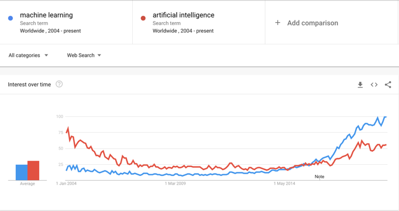
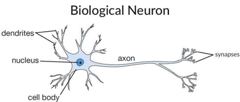
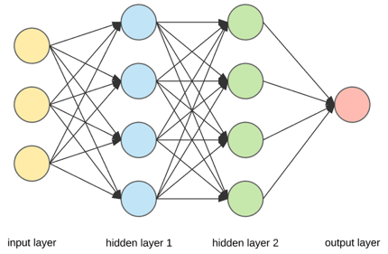
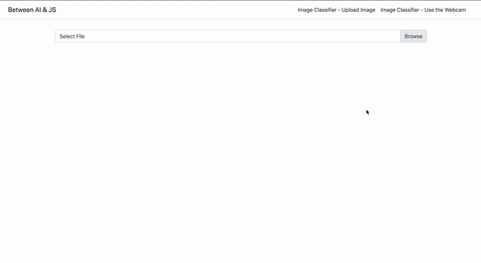
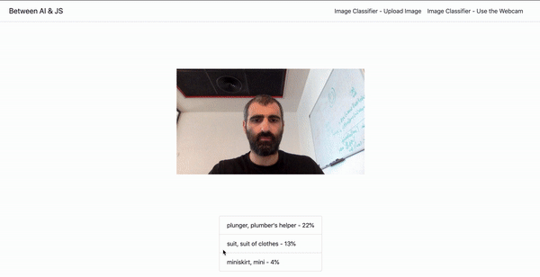

# 使用 Angular 和 TensorFlow.js 打造属于你的图片识别器

如果你是一个 Js 开发工程师，同时对数据科学家利用机器学习和人工智能所做的事感到惊奇，阅读这篇博客后，相信你可以在几分钟使用 JavaScript 内搭建属于你的图片识别器。


AI（Artificial Intelligece）和 ML 毫无疑问是近几年来最火的词汇。

好像满世界都谈论 AI。但是，感觉并不是事实，我查看了 google trends 以见证了这两个词汇不断升温的过程。



不知咋地，我总是感觉，这个话题只是为数据科学家，python 开发者和比我聪明的人提供的。所以我检查了一下  google trends 上相关的查询：


没有前端，没有 JavaScript，也没有 Angular，几乎都是 python。

## AI 是什么？

> The theory and development of computer systems able to perform tasks normally requiring human intelligence, such as visual perception, speech recognition, decision-making and translation between Languages

换句话说，通过让计算机利用人类的智慧，做所有事。

举例来说？

Siri，Alexa，Tesla，甚至是 NetFlix 都利用 AI 相关概念向你推荐剧集。

### AI 如何工作？

无论你信不信，AI 实际上基于生物学。

我们的大脑中充满了神经元，神经元从视觉获取输入，并通过突触生成输出。最重要的是，这就是人脑智力的真香。



现在让我们将概念转化为数学模型。如何将神经元通过代码以简单的方式实现呢？应该是使用一个接收多个输入并将输入转化为输出的节点吧。

大多数时候，一个神经元并不足以创建我们所期待的预测模型。所我们实际上需要将神经元转化为一个神经网络：



在节点上，每一个输入值都存在一个权重，通过运行一些激活函数，我们在第二层级上获取一个输出。但是，我们发现获得的输出并不是我们想看到的那个，所以我们需要重新计算节点的权重以适配我们的案例。对于同一个案例，实际上我们 pump up 同样的数字，以便我们可以在下一次迭代中获得期待的结果。而这个过程就称为 **训练**，当我们将更多的数据加入到模型中后，模型得以进化。

其中最有效的创建神经网络的方式是名为 TensorFlow 的技术。

大约一年前的时候，Google 发布了 **TensorFlow.js**。起初，我以为Tensorflow.js 只是由 C语言 编写的 Tensorflow 插件/绑定，你需要将其下载安装在你的电脑上。但是事实上，Tensorflow.js 是将 Tensorflow 完完全全通过 JS 重写的 JS 包。

### JS 真的是足够强健以计算一个复杂的模型吗？

浏览器如何才可以在可以接受的时间内进行大量的数学计算流程呢？多亏有 WebGL，我们可以在 JS 代码中使用显卡内存进行相关计算，而这样会比使用 RAM 内存中进行处理要更强健，更快。

**事实上，我们在浏览器里进行无依赖的机器学习**

## 图像分类器

AI 领域内最令人激动地概念之一就是图像识别。

我一直对计算机系统可以像人类那样识别图像的能力感到惊讶。

让我们看一个 facebook 的例子，“某人上传了一张你可能于其中的照片” 这个功能着实惊讶到了我，facebook 的工程师是怎么实现的？！


刚刚我们才说，我们可以再浏览器里做同样的事儿，让我们试试看！

我们将会使用名为 "mobilenet" 预处理模型。之所以这个模型被命名为 mobilenet，是因为该模型是为移动设备所设计的，相比于其他预测模型，我的执行速度更快。

我们将创建两个例子：

- 上传图片，让浏览器分类其中的内容
- 开启机器的照相头，让浏览器识别照相机捕获的内容。

### 图片上传分类器

#### 第一步：安装 TensorFlow 和 Mobilenet

```bash
npm i @tensorflow/tfjs
npm I @tensorflow-models/mobilenet
```

#### 第二步：向组件中导入 mobile net

```typescript
import * as mobilenet from '@tensorflow-models/mobilenet';
```

#### 第三步：载入 mobilenet 模型

在 OnInit 钩子里载入模型，并添加加载标志位。

```typescript
@Component({
  selector: 'app-image-classfier-upload',
  templateUrl: './image-classfier-upload.component.html',
  styleUrls: ['./image-classfier-upload.component.scss']
})
export class ImageClassfierUploadComponent implements OnInit {

  model: any;
  loading: boolean;

  constructor() { }

  async ngOnInit() {
    this.loading = true;
    this.model = await mobilenet.load();
    this.loading = false;
  }

}
```

#### 第四步：准备 HTML

现在，让我们向模板中添加一个 input file section 和一个 加载标志：

```html
<div class="cont d-flex justify-content-center align-items-center flex-column">

  <div class="custom-file">
      <input type="file" class="custom-file-input" (change)="fileChange($event)">
      <label class="custom-file-label">Select File</label>
  </div>

  <div *ngIf="loading">
      
  </div>


</div>
```

#### 第五步：实现 fileChange()  函数

添加一个 `imgSrc` 类属性，并将 FileReader 赋值给它，用于展示图片上传预览

```typescript
async fileChange(event) {
    const file = event.target.files[0];
    if (file) {
      const reader = new FileReader();

      reader.readAsDataURL(file);

      reader.onload = (res: any) => {
        this.imgSrc = res.target.result;

      };
    }
  }
```

#### 第六步：分类上传的图片

现在有了 `imgSrc`，就可以通过执行 `model.classify()`方法获取模型的与预测值了：

```typescript
 setTimeout(async () => {
          this.predictions = await this.model.classify(this.img.nativeElement);
        });Ï
```

与此同时，我们更新模块内容以展示预测：

```html
<div class="list-group">
      <div class="list-group-item" *ngFor="let item of predictions">
          {{item.className}} - {{item.probability | percent}}
      </div>
  </div>
```

结果是：



一切正常！

我们刚刚只用 JavaScript 就实现了我们第一个图片分类器。

### Webcam 分类器

Mobilenet 分类不仅仅可以用于静态图片我们还可以分类和预测实时视屏流！

让我们向我们的模板中添加一个 HTML5 `video` tag：

```html
<video autoplay muted width="300px" height="300px" #video></video>
```

现在，为了启动我们的 webcam，我们必须设置数据流。首先让我们通过 `@ViewChild` 获取模板中的 video 元素：

```typescript
@ViewChild('video') video: ElementRef;
```

并在 `AfterViewInit` 生命周期钩子中进行相关实现：

```typescript
async ngAfterViewInit() {
    const vid = this.video.nativeElement;

    if (navigator.mediaDevices.getUserMedia) {
      navigator.mediaDevices.getUserMedia({ video: true })
        .then((stream) => {
          vid.srcObject = stream;

        })
        .catch((err0r) => {
          console.log('Something went wrong!');
        });
    }
  }
```

这里有几个地方需要注意一下：

1. 因为我们在调用组件时，我们改变了 DOM 元素，所以最好在 AfterViewInit 生命周期中实现功能。
2. 在执行功能之前首先检查用户的浏览器是否支持 `navigator.mediaDevices.getUserMedia` API,确保应用不会异常。
3. 我们通过 getUserMedia 函数获取一个 Promise，该 Promise 包含一个数据流，我们将 video 的 `nativeElement.srcObject` 置于数据流中，这样我们就可以通过屏幕看到我们自己了：

最后，我们可以在 webcam 数据流中每隔三秒运行一次 `classify()`函数：

```typescript
setInterval(async () => {
      this.predictions = await this.model.classify(this.video.nativeElement);
   }, 3000);
```

看一下成果：



我尝试过对遥控器，钱包和手机进行分类。你可以看到分类器成功地对这些东西进行了预测/分类。

虽然结果不是100%正确，但是还是非常吸引人。

## 总结一下：

- 现在，就算你不是数据科学家也可以做 AI 相关的事情了。
- TensorFlow.js 是一个完全独立的js包，你只需要一个简单的引入就可以在浏览器中使用它。
- 说不定未来前端开发工程师可以参与进 AI 预测模型的构建中~

## Demo

上述的所有功能实现我都放在这个 [stackblitz 仓库](https://stackblitz.com/github/eliraneliassy/between-ai-n-js/tree/final?source=post_page-----5b1bc2391424----------------------)中，欢迎参考。