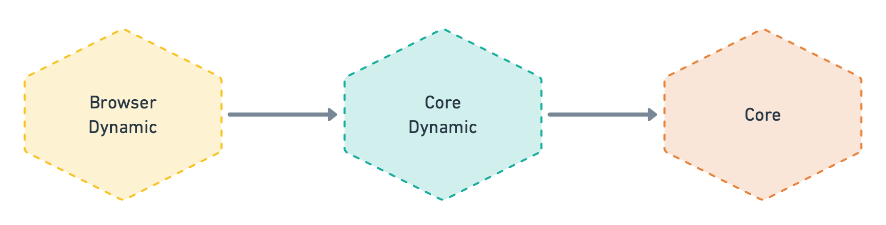
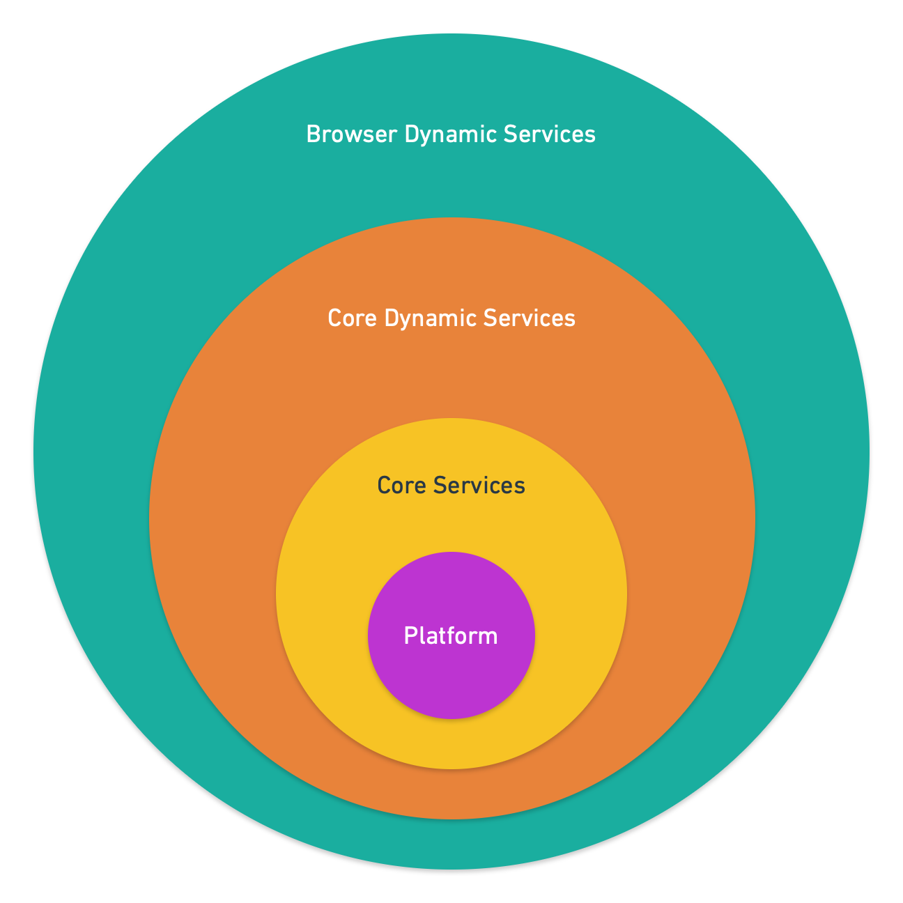
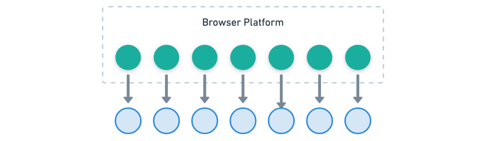
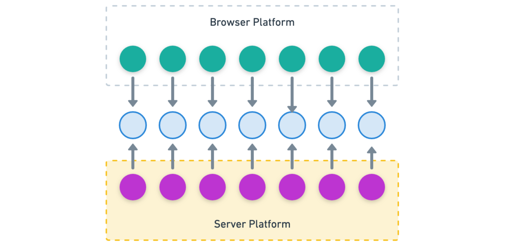
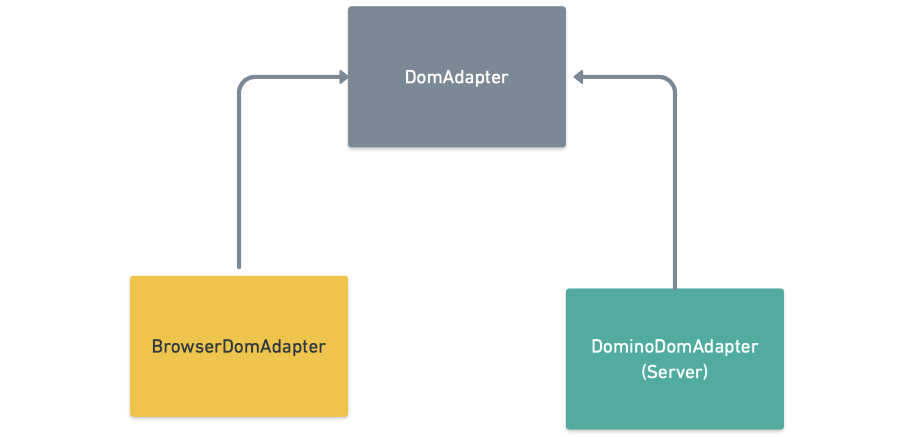

# 深入理解 Angular Platforms 之 什么是 Angular Platforms

[原文链接](https://medium.com/angular-in-depth/angular-platforms-in-depth-part-1-what-are-angular-platforms-9919d45f3054)

原作者:[
Nikita Poltoratsky
](https://twitter.com/NikPoltoratsky)

译者:[尊重](https://www.zhihu.com/people/yiji-yiben-ming/posts)

Angular 框架的设计初衷是将其打造成一个独立平台。这样的设计思路确保了 Angular 应用可以正常地跨环境执行 -  无论是在浏览器，服务端，web-worker 甚至是在移动设备上。

在这一系列文章中，我们将揭示 Angular 应用跨平台执行的奥秘。我们还会学习如果创建自定义 Angular 平台，该平台可以在系统命令终端中，使用 ASCII 图像工具渲染应用。

系列文章：

- Angular Platforms in depth. Part 1. 什么是 Angular Platforms
- [Angular Platforms in depth. Part 2. 应用启动流程](https://blog.angularindepth.com/angular-platforms-in-depth-part-2-application-bootstrap-process-8be461b4667e)
- [Angular Platforms in depth. Part 3. 在命令行终端中渲染 Angular 应用](https://medium.com/angular-in-depth/angular-platforms-in-depth-part-3-rendering-angular-applications-in-terminal-117e4da9c0cc)


## 本文内容

- Angular 是一个跨平台框架
- 什么是 Angular platforms
- Angular platforms 如何确保跨平台能力的执行

## Angular 是一个跨平台框架

正如前文所述，Angular 在设计之初就将灵活性作为设计考量之一，这也是为什么 Angular 是一个跨平台框架，而不仅仅限制使用于浏览器。确保 Angular 执行的唯一条件是 JavaScript 引擎。让我们看看最受欢迎的 Angular 运行环境。

### 浏览器

当我们通过 Angular CLI 指令 `ng new MyNewApplication` 创建一个新的 Angular 应用时，应用的默认环境设置为浏览器环境。

### 服务端

Angular 应用可以被编译和执行于服务端；在这种场景下，我们可以将 Angular 应用编译为静态 HTML 文件，再将相关文件发送给客户端。

通过这样的方式，我们可以提升应用的加载速度，同样确保应用可以被所有搜索引擎正确索引。

### Web worker

我们可以将 Angular 应用的部分移动到其他的线程中运行 - web worker 线程中。在这种情况下，我们将只留下应用的一小部分在主线程中，而这一部分将允许 web worker 涉及的部分通过 document API 进行沟通。

通过这样的方式，我们可以塑造出一个顺滑的没有卡顿的 UI，因为应用中大部分的计算过程都会和 UI 渲染部分离开。

> Web worker 环境从一开始就处于试验阶段，自动 Angular 8 开始就被摒弃了。

### NativeScript

有许多第三方库协助我们将 Angular 程序跨多环境运行。比如 NativeScript。 NativeScript 确保 Angular 能够运行于移动设备，并使用所有原生平台的能力。

但是为什么跨环境执行 Angular 应用是可能的呢？

> 秘密武器就是 platforms！

## 什么是 Angular platforms？

为了理解 Angular platforms 是什么，我们需要查看每个 Angular 应用的入口：`maint.ts` 文件：

```typescript
import { platformBrowserDynamic } from '@angular/platform-browser-dynamic';

platformBrowserDynamic().bootstrapModule(AppModule);
```

我们需要注意两个重要的部分：

- `platformBrowserDynamic()` 函数被调用并返回某个对象
- 返回的对象用户引导启动我们的应用

如果我们简单地重写 `main.ts` 文件，我们会发现一个有趣的细节：

```typescript
import { platformBrowserDynamic } from '@angular/platform-browser-dynamic';
import { PlatformRef } from '@angular/core';
 
 
// Create Browser Platform
const platformRef: PlatformRef = platformBrowserDynamic();
 
// Bootstrap Application
platformRef.bootstrapModule(AppModule);
```

`platformBrowserDynamic` 是一个 **platform factory** - 一个创建新 platforms 实例的函数。 `platformBrowserDynamic` 函数的返回结果是一个 `PlatformRef`。 `PlatformRef` 只是一个 Angular 服务，该服务知晓如何引导启动 Angular 应用。为了更好理解 `PlatformRef` 这个实例的创建过程，让我们看看 `platformBrowserDynamic` 的实现：

```typescript
export const platformBrowserDynamic = createPlatformFactory(
  
  // Parent platform factory
  platformCoreDynamic,
  
  // New factory name
  'browserDynamic',
  
  // Additional services
  INTERNAL_BROWSER_DYNAMIC_PLATFORM_PROVIDERS,
);
```

通过阅读上述的代码，我们发现 `platformBrowserDynamic` 函数只是 `createPlatformFactory` 的返回结果，而 `createPlatformFactory` 接受下述参数：

- 父级 platform factory - `platformCoreDynamic`
- 新 platform 的名称 - `browserDynamic`
- 额外的提供商 - `INTERNAL_BROWSER_DYNAMIC_PLAFORM_PROVIDERS`

`platformCoreDynamic` 是一个 父级 platform factory 函数。我们可以将 `platformCoreDynamic` 和 `platformBrowserDynamic` 的关系定义为继承。`createPlatformFactory` 函数只是用于帮助我们将一个 platform factory 继承于某个其他的 platform factory。就是这么简单。

更有趣的部分在更深的继承层次结构中。事实上，`platformCoreDynamic` 继承于 `platformCore` 中，而 `platformCore` 没有继承意义上的父级。

所以，有关 `platformBrowserDynamic` 的完整继承结构是这样：



在继承的过程中， Angular platform factory 并不会改变父级 platform factory 的行为。事实上， Angular platform factory 为应用提供了额外的 tokens 和服务。

好吧，这好像有点复杂。让我们仔细分析 `createPlatformFactory` 函数，希望可以理解 Angular platfor factories 是如何被创建的：

```typescript
type PlatformFactory = (extraProviders?: StaticProvider[]) => PlatformRef;

export function createPlatformFactory(
  parentPlatformFactory: PlatformFactory,
  name: string,
  providers: StaticProvider[] = [],
): PlatformFactory {

  return (extraProviders: StaticProvider[] = []) => {
    const injectedProviders: StaticProvider[] = providers.concat(extraProviders);

    if (parentPlatformFactory) {
      return parentPlatformFactory(injectedProviders);
    } else {
      return createPlatform(Injector.create({ providers: injectedProviders }));
    }
  };
}
```

当我们调用 `createPlatformFactory` 函数时，函数返回一个 platform factory 函数。该函数为我们的应用接受额外的 `StaticProviders`。如果我们提供了父级 platform factory， `createPlatformFactory` 函数将会调用之并返回它的结果；否则，`createPlatformFactory` 函数将只会创建并返回一个新的 platform。 让我们逐步分析以更好理解 `platformBrowserDynamic` 函数的创建过程。

1. `platformBrowserDynamic` 通过 `createPlatformFactory` 函数调用所创建，而 `platformCoreDynamic` 作为其父级 platform。
2. 我们调用 `platformBrowserDynamic` 函数创建了一个新的 platform
3. 该 platform 检查 `parentPlatformFactory` 是否存在，若存在则添加额外的 providers 并调用 `parentPlatformFactory` 函数，最终返回 `parentPlatformFactory` 的结果：

```typescript
if (parentPlatformFactory) { 
  return parentPlatformFactory(injectedProviders); 
}
```

4. 在这个阶段，我们注意到， `platformBrowserDynamic` 函数的返回结果 其实是 添加了通过 `platformBrowserDynamic` 提供的服务后构成的 `platformCoreDynamic` 函数 的返回结果。
5. `platformCoreDynamic` 和 `platformBrowserDynamic` 很大程度上以同样的方式被创建，只有两点不同，`platformCoreDynamic` 拓展自 `platformCore` 并提供了其自身的 providers。

```typescript

export const platformCoreDynamic = createPlatformFactory(
  platformCore,
  'coreDynamic', 
  CORE_DYNAMIC_PROVIDERS,
);
```

到了此刻我们意识到，我们遇到的是同样的场景：因为父级 platform 的存在，我们只是返回 添加了额外的 providers 的父级 platform factory 的函数结果。

```typescript
platformCore([ ...CORE_DYNAMIC_PROVIDERS, ...BROWSER_DYNAMIC_PROVIDERS ]);
```

6. 但是在 `platformCore` 中，事情会有一点不太一样。

```typescript
export const platformCore = createPlatformFactory(
  null,
  'core',
  CORE_PLATFORM_PROVIDERS,
);
```

此时，`CORE_PLATFORM_PROVIDERS` 是一个只包含最重要 provider 的数组 - `PlaftformRef` 服务。因为我们在父级 flatform factory 中使用 `null` 作为入参，所以 `createPlatformFactory` 函数将会返回 `createPlatform` 函数的结果。

7. `createPlatform` 函数将会从 injector 中获取 `PlatformRef`。并将其返回给调用者。

```typescript
function createPlatform(injector: Injector): PlatformRef {
  return injector.get(PlatformRef);
}
```

8. 现在我们创建了 `PlatformRef`:

```typescript
const ref: PlatformRef = platformBrowserDynamic();
```


注意，在继承的过程中，platforms 并没有明显地改变 `PlatformRef` 的功能行为。事实上，继承的过程只是提供新的服务合集，而这些服务将会在引导启动的流程中，被 `PlatformRef` 所使用。



我们注意到，`platformCore` 和其他 platforms 有所不同。 `platformCore` 有些特别，因为其负责对 platform 的创建过程提供 `PlatformRef`, 这也是为什么使用 `platformCore` 作为 Angular 生态系统中每个 platform 的 root platform 的原因。

通过上述的论述，我们可以得出结论，每个 Angular platform 包含两个重要的部分：

- `PlatformRef` - 用于引导启动 Angular 应用的服务。
- Provider - 用于引导启动和执行阶段的 token 和服务的数组。

## Angular platforms 如何让跨平台执行成为现实？

在上一部分中，我们已经学到了什么是 Angular platforms 以及如何创建它。现在，让我们探讨一下 Angular platforms 是如何让 Angular 成为跨平台框架的。

实现的核心就在于抽象。Angular 高度依赖于依赖注入系统。这也是为什么 Angular 本身很大一部分内容被声明为抽象服务的原因：

- Renderer2
- Compiler
- elementSchemaRegistry
- Sanitizer
- etc.

在 Angular 中上述提及的服务和其他部分都被声明为抽象类。当我们使用不同的 platform 时，这些 platforms 提供对这些抽象类合适的实现。解释一下，比如，我们有一些由 Angular 所申明的抽象服务。我个人比较倾向于将他们想象成蓝色的圆圈：


但是这些都是抽象类，也就意味着他们缺少实现或者功能。当我们使用 Browser Platform 时，platform 将对这些服务提供实现：



而当我们使用 Server Platform 时，它也会向这些抽象核心服务提供属于自己的实现。



好，现在让我们看一个具体的例子。

举例来说，Angular 使用 `DomAdapter` 抽象以环境无关的方式去操作 DOM。下述代码是 `DomAdapter` 抽象类的简化版本。

```typescript
export abstract class DomAdapter {
  abstract setProperty(el: Element, name: string, value: any): any;
  abstract getProperty(el: Element, name: string): any;
  abstract querySelector(el: any, selector: string): any;
  abstract querySelectorAll(el: any, selector: string): any[];
  abstract appendChild(el: any, node: any): any;
  abstract removeChild(el: any, node: any): any;
  
  //... and so on
}
```

当我们使用 Browser Platform 时，Angular 将会对该抽象类提供合适的浏览器实现：

```typescript
export class BrowserDomAdapter extends DomAdapter { ... }
```

`BrowserDomAdapter` 与浏览器的 DOM 直接交互，这也是为什么该实现只能用于浏览器环境中。

出于服务器端渲染的目的而使用 Server Platform 以确保在服务器端正常执行，而 Server Platform 也提供了对 `DomAdapter` 抽象类的另一种实现：

```typescript
export class DominoAdapter extends DomAdapter { ... }
```

`DominoAdapter` 不与 DOM 进行交互，因为在服务端无法获取 DOM。除此之外，其还会使用 domino library，在 node.js 环境中模拟 DOM。

结果上来说，抽象类的架构如下：



## 结论

恭喜，你已经抵达这篇文章的末尾了。在本文中，我们讨论了什么是 Angular platforms，以及如何创建 Angular platforms ，并一步步地了解 `platformBrowserDynamic` 的启动过程。最后，我们了解了 platforms 理念如何确保 Angular 成为一个跨平台框架。

如果你希望了解更多有关 Angular platforms 的知识，还请阅读后续的系列文章

- Angular Platforms in depth. Part 1. 什么是 Angular Platforms
- [Angular Platforms in depth. Part 2. 应用启动流程](https://blog.angularindepth.com/angular-platforms-in-depth-part-2-application-bootstrap-process-8be461b4667e)
- [Angular Platforms in depth. Part 3. 在命令行终端中渲染 Angular 应用](https://medium.com/angular-in-depth/angular-platforms-in-depth-part-3-rendering-angular-applications-in-terminal-117e4da9c0cc)

别忘了，在 [twitter](https://twitter.com/NikPoltoratsky) 上粉我一下，你会在第一时间获得有关 Angular 文章的通知。