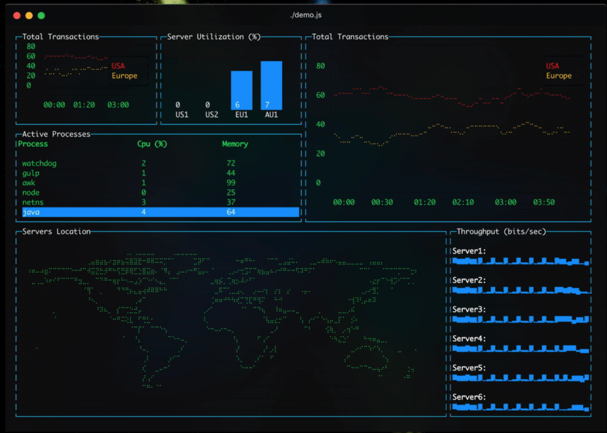
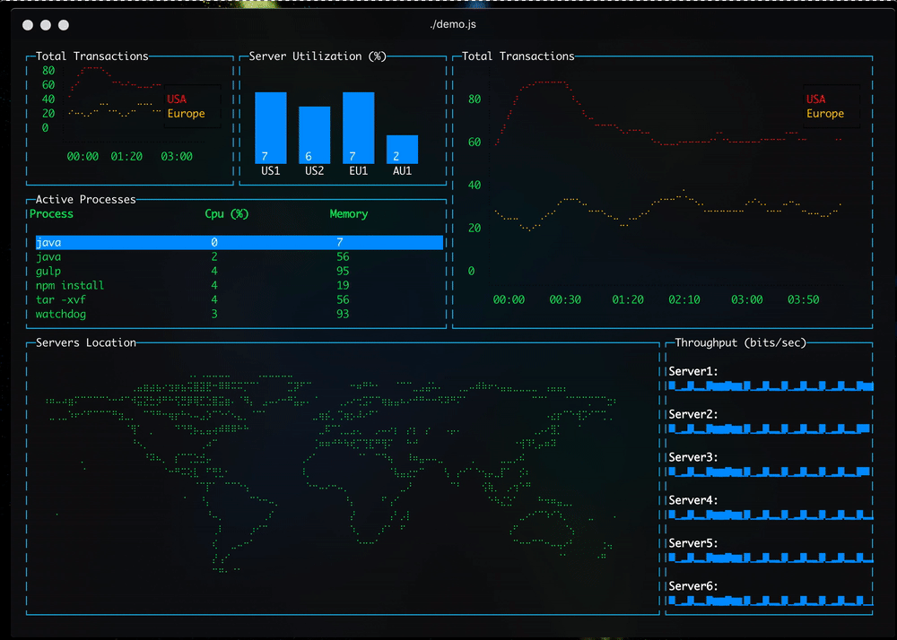

# 深入理解Angular平台之于终端渲染Angular应用

[原文链接](https://medium.com/angular-in-depth/angular-platforms-in-depth-part-3-rendering-angular-applications-in-terminal-117e4da9c0cc)

原作者:[
Nikita Poltoratsky
](https://twitter.com/NikPoltoratsky)

译者:[尊重](https://www.zhihu.com/people/yiji-yiben-ming/posts)

Angular 框架的设计初衷是将其打造成一个独立平台。这样的设计思路确保了 Angular 应用可以正常地跨环境执行 -  无论是在浏览器，服务端，web-worker 甚至是在移动设备上。

在这一系列文章中，我们将揭示 Angular 应用跨平台执行的奥秘。我们还会学习如果创建自定义 Angular platform ，其可以使用 ASCII 图像工具系统命令终端中渲染应用。

系列文章：

- [Angular Platforms in depth. Part 1. 什么是 Angular Platforms](https://blog.angularindepth.com/angular-platforms-in-depth-part-1-what-are-angular-platforms-9919d45f3054)
- [Angular Platforms in depth. Part 2. 应用启动流程](https://medium.com/angular-in-depth/angular-platforms-in-depth-part-2-application-bootstrap-process-8be461b4667e)
- Angular Platforms in depth. Part 3. 在命令行终端中渲染 Angular 应用



本文将是深入理解 Angular platforms 系列的最后一篇文章。本文中，我们将领略创建自定义 platform 的全过程。但是在开始之前，请确保你已经理解了 Angular platforms 的工作原理或查看本系列的其他两篇技术博客。

正如我在系列文章的开始时所说，借助了抽象的概念，Angular 才能够跨越环境正常运行。Angular 中的很大一部分内容都被申明为抽象类，当我们使用不同的 platforms 时，这些 platforms 提供对抽象类的具体实现。因此，我们只需要完成某些 Angular 服务的具体实现，就可以达成我们创建终端 platform 的目标。

## 本文内容

- Renderer
- Sanitizer
- Error handling
- Terminal module
- Platform terminal
- Building terminal application

## Renderer

让我们从终端 platform 最重要的部分 - 渲染开始。 Angular 使用 `Renderer` 抽象通过环境无关的方式进行渲染。`renderer` 只是一个抽象类，所以我们需要创造对 `renderer` 的实现，该实现将负责在系统终端中使用 ASCII 图像工具渲染应用。

但是首先，我们如何在系统终端中渲染应用呢？我认为最简单的方式是使用第三方类库，利用第三方类库调用 ASCII 图像工具在终端中创建图像。最终结论是使用 `blessed` 类库，该类库具有用于 node.js 的高级终端接口API，非常强大的类库。

首先，安装 `blessed`：

```bash
npm install blessed @types/blessed
```

因为我们已经决定使用专有类库进行UI渲染的操作了，所以我现在需要做的是构建一些适配器（adapter）以确保 Angular renderer's API 和 blessed Library 的 API 相匹配。

下述代码是 Angular Renderer 的简要申明：

```typescript
export abstract class Renderer2 {

  abstract createElement(name: string, namespace?: string|null): any;

  abstract createText(value: string): any;

  abstract appendChild(parent: any, newChild: any): void;

  abstract addClass(el: any, name: string): void;

  abstract removeClass(el: any, name: string): void;

  // ...
}
```

Renderer2 的基本责任是创建和移除元素，添加css类和attributes，注册事件侦听器。

另一方面，blessed 类库拥有下述接口：

```typescript
const blessed = require('blessed');

// Create blessed screen
const screen = blessed.screen();

// Create some elements
const box = blessed.box();
const table = blessed.table();

// Add elements on the screen
table.append(box);
screen.append(table);

// Display all changes
screen.render();
```

正如上述代码所示，blessed 是一个平铺直叙的 node.js 类库，提供了一个 `screen` 和一系列组件。`Screen` 类似于浏览器的 `document`。`Screen` 既是应用程序的根元素，同时也包含许多有用的API。

### Screen

让我们使用 `screen` 进行基于 blessed 的 renderer 集成。首先，让我们创建一个独立的 `Screen` service，该服务向 renderer 提供 `screen` 属性。

```typescript
import { Injectable } from '@angular/core';

import * as blessed from 'blessed';
import { Widgets } from 'blessed';

@Injectable()
export class Screen {

  private screen: Widgets.Screen;

  constructor() {
    this.screen = blessed.screen({ smartCSR: true });
    this.setupExitListener();
  }

  selectRootElement(): Widgets.Screen {
    return this.screen;
  }

  private setupExitListener() {
    this.screen.key(['C-c'], () => process.exit(0));
  }
}
```

上述代码中包含了一个基础的 `Screen` 实现。该服务负责创建一个 blessed screen，同时创建一个退出监听器。因为我们将会在终端中执行应用，使用 `control + c` 的组合键终止控制台应用是最常见的方式。这也是为什么我们需要监听这样的组合键行为，并给出退出程序的反馈。 `process.exit` 是一个标准的 node.js API，该 API 允许脚本退出其自身进程的同时给出一个退出码。`0` 表示进程正常完结，无错误发生。上述代码中，`Screen` 还通过 `selectRootElement` 函数提供了选择根元素的能力。

### Elements registry

现在我们已经拥有了 `Screen` 并拥有了选择根元素的能力，是时候处理元素生成流程了。
通过 `blessed` 包直接导出的方法，可以直接在 screen 上创建元素。与此同时，Angular renderer 使用 `createElement` 函数实现同样的功能。这也是为什么我们需要为元素创建逻辑制作适配器的原因。举例来说，我们将 `blessed` 的元素创建逻辑封装在独立的 `ElementsRegistry` 服务中。`ElementsRegistry` 通过 `createElement` 函数创建 `blessed` 元素:

```typescript
import { Injectable } from '@angular/core';
import * as blessed from 'blessed';
import { Widgets } from 'blessed';

export type ElementFactory = (any) => Widgets.BoxElement;

export const elementsFactory: Map<string, ElementFactory> = new Map()
  .set('text', blessed.text)
  .set('box', blessed.box)
  .set('table', blessed.table)

@Injectable()
export class ElementsRegistry {

  createElement(name: string, options: any = {}): Widgets.BoxElement {
    let elementFactory: ElementFactory = elementsFactory.get(name);

    if (!elementFactory) {
      elementFactory = elementsFactory.get('box');
    }

    return elementFactory({ ...options, screen: this.screen });
  }
}
```

上述代码中，`ElementsRegistry` 服务包含一个 `createElement`,该函数用于查找在element map 中的 element 并返回其实例。为了避免没有在 map 中找到 element 的情况，`ElementsRegistry` 将默认返回一个 `box` element, 该元素是 `div` element 在浏览器中的拟态。

到了这个阶段，我们拥有了所需的全部实体，已经可以创建一个用于在系统终端中使用 ASCII 图像工具渲染应用的 Angular renderer 了。

### `Renderer`

下述代码是 renderer 的基本实现：

```typescript
export class TerminalRenderer implements Renderer2 {

  constructor(private screen: Screen, private elementsRegistry: ElementsRegistry) {
  }

  createElement(name: string, namespace?: string | null): any {
    return this.elementsRegistry.createElement(name);
  }

  createText(value: string): any {
    return this.elementsRegistry.createElement('text', { content: value });
  }

  selectRootElement(): Widgets.Screen {
    return this.screen.selectRootElement();
  }

  appendChild(parent: Widgets.BlessedElement, newChild: Widgets.BlessedElement): void {
    parent.append(newChild);
  }

  setAttribute(el: Widgets.BlessedElement, name: string, value: string, namespace?: string | null): void {
    el[name] = value;
  }

  setValue(node: Widgets.BlessedElement, value: string): void {
    node.setContent(value);
  }
}
```

在此我只实现了所需方法的一小部分，剩下的部分交给你自己实现。现在，`TerminalRenderer` 类实现了 `Renderer2` 接口。其使用 `Screen` 和 `ElementRegistry` 以创建元素。

但是，`TerminalRenderer` 并不是一个 `Injectable` 的服务。Angular 需要通过 `RendererFactory` 创建 `Renderer`。所以，代码中需要添加：

```typescript
@Injectable()
export class TerminalRendererFactory implements RendererFactory2 {
  
  constructor(private screen: Screen, private elementsRegistry: ElementsRegistry)

  createRenderer(): Renderer2 {
    return new TerminalRenderer(this.screen, this.elementsRegistry);
  }
}
```

`TerminalRendererFactory` 类实现了 `RendererFactory2` 接口，并只实现了一个函数 - `createRenderer`，该函数用于创造 `TerminalRenderer` 实例并注入相关服务。

在这个阶段，我们已经实现了 Angular `TerminalRenderer`, 通过 `TerminalRenderer` 可以在系统终端中利用 ASCII 图像工具渲染 Angular 应用。但是这还不够，我们还有尚未完成的部分。让我们继续深入。

## Sanitizer

Angular 使用 `Sanitizer` 抽象以消除潜在的危险内容。在 Angular 引导启动应用时，`Sanitizer` 是必须的。因为 `Sanitizer` 在 Angular 核心包中被声明为抽象类，浏览器 platform 提供了它自己专属的实现 - `DomSanitizer`。`DomSanitizer` 实现类通过对 DOM 中使用的内容进行“消毒”以避免跨站脚本攻击。

举例来说，当在一个 `<a [href]=”someValue”>` 中超链接中绑定一个 URL 时，`someValue` 将会被“消毒”以确保攻击者无法注入脚本，比如 一个 `javascript`： 在网站上执行代码的 URL。在某些特殊的场景下，可以按需禁用“消毒”功能，比如，应用真的需要生成一个允许动态内容植入的 `JavaScript:` 类型的链接。用户可以通过 `bypassSecurityTrust...` 函数构造内容的方式绕过安全“消毒”，并将其绑定在模板中。

但是在终端中，我们没有 DOM，所以也就不会存在跨站脚本攻击。正因为不存在跨站脚本攻击，我们也就不需要对任何模块内容进行“消毒”。综上所述，我们只需要给 Angular 提供一个 `Sanitizer` 的空白实现即可：

```typescript
import { Sanitizer, SecurityContext } from '@angular/core';

export class TerminalSanitizer extends Sanitizer {
  sanitize(context: SecurityContext, value: string): string {
    return value;
  }
}
```

如上所示，`TerminalSanitizer` 作为 `Sanitizer` 的实现其实啥事都没做，只是返回了传入的内容。

## Error handling

每一个优秀的应用都应该知道如何合理地处理错误。Angular 应用也不例外。这也是Angular提供设置全局 `ErrorHandler` 能力的原因，其将对应用程序中每个未处理的异常做出响应。Angular 提供了一个默认的 `ErrorHandler` 实现，该实现通过浏览器的 `console` 正确地记录所有未处理的异常。但是在终端环境下，这样的实现是不满足需求的。

在终端环境下，我们会遇到一个问题 - 如果应用在某处抛出了一个异常，`ErrorHandler` 将只会记录它，但是应用任然会保持阻塞状态。在浏览器环境内，我们可以通过重新加载tab页的方式重载应用，但是毫无疑问这样的方式无法应用于终端环境。这也是我们需要提供一个 `ErrorHandler` 自定义实现的原因，终端环境下不仅仅需要记录异常，同时也需要退出当前进程。

```typescript
import { ErrorHandler, Injectable } from '@angular/core';

@Injectable()
export class TerminalErrorHandler implements ErrorHandler {

  handleError(error: Error): void {
    console.error(error.message, error.stack);
    process.exit(1);
  }
}
```

上述代码是对 `ErrorHandler` 的基础实现。`TerminalErrorHandler` 实现了在控制台打印错误的同时以错误代码为`1`的结果退出进程，错误代码 `1` 代表了应用执行过程中发生了错误。

## Terminal module

不知道你是否还记得，每一个通过 Angular CLI 配置创建的 Angular 应用都是默认执行于浏览器环境的，这也是为什么默认情况下 `BrowserModule` 将自动导入进 `AppModule` 中的原因。`BrowserModule` 包含一些专为浏览器提供的 providers，并重新导出 `CommonModule` 和 `ApplicationModule`，而这些模块包含了多个对 Angular 应用而言至关重要的 providers。终端 platform 同样需要这些 providers，这也是为什么我们需要创建一个自定义的 `TerminalModule` 将 `CommonModule` 和 `ApplicationModule` 重新导出，`TerminalModule` 也用于将上述创建的终端相关服务注入到应用中。

```typescript
import { CommonModule, ApplicationModule, ErrorHandler, NgModule, RendererFactory2 } from '@angular/core';

import { Screen } from './screen';
import { ElementsRegistry } from './elements-registry';
import { TerminalRendererFactory } from './renderer';
import { TerminalErrorHandler } from './error-handler';

@NgModule({
  exports: [CommonModule, ApplicationModule],
  providers: [
    Screen,
    ElementsRegistry,
    { provide: RendererFactory2, useClass: TerminalRendererFactory },
    { provide: ErrorHandler, useClass: TerminalErrorHandler },
  ],
})
export class TerminalModule {
}
```

但是，并不是所有的服务都通过 `TerminalModule` 进行注册，有些服务在引导启动阶段就会被使用，因此他们需要被提前提供。在这种情况下，提供这些服务的唯一方式就是创建一个自定义 platform。

## Platform terminal

```typescript
import { COMPILER_OPTIONS, createPlatformFactory, Sanitizer } from '@angular/core';
import { ɵplatformCoreDynamic as platformCoreDynamic } from '@angular/platform-browser-dynamic';
import { DOCUMENT } from '@angular/common';
import { ElementSchemaRegistry } from '@angular/compiler';

import { TerminalSanitizer } from './sanitizer';


const COMMON_PROVIDERS = [
  { provide: DOCUMENT, useValue: {} },
  { provide: Sanitizer, useClass: TerminalSanitizer, deps: [] },
];

export const platformTerminalDynamic = createPlatformFactory(platformCoreDynamic,
  'terminalDynamic', COMMON_RPOVIDERS]);
```

终端 platform 通过 `createPlatformFactory` 方法创建，该方法继承了 `platformCoreDynamic` 的 providers 的同时添加了终端 platform 的定制化 providers。

到了这个阶段，我们已经完成了所有事前准备，是时候给终端构建一个 Angular 应用了。

## Building terminal application

首先通过 Angular CLI 创建一个新的 Angular 应用：

```bash
ng new AngularTerminalApp
```

然后将 `TerminalModule` 添加到 `AppModule` 模块的 `imports` 部分。

```typescript
import { NgModule } from '@angular/core';
import { TerminalModule } from 'platform-terminal';

import { AppComponent } from './app.component';

@NgModule({
  declarations: [
    AppComponent,
  ],
  imports: [
    TerminalModule,
  ],
  bootstrap: [AppComponent],
})
export class AppModule {
}
```

当 `AppModule` 准备好后，是时候设置终端 platform 了：

```typescript
import { platformTerminalDynamic } from 'platform-terminal';
import { enableProdMode } from '@angular/core';

import { AppModule } from './app/app.module';
import { environment } from './environments/environment';

if (environment.production) {
  enableProdMode();
}

platformTerminalDynamic().bootstrapModule(AppModule)
  .catch(err => console.error(err));
```

上述代码中展示了如何从刚刚构建的 `platform-terminal` 包中引入终端 platform。并使用其引导启动应用的 `AppModule`。

最后一件还需要的做的事情是创建 `AppComponent` 并填入应有所需的所有元素。

```typescript
import { ChangeDetectionStrategy, Component } from '@angular/core';

import { TransactionsService } from '../transactions.service';
import { SparklineService } from '../sparkline.service';
import { ServerUtilizationService } from '../server-utilization.service';
import { ProcessManagerService } from '../process-manager.service';

@Component({
  selector: 'app-component',
  template: `
    <grid rows="12" cols="12">
      <line
        [row]="0"
        [col]="0"
        [rowSpan]="3"
        [colSpan]="3"
        label="Total Transactions"
        [data]="transactions$ | async">
      </line>
      <bar
        [row]="0"
        [col]="3"
        [rowSpan]="3"
        [colSpan]="3"
        label="Server Utilization (%)"
        [barWidth]="4"
        [barSpacing]="6"
        [xOffset]="3"
        [maxHeight]="9"
        [data]="serversUtilization$ | async">
      </bar>
      <line
        [row]="0"
        [col]="6"
        [rowSpan]="6"
        [colSpan]="6"
        label="Total Transactions"
        [data]="transactions$ | async">
      </line>
      <table
        [row]="3"
        [col]="0"
        [rowSpan]="3"
        [colSpan]="6"
        fg="green"
        label="Active Processes"
        [keys]="true"
        [columnSpacing]="1"
        [columnWidth]="[28,20,20]"
        [data]="process$ |async">
      </table>
      <map
        [row]="6"
        [col]="0"
        [rowSpan]="6"
        [colSpan]="9"
        label="Servers Location">
      </map>
      <sparkline
        row="6"
        col="9"
        rowSpan="6"
        colSpan="3"
        label="Throughput (bits/sec)"
        [tags]="true"
        [style]="{ fg: 'blue', titleFg: 'white', border: {} }"
        [data]="sparkline$ | async">
      </sparkline>
    </grid>
  `,
  changeDetection: ChangeDetectionStrategy.OnPush,
})
export class AppComponent {
  transactions$ = this.transactionsService.transactions$;
  sparkline$ = this.sparklineService.sparkline$;
  serversUtilization$ = this.serversUtilization.serversUtilization$;
  process$ = this.processManager.process$;

  constructor(private transactionsService: TransactionsService,
              private sparklineService: SparklineService,
              private serversUtilization: ServerUtilizationService,
              private processManager: ProcessManagerService) {
  }
}
```

`AppComponent` 组件内容相当无脑，所以我没有进行任何注释。

现在我们需要将应用编译一下。使用 Angular Compiler CLI 可以实现：

```
ngc -p tsconfig.json 
```

Angular Compiler CLI 会将编译后的应用的文件放在 `dist` 文件夹中。因此，我们只需要像启动常规的 node.js 应用那样启动编译后的应用即可。

```
node ./dist/main.js
```

现在，看一下终端：



## 结论

恭喜，你已经抵达这篇文章的末尾了。在本文中，我们学习了许多有关 Angular platforms 的知识，领略了自定义 platform 的创造流程，了解了关键的 Angular 服务和模块，并在最终，构建了一个自定义 platform，实现了使用 ASCII 图像工具将 Angular 应用渲染在系统终端中的壮举。

你可以在这个[repo]( https://github.com/Tibing/platform-terminal)中找到所有关于终端 platrofm 的源代码。

如果你希望了解更多有关 Angular platforms 的知识，还请阅读后续的系列文章

- [Angular Platforms in depth. Part 1. 什么是 Angular Platforms](https://blog.angularindepth.com/angular-platforms-in-depth-part-1-what-are-angular-platforms-9919d45f3054)
- [Angular Platforms in depth. Part 2. 应用启动流程]()
- Angular Platforms in depth. Part 3. 在命令行终端中渲染 Angular 应用

别忘了，在 [twitter](https://twitter.com/NikPoltoratsky) 上粉我一下，你会在第一时间获得有关 Angular 文章的通知。
