# 通过将Angular library分割为多个bundle的方式优化SPA应用的效率

利用 ng-packagr 的辅助入口（secondary entry）

[原文链接](https://medium.com/angular-in-depth/improve-spa-performance-by-splitting-your-angular-libraries-in-multiple-chunks-8c68103692d0)

[原作者:Kevin Kreuzer](https://twitter.com/kreuzercode)

译者:[尊重](https://www.zhihu.com/people/yiji-yiben-ming/posts)


Angular 是一个超棒的框架！

让 Angular 同时叫好又叫座的原因之就是庞大的社区和社区提供的巨大价值。基本上每时每刻都有 Angular meetups，博客，研讨会和新的 library 出现。

现如今，多亏了 Angular CLI 的发扬光大，自己制作 Angular Library 不再是什么难事了。而通过 Angular Library ，开发者可以更便捷地在多个应用中共享代码。

因为 Angular Library 会被用于不同的应用中，性能是一个十分重要的方面。一个 library 表现不佳就可能拖累到数个应用！

在前端的世界里，有多种性能考量，比如运行性能和初始化加载性能，而在本文中，我们将专注于初始化加载的性能。

在面向大企业服务，提供和维护各种各样的 library 和 UI 框架的过程中，我遇到了一些不显山露水的“坑”并想方设法去解决了他们。而其中有一些经验是值得分享给社区的。

## 这就是一个简单的 library，它不会影响到性能的~

让我们首先用 Angular CLI 创建一个简单的 Library。如果你没有创建过 Angular Library，阅读[这篇博客](https://blog.angularindepth.com/the-ultimate-guide-to-set-up-your-angular-library-project-399d95b63500?source=post_page-----8c68103692d0----------------------)以获取基本的相关知识。

当我们使用 CLI 创建了多项目工作区后，我们就可以添加 library 相关的代码了。

我们将创建的 Library 命名为 `howdy`，其唯一目的是使用你的名字进行打招呼或者告诉你当前的时间。该 library 包含两个模块，每一个模块包含一个组件。一个模块用来打招呼，另一个用来报时。

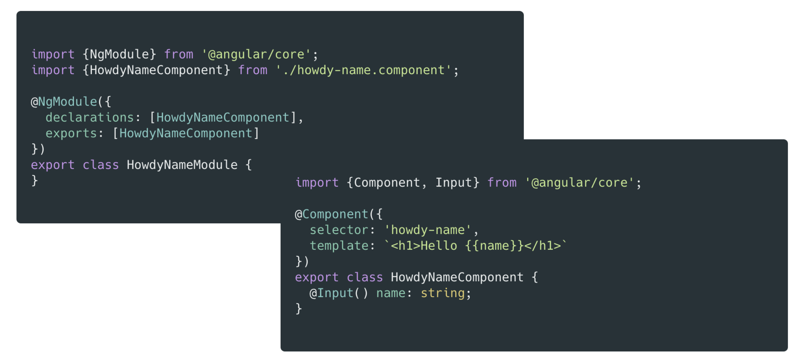

`HowdyNameModule` 只是一个简单的 Angular Module，其组件通过 @Input 接受一个 name 的属性并将其展示在模板中。

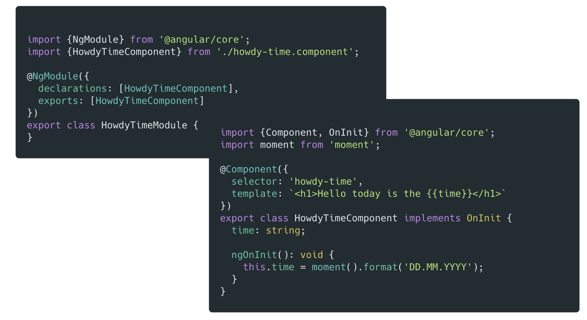

而 `HowdyTimeComponent` 负责借助第三方库 `moment` 的功能展示时间。

好的，howdy library 已经做好发布准备啦！显而易见，这就是一个功能简单的库，理论上来说他不会影响性能的，我猜？

## 使用 howdy library

现在 howdy library 已经准备就绪。
为了调用howdy library，我们使用 Angular CLI 生成了一个新 SPA 应用。

```bash
ng new greeting-app
```

因为我们对性能有要求，所以需要安装名为 `webpack-bundle-analyzer` 的开发依赖。

```bash
npm i -D webpack-bundle-analyzer
```

> `webpack-bundle-analyzer` 将 webpack 的输出文件可视化，并允许通过一个可缩放的 treemap 进行交互。

分析 bundle 的最佳方式是向 `package.json` 文件中添加下述分析脚本。

```json
"analyze": "ng build --prod --stats-json && webpack-bundle-analyzer ./dist/greeting-app/stats-es2015.json"
```

当我们执行上述指令后，Angular 将会构建一个 production 版本的 bundle 并输出一个 `stats-es2015.json` 文件，该文件由 `webpack-bundle-anlyzer` 生成并拥有可视化的能力。

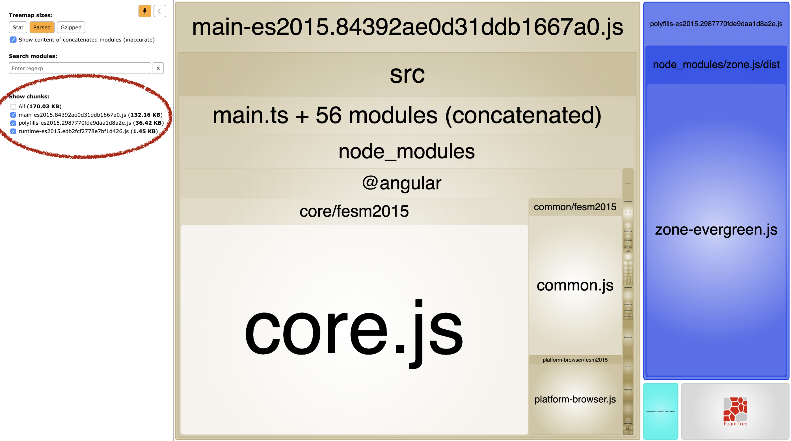

因为我们还没有写任何的功能代码，我们的 main bundle 主要由 Angular 自身组成，同时注意到 `zone.js` 文件包含在 `polyfill` bundle 中。

全部算在一起，我们应用的大小现在是 `207kb`。

但是我们还没有将 `howdy` library 纳入到应用中！现在，加入 `howdy`:

```bash
npm i howdy
```

现在 `howdy` 已经成功安装了，我们可以在应用中用我们的名字打招呼了。我们暂时还不感兴趣展示当前时间。因此我们只需要使用 `HowdyNameModule` 模块，也就不需要引入 `HowdyTimeModule` 模块了。

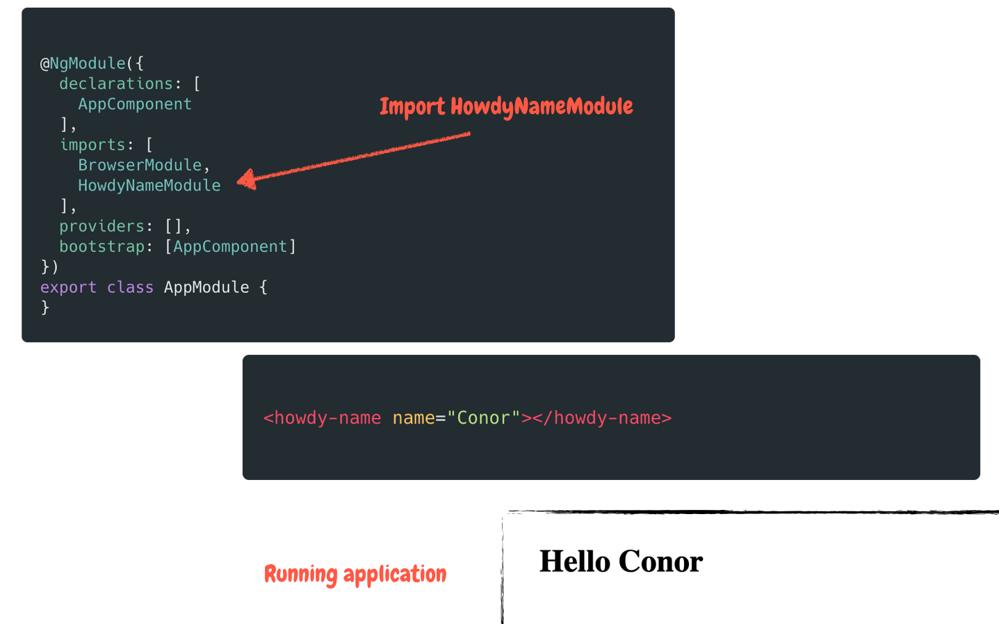

注意！在我们的应用中，我们只引用了 `HowdyNameModule` 模块。让我们重新运行 `analyze` 脚本。

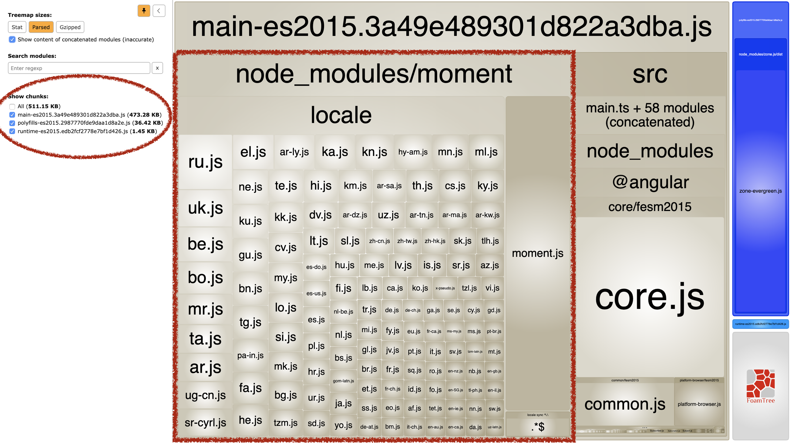

Wow！我们的 bundle 大小从 `207KB` 上涨到了 `511.15KB`，可以说超过了一倍的大小，啥情况？？？

相信大家都可以一眼看出端倪。 `moment` 这个包太大啦！他除了包含核心实现的代码之外，还包含了所有的本地化功能模块。

当然，`moment` 可以被诸如 `date-fns` 或者 `moment-mini` 这样的包替换掉。但是真正的问题是，为什么会出现这样的问题？我们仅引入了 `HowdyNameModule` 模块，并没有引入 `HowdyTimeModule`。我认为摇树优化应该“摇掉”了没有使用的模块才对，但是事实好像不是这样。

## 万物不是皆可摇

为了确保摇树优化成为可能，Angular 在构建过程中运行了一系列高级的优化措施。但是即使是有 Angular 兜底，在我们并没有引入 `HowdyTimeModule` 模块的情况下，`moment` 还是出现在构建后的 bundle 之中。

问题出在 `moment` 的打包方式上。查看一下 `node_modules` 文件夹中的 `moment.js` 文件：

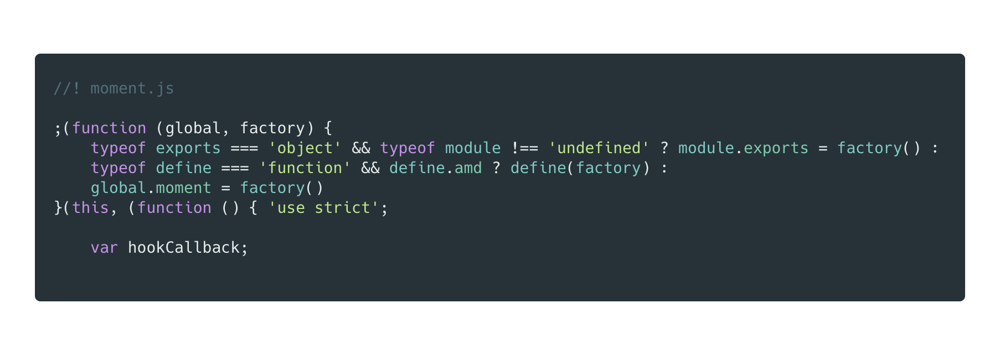

因为 `moment` 支持多场景使用，比如 NodeJS 后台，Angular 应用或者纯 JavaScript 中，所以它的打包方式是 `UMD` 而不是 `ES` 模块。

通过 `UMD` 打包的 library 被封装在一个 IFFE 中，这也就意味着，`ModuleConcatenation` 无法使用。这样的状况下，构建优化工具也就无法得知代码是否会被使用以及是否含有副作用了。

简而言之，模块的类型阻止了 Angular 在构建时使用更高级的 bundle 优化。

不幸的是，我们无法控制 `moment` 的打包方式。但是这是否意味着我们必须接受这样巨大的 bundle 呢？

## 使用辅助入口赢得比赛

虽然我们无法控制 `moment` 的打包方式，但是我们可以管理我们自己的 library。事实上，也有这样的一个方法可以避免上述状况的发生。辅助入口！

时至今日，绝大多数的 Angular library 都通过 `ng-packagr` 进行打包，`ng-packagr` 通过使用 `ng-package.json` 文件和 `public-api` 控制打包，而 `public-api` 则作为应用的入口存在。

人如其名，辅助入口点允许你为应用指定多个入口点。

虽然听起来不错，但是如何启用辅助入口点呢？

辅助入口点会由 `ng-packagr` 动态发现。`ng-packagr` 会搜寻 main `package.json` 文件目录下的子目录中的 `package.json` 文件，

我们利用这个机制，向 `howdy` library 中添加下述文件，这样我们就可以启用辅助入口点了。

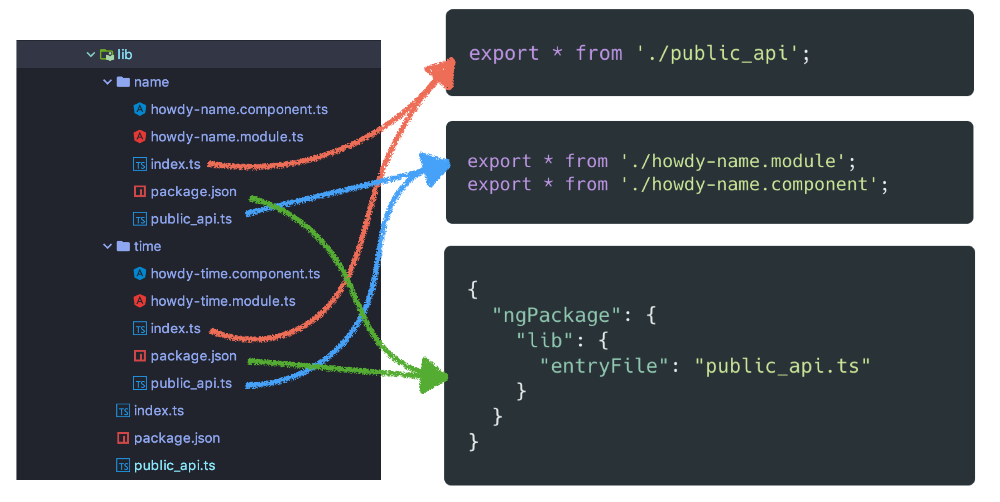

对于每个模块而言，我们添加了一个 `index.ts` 文件，一个 `package.json` 文件和一个 `public_api.ts`。

- `index.ts` 文件用来指向 `public_api`, 简化导入的过程。
- `public_api` 从模块中导出所有模块和组件。
-  `package.json` 文件则包含了 `ng-packagr` 的具体配置。在我们的例子中，该配置已经足够去指定 `entryFile` 了。

>  `package.json` 文件也包含其他属性，比如 `cssUrl`，值得注意的是，这些属性只在当前的子入口范围内生效。

如果此时我们进行构建，我们会得到三个 chunks: `howdy.js`, `howdy-src-lib-name.js` 和 `howdy-src-lib-time.js`。

`howdy-src-lib-name.js` 文件中只包含 `HowdyNameModule` 的相关代码，而 `howdy-src-lib-time.js` 只包含 `HowdyTimeModule` 的相关代码。

让我们看看 `howdy.js` 文件的代码:

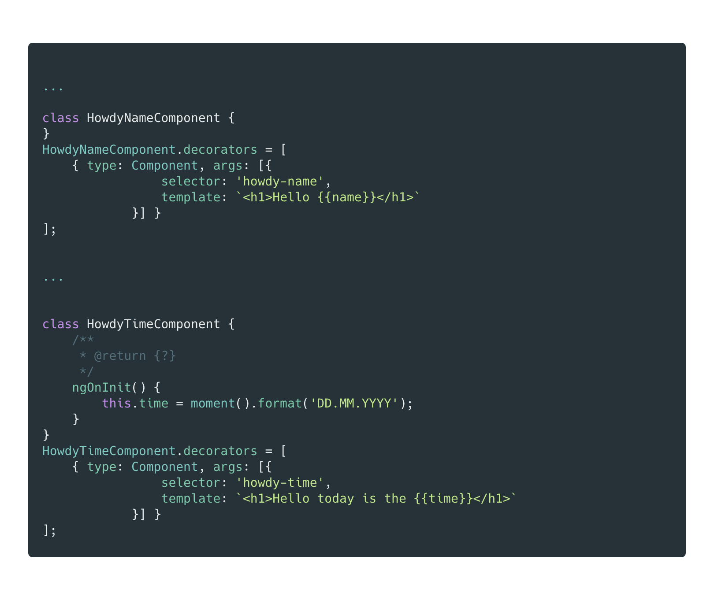

`howdy.js` 文件仍然包含了 `HowdyNameComponent` 和 `HowdyTimeComponent` 组件，这也意味着，即使只导入 `HowdyNameModule` 模块，我们仍然会将 `moment` 纳入打包的范畴。

> 如果我们继续以现在的方式将 `HowdyTimeModule` 从打包中摇掉，我们需要使用 deep imports 的技术。那样我们就不会从 `howdy.js` 文件中引入模块，而直接从 `howdy-src-lib-time.js` 中引入。
> 但是使用 deep imports 进行引入是非常危险的做法，应当极力去避免。

那我们应该如何处理这个问题？如何确保在使用标准导入的方式的同时，`HowdyTimeModule` 可以被正常地“优化”掉。换个思路，我们需要调整一下 `howdy.js` 文件创建的方式。

## 使用一个 “signpost”

其实这个点子不复杂，只是将代码从 `howdy.js` 文件中移出，取而代之让 `howdy.js` 成为一个“signspot”（路标）一样的工具，作为其他文件的引用。

让我们看看 `src/public_api.ts` 文件的具体实现。

```typescript
/*
 * Public API Surface of howdy
 */
export * from './lib/name/howdy-name.component';
export * from './lib/name/howdy-name.module';
export * from './lib/time/howdy-time.component';
export * from './lib/time/howdy-time.module';
```

这些代码负责包含所有在 `howdy.js` 文件中的 `name` 和 `time`。我们需要将这些代码从 `howdy.js` 文件中移出，并让 `howdy.js` 指向其他包含了代码实现的片段。实际操作一下：

```typescript
/
 * Public API Surface of howdy
 */
export * from 'howdy/src/lib/name';
export * from 'howdy/src/lib/time';
```

现在 `howdy.js` 除了导出真正的实现外，还提供了对不同代码文件的相对路径。通过修改 `howdy.js` 文件，现在其仅指向其他 bundles，并且不再包含任何有实际意义的代码。

现在让我们运行 `ng build` 命令并分析一下我们的 `dist` 文件夹。

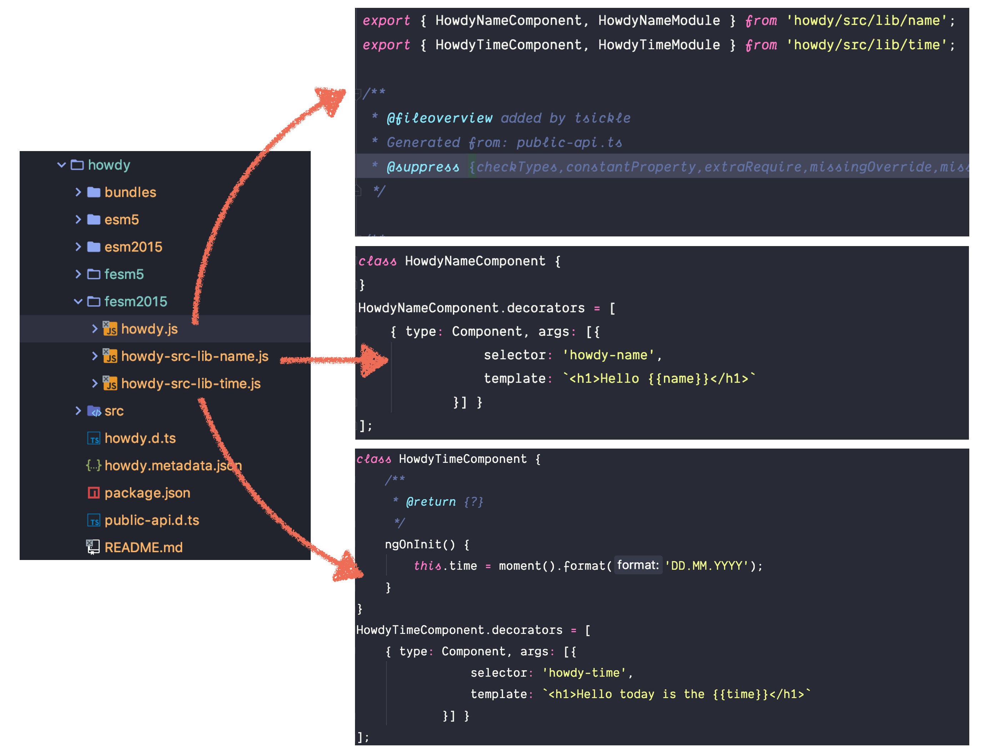

现在， `howdy.js` 文件成为了一个 `signpost`, 用于指向那些包含实现的 chunks。`howdy-src-lib-name.js` 文件现在只包含来自于 `name` 文件夹的代码，而 `howdy-src-lib-time.js` 只包含来自于 `time` 文件夹的代码。

## 通过辅助入口使用 howdy

现在让我们更新在 `greeting-app` 中的 `howdy` 包，并重新执行 `analyze` 脚本。

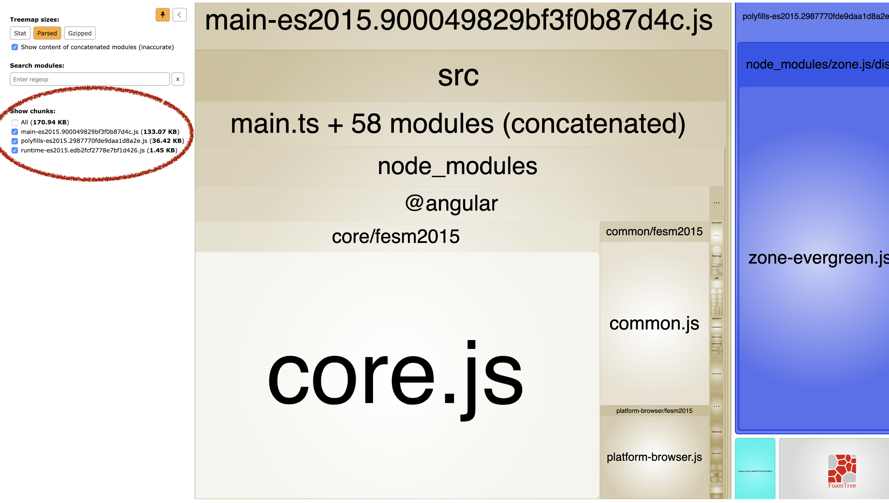

很好，现在 bundle 的大小是 `170.94 KB`, 只比初始化的时候稍微高一点。让我们检查一下 `howdy` 模块在最终的 bundle 中占比多少。

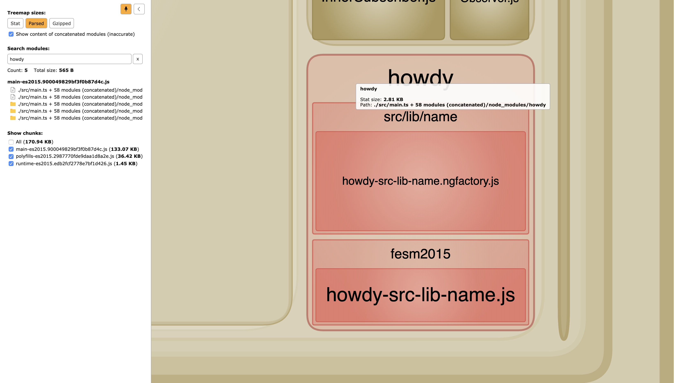

太棒了，通过上面一通操作，我们尽可能地将 SPA 的构建包大小保持在较低的水平上。SPA 只会获取其所需要的代码内容。

> 当你将辅助入口功能与懒加载融合在一起使用时，效果会更好。设想一下，在一个懒加载模块中使用 `HowdyTimeModule` 时，`moment` 将会包含在懒加载的模块中，而非在主模块中。

## 真实世界的经验

上面的例子其实挺简单的。

然而，当你将辅助入口的功能引入到一个企业级项目中时，一切将会变得不太一样。你将会遇到不少麻烦，而`ng-packagr` 的错误信息并不总生效。

你可能需要在 `tsconfig.json` 文件中调整某些导入路径或者指定某些路径配对关系，而这样的状况可能会很常见。同时你也可能会遇到当前模块引用其他 chunks 的模块的情况。

但是相信我，一旦你解决了这些问题，获得收益也会格外丰厚。

以前，在大型的企业级应用中，在我们将某些 libraries 导入到某些新创建的 SPA 应用中时，这些新项目的构建包都会格外的大。

在某些时候，构建包可以达到 `5MB` 之大。每一个 SPA 都会包含 `moment`, `@swimlane/datatable` 以及一些他根本就不会用到的内容。因此，我们开始为了优化构建包的大小而努力。

我们使用 `date-fns` 替换了 `moment`， 同时使用了辅助入口功能。目前，在默认包含某些libraries 情况下新建的 SPA 应用的 main chunk 大小是 `662KB`。还是有点大，我们还是不太满意，因此我们还会继续尝试优化。

虽然在本文的例子中，利用辅助入口的功能实现我们的目标看起来很简单，但是若是需要在重要的项目中使用辅助入口的能力，毫无疑问会有更多的困难。

## 结论

Angular 在优化构建包大小的方向上做了非常棒的努力。即使这些构建优化措施都很复杂，但是并不意味着他们能够摇树优化所有应该被优化的内容。

那些不以 `ESModules` 方式打包的模块就无法被摇树优化。

作为 library 的创造者，当我们引入第三方的 library 时，需要谨慎处理这些第三方引入对项目的 bundle 大小的影响。

我们无法控制第三方 library 的打包方式。但是我们可以控制我们的 library 的打包方式。

通过辅助入口功能，我们可以优雅地将 library 内容分为多个 chunks 提供调用。而在适当的情况下，这些 chunks 都可以在 Angular 的构建阶段摇树优化掉。通过这样的方式，即使是被错误打包的第三方 library 被使用时，也只会被包含在所需的 bundle 中。


