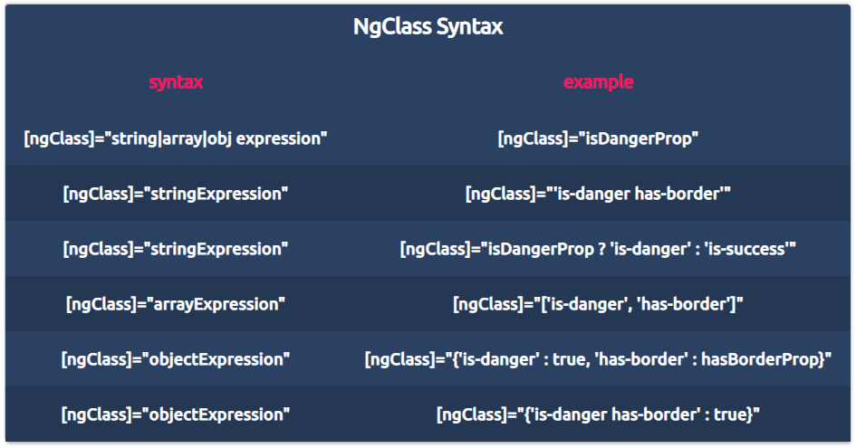
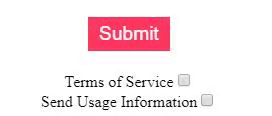
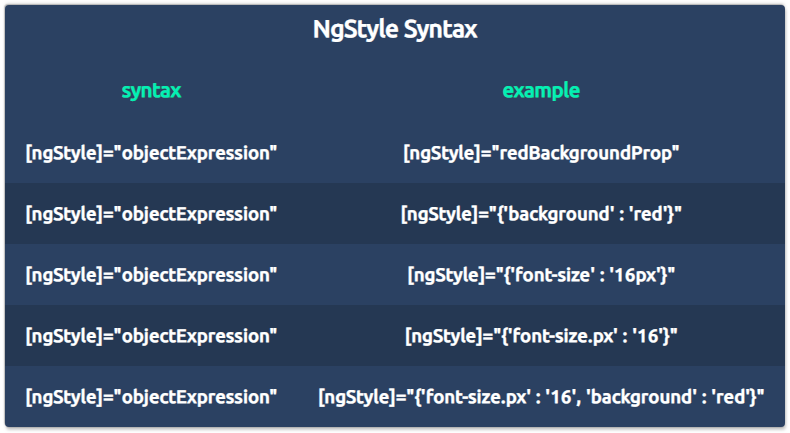

# 精通Angular之NgClass和NgStyle

[原文链接](https://medium.com/angular-in-depth/angular-mastery-ngclass-ngstyle-e972dd580889)

[原作者:Erxk Verduin
](https://medium.com/@erxk_verduin)

译者:[尊重](https://www.zhihu.com/people/yiji-yiben-ming/posts)

精通 Angular 模板语法基础知识之二。

源代码:[StackBlitz 🚀](https://stackblitz.com/edit/erxkv-ngclass-ngstyle)

本文目标：学习 Angular 的 NgClass 和 NgStyle 指令。

本文主题：

- 探讨 NgClass 和 NgStyle 的**语法和语义**
- **探索 Angular 源码**，了解 NgClass 和 NgStyle 背后的故事
- 使用示例帮助理解如何使用  NgClass 和 NgStyle

## 概览

 **NgClass 和 NgStyle 都是 Angular 的指令**，依赖于其功能，我们可以根据条件将一个或多个 css class/styles 应用在一个元素上。通过这种方式，同一时间根据需求操纵多个 class 或 styles 将会非常方便快捷；让我们和常规情况进行比较：

 原生的 style 和 class attributes 只能静态地应用 一个 - 多个 classes/styles。

 在同一时间，Angular 的 **class 和 style 绑定**只允许根据情况使用单个 class 或 style 。

考虑 何时在 **Angular 的 class 和 style 绑定** 或者 **原生 attributes** 上使用 NgClass 和 NgStyle 时，请先问自己两件事：

 - 我需要动态/静态地使用 classes/styles 吗？
 - 我在使用一个/多个 classes/styles 吗？

```html
<!-- Native Class and Style Attributes -->
<input class="is-danger my-button" style="border: none; color: blue">

<!-- Angular class and style Bindings -->
<input [class.is-danger]="booleanProp" [style.border]="borderProp">

<!-- ngClass -->
<input [ngClass]="{'is-danger': booleanProp, 'myButton': true}">
<input [ngClass]="isDangerButton">

<!-- ngStyle -->
<input [ngStyle]="{'border': borderProp, 'color': colorProp}">
<input [ngStyle]="hasColorBorder">

<!-- 
booleanProp, borderProp, etc...
would be properties from our
Typescript class
-->
```

通过将 NgClass 和 NgStyle 指令与 **Angular Property & Event Biding** 相组合的方式，我们可以实现条件渲染的功能。

现在我们理解了为什么以及何时需要去使用 NgClass 和 NgStyle，让我们深入了解这两个指令

## NgClass

### 语法

NgClass 通过接收**行内申明**或者来自 **typescript 类的 属性/方法** 的方式获取输入内容。听起来语法的复杂度很高但是真实使用起来并不困难：

- 一个使用空格分隔的字符串 `[ngClass]="is-info is-item has-border"`
- 一个字符串数组 `[ngClass]="['is-info', 'is-item', 'has-border'"]`
- 一个对象 `[ngClass]="{'is-info': true, 'is-item': true}`

上述所有的例子都是**行内申明**的，都可以被 Typescript 的 **property/method** 所替换，只要表达式返回有效的输入内容即可：

```typescript
export class MyComponentClass {
  myStringProperty = "is-info is-item has-border";
  myArrayProperty = ['is-info', 'is-item', 'has-border'];
  myObjectProperty = {'is-info': true, 'is-item': true};
}
```

- `[ngClass]="myStringProperty"`
- `[ngClass]="myArrayProperty"`
- `[ngClass]="myObjectProperty"`



> 三元表达式也是有效的输入，只要三元表达式的返回有效的字符串，数组或对象
> 
> 比如： `[ngClass]="name === 'erxk' ? 'is-author' : 'is-reader'`

## 指令的实现

看一个例子：



```html
<button type="button" class="big-font" [ngClass]="classStyler">Submit</button>

<div>
  <label for="one">Terms of Service</label>
  <input #one id="one" type="checkbox" (change)="updateTos(one.checked)">

  <label for="two">Send Usage Information</label>
  <input #two id="two" type="checkbox" (change)="updateUsage(two.checked)">
</div>
```

```typescript
export class StatusButtonComponent implements OnInit {

  tosSigned = false;
  sendUsage = false;

  // [ngClass]="classStyler" 
  classStyler = {
    warning: false,
    info: false,
    error: !this.tosSigned,
    success: this.tosSigned,
  }

  // ...

  updateStyle() {
    this.classStyler.error = !this.tosSigned;
    this.classStyler.success = this.tosSigned && this.sendUsage;
    this.classStyler.warning = this.tosSigned && !this.sendUsage;
  }

}
```

```css
.warning {
  background: hsl(48, 100%, 67%);
  border: 5px solid hsl(48, 100%, 67%);
  color: black;
}

.error {
  background: hsl(348, 100%, 61%);
  border: 5px solid hsl(348, 100%, 61%);
  color: white;
}

.success {
  background: hsl(141, 71%, 48%);
  border: 5px solid hsl(141, 71%, 48%);
  color: white;
}
```

### 上述代码中的关键点

- `button` 元素上使用了 NgClass 指令
- NgClass 的输入是来自 Typescript 类的 `classStyler` 属性。`classStyler` 是一个有效的对象表达式。
-  `classStyler` 的属性与 Css 类的名称相匹配。
-  NgClass 只会添加 css 类，而不会覆盖原有的 css 样式; button 按钮仍然拥有 `class="big-font"` 的样式。
-  在 Typescript 类中更新用于 HTML 元素上的 CSS 类。

像上面这种，根据条件使用 Typescript/JavaScript 更新 CSS 样式的方法，让我们想起了原生 JavaScript 中的方法：`element.classList.add` 和 `element.classList.remove`。

```typescript
updateButtonClass() {
  const button = document.querySelector('button');
  button.classList.add('info');
}
```

上述的代码与 NgClass 的实现方式有些类似，查看 NgClass 的源代码会发现，Angular 在完成一些繁重的边际准备工作后就会调用 `toggleClass()` 方法。

> 下面的代码段是下下个代码段的执行上下文，我们不必完全了解其含义

```Typescript
private _applyKeyValueChanges(changes: KeyValueChanges<string, any>): void {
  changes.forEachAddedItem((record) => this._toggleClass(record.key, record.currentValue));
  changes.forEachChangedItem((record) => this._toggleClass(record.key, record.currentValue));
  changes.forEachRemovedItem((record) => {
    if (record.previousValue) {
      this._toggleClass(record.key, false);
    }
  });
}

private _applyIterableChanges(changes: IterableChanges<string>): void {
  changes.forEachAddedItem((record) => {
    if (typeof record.item === 'string') {
      this._toggleClass(record.item, true);
    } else {
      throw new Error(
          `NgClass can only toggle CSS classes expressed as strings, got ${stringify(record.item)}`);
    }
  });

  changes.forEachRemovedItem((record) => this._toggleClass(record.item, false));
}
```

现在看看 `toggleClass()` 的具体实现，NgClass 实际上最终会使用 Angular 的 `Renderer2` 对 `nativeElement`(NgClass 所依附的 HTML 元素) 执行 `addClass()` 或 `removeClass()` 方法。

```Typescript
private _toggleClass(klass: string, enabled: boolean): void {
  klass = klass.trim();
  if (klass) {
    klass.split(/\s+/g).forEach(klass => {
      if (enabled) {
        this._renderer.addClass(this._ngEl.nativeElement, klass);
      } else {
        this._renderer.removeClass(this._ngEl.nativeElement, klass);
      }
    });
  }
}
```

注意，无论我们通过 Typescript property/methods 还是 HTML 行内申明 的方式使用 NgClass，其实现都是一样的。

### 关键点

- 无论是 **Typescript property/Method** 还是 **行内申明** 都可以作为 NgClass 指令的输入
- NgClass 接受字符串，字符串数组或者对象表达式作为输入
- NgClass 通过 `Renderer2` 的 `addClass()` 和 `removeClass()` 方法添加/移除 css 类
- NgClass 只会添加，而不会覆盖原有的 css 类

## NgStyle

NgStyle 接受一个键值对的对象作为输入，键值对的键是一个 CSS style。可以在键上添加一个前缀简化写法，如下的写法是合规的：

`[ngStyle]="{font-size.px: 16}"` 代替 `[ngStyle]="{font-size: 16px}"`

与 NgClass 类似，NgStyle 同样也接收 **行内申明** 和 Typescript 属性/方法作为输入内容。 `[ngStyle]="myObjectExpressionProperty"`



## 指令的实现

举个例子：


```typescript
export class PictureEditorComponent implements OnInit {

  styler = {
    [WIDTH]: "250", // Use constants
    "max-width.px": "600", // Hard-Coding
    "min-width.px": "200",
    "filter": "sepia(0)"
  }

  updateSize(val) {
    this.styler[WIDTH] = val;
  }

  updateSepia(val) {
    this.styler['filter'] = `sepia(${val})`;
  }

}
```

```HTML
<div>
  
</div>

<!-- ...size -->

<div>
  <input #sepia type="range" id="sepia" name="sepia" 
         min="0" max="1" value="0" step="0.1"
         (input)="updateSepia(sepia.value)">
  <label for="sepia">Sepia</label>
</div>
```

## 上述代码中的关键点

- NgStyle 被使用于图像上
- NgStyle 的输入 `styler` 来自于 Typescript 类。`styler` 是一个可用的对象表达式。
- `styler` 中的属性都是可用的 CSS styles
- `input` 元素通过 Angular Event Binding 更新 `styler` 对象中属性的值

通过查看相关源码发现，NgStyle 和 NgClass 使用了相似的范例。NgStyle 是更加直接的一个指令，其只接受一种类型的输入。

```Typescript
private _applyChanges(changes: KeyValueChanges<string, string|number>): void {
  changes.forEachRemovedItem((record) => this._setStyle(record.key, null));
  changes.forEachAddedItem((record) => this._setStyle(record.key, record.currentValue));
  changes.forEachChangedItem((record) => this._setStyle(record.key, record.currentValue));
}

private _setStyle(nameAndUnit: string, value: string|number|null|undefined): void {
  const [name, unit] = nameAndUnit.split('.');
  value = value != null && unit ? `${value}${unit}` : value;

  if (value != null) {
    this._renderer.setStyle(this._ngEl.nativeElement, name, value as string);
  } else {
    this._renderer.removeStyle(this._ngEl.nativeElement, name);
  }
}
```

当 Angular 触发 `_setStyle()` 函数时，`Renderer2` 会基于输入内容调用 `setStyle()` 和 `removeStyle()` 方法。注意！我们是在设置 CSS style 而不是添加：如果我们在应用过原生的 CSS style 属性的元素上调用 NgStyle，原生的 CSS style 将会被重写。

### 关键点

- NgStyle 接受键值对作为输入，前提条件是**键必须是可用的 CSS style**
- NgStyle 的输入既可以是 HTML 行内申明，也可以是Typescript 类的 property/methods
- 从实现的角度，NgStyle 实际上就是 Angular 的 `Renderer2` 调用 `setStyle()` 和 `removeStyle()` 方法
- NgStyle 将会重写元素的当前 CSS style

## 总结

感谢阅读！在本文中，我们介绍了如何借助 Angular property 和 Event Binding
使用 NgClass 和 NgStyle 指令实现多个 CSS styles/classes 的条件渲染；我们也通过实例简要介绍了 NgStyle 和 NgClass 的实现原理。如果你对 Angular 模板语法的内容感兴趣，请阅读[这篇技术博客](https://blog.angularindepth.com/angular-mastery-template-syntax-194bffe2ad6f?source=post_page-----e972dd580889----------------------)。


