# 量子Angular-移除Zone优化性能

最小代价将 Zone 从 Angular 中移除，实现提升运行时性能的目标

[原文链接](https://blog.bitsrc.io/quantum-angular-maximizing-performance-by-removing-zone-e0eefe85b8d8)

[原作者:Giancarlo Buomprisco
](https://frontend.consulting/)

译者:[尊重](https://www.zhihu.com/people/yiji-yiben-ming/posts)


作为 Angular 开发者，我们每个人都欠 Zone.js 一顿饭：多亏了有 Zone 的协助，我们能够以魔术般的方式使用 Angular；事实上，大部分时候我们只是修改了一个属性,Angular 就会自动渲染组件，确保视图总是及时更新。非常酷！

在本文中，我们将会探索一些新版本中的功能：新的 Angular 编译器 Ivy 将帮助开发者通过更简单的方式脱离 Zone 创建 Angular 应用。

本文将会介绍，通过使用 Typescript 装饰器尽可能地减少运行时开销的方式，确保高负载压力下应用性能能有的大幅度的提升。

注意：只有当 Angular Ivy 和 AOT 默认启动时，本文中介绍的方法才可运行。本文仅具有教学意义，没有商业宣传目的。

Tip：使用[Bit](https://bit.dev/)轻松且逐步地构建 Angular Component Libraries: 于跨项目之间对可重用组件进行协作以提高开发速度，保持一致的 UI 并编写更具备可伸缩性的代码。

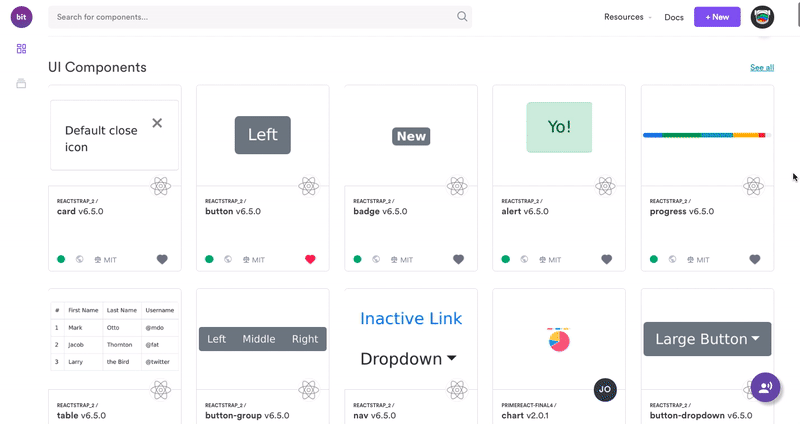

## 脱离 Zone 使用 Angular 的场景

在进入正题之前，先问我们自己一个问题：Zone 可以帮助我们自动重新渲染模板，禁用 Zone 真的有价值吗？的确，Zone 可以帮助我们节省很多编码工作，但是别忘记羊毛总是出在羊身上。

如果你的应用对性能有特别的目标要求，禁用 Zone 可以帮助应用获得更好的性能：举例来说，高频更新就是对性能有高要求的一个真实场景，这也是我在实现某实时交易系统应用中所遇到的问题，该应用的 WebSocket 无时无刻不在向客户端发送信息。

## 从 Angular 中移除 Zone

让 Angular 脱离 Zone 运行的方式很简单。首先是移除或注释掉 `polyfill.ts` 文件中有关 `zone.js` 文件的引用：

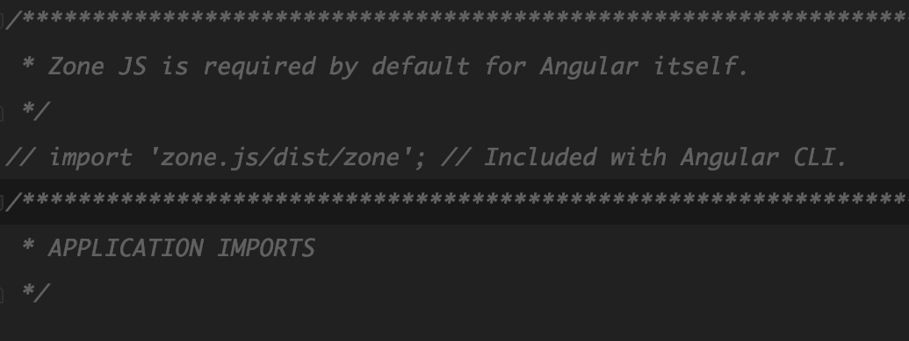

第二步是使用以下配置参数的方式引导启动 root 模块：

```Typescript
platformBrowserDynamic()
  .bootstrapModule(AppModule, {
    ngZone: 'noop'
  })
  .catch(err => console.error(err));
```

## Angular Ivy：通过 `ɵdetectChanges and ɵmarkDirty` 手动检测变更

在我们开始编写 Typescript 装饰器之前，我们先了解一下 Ivy 是如何绕过 Zone 和 DI 在组件上触发一次变更检测的（通过将组件标记为 dirty 的方式）。

新版本中从 `@angular/core` 中导出了两个新方法： `ɵdetectChanges` 和 `ɵmarkDirty`。这两个方法仍不稳定，因此他们被添加了前缀字符 `ɵ`。

通过例子了解如何使用这两个方法。

### ɵmarkDirty

本方法将会标记一个组件为 dirty 状态(需要重新渲染) 并将在未来某个时间点安排一个变更检测，除非该组件已经被标记为 dirty 状态。

```Typescript
import { ɵmarkDirty as markDirty } from '@angular/core';
@Component({...})
class MyComponent {
  setTitle(title: string) {
    this.title = title;
    markDirty(this);
  }
}
```

### ɵdetectChanges

处于某些效率方面的原因，内部文档不推荐使用 `ɵdetectChanges` 而推荐使用 `ɵmarkDirty`。`ɵdetectChanges` 方法将会同步触发组件及其子组件的变更检测。

```Typescript
import { ɵdetectChanges as detectChanges } from '@angular/core';
@Component({...})
class MyComponent {
  setTitle(title: string) {
    this.title = title;
    detectChanges(this);
  }
}
```

## 通过 Typescript 装饰器自动监测变更

通过上述提及的函数，Angular 允许开发者绕过 DI 进行操作，这的确提高了开发者的体验，但是作为开发者的我们肯定还不满足，因为我们还是需要导入并手动调用这些函数以触发变更检测。

为了使自动变更检测更简单，我们可以写一个 Typescript 装饰器。虽然这样的方式有一些局限性，但是我觉得装饰器还是可以满足我们的诉求的。

### 引入 @observed 装饰器

为了以最小代价检测内容变更，我们会构建一个可以应对以下三种类型的装饰器：

- 面向同步方法
- 面向一个 Observable
- 面向一个 Object

现在让我们看两个例子。如下图所示，将 `@observed` 装饰器应用于 `state` 对象和 `changeName` 方法。

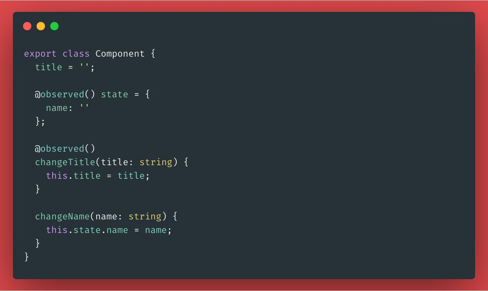

- 通过使用 Proxy API 监听对象 `state` 的变化，并触发变更检测。
- 使用一个函数覆写 changeTitle 方法，该函数首先调用该方法，然后触发变更检测

让我们使用一个 `BehaviorSubject` 举例：

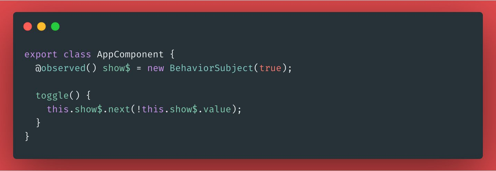

对于 Observable 而言，事情有点复杂：首先需要订阅这个 Observable 并在 subscription 中将组件标记为 dirty，但是我们同样需要完成清理工作。因此，需要覆写 `ngOnit` 和 `ngOnDestroy` 去订阅和清除 subscription。

### 写点代码！

下述代码是 **observed** 装饰器的类型描述：

```Typescript
export function observed() {
  return function(
    target: object,
    propertyKey: string,
    descriptor?: PropertyDescriptor
  ) {}
}
```

上述代码中，`descriptor` 是可选参数，因为装饰器需要同时支持方法和属性。如果该参数被定义，就意味着装饰器所应用的对象是一个方法：

- 存储原始方法的值
- 覆写该方法：调用原方法后，调用 `markDirty(this)` 方法以触发一次变更检测

```Typescript
if (descriptor) {
  const original = descriptor.value; // store original
  descriptor.value = function(...args: any[]) {
    original.apply(this, args); // call original
    markDirty(this);
  };
} else {
  // check property
}
```

除了装饰器应用于函数的情况，我们还需要处理 Object 和 Observable 的状况。为了区分装饰器应用于 Object 还是 Observable，我们引入了另一个 Angular 所提供的私有 API （虽然我们不应该使用它）：

- `ɵcmp` 属性允许开发者获取由 Angular 所处理的属性定义。通过使用 `ɵcmp`，我们可以覆写组件的 `onInit` 和 `onDestroy` 方法。

```Typescript
const getCmp = type => (type).ɵcmp;
const cmp = getCmp(target.constructor);
const onInit = cmp.onInit || noop;
const onDestroy = cmp.onDestroy || noop;
```

为了将属性标记为 “to be observed”，需要使用 `ReflectMetadata` 并将其值设置为 `true`，这样我们就可以在组件的初始化阶段确认 “需要观察该属性”：

```typescript
Reflect.set(target, propertyKey, true);
```

现在让我们覆写 `onInit` 钩子并在属性初始化时对其进行检查：

```Typescript
cmp.onInit = function() {
  checkComponentProperties(this);
  onInit.call(this);
};
```

`checkComponentProperties` 将会遍历所有的组件属性，通过检查使用 `Reflect.set` 设置的值进行过滤。

```typescript
const checkComponentProperties = (ctx) => {
  const props = Object.getOwnPropertyNames(ctx);

  props.map((prop) => {
    return Reflect.get(target, prop);
  }).filter(Boolean).forEach(() => {
    checkProperty.call(ctx, propertyKey);
  });
};
```

`checkProperty` 函数负责装饰每一个属性。首先需要确认属性是 Observable 还是 Object。如果该属性是一个 Observable，就需要订阅他并将相关的 subscription 添加到存储在组件上的 subscriptions 列表中。

```typescript
const checkProperty = function(name: string) {
  const ctx = this;

  if (ctx[name] instanceof Observable) {
    const subscriptions = getSubscriptions(ctx);
    subscriptions.add(ctx[name].subscribe(() => {
      markDirty(ctx);
    }));
  } else {
    // check object
  }
};
```

如果属性是一个 Object，就将其转化为一个 Proxy，并在其处理函数中调用 `markDirty`。

```typescript
const handler = {
  set(obj, prop, value) {
    obj[prop] = value;
    ɵmarkDirty(ctx);
    return true;
  }
};

ctx[name] = new Proxy(ctx, handler);
```

最终，当组件销毁时，清除组件内的 subscriptions：

```typescript
cmp.onDestroy = function() {
  const ctx = this;
  if (ctx[subscriptionsSymbol]) {
    ctx[subscriptionsSymbol].unsubscribe();
  }
  onDestroy.call(ctx);
};
```

这个装饰器还不够详尽，并不能覆盖大型应用中的所有状况（比如返回 Observable 的模板函数调用，我还在为此努力）。

但是目前，这个装饰器已经足够应对我的小应用了。装饰器的全量代码在本文的末尾。

## 性能结果与注意事项

我们已经了解一些 Ivy 的核心内容，并了解了如何使用 Ivy 提供的 API 构建了一个应对 “无 Zone” 环境下，便捷处理变更检测的装饰器，是时候拿真实应用来检测一下成果了。

我使用了我的实验性项目 [Cryptofolio](https://github.com/gbuomprisco/cryptofolio) 来检测添加和移除 Zone 场景下应用性能的变化。

我将上述装饰器应用于所有需要的模板引用上，并移除了 Zone。比如，下列组件：

- 在模板中使用的两个变量分别是 price（number）和 trend（up，stale，down），并将他们都用 `@obseved` 装饰器进行装饰

```Typescript
@Component({...})
export class AssetPricerComponent {
  @observed() price$: Observable<string>;
  @observed() trend$: Observable<Trend>;
  
  // ...
}
```

### 构建包的大小

首先，让我们检查一下通过移除 Zone.js，构建包的大小减少了多少。下图展示了包含 Zone.js 的构建包大小：

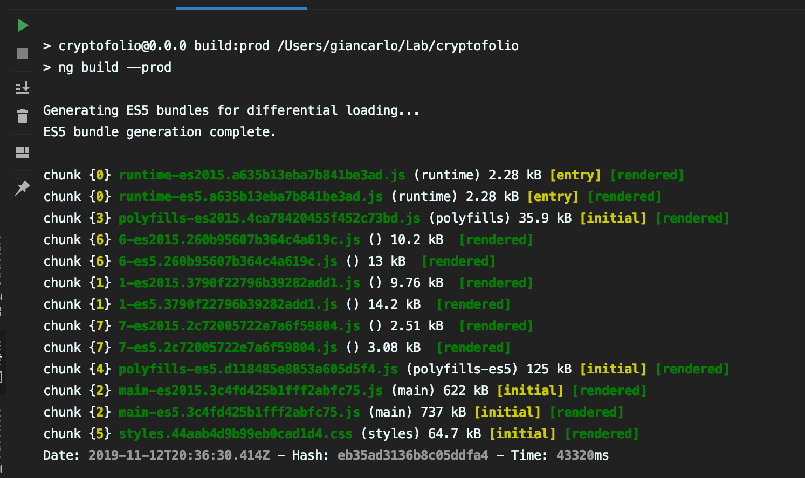

当移除 Zone.js 之后：

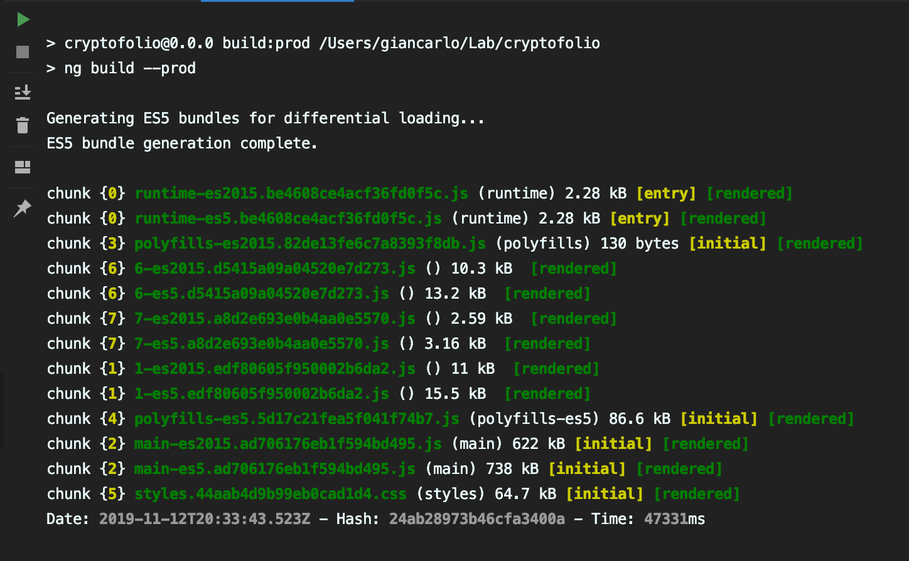

观察 polyfills-es2015 的 bundle，很明显 Zone.js 占据了近 35kb 的空间，而移除了 Zone.js 的 bundle 只有 130 bytes 左右。

### 初始化加载

在没有限流的情况下，我尝试了一些 lighthouse 的审查：我不会很严肃地对待下述结果：事实上，当我想要得到一个平均结果时，每次的结果变化得有点大。

bundle 大小的差异可能是移除 Zone.js 版本取得高分的原因。下面是包含 Zone.js 时审查的结果：

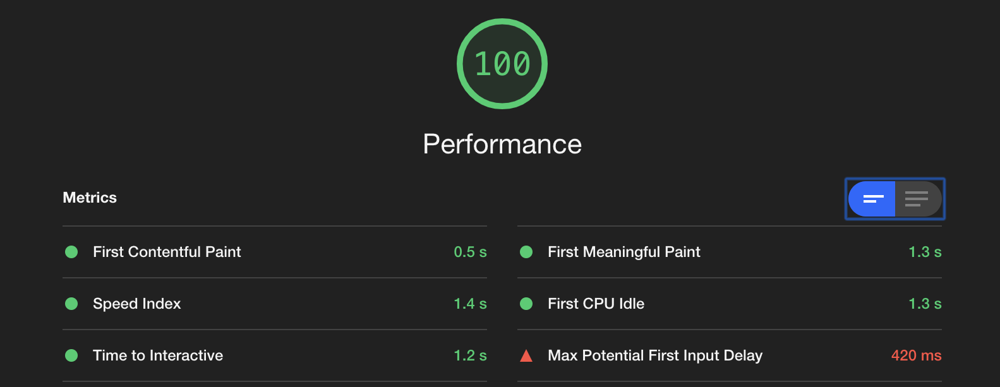

当 Zone.js 被移除后：

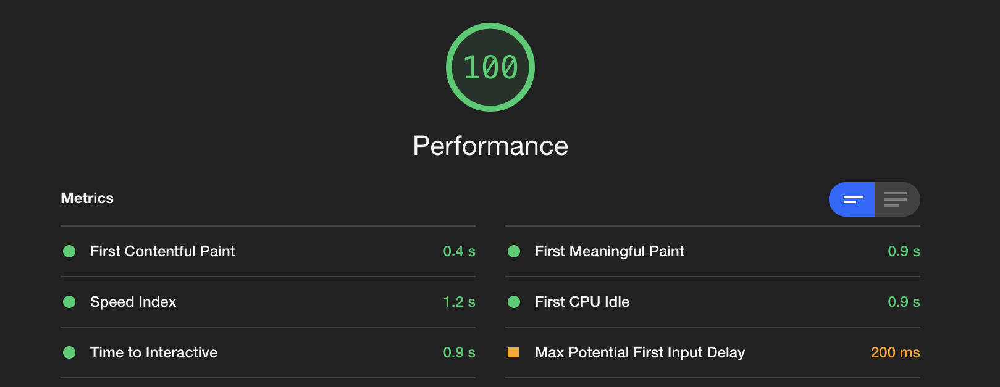

### 运行时性能

现在轮到了有趣的部分:负载下的运行时性能。
当每秒钟多次更新上百个属性时，CPU 的表现如何，让我们拭目以待。

为了让应用处于负载的场景下，我创建了大约100个模拟价格的事件触发器，每一个触发器每隔250ms就会发出一个随机的价格。如果价格上涨了，那么该价格会展示为略，反之则展示为红色。这样的操作会使我的MacBook Pro承受巨大的负载压力。

> 在金融部门从事高频数据流应用程序的工作时，这是我经常遇到的应用场景。

我使用了 Chrome 开发者工具分析每一个版本的 CPU 使用率。

首先从包含 Zone.js 的版本开始：


其次是移除了 Zone.js 的版本：


分析一下上面的内容，查看一下 CPU 使用图：

- 使用包含 Zone 的版本时，CPU 使用率始终在 70% - 100% 之间，高居不下！如果保持该页面以当前负载运行一段时间，页面一定会崩溃

- 使用移除 Zone 的版本时，CPU 使用率则稳定在 30% - 40%，几乎没有压力！

注意：上述结果均于 Chrome 开发者工具开启的状态下获取，开发者工具本身会降低页面的性能，所以与真实的 CPU 使用率数据存在一定差异。

### 增加负载

抱着尝试极限的想法，我将每一个模拟价格触发器的触发频率增加了4次/s：

- 移除了 Zone 的版本仍然可以很好地应对该负载，CPU 使用率大约在 50%
- 只有当我将触发频率调整到每10ms一次时(100个触发器同时做功的情况下)，移除 Zone 的版本 CPU 使用率才会抵达 100% 的危险范围。

## 使用Angular Benchpress进行基准测试

以上方式得出的数据并不是最科学的，也不是以科学基准作为目标进行测试；所以我建议你检查这个[benchmark](https://krausest.github.io/js-framework-benchmark/current.html)并反向勾选除了 Angular 和 Zoneless Angular 之外的所有框架。

我从上述链接中得到了一些启发，创建了一个执行繁重操作的项目，并使用Angular Benchpress对它进行了基准测试。

被测试的组件如下：

```
@Component({...})
export class AppComponent {
  public data = [];
  @observed()
  run(length: number) {
    this.clear();
    this.buildData(length);
  }
  @observed()
  append(length: number) {
    this.buildData(length);
  }
  @observed()
  removeAll() {
    this.clear();
  }
  @observed()
  remove(item) {
    for (let i = 0, l = this.data.length; i < l; i++) {
      if (this.data[i].id === item.id) {
        this.data.splice(i, 1);
        break;
      }
    }
  }

  trackById(item) {
    return item.id;
  }

  private clear() {
    this.data = [];
  }

  private buildData(length: number) {
    const start = this.data.length;
    const end = start + length;

    for (let n = start; n <= end; n++) {
      this.data.push({
        id: n,
        label: Math.random()
      });
    }
  }
}
```

之后，我使用 Protractor 和 Benchpress 运行了一个小规模的基准测试套件：套件将会运行指定数量的操作。

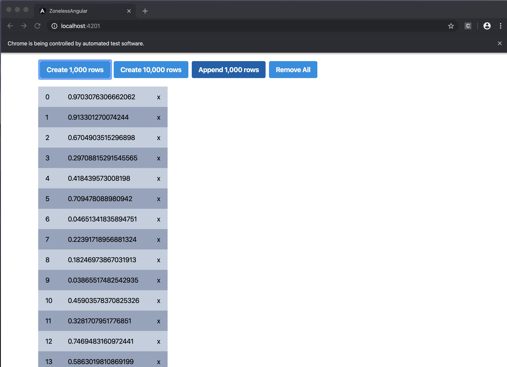

### 结果

通过上述工具测试的结果为：

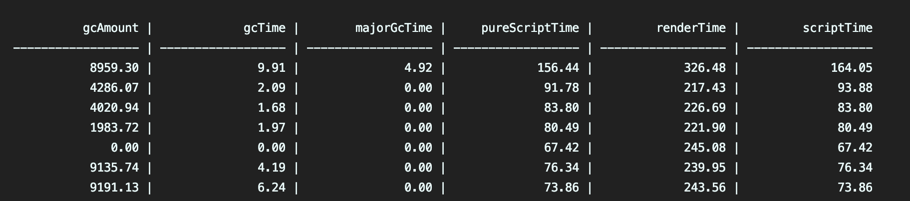

上述输出内容的评判标准解释如下：

```
 gcAmount: gc amount in kbytes
- gcTime: gc time in ms
- majorGcTime: time of major gcs in ms
- pureScriptTime: script execution time in ms, without gc nor render
- renderTime: render time in ms
- scriptTime: script execution time in ms, including gc and render
```

注意：下述图示仅对渲染时间进行了展示，完整的结果输出请查看[这个链接](https://github.com/Gbuomprisco/zoneless-angular)

### 测试：创建 1000 行

第一个测试创建了1000行：

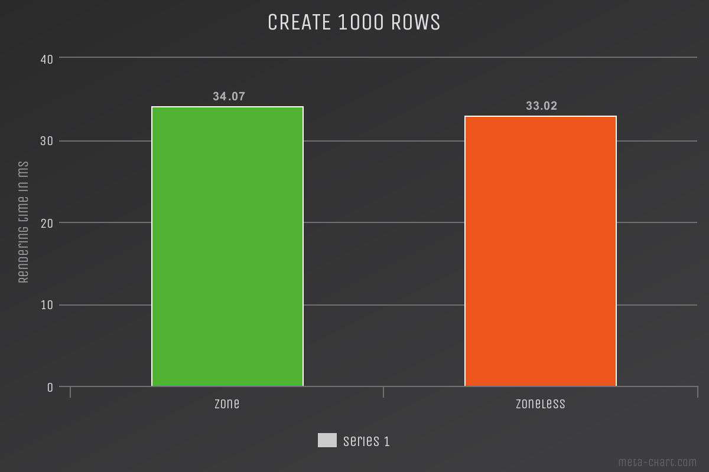

### 测试：创建 10000 行

因为负载变得更重了，我们可以看到明显的不同：

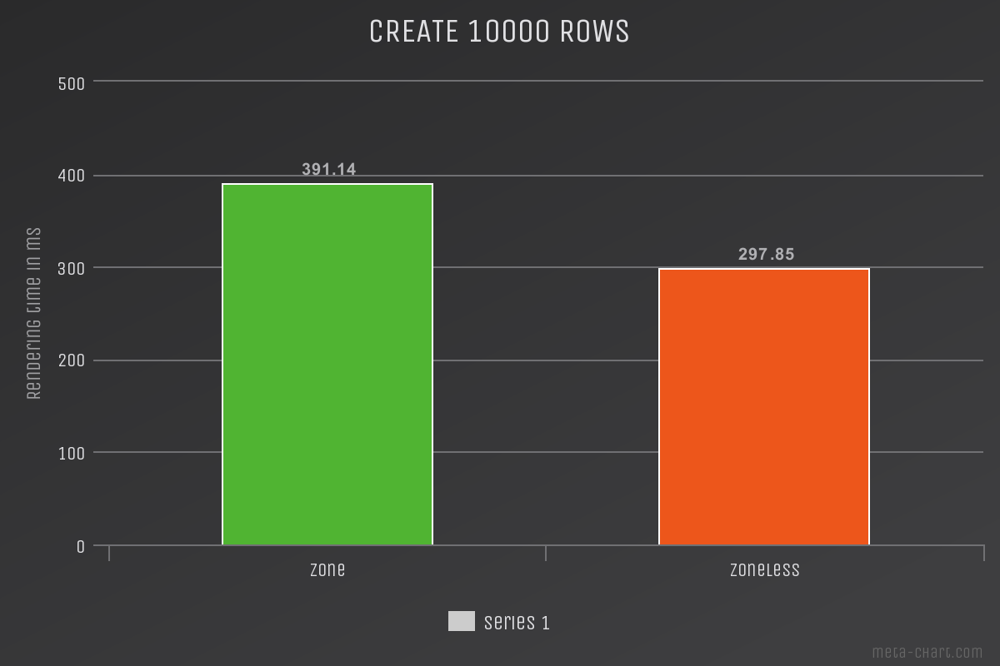

### 测试：添加1000行

本测试在 10000 的列表中添加 1000 行：

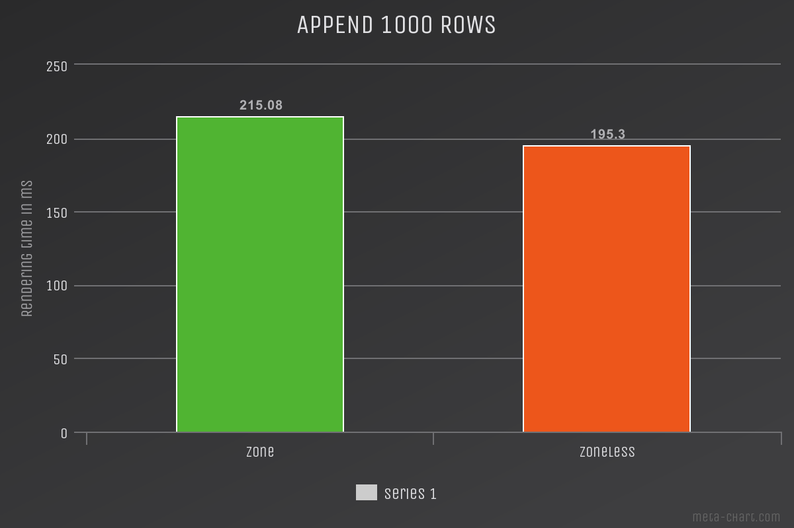

### 测试：移除10000行

本测试创建 10000 行并将其移除：

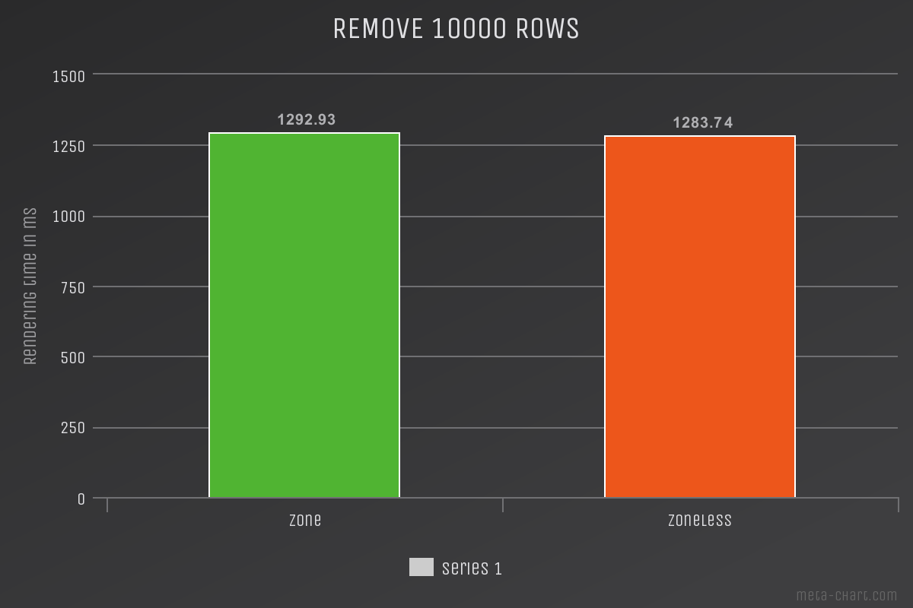

## 结语

我希望你喜欢这篇文章，同时我也希望我没有说服你立刻去将你的项目中的 Zone 全部移除。如果你计划强化一个 Angular 应用的性能时，本文中所提到的策略应该作为你最后一个选择。

诸如 OnPush 变更检测策略，trackBy，detaching Component，runing outside of Zone，Zone events blacklist，以及其他技术应当是你的首选方案。使用本文中所涉及的方案，可能会让你承受无法接受的代价。

事实上，除非你可以掌控项目中的方方面面和边边角角，否则不使用 Zone 进行开发是非常困难的。

如果其他所有优化技术都失败了，而你认为 Zone 真正意义上成为了你项目的瓶颈，此时再考虑尝试手动控制 Angular 应用中的变更检测会更加合适。

我希望本文可以带给你一些关于 Angular 未来功能的思考，Ivy 可以做到什么，以及如何围绕 Zone 让 Angular 应用达到其理论的上限。

## 源代码

Typescript 装饰器的代码放在[在本项目页面中](https://github.com/Gbuomprisco/ngx-toolkit/blob/master/projects/observed-property/src/lib/index.ts)

```typescript
// tslint:disable

import { Observable, Subscription } from 'rxjs';
import { Type, ɵComponentType as ComponentType, ɵmarkDirty as markDirty } from '@angular/core';

interface ComponentDefinition {
  onInit(): void;
  onDestroy(): void;
}

const noop = () => {
};

const getCmp = <T>(type: Function) => (type as any).ɵcmp as ComponentDefinition;
const subscriptionsSymbol = Symbol('__ng__subscriptions');

export function observed() {
  return function(
    target: object,
    propertyKey: string,
    descriptor?: PropertyDescriptor
  ) {
    if (descriptor) {
      const original = descriptor.value;
      descriptor.value = function(...args: any[]) {
        original.apply(this, args);
        markDirty(this);
      };
    } else {
      const cmp = getCmp(target.constructor);

      if (!cmp) {
        throw new Error(`Property ɵcmp is undefined`);
      }

      const onInit = cmp.onInit || noop;
      const onDestroy = cmp.onDestroy || noop;

      const getSubscriptions = (ctx) => {
        if (ctx[subscriptionsSymbol]) {
          return ctx[subscriptionsSymbol];
        }

        ctx[subscriptionsSymbol] = new Subscription();
        return ctx[subscriptionsSymbol];
      };

      const checkProperty = function(name: string) {
        const ctx = this;

        if (ctx[name] instanceof Observable) {
          const subscriptions = getSubscriptions(ctx);
          subscriptions.add(ctx[name].subscribe(() => markDirty(ctx)));
        } else {
          const handler = {
            set(obj: object, prop: string, value: unknown) {
              obj[prop] = value;
              markDirty(ctx);
              return true;
            }
          };

          ctx[name] = new Proxy(ctx, handler);
        }
      };

      const checkComponentProperties = (ctx) => {
        const props = Object.getOwnPropertyNames(ctx);

        props.map((prop) => {
          return Reflect.get(target, prop);
        }).filter(Boolean).forEach(() => {
          checkProperty.call(ctx, propertyKey);
        });
      };

      cmp.onInit = function() {
        const ctx = this;

        onInit.call(ctx);
        checkComponentProperties(ctx);
      };

      cmp.onDestroy = function() {
        const ctx = this;

        onDestroy.call(ctx);

        if (ctx[subscriptionsSymbol]) {
          ctx[subscriptionsSymbol].unsubscribe();
        }
      };

      Reflect.set(target, propertyKey, true);
    }
  };
}
```

## 资源引用

- [Frontend Frameworks Benchmark](https://krausest.github.io/js-framework-benchmark/current.html)
- [Zoneless Benchmark Project (zone branch contains the code with Zone)](https://github.com/Gbuomprisco/zoneless-angular)
- [RFC: Component: Proposal for a new package `component`](https://github.com/ngrx/platform/issues/2052)
- [Building with Ivy: rethinking reactive Angular](https://www.youtube.com/watch?v=rz-rcaGXhGk)