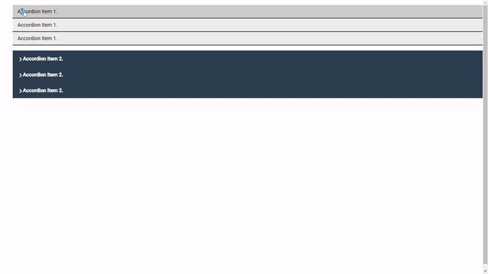
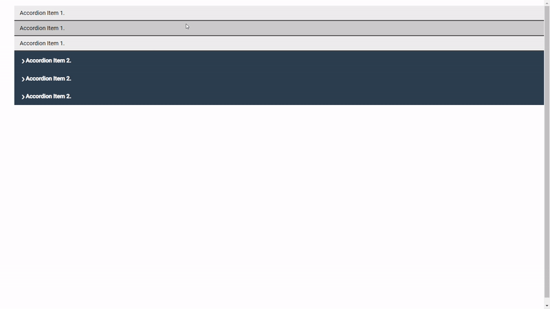

# 使用策略模式升级组件API

[原文链接](https://medium.com/angular-in-depth/level-up-your-components-api-using-the-strategy-pattern-61762583a7d8)

[原作者:Itay Oded](https://medium.com/@ItayOded?source=post_page-----61762583a7d8----------------------)

译者:[尊重](https://www.zhihu.com/people/yiji-yiben-ming/posts)

策略模式是常见的解决软件问题的方案之一。在本文中，我们将学习什么是策略模式，以及如何将策略模式应用于 Angular 组件中。


## The Problem

存在这样一个场景：当你需要使用一个公共组件时，因为某些特殊的用例需要对这个组件进行一些修改，这个组件可能是一个列表一个表格或是一个展示内容的卡片。

首先能想到的方案是创建一个 shared 组件并使用 `@Input` 进行定制化配置。大多数时候，这个方案是可行的，但是随着时间的推移，`shared component` 本身可能会变得越来越复杂，组件的模板可能会变得极其臃肿，包含各种条件陈述以应对每一个场景（`*ngIf`,`ngSwitchCase`）。

为了减少臃肿的条件判断，避免为每一个新定制功能修改组件的 “核心代码”，我们需要在保持核心逻辑的同时将非核心功能与之解耦；换句话说，就是保持[开闭原则](https://en.wikipedia.org/wiki/Open%E2%80%93closed_principle)

## Strategy Pattern for the Win 🎉

策略模式是一种行为设计模式，允许在运行时选择算法。

`Gang of Four` 所注的 “Design Patterns — Elements of Reusable Object-Oriented Software” 一书中曾说过：

> Define a family of algorithms, encapsulate each one, and make them interchangeable. Strategy lets the algorithm vary independently from clients that use it.

> 定义一系列算法并封装之，确保算法之间可互换。策略使算法独立变化于使用它的客户。

策略模式定义了三个角色：

- **Context** - 使用 **ConcreteStrategy** 算法的类，这个类在运行时获得一个算法并执行。
- **Strategy** - 一个抽象类/接口，它是提供算法的所有 **ConcreteStrategy** 类的基类。
- **ConcreteStrategy** - 实现由 `Strategy` 基类所定义的算法。

举例来说，假设我们有三种不同级别的雇佣者（合同工，全职工，管理者），并计算公司需要支付的薪水（假设每个级别员工获得的薪水一致）。

首先我们需要定义 **Strategy** 接口 - `Employee`，并在每个级别上实现它。

```typescript

interface Employee {
  getSalary: () => number;
}
```

现在为每一种雇员定义一个 **ConcreteStrategy** 类。

```typescript
class ContractorStrategy implements Employee {
  public getSalary() {
    return 2000;
  }
}
class FulltimeEmployeeStrategy implements Employee {
  public getSalary() {
    return 1000;
  }
}
class ManagerStrategy implements Employee {
  public getSalary() {
    return 5000;
  }
}
```

最后，创建一个使用雇员类的 **Context** 并计算公司所需支付的薪水。

```Typescript

class Calculator {
  public sum = 0;
  public calculate(employee: Employee) {
    this.sum += employee.getSalary();
  }
}
const calculator = new Calculator();
calculator.calculate(new FulltimeEmployeeStrategy());
calculator.calculate(new ContractorStrategy());
calculator.calculate(new ManagerStrategy());
console.log(calculator.sum); // 8000.
```

## Why & When

关于 “When” 的场景：

- 当类包含大量的条件操作符，同一个算法基于不同的条件在不同的变体之间来回横跳。
- 当你希望将“行为”与“使用行为”的类解耦时。 
- 当你拥有很多相似的类，并且这些类只在执行某些行为时有区别时。

策略模式的最大好处是，解耦行为算法并简化代码的复杂度。

现在，如果不使用策略模式而使用常规的方式实现我们之前的例子，代码可能会长这样：

```Typescript
class Calculator {
  public sum = 0;
  public calculate(employee: 'fulltime' | 'contractor' | 'manager') {
    if (employee === 'fulltime') {
      this.sum += 1000;
    } else if (employee === 'contractor') {
      this.sum += 2000;
    } else if (employee === 'manager') {
      this.sum += 5000;
    }
  }
}
```

## Strategy Pattern for Components

对于策略模式在组件中的应用：

定义一系列“presentation/dumb” 组件并封装之，确保可以在运行时选择和使用。

上述操作可以通过 Angular 的依赖注入系统实现。

比如说，假设我们需要创建两个不同的 “Accordion list” 组件。这两个 accordions 可能外观和行为有些不同，但核心机制完全相同。

通过使用策略模式，我们不会编写重复的代码，也就不会创建两个拥有相同机制的不同组件。

首先从创建接口开始。

```Typescript
// accordion.model.ts

export interface AccordionWrapper {
  items: AccordionItem[];
}
export interface AccordionItem {
  itemToggled: EventEmitter<number>;
  isOpen: boolean;
}
```

我们还需要向 `AccordionItem` 添加一个 injection token。

```Typescript
// accordion.tokens.ts

import {InjectionToken} from '@angular/core';
import {AccordionItem} from './accordion.model';

export const ACCORDION_ITEM = new InjectionToken<AccordionItem>('AccordionItem');
```

正如上述代码所示，accordion 包含两个成员：

- 作为 **context** 的 `AccordionWrapper`
- 作为 **strategy** 的 `AccordionItem`

创建 wrapper：

```Typescript
// accordion-wrapper.component.ts

import {Component, AfterContentInit, ContentChildren} from '@angular/core';
import {AccordionItem, AccordionWrapper} from './accordion.interface';
import {ACCORDION_ITEM} from './accordion.tokens';

@Component({
  selector: 'app-accordion',
  template: `<ul class="accordion-container">
    <ng-content></ng-content>
  </ul>
  `,
  styleUrls: ['./accordion.component.scss']
})
export class AccordionComponent implements AfterContentInit, AccordionWrapper {

  private activeIndex: number;
  @ContentChildren(ACCORDION_ITEM as any) items: AccordionItem[];

  public ngAfterContentInit(): void {
    this.items.forEach((item: AccordionItem, index) => {
      item.itemToggled.subscribe(() => this.itemToggledHandler(index));
    });
  }

  public itemToggledHandler(i: number) {
    this.activeIndex = this.activeIndex === i ? null : i;
    this.items.forEach((item: AccordionItem, index) => {
      item.isOpen = index === this.activeIndex;
    });
  }
}
```

如上述代码所示，`AccordionComponent` 使用 `@ContentChildren` 装饰器从 `ng-content` 中注入 `AccordionItem`, 订阅 `itemToggled` 并根据条件打开/关闭 accordion。

现在轮到 Accordion item 了：

我们需要创建两个表现和行为都不同的 accordion items。
为了实现这一目标，需要创建两个组件，组件实现 `AccordionItem` 接口并在运行时提供 `ACCORDION_ITEM`，以便 wrapper 组件注入和使用。

幸运的是，Angular 支持运行时提供 token 值的功能 - useExisting 属性。

Accordion Item 1:

```Typescript
// accordion-item1.component.ts

import {Component, EventEmitter, forwardRef} from '@angular/core';
import {AccordionItem} from '../accordion.model';
import {ACCORDION_ITEM} from '../accordion.tokens';

@Component({
  selector : 'app-accordion-item',
  template : `
    <li
        class="accordion-item"
        [class.open]="isOpen"
        (click)="itemToggled.emit()"
    >
      <div class="item-header">
        Accordion Item 1.
      </div>
      <div class="item-content">
        Accordion Item 1 Content.
      </div>
    </li>
  `,
  styleUrls: ['./accordion-item.component.scss'],
  providers: [{provide: ACCORDION_ITEM, useExisting: AccordionItemComponent}]
})
export class AccordionItemComponent implements AccordionItem {

  public isOpen: boolean;
  public itemToggled = new EventEmitter<number>();

}
```

Accordion Item 2:

```typescript
// accordion-item2.component.ts

import {Component, EventEmitter, forwardRef} from '@angular/core';
import {AccordionItem} from '../accordion.model';
import {ACCORDION_ITEM} from '../accordion.tokens';

@Component({
  selector: 'app-accordion-item2',
  template: `
    <div class="accordion-item" [class.open]="isOpen">
      <label class="accordion-item-label" (click)="itemToggled.emit()">
        Accordion Item 2.
      </label>
      <div class="accordion-item-content">
        Accordion Item 2 Content.
      </div>
    </div>
  `,
  styleUrls: ['./accordion-item2.component.scss'],
  providers: [{provide: ACCORDION_ITEM, useExisting: AccordionItem2Component}]
})
export class AccordionItem2Component implements AccordionItem {

  public isOpen: boolean;
  public itemToggled = new EventEmitter<number>();

}
```

最后，在模板中实现 context 和 strategy 组件。

```html
<!--app.component.html-->

<app-accordion>
  <app-accordion-item *ngFor="let item of accordionItems">
  </app-accordion-item>
</app-accordion>

<app-accordion>
  <app-accordion-item2 *ngFor="let item of accordionItems">
  </app-accordion-item2>
</app-accordion>
```



使用策略模式的另一个好处是，因为接口遵循多态，我们可以在同一个 wrapper 中使用 multi-strategy 组件。

所以下述代码实现也是可以的：

```HTML
<!--app.component.html-->

<app-accordion>

  <app-accordion-item *ngFor="let item of accordionItems">
  </app-accordion-item>

  <app-accordion-item2 *ngFor="let item of accordionItems">
  </app-accordion-item2>

</app-accordion>
```



## 总结

相信通过此文，大家都对策略模式有了基本的了解，以及如何利用策略模式构建更好的组件 API。策略模式可以应用于多个场景（通用 UI 组件，AB 测试等等）。

通过对 `AcoridionComponent` 中策略模式的实现，我们也领略了策略模式的优势和魅力。

你可以在 [stackblitz example](https://stackblitz.com/github//itayod/relational-accordion) 在线demo中找到相关代码实现。


