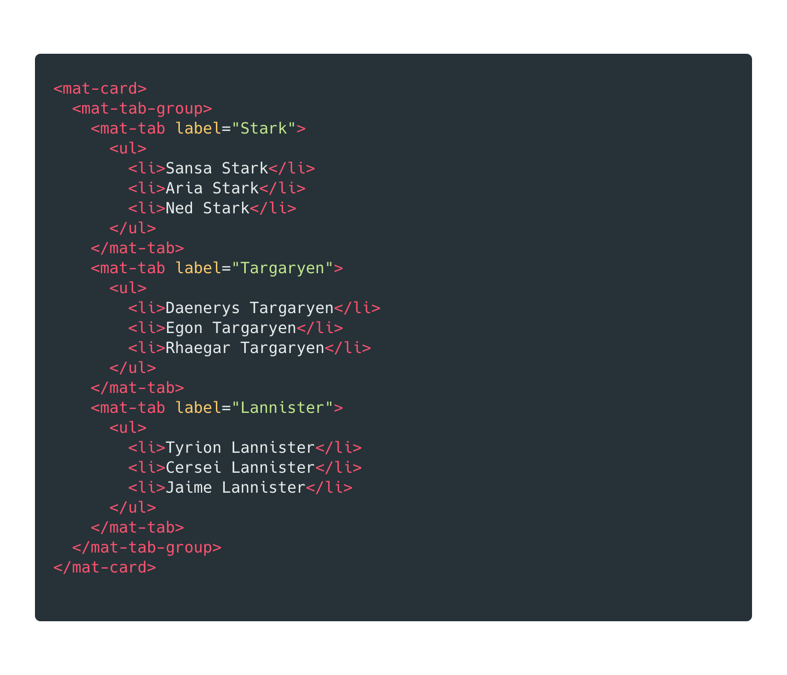
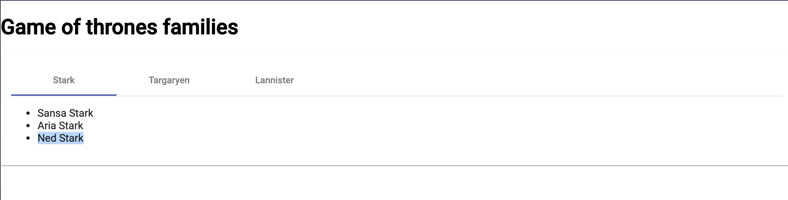
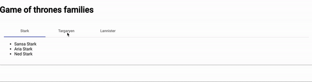
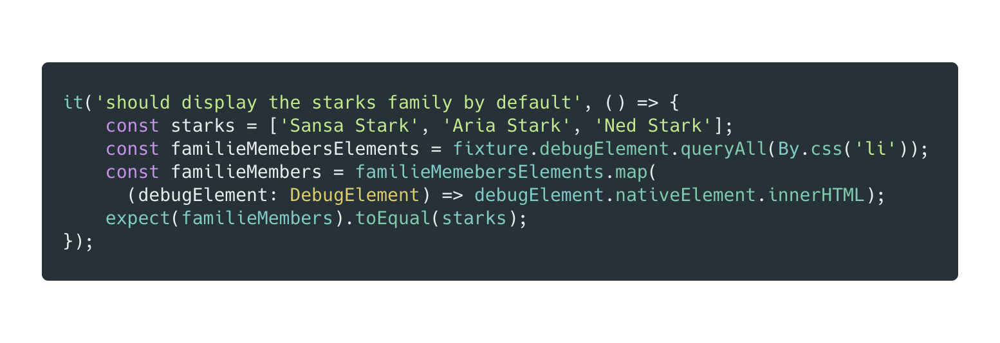
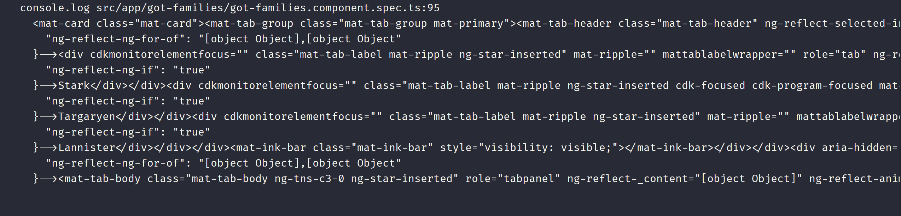
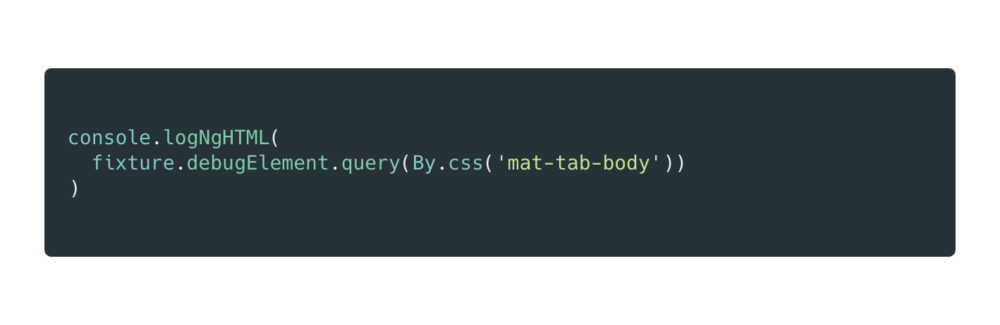
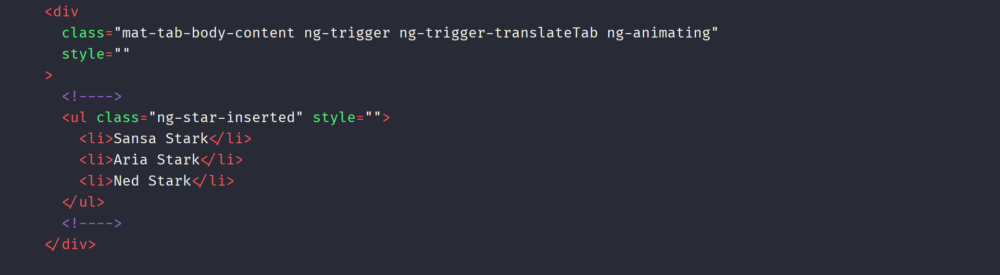
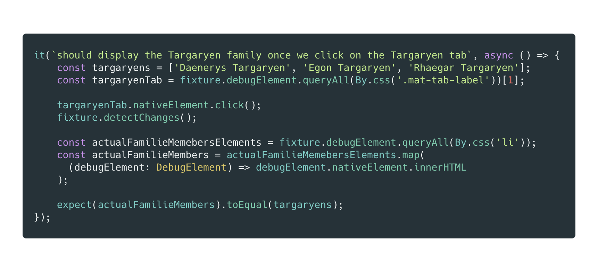
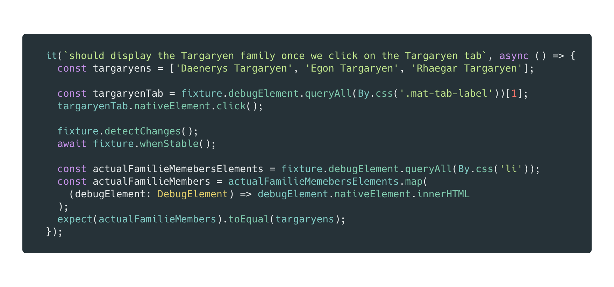
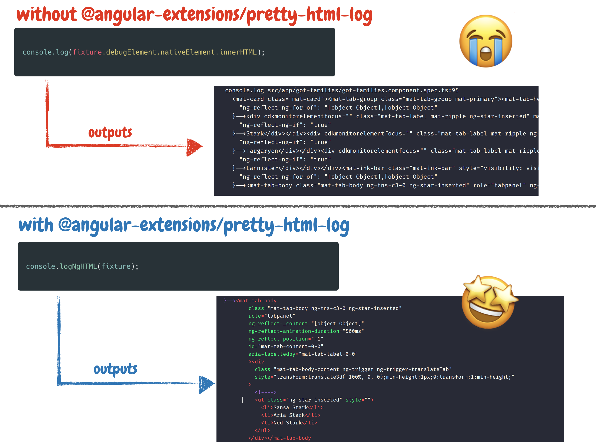

# 在Jest中改进对 Angular 组件测试的调试

@angular-extensions/pretty-html-log

[原文链接](https://medium.com/angular-in-depth/improved-debugging-of-angular-component-tests-in-jest-ac035e521763)

[原作者:Kevin Kreuzer](https://medium.com/@kevinkreuzer?source=post_page-----ac035e521763----------------------)

译者:[尊重](https://www.zhihu.com/people/yiji-yiben-ming/posts)


良好的测试是每一个应用的基础，也是项目成功的关键。作为一个眼光卓越的框架，Angular 在设计之初就考虑了测试的能力，并向开发者提供了许多测试功能。

通常来说，Angular CLI 生成项目时会默认使用 Karma 作为 test runner，Jasmine 作为测试框架。但是现如今，不少人开始尝试使用 Jest 代替默认的 Angular 测试方案。

多种原因促成了这种技术方案的迁移。最常见的说法是 - Jest 拥有更好的性能和稳定性；Jest 比 Karma 更快。Jest 可以在不运行浏览器的状况下运行测试（Jest 使用了 DOM 的 JavaScript 实现 - `jsdom`）。

虽然 `jsdom` 是很快但是并不是没有代价 - `jsdom` 很难debug。

> 如果你想了解如何使用 Jest 创建一个 Angular library project，推荐你阅读这篇文章。

[Migrate your Angular library to Jest](https://medium.com/angular-in-depth/migrate-your-angular-library-to-jest-faba9579591a)

## What are we going to learn? 👨‍🎓

我们将探索 在一个使用 Angular + Jest 的项目中，如何使用第三方库 `@angular-extensions/pretty-html-log` 提升对组件测试的调试能力。

## 一个简单的组检测试

首先让我们看看作为案例的组件 - 展示权力的游戏的家族信息。



上述代码展示了三个不同的 Angular material tabs。一个 tab 展示 Stark 家族，一个 tab 展示 Targaryen 家族，一个 tab 展示 Lannister 家族。每一个 tab 都会展示相应的家族成员。



现在让我们实现一些组件测试的代码。

## Component test（组件测试）

组件测试确保用户交互可以反馈出正确的组件 HTML 渲染结果。

在我们的样例中，当用户点击一个家族的 tab 时，能否正确地渲染对应的家族成员信息是测试的标准。



从简单的测试开始，首先我们测试默认情况下，Stark 家族的信息是否正常渲染展示。



测试中，我们首先定义了 Stark 家族中的所有成员。然后查询了 list 元素的内容，并断言，展示元素的 `innerHtml` 包含所有期待的家族成员信息。

通过上述测试，我们可以确认初始状态是正确的。接下来，我们需要测试：点击 Targaryen 家族的 tab 页面，是否正常展示 Targaryens 家族成员的信息。


首先获取 Targearyen tab 页面的元素，并对其调用 `nativeElement.click()` 模拟用户的点击。在点击之后，调用 `fixture.detectChanges()` 通知 Angular 触发一次组件的变更检测。

再获取所有组件中展示的 list 元素并抽取其 `innerHTML` 的文本内容。最后，我们断言从 `innerHTML` 中获取的文本内容等于 Taragaryens 家族成员的信息。

看起来一切都没问题！但是，当我们执行测试时，测试没有通过。

## Debugging component tests（调试组件测试）

如何修复这个未能通过的测试呢？

首先，我们仔细检查错误信息。通常来说，错误信息会给我们指引一个正确的方向。但当我们遇到复杂场景时，错误信息所提供的信息就很有限了。

我们需要一个调试的方法。

我们当然可以通过在测试中打断点的方式逐步走完测试，但是这个方案并不是那么有帮助。使用 Karma 时，我们可以设置断点并在浏览器中检查 HTML 展示；但是使用 Jest 时，我们没有浏览器实例，只有 `jsdom`（DOM 的 JavaScript 展示）。我们需要访问/获取 `Component fixture` 的方式。

我们可以尝试使用老银弹 `console.log`?

## Inspect ComponentFixture with console.log

虽然完全可以通过如下方式打印 `component fixture` 的 `debugElement innerHTML` ：

```typescript
console.log(fixture.debugElement.nativeElement.innerHTML);
```

但是结果输出却是：



内容完全不可读。

但是如果我们仔细观察内容，会发现其内容就是 `component fixtures HTML`。

通过 `console.log` 可以完整的获取 `component fixtures HTML`，那么有什么什么方法是可以通过更可读的方式获取 `component fixtures HTML` 吗？

当然，我们可以将打印出的内容复制到一个 HTML 文件中并对其执行标准化格式操作，但是那样也太“人工智能”了。这种方案会消耗大量的人力和时间，不可能为每一个测试都这样人工介入一遍。

有方案吗？当然！

我们可以借助于 **@angular-extension/pretty-html-log** 的力量。

## 设置 @angular-extension/pretty-html-log

`@angular-extension/pretty-html-log` 接收`ComponentFixture`, `DebugElement` 或 纯HTML `string` 作为参数，将其格式化并以高亮的形式展示在控制台中。

听起来功能不错，试试看。

首先我们需要安装模块。因为该模块只会在测试中使用，因此只需要将其作为开发依赖安装即可。

```bash
npm i -D @angular-extension/pretty-html-log
```

如何你在 Angular 中使用 Jest, 有大概率你使用了 `jest-preset-angular`，也就意味和会存在一个名为 `setupJest.ts` 的文件。使用与导入 `jest-preset-angular` 同样的方式导入 `@angular-extension/pretty-html-log`。

```typescript
import '@angular-extension/pretty-html-log';
```

通过上述的导入，`console` 命令会被打上一个功能补丁，加上一个 `logHTML` 方法。除了使用 `console.log` 命令外，你还可以调用 `console.logNgHTML` 方法，该方法接受 `ComponentFixture`,`DebugElement` ，一个原生 HTML 元素 或是一个 `string` 作为参数。

现在，让我们使用 `logNgHTML` 这个方法找到测试中的错误。



我们当然也可以将整个 `fixture` 作为参数传递给 `console.logNgHTML` 方法中，但是考虑到我们只对 `mat-tab-body` 的渲染内容感兴趣，所以没这个必要。

上述操作所产生的输出如下：



可读性真的很重要。

我们可以从打印的内容中观察到，模板仍然在展示 Starks 家族成员信息。但是为什么？让我们重新回顾一下测试内容。



模拟点击之后，`fixture.detectChanges` 通知 Angular 触发一次变更检测。但是我们的断言逻辑在模板改变之前就已经完成执行了。因此我们需要等待 `fixture.whenStable()` promise 完成后，改变才能反射到模板中。

修复测试的错误。



很好，我们改进了测试的调试机制。更重要的是，可阅读性更强的 HTML 帮助我们发现了错误并修复了测试内容。

## 结论

Jest 真的很棒！Jest 要比 Karma + Jasmine 的方案快多了。无需启动浏览器，Jest 就可以运行测试。无需使用真实的 DOM，Jest 使用名为 `jsdom` 的虚拟 DOM 表示形式。

`jsdom` 虽然有性能的优势但是也有调试方面的劣势。其劣势在面对 Angular 组件测试时尤其明显。

通常来说，为了调试对组件的测试，需要检查 DOM 的内容。最常见的解决方案是使用老药方 `console.log`，但是这个方案也有其局限性。

首先，总是手动输入

```typescript
fixture.debugElement.nativeElement.innerHTML
```

很是恼人。除此之外，使用 `console.log` 所打印出的 `HTML` 内容基本不可读。因此为了可读性还需要将打印出的字符串内容放置于新的 HTML 文件中并将其格式化，太麻烦了。

幸好，使用 `@angular-extension/pretty-html-log` 模块可以让一切变得简单起来。

`@angular-extension/pretty-html-log` 模块为 `console` 补丁了一个 `logNgHTML` 方法，通过该方法可以将 `ComponentFixture` 的 `innerHTML`，`DebugElement`,`NativeElement` 或 `HTML String` 转化为可读的 HTML 内容。



感谢阅读，欢迎关注我后续的文章。
 


