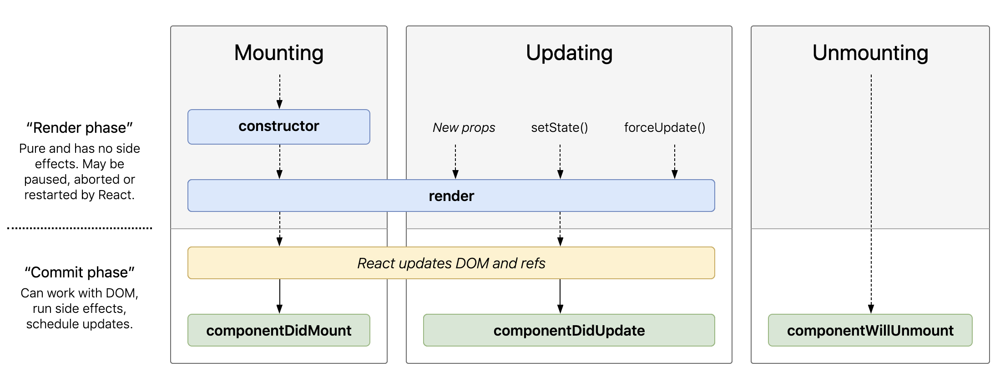

# 多才多艺的Ivy-混用Angular+React

[原文链接](https://medium.com/angular-in-depth/angular-and-react-together-with-ivy-5c77d1f48204)

[原作者:Richard Sahrakorpi](https://medium.com/@rjgunning?source=post_page-----5c77d1f48204----------------------)

译者:[尊重](https://www.zhihu.com/people/yiji-yiben-ming/posts)


声明：本文不会过多解释什么是 Angular Ivy，而将探索一些由 Ivy 带来的实验性的功能。考虑到这些功能还处于试验阶段，未来可能会发生变化。如果你还不熟悉 Angular Ivy，推荐阅读 [Eliran Eliassy](https://medium.com/u/b655ae6fff25?source=post_page-----5c77d1f48204----------------------)的文章[new Angular Engine](https://blog.angularindepth.com/all-you-need-to-know-about-ivy-the-new-angular-engine-9cde471f42cf) 或是了解一下他在今年的 [AngularConnect](http://www2.whiteoctoberevents.co.uk/e/168012/ect-status-1177608729040232450/327366i/415194539?h=Vmo95oH69FZuzZdJ25V3cE1gly4epyrHLK6tjYJE0ds) 技术大会上所做的演讲。

互联网上关于”框架之争“的讨论中，关于选择什么框架的辩驳从来没有停过，但是有一种说法是心照不宣的：一个公司只能使用一种框架进行开发工作 - 没有公司使用多种框架并行的模式。然而，在真实世界中，这种状况几乎不可能发生。事实上，许多公司都在并行使用多种 JavaScript 框架。某家公司可能一开始使用 A 框架，但是当他们收购另一家使用 R 框架的公司/为新启动的项目选择最新的框架时，他们并不会只局限于使用 A 框架。

这样的状况导致公司必须支持多种框架，同样的功能或组件在不同的框架中多次实现。现在，缺少一种将过去全部铲除，使用一种更统一方式重新出发的契机，有没有更机智的方法可以避免重复劳作呢？在本文中，我们将探索 Angular Ivy 的实验性功能 - 利用 Angular Ivy 创造跨平台共享组件库。

现如今流行的跨平台解决方案是 web-components。通过打包，这些 web-components 将会成为独立的元素，可以用于任何框架之中。尽管本文不会讨论 web-component 本身是否值得使用，但是毫无疑问的是任何方案都有其优缺点。比如，我曾经遇到的问题：如何效率地将 web-component 纳入 Angular library 中；比如当开发者同时将 web-components 分别引入 library 中和引入 App 中时就可能会出现问题。虽然这并不是一个无法解决的问题，但是从这个案例中我们可以发现 web-components 可能并不是解决所有问题的最好方式/工具。

除此之外，如果你已经拥有了由 React 或 Angular 所编写的组件库，在确保组件库的正常使用之前，你可能不希望一上来就将其转化为 web components。这就引发了另一个问题，React 组件库和 Angular 组件库可以互相混用吗？

## 我可以在 Angular 中直接使用 React 组件吗？或者我可以在 React 中直接使用 Angular 组件吗

为了了解在 Angular 中直接使用 React 组件是否存在可能性，我翻看了不少文档和实现，并最终在 ng-packagr [document](https://github.com/ng-packagr/ng-packagr/blob/master/docs/jsx.md) 和 这个 [demo app](https://github.com/ng-packagr/ng-packagr/blob/master/integration/samples/jsx/src/react-integration.component.tsx) 中找到了相关实现。在 demo 中， 通过 `ReactDOM.render` 方法直接在一个 Angular 组件中渲染了一个 React 组件。这个整合组件可以被当做 angular library 的一部分打包并允许直接用于 Angular 应用中。

```typescript
export class AngularReactLabel implements AfterViewInit {

  constructor(private hostRef: ElementRef) {}

  ngAfterViewInit(): void {
    const hostElement = this.hostRef.nativeElement;
    const LabelToShow = () => (
      // Actual use here, might include data-binding in a real world scenario
      <ReactLabel></ReactLabel>
    );
    ReactDOM.render(<LabelToShow />, hostElement);
  }
}
```

查看本[地址](https://github.com/ng-packagr/ng-packagr/blob/master/integration/samples/jsx/src/react-integration.component.tsx)获取全部源码。

如此简单的跨平台方案（使用框架的原生渲染方法将组件注入）不禁让我想问：能否用同样的方案将 Angular 组件添加到 React 应用使用呢？在 Angular Ivy 出现之前，这是一个很艰巨的任务；但是现在，通过使用 Ivy renderer，事情变得要简单多了。借助于 Ivy，只需要很少的工作就可以渲染一个完全独立不依赖于 `ngModule` 的 Angular 组件，这一系列思路在 [Eliran Eliassy](https://medium.com/u/b655ae6fff25?source=post_page-----5c77d1f48204----------------------)的 [Bye Bye NgModules talk at NG-DE](https://www.youtube.com/watch?v=MwFl2Rd_RJ0)及[相关文章](https://blog.angularindepth.com/the-future-of-standalone-components-in-the-post-ivy-release-days-e7ed9b9b4dcd)中均有提及。

Ivy renderer 和 View Engine 之间最大的区别是，借助于 Ivy，组件现在知晓一切渲染其自身所需要的必要条件。在此之前，组件只能在 Angular 上下文环境中渲染；而现在，通过 Ivy 渲染一个组件只需要使用 `θrenderComponent(Component)` 函数即可。

在 Angular 的 [renderComponent function documentation](https://github.com/angular/angular/blob/a2e890e4f7d01f0edd1c69ce5be61ef69318d9e4/packages/core/src/render3/component.ts#L93-L105) 中，该函数的描述是：

> 在一个已存在的 host element 中引导启动一个组件并返回该组件的一个实例。使用该方法在 DOM tree 中引导启动一个组件。每次调用该函数都将创建一个独立的 component tree，injectors 和 变更检测周期。
>
> Bootstraps a Component into an existing host element and returns an instance of the component. Use this function to bootstrap a component into the DOM tree. Each invocation of this function will create a separate tree of components, injectors and change detection cycles and lifetimes.

在一个 React 上下文中渲染一个 Angular 组件，这个函数好像就是我们打开宝箱的钥匙。

## 在 React 中渲染一个 Angular 组件

现在我们已经知道 Ivy 将会扮演关键先生，先了解一下创建一个 demo app 需要什么。首先我们创建一些简单的 Angular 组件=并使用 Ivy 将他们编译为一个 Angular Library。

第二步我们将创建一个 React wrapper library。这个 Library 将作为一个 `对 Angular Library 中每个 Angular component 进行封装` 的React component 存在。这样的方式允许对 Library 进行摇树优化，并剔除那些没有使用的组件。为了避免编写重复的代码且因为这些封装组件彼此之间较为相似，我们会创建一个通用的封装组件类，这样可以通过 extend 的方式将其拓展为各个封装组件。

### 创建 Angular Library

我们首先创建的是一个最简单的 Hello World 组件。
该组件包含一个用于在模板中展示的字符串类型`@input`，以及一个组件初始化一秒后立刻抛出数据的 `@output`。
我们通过在 `ngOnit` 生命周期钩子中使用 `setTimeout` 方法，通知组件何时抛出事件。
最后，我们会监听 `ngOnChanges` 生命周期钩子，并将所有的对象变化记录在控制台中以展示组件的正常运行。

这个组件展示了一些信息。
首先需要确保基本的 `@input` 和 `@output` 绑定在 React 环境中也可以正常使用。
其次，在 React 环境中，Angular 生命周期钩子和变更检测仍然可以正常运行。

```typescript
// hello-world.component.ts

@Component({ selector: 'hybrid-hello-world', template: 'Hello {{name}}!' })
export class HelloWorldComponent implements OnInit, OnChanges {
  @Input() name = 'world';
  @Output() stuff = new EventEmitter<string>();

  ngOnInit() {
    setTimeout(() => {
      this.stuff.next('loaded');
    }, 1000);
  }
  
  ngOnChanges(changes){
    console.log(changes)
  }
}
```

第二个样例组件会是一个定时器组件，其中会用到 Angular 的生命周期钩子，使用 rxjs observable 配合 `on-push` change detection Strategy 更新组件的 `counter` 。确保 `on-push` change detection Strategy 正常工作，我们需要告知组件 view 何时处于 dirty 状态并需要更新。为了实现该功能，我们将使用 Ivy 的 `θmarkDirty` 函数。该函数将通知 Angular runtime，组件内容已经被更新，应于下一次变更检测周期内被检查。

```typescript
// timer.component.ts

import {
  Component,
  OnInit,
  OnDestroy,
  ɵmarkDirty as markDirty,
  ChangeDetectionStrategy
} from '@angular/core';
import { Subscription, timer } from 'rxjs';

@Component({
  selector: 'hybrid-timer',
  template: `counter: {{counter}}`,
  changeDetection: ChangeDetectionStrategy.OnPush
})
export class TimerComponent implements OnInit, OnDestroy {

  private counterSubscription: Subscription;
  public counter: number;

  constructor() { }

  ngOnInit() {
    this.counterSubscription = timer(0, 1000)
      .subscribe(c => {
        this.counter = c;
        markDirty(this);
      });
  }

  ngOnDestroy() {
    this.counterSubscription.unsubscribe();
  }

}
```

### 创建一个 React helper

后续需要创建一个通用的 React component helper class。该类将会指导 React 渲染被提供的 Angular component。这样做的目的是减少所需的代码量以更轻松地创造独特的封装组件。通用类将使用新的 Angular Ivy 函数将 Angular 组件渲染成 DOM 并确保 event 触发时 DOM 保持更新。

利用 typescript 语言特性，我们可以将通用类作为 re-useable base 并接收类型 T 作为参数，类型 T 则代表了需要渲染的 Angular 组件。通过这样的方式，我们可以使用该组件渲染任何一个 Angular 组件而无需进行定制化操作。这个通用组件 extend 自基础的 React 组件，以确保所有继承自该组件的新组件都可以被 React 所解析。

该通用类的构造器函数接受一个属性对象和一个 `ComponentType` 对象（用于指定需要渲染的 Angular component 的类型）。`ComponentType` 是一个服务于 Angular Ivy 编译器的特殊的类型接口，该接口 extends 于基本的 `Type` 并添加了一个特殊的属性 - 属性的键是 `NG_COMPONENT_DEF` 变量的值。该属性用于提供需要被渲染的组件的元数据信息，比如 selector，inputs 和 outputs。

通过获取组件的特殊属性，我们可以简化后续的封装组件所需提供的有关 Angular component 的信息。除此之外，通过使用 Angular 指定的 host element，我们会确保最终的代码实现更强健并具备更好的可读性（代码将会被包含在 HTML中）。

最后，在构造器中，我们将使用 `selector` key 将 seletor 存储在组件的 state 对象中，这样在后续的渲染组件模板过程中取值会更加便利。

```tsx
export class ReactNgWrapper<T, U = any> extends React.Component<U, { selector: string, propChanged: Set<string> }> {
  private _componentDef: ComponentDef<T>;

  constructor(props: Readonly<U>, private componentFactory: componentType<T>) {
    super(props);

   this._componentDef = componentFactory[NG_COMPONENT_DEF] || null;

    if (!this._componentDef) {
      throw new Error('A component with a ngComponentDef is required');
    }

    this.state = {
      selector: this._componentDef.selectors[0][0] as string,
      propChanged: new Set<string>()
    };
  }
```

简要了解一下 React 的生命周期钩子及其顺序，我们会发现 `render` 函数在 mounting 阶段执行，此时尚无内容被添加到 DOM 结构中。

所有的 React component 都需要 `render` 函数，其用于声明模板并控制模板渲染在 DOM 中的方式。

在第一次渲染运行之前，是没有 DOM 模板允许挂载 Angular 组件的。



因此，我们需要实现我们的 `render` 方法，创建一个简单的 host element 用于挂载 Angular element，但是并不在该方法中使用任何与 Angular 相关的技术/内容。我们的 `render` 函数将获取先前存储的 selector，使用一个 `与定义在 Angular 组件中的 selector 相匹配的 element tag` 创建一个 DOM 元素。通过这样的实现，页面的 DOM 结构中就包含了一个用于 Angular element 插入的”地点“。

```tsx
render() {
    const CustomTag = `${this.state.selector}`;

    return (
      <CustomTag></CustomTag>
    )
  }
```

因为在第一次 `render` 运行之前，没有任何已渲染的模板可用，所以我们需要借助 React 的 `componentDidMount` 生命周期钩子。`componentDidMount` 钩子在初始化渲染后执行，此时页面中包含了所需的 host element。从某种意义上，可以将 React 的 `componentDidMount` 钩子理解为 Angular 的 `ngAfterViewInit` 钩子。

在 `componentDidMount` 钩子中，我们将调用 Angular Ivy 的 `θrenderComponent` 函数。该函数将获取 Angular component（构造器中提供）并告知 Angular 使用生命周期钩子。如果没有显式地通知 Angular 使用生命周期钩子，那么生命周期钩子就不会生效。

处理在 React 和 Angular 组件之间的 `@output` 绑定是一个不小的挑战，因为 React 和 Angular 实现事件绑定的方式不一样。

在 Angular 中， output events 由 event emitters 处理，其本质是对 rxjs `Subject` 类的拓展。换句话说，在 Angular 中当你监听到组件输出时，实际上是订阅一个 observable 并在 observable 抛出数据时执行相关代码。

而在 React 中，组件会将一个函数作为 prop input 传递给子组件。而子组件的作用就是调用传递进自己的方法。

为了确保技术的区别不会影响我们的目标，React 封装组件必须订阅每个 Angular 组件的 output event emmitter。在该订阅函数中，我们再调用相关的 React prop 函数。因为已经获取了 Angular 的组件定义，我们可以循环遍历所有的 outputs，如果存在对应的 React prop 并且也在 event 上设置了关联，那么就可以订阅该 outputs。最后，将所有的订阅存储在私有类属性中，确保可以在需要的时刻对 subscriptions 取消订阅，避免内存泄漏。

`componentDidMount` 方法中的最终功能是更新输入绑定。我们将该功能封装进一个名为 `updateComponent` 的方法中，我们需要在每一次变更检测周期中检查输入是否需要更新。

`updateComponent` 方法会遍历每一个 react prop 并将设置与之匹配的 angular component 属性值。不通过模板直接设置属性值的方式不会通知 Angular 组件的值发生了变化，因此我们需要手动调用 `ngOnChanges` 和 Ivy 的 `markDirty` 方法通知 Angular 变化的发生。

```tsx
// react-ng-wrapper.tsx

export class ReactNgWrapper<T, U = any> extends React.Component<U, { selector: string, propChanged: Set<string> }> {
  private _childComponent: T & Partial<OnChanges>;
  private _componentDef: ComponentDef<T>;


  // After the component did mount, we set the state each second.
  componentDidMount() {
    // render component after selector is in DOM
    this._childComponent = renderComponent(this.componentFactory, { hostFeatures: [LifecycleHooksFeature] });

    // listen to outputs
    this._subscriptions.push(
      ...Object.keys(this._componentDef.outputs).map(
        (output) => {
          return this._childComponent[output].subscribe((e) => {
            if (this.props[output] && typeof this.props[output] === "function") {
              this.props[output](e)
            }
          })
        }
      )
    )

    // bind inputs
    this.updateComponent();
  }

  updateComponent() {
    if (this._childComponent) {
      const changes: SimpleChanges = {}
      // update inputs and detect changes
      Object.keys(this.props).forEach(prop => {
        if (this._childComponent[prop] &&
          Object.keys(this._componentDef.inputs).includes(prop) &&
          this._childComponent[prop] !== this.props[prop]) {

          changes[prop] = new SimpleChange(this._childComponent[prop], this.props[prop], !this.state.propChanged.has(prop))
          this.state.propChanged.add(prop);
          this._childComponent[prop] = this.props[prop]
        }
      })

      if (typeof this._childComponent.ngOnChanges === "function") {
        this._childComponent.ngOnChanges(changes);
      }

      markDirty(this._childComponent);
    }
  }
}
```

现在，我们需要解决的问题是，当 React component 运行一次更新周期时，如何同步更新 Angular 的组件。

回顾一下上面的 React 生命周期钩子图，在更新周期中有两个钩子将会被触发：

- `render` 被用来向 DOM 中添加 host element
- `componentDidUpdate`

我们将会使用 `componentDidUpdate` 钩子函数在 React 组件的每一个更新循环中更新 input binding。利用已经创建过 `updateComponent` 函数可以更新 input binding，所以只需要在声明周期钩子函数中调用之即可。

```tsx
// react-ng-wrapper.tsx

  componentDidUpdate(){
    this.updateComponent();
  }
```

最后的最后，我们会使用 React component 的 `componentWillUnmount` 钩子函数清除订阅确保没有内存泄漏。

```tsx
// react-ng-wrapper.tsx

 componentWillUnmount() {
    this._subscriptions.forEach(subscription => subscription.unsubscribe())
  }
```

现在，可以渲染任何 Angular 组件的通用 React component 完成了。

## Creating React wrapper components for each of our Angular components

通过 extends 刚刚创建的通用 React component，我们就可以创建针对于不同 Angular component 的 React 封装组件了。在 React 中创建我们的 Hello World 和 Timer Angular component 只需要几行就搞定了。

```tsx
// hello.tsx

export class ReactHelloComponent extends ReactNgWrapper<HelloWorldComponent> {
  constructor(props){
    super(props, HelloWorldComponent as any)
  }
}
```

```tsx
// timer.tsx

export class ReactTimerComponent extends ReactNgWrapper<TimerComponent> {
  constructor(props) {
    super(props, TimerComponent as any)
  }
}
```

之后就需要使用 Angular 编译器和 ng-packaer 对 React Wrapper Library 进行编译了。只有这样，最终的 Library 才可以理解 Angular 于其中所做的操作。

## The React Application

最后，展示一下如何在 React 应用中使用刚刚编译好的封装组件。

```tsx
// app.tsx

import React from "react";
import { ReactTimerComponent, ReactHelloComponent } from '@hybrid/react-wrappers';
import { HelloJSX } from '@hybrid/react-component-library'
export class App extends React.Component {
  constructor(props) {
    super(props);

    this.state = {
      name: "project-react",
    };
  }

  componentDidMount() {
    setTimeout(() => {
      this.setState({ name: "project-angular-react" })
    }, 2000);
  }

  onStuff(e) {
    console.log(`stuff happened ${e}`)
  }

  render() {
    return (
      <div>
        <div style={{ textAlign: "center", fontSize: "xx-large" }}>
          <ReactHelloComponent name={this.state.name} stuff={this.onStuff}></ReactHelloComponent>
          <div>
            <ReactTimerComponent></ReactTimerComponent>
          </div>

          <HelloJSX></HelloJSX>
        </div>
      </div>
    );
  }
}
```

上述代码中，我们创建了一个基础的 React 组件，并将 Hello World 和 Timer 组件添加到 DOM 中。
在 Hello World 组件中使用了输入绑定将 `name` 传递给 Angular 组件并使用 `onStuff` 函数将 Angular 组件抛出的事件传递给 React component 并将信息打印到到控制台中。

最后，在两秒之后修改 `name` 的属性，并将其传递给 Hello World 组件以更新模板。


## 总结

借助于 Angular Ivy - 第三代 Angular 编译器，创建有趣的混合应用逐渐成为可能，我们已经可以将 Angular 组件无损地添加到基于其他 JS 框架创建的项目中去。

Ivy 打开了一扇大门：创建跨平台的共享组件，无需将组件转化为 web-components 或者为同一个组件基于不同框架创建不同的版本。

虽然本文中所有的功能尚未完全准备就绪，还不能现在用于生产环境，但是使用现有的工具所实现的功能着实让人大吃一惊。

本文所提及的所有代码都放在这个 [repo](https://github.com/RGunning/Angular-React-hybrid) 中:包含了所有可运行的实例（在 React 中使用 Angular 组件 / 在 Angular 中使用 React 组件），欢迎在 repo 中提出你的新想法。

本文只是一个开始，而 Ivy 未来可期。
