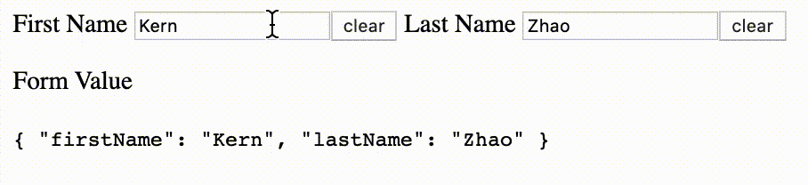

# 实现 ControlValueAccessor 时不要重新造轮子

重复利用已经实现的 ControlValueAccessor。

[原文链接](https://medium.com/angular-in-depth/dont-reinvent-the-wheel-when-implementing-controlvalueaccessor-a0ed4ad0fafd)

[原作者:Siyang Kern Zhao](https://medium.com/@siyangkernzhao?source=post_page-----a0ed4ad0fafd----------------------)

译者:[尊重](https://www.zhihu.com/people/yiji-yiben-ming/posts)


## 前置条件

你可能已经阅读过[the technique of implementing ControlValueAccessor (CVA) to adapt your custom form element to Angular’s Reactive Form, such as a 1–5 star rating component. 实现 ControlValueAccessor 使自定义表单元素适应于 Angular 响应式表单，比如1-5 星组件](https://dev.to/bitovi/understanding-angular-s-control-value-accessor-interface-5e7k)

在阅读本文之前，你需要了解 CVA 的相关技术。如果你对 CVA 还不够了解，请先阅读 [CVA 技术阅览](https://dev.to/bitovi/understanding-angular-s-control-value-accessor-interface-5e7k) 和 [CVA 深入解析](https://blog.angularindepth.com/never-again-be-confused-when-implementing-controlvalueaccessor-in-angular-forms-93b9eee9ee83)

## 问题

假设你需要一个 component A，A 中封装了一个原生的表单元素，而你希望可以直接在 component A 中直接应用 `formControl` 和 `formControlName`，就像在原生表单元素上使用 `formControl` 和 `formControlName` 一样。

举例来说，创建了一个名为 `resettable-input` 组件（大概率重置的行为在应用中会被大量使用），该组件包含一个 input 元素和一个 button 元素，点击 button 将清除 input 中的内容。



除此之外，你还希望 `resettable-input` 组件兼容响应式表单，确保 `formControl` 和 `formControlName` 指令可以直接应用于 `resettable-input` 组件。

```html
<form [formGroup]="formGroup">

  First Name
  <resettable-input [formControlName]="'firstName'"></resettable-input>

  Last Name
  <resettable-input [formControlName]="'lastName'"></resettable-input>

</form>
```

> 我强烈推荐读者在这里暂停，花几分钟思考一下如果是你会怎么解决这个问题。

通常来说，你可能会直接开始 coding 对 `resettable-input` 组件实现 `ControlValueAccessor`，如下所示：

```typescript
@Component({
  selector: 'resettable-input',
  template: `
    <input type="text" (blur)="onBlur()" (input)="onInputChange()" #input>
    <button (click)="clearInput()">clear</button>
  `,
  providers: [{
    provide: NG_VALUE_ACCESSOR, useExisting: ResettableInputComponent, multi: true
  }]
})
export class ResettableInputComponent implements ControlValueAccessor {

  onTouched = () => {};
  onChange = _ => {};

  @ViewChild('input', {static: true, read: ElementRef})
  inputElementRef: ElementRef;

  constructor(private _renderer: Renderer2) {}

  clearInput() {
    this._renderer.setProperty(this.inputElementRef.nativeElement, 'value', '');
    this.onChange('');
  }

  onInputChange() {
    const value = this.inputElementRef.nativeElement.value;
    this.onChange(value);
  }

  onBlur() {
    this.onTouched();
  }

  registerOnTouched(fn: any) {
    this.onTouched = fn;
  }

  registerOnChange(fn: any) {
    this.onChange = fn;
  }

  writeValue(value: string) {
    this._renderer.setProperty(this.inputElementRef.nativeElement, 'value', value);
  }

  setDisabledState(isDisabled: boolean): void {
    this._renderer.setProperty(this.inputElementRef.nativeElement, 'disabled', isDisabled);
  }

}
```

这个方案肯定是行的通的。但是你可能不知道：这样的解决方案其实是在重复造轮子。事实上， Angular 已经为 [input 元素实现了 ControlValueAccessor](https://github.com/angular/angular/blob/master/packages/forms/src/directives/default_value_accessor.ts)，**而且不仅仅是 input 元素，还包括 checkbox，radio 等原生元素**。官方的实现肯定包含了更全面的功能并且经过了全方位的测试，相比之下，你的实现就不值一提了。

现在的问题是，如何重复利用官方已经实现了的 `ControlValueAccessor`。

解决方案如下：

```typescript
@Component({
  selector: 'resettable-input',
  template: `
     <input type="text" [formControl]="control">
     <button (click)="clearInput()">clear</button>
  `,
  providers: [{
    provide: NG_VALUE_ACCESSOR,
    useExisting: ResettableInputComponent,
    multi: true
  }]
})
export class ResettableInputComponent implements ControlValueAccessor {

  @ViewChild(FormControlDirective, {static: true})
  formControlDirective: FormControlDirective;
  @Input()
  formControl: FormControl;

  @Input()
  formControlName: string;
  /* get hold of FormControl instance no matter formControl or    formControlName is given. If formControlName is given, then this.controlContainer.control is the parent FormGroup (or FormArray) instance. */
  get control() {
    return this.formControl ||     this.controlContainer.control.get(this.formControlName);
  }

  constructor(private controlContainer: ControlContainer) {
  }

  clearInput() {
    this.control.setValue('');
  }

  registerOnTouched(fn: any): void {
    this.formControlDirective.valueAccessor.registerOnTouched(fn);
  }

  registerOnChange(fn: any): void {
    this.formControlDirective.valueAccessor.registerOnChange(fn);
  }

  writeValue(obj: any): void {
    this.formControlDirective.valueAccessor.writeValue(obj);
  }

  setDisabledState(isDisabled: boolean): void {
    this.formControlDirective.valueAccessor.setDisabledState(isDisabled);
  }
}
```

这个方案可以正确地运行，同时我们也避免了重复对原生 input 元素实现 `ControlValueAccessor` 的尴尬。

上述代码中，使用 `@ViewChild` 获取 `formControlDirective`（自动通过 formControl 指令绑定到文本输入元素上），其 `valueAccessor` 已经由 Angular 帮你处理完成，我们只需要将其与我们的 `ControlValueAccessor` 实现链接起来即可。

## 结论

如果你想创建一个自定义的表单组件，并且要求与 Reactive From 相适配，就需要实现 `ControlValueAccessor`。

但是如果自定义表单组件由一个现成的原生表单元素/其他已经实现过 `ControlValueAccessor` 的自定义表单元素所组成，重复利用已实现的 `ControlValueAccessor` 会比从0开始自己实现一个 `ControlValueAccessor` 更合适。

Final Demo 在[这里](https://stackblitz.com/edit/angular-nrta3n)
