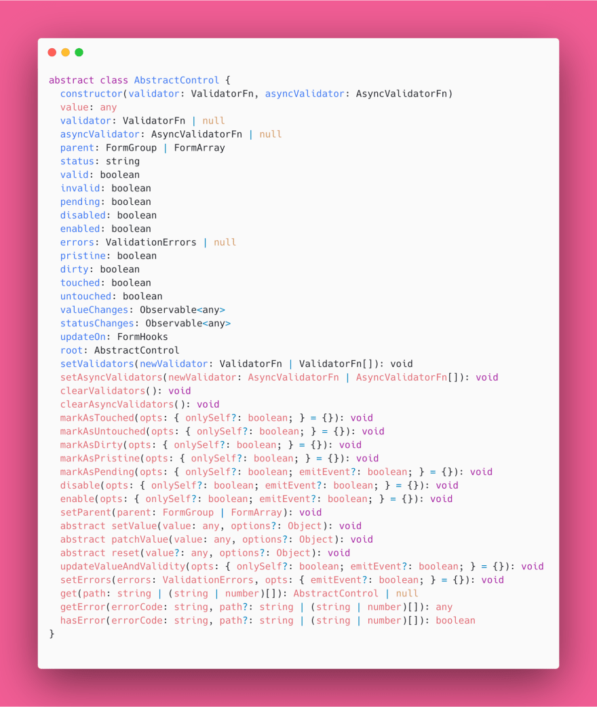
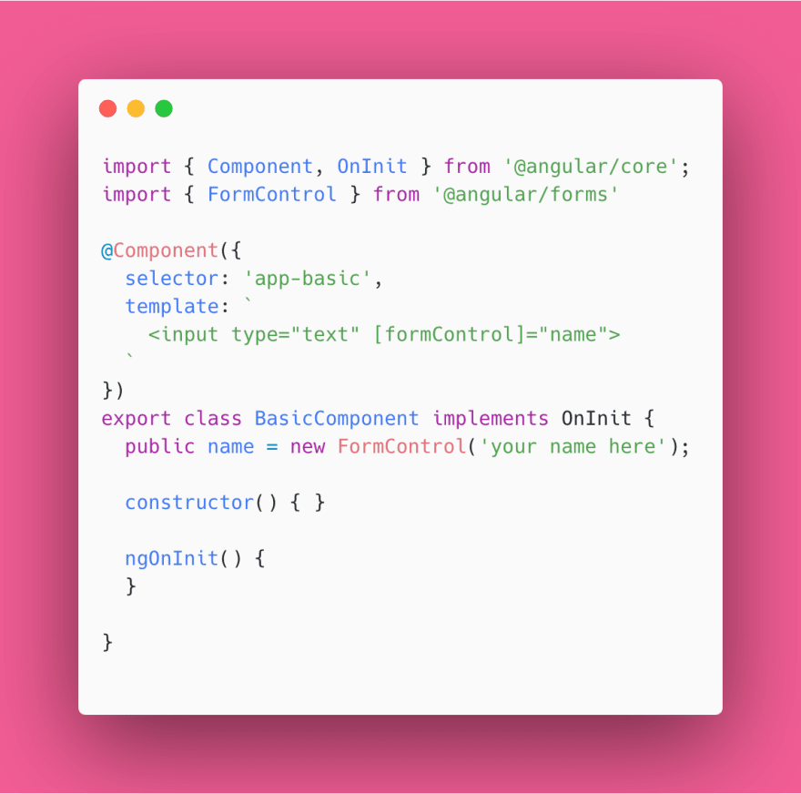
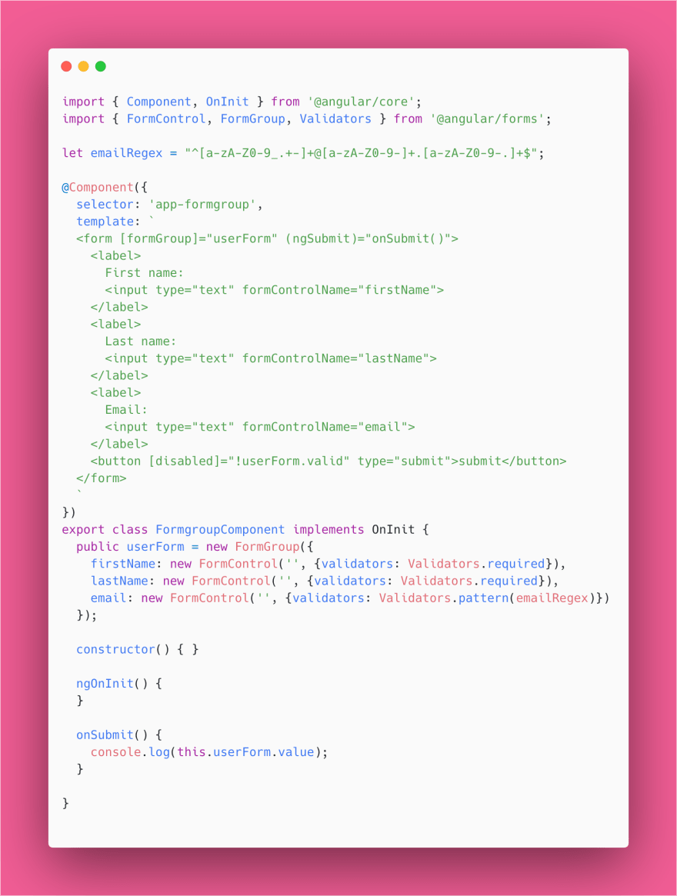
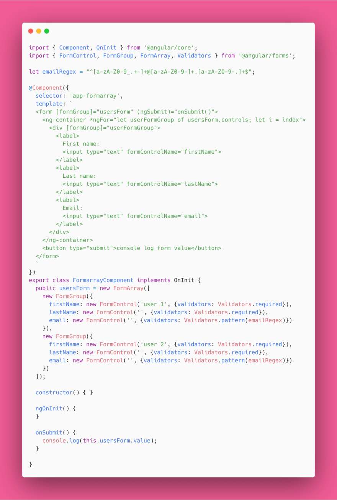
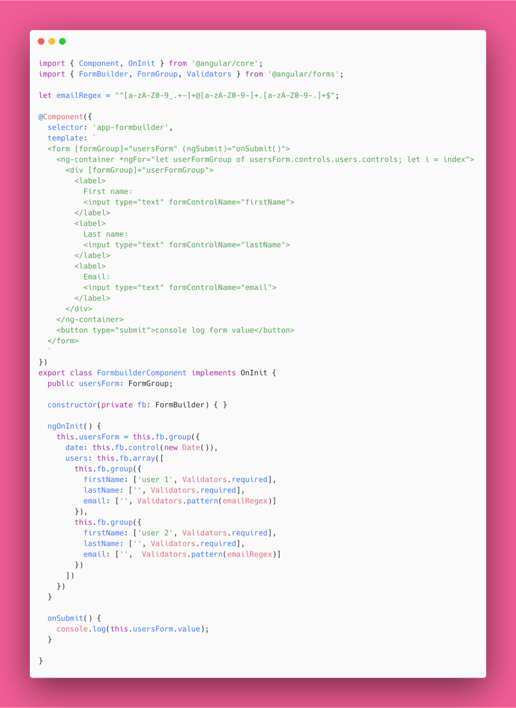
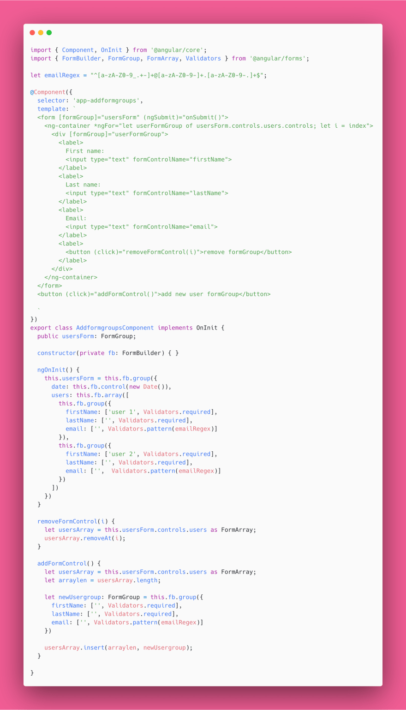

# 管理Angular中的嵌套和动态表单

[原文链接](https://dev.to/angular/managing-nested-and-dynamic-forms-in-angular-1he6)

[原作者:Jennifer Wadella](https://dev.to/likeomgitsfeday)

译者:[尊重](https://www.zhihu.com/people/yiji-yiben-ming/posts)

Angular 响应式表单借助其强壮的 API 向开发者提供了强大的开发能力，但相比于模板驱动表单，响应式表单的学习曲线也更加陡峭。在本文中，我们将了解什么是 Angular 的表单元素，如何将表单元素嵌套/混合使用，以及如何动态地创建表单元素。

## AbstractControl

首先需要了解的是 **AbstractControl** 类，绝大多数的表单元素均拓展自该类。
**AbstractControl** 包含许多属性，管理表单元素的方方面面，比如：

- 父级元素的有效状态
- 标记 Control 的状态（touched/untouched/dirty）
- 启用/禁用 Control
- 获取/设置 Control 的值
  
**AbstractControl** 类包含太多信息，所以我们使用下图作为其功能文档

## FormControl

构建 Angular 表单的基本元素是 **FormControl**。**FormControl** 类代表了页面上的输入元素。只有通过 formControl，开发者才可以获取 input,select,dropdown 和 自定义元素的相关表单信息。`[formControl]` 指令用于将 DOM 中的 input 元素绑定到其对应的 FormControl 上。

FormControl 可以使用指定值进行初始化，比如上图示例中的 `your name
 here`，也可以在初始化时设置启用/禁用状态，同时也可以设置校验规则。

## FormGroups

**FormGroup** 类用于将一系列的 controls 组合在一起。其同样 extends 自 `AbstractControl` 类，也就意味着我们可以同时获取一个 `formGroup` 中所有的 `fromControl` 的状态和值。通过使用 `FormGroup`，开发者可以更便捷地管理 FormControl。使用 `[formGroup]` 指令将 `FormGroup` 与页面 DOM 相绑定。

## FormArray

**FormArray** 类将 `FormControls` 聚合成一个数组，与 `FromGroup` 通过 `FormControls` 创建 object 的方式类似。对 `FromArrays` 而言，你可以使用类似于原生 JavaScript 数组处理的方法向 `FormArrays` 加入/移除 `formControl。FormArray` 还向开发者提供了创建 `嵌套/动态表单` 的能力。

在上述代码示例中，我们使用一个 `ngFor` 循环遍历 `userForm.controls` (`userForm` 是一个 `FormArray`)。该 `FormArray` 包含两个 `FormGroup`,所以需要在相应的 DOM 元素上使用 `[formGroup]` 指令将对应的 `FormGroup` 实例进行绑定。

## FormBuilder

重复手动输入 `new FromControl('')`,`new FormGroup({})`,`new FormArray([])` 的过程效率极低，尤其是创建大型表单时，更是让人痛苦。幸运的是，Angular 向开发者提供了 `FormBuild` 类，使用相对简单的语法实现创建表单的过程。

我们已经了解了所有创建 Angular 表单的基本知识了，现在，看看更复杂的案例。

## 动态地创建/移除 FormControls 和 FormGroups

假设我们希望创建一个自定义表单 - 允许创建不限量的用户。该表单允许通过添加新的 `FormGroups` 的方式按需创建新的用户，同样允许移除 `FromGroups` 。我们使用一个 `FromArray` 为每一个创建的用户装载包含 `FromContrls` 的 `FormGroups`。
为了实现上述功能，需要使用 `FromArray` 的方法：

- `insert` 函数接受两个参数，插入的下标和需要插入的 `fromGroup`.
- `removeAt` 函数，接受一个参数，需要移除的 `fromGroup` 的下标。

上述代码实现了一个可以动态添加/删除 `formGroup` 的表单，用户可以借助该表单创建任意数量的用户。

通过了解 `FormControl`, `FormGroup`, and `FormArray` 的功能，我们可以灵活地创建出满足业务数据提交需求的表单结构。

通过[本链接](https://stackblitz.com/github/tehfedaykin/angular-dynamic-forms)，查看本文中的所有代码。

