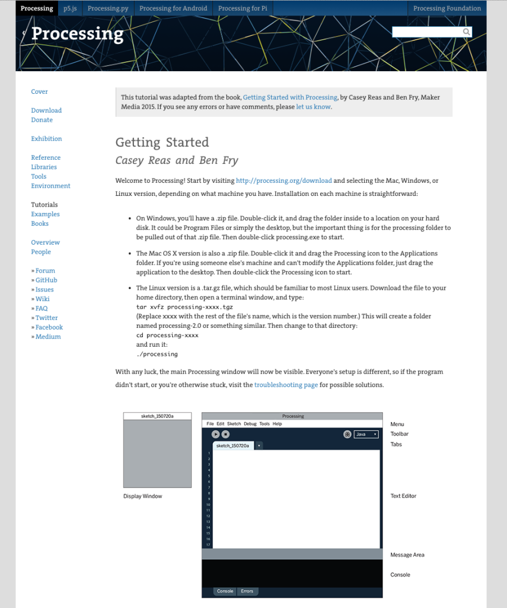
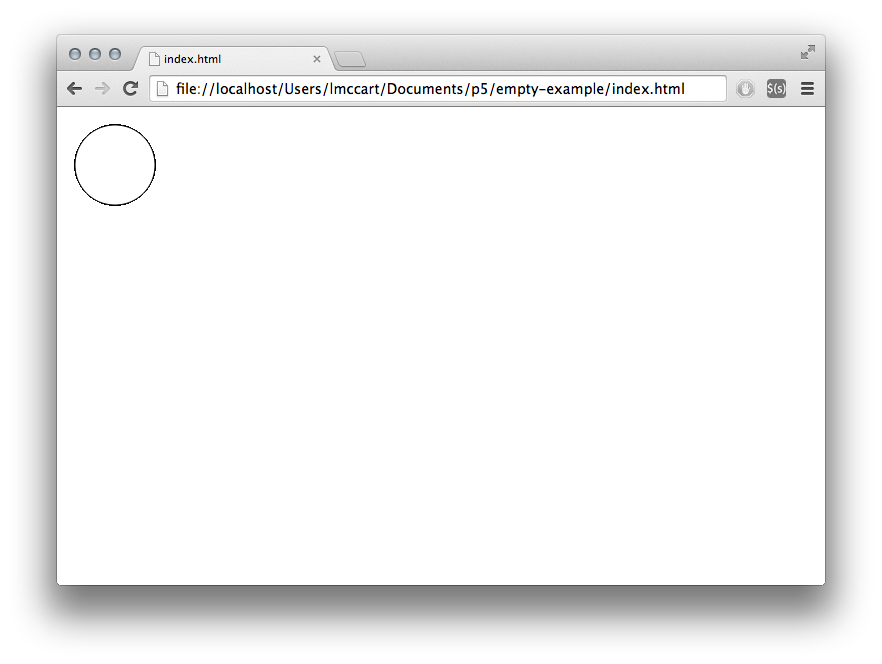
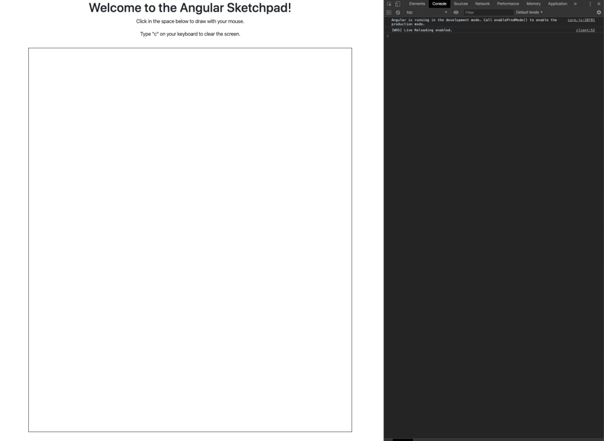

# 使用 Angular 和 P5JS 创建一个素描板 

[原文链接](https://medium.com/angular-in-depth/creating-a-sketchpad-with-angular-and-p5js-e2834cf5b1f1)

[原作者:Andrew Evans](https://medium.com/@andrew_evans?source=post_page-----e2834cf5b1f1----------------------)

译者:[尊重](https://www.zhihu.com/people/yiji-yiben-ming/posts)

时至今日，许多伟大的框架都通过软件提供了动画和绘画的能力。最近，我一直在使用 [P5JS](https://p5js.org/) 进行一些开发工作，经过长时间地学习，我有一些经验想要分享给社区，希望可以帮到其他开发者。

本文将会介绍如何使用 P5JS 构建一个 Angular 项目：

- 如何基于 Angular 搭建一个基本的素描板
- 如何于 Angular 项目中使用 P5JS 中有趣的功能

下面是将作为 demo 的应用的视频：

[video demo](https://youtu.be/gJ50_FGEeKA)

虽然本文中我是使用 Angular 作为框架，但是 P5JS 并不限定于任何一个 JavaScript 框架。我选择Angular 的原因只是我是 Angular 忠实粉丝。

本文的所有代码都在这个 [github project](https://github.com/andrewevans0102/angular-sketchpad) 中。我推荐你将项目通过 `git clone` 命令下载下来以便 follow 本文的节奏。

除此之外，本文所提及的 demo 同样也制作了完整的 `stackblitz`， [地址在此](https://stackblitz.com/edit/angular-sketchpad1)

## 什么是 P5JS

P5JS是一个 JavaScript 库，作为 [Processing project](https://processing.org/) 的继承人而构建（该项目最初由 MIT 的 [Casey Reas](https://en.wikipedia.org/wiki/Casey_Reas) 和 [Ben Fry](https://en.wikipedia.org/wiki/Ben_Fry) 启动）。
”Processing“ 是指可以直接与项目进行交互（或创建）的语言和编辑器。
”Processing“ 语言是 Java，但是除了 Java 之外还有一些其他语言的版本。
”Processing“ 语言处于媒体库的顶端，其许多核心功能通常来说都比较难用。
”Processing“ 帮助那些对技术不熟悉的艺术家群体构建超赞的图像作品和艺术品。

> “Processing” refers to the language and the editor that you can use to directly interact with (and create) projects. The “Processing” language is Java, but there are additional versions in different languages. The Processing Language sits on top of media libraries, and a lot of core functionality that was traditionally very hard to work with. Processing makes it easier for Artists and people not as familiar with technical stacks, to build really awesome graphical displays and artwork.



"processing" 的网站包含了许多特别棒的[指引内容](https://processing.org/tutorials/),基本覆盖了从0开始构造高端艺术品的全过程。”Processing“ 语言支持视觉和听觉元素。

我第一次接触 ”Processing“ 还是在攻读计算机科学硕士的时候，那会我使用了 `processing` 构建了一个自定义的 Photoshop 实现和其他一些项目。

P5JS 是 `processing` 的 JavaScript 版本，具有和其他的 `Processing language` 一样的功能。

在本文中，只会专注于 P5JS 的内容，但是我强烈推荐你阅读 `Processing` 的网站及其相关的文档，相信我，你会获益良多。

`Processing` 和 `P5JS` 均围绕两个方法构建：

> 你也可以使用其他方法捕获应用的某些阶段（比如，应用加载之前）。

- `setup` 方法用于创建应用并进行初始化操作。
- `draw` 方法则作为应用页面不断被调用，并重绘屏幕。

在 `P5JS` 中，这两个方法如下所示：

```javascript
function setup() {
  createCanvas(640, 480);
}
 
function draw() {
  ellipse(50, 50, 80, 80);
}
```

上述代码非常简单，其创造了一个 640px * 480px 的 canvas 并在其中画了一个椭圆。

上述代码的展示效果如下：



坦白地说，上述代码只是从 [P5JS getting started Page](https://p5js.org/get-started/) 复制而来。很简单的代码，但是将 `P5JS` 的工作方式介绍得很清楚。

## 如何开始

使用 `P5JS` 并不困难，你只需要一个 HTML 文件并复制一份 P5JS 库。[基础页面](https://p5js.org/get-started/) 包含了基础设置的例子。
正如我之前所说，本文将使用 Angular 构建项目。基于 Angular 项目的创建过程会多出额外的几步操作，但是并不复杂。

你可以按照我在后文中展示的步骤操作，并参考 github上 的源码以了解其的“最终形态”。

首先，使用 Angular CLI 的 `ng new` 指令创建一个新项目，并默认启用路由。

初始化 ”hello world“ 项目后，使用下述指令创建两个组件：

```bash
ng g c home-page
ng g c page-not-found
```

并在 `app-routing.module` 文件中配置基本的路由参数：

```typescript
import { NgModule } from '@angular/core';
import { Routes, RouterModule } from '@angular/router';
import { HomePageComponent } from './home-page/home-page.component';
import { PageNotFoundComponent } from './page-not-found/page-not-found.component';
 
const routes: Routes = [
  { path: 'home-page', component: HomePageComponent },
  { path: '', redirectTo: '/home-page', pathMatch: 'full' },
  { path: '**', component: PageNotFoundComponent }
];
 
@NgModule({
  imports: [RouterModule.forRoot(routes)],
  exports: [RouterModule]
})
export class AppRoutingModule {}
```

上述代码中，只是将项目的默认页面配置为 `home-page`, 并使用 `page-not-found` 页面捕获其他非路由页面。

现在使用下述指令安装 `P5JS`：

```bash
npm i p5
```

你可以选择使用 `bootstrap` 进行样式处理

```bash
npm i bootstrap
```

在安装完 `bootstrap` 后，你还需要将下述代码添加到 Angular 项目的 `styless.scss` 文件中确保 Angular 可以正确识别 `bootstrap`

```scss
@import '~bootstrap/dist/css/bootstrap.css';
```

现在，一切准备就绪，我们可以创建素描板组件了！

## 素描板

现在，应用中包含两个组件 `home-page` 和 `page-not-found`。当我们完成对素描板的构造后，成品效果如下图所示：



开始之前，我们首先需要定义一个素描板。
首先在 `home-page` 组件内将下述代码添加到 `ngOnInit` 钩子函数中：

```typescript
// this sketch was modified from the original
// https://editor.p5js.org/Janglee123/sketches/HJ2RnrQzN
const sketch = s => {
  s.setup = () => {
    let canvas2 = s.createCanvas(s.windowWidth - 200, s.windowHeight - 200);
    // creating a reference to the div here positions it so you can put things above and below
    // where the sketch is displayed
    canvas2.parent('sketch-holder');
 
    s.background(255);
    s.strokeWeight(this.sw);
 
    this.c[0] = s.color(148, 0, 211);
    this.c[1] = s.color(75, 0, 130);
    this.c[2] = s.color(0, 0, 255);
    this.c[3] = s.color(0, 255, 0);
    this.c[4] = s.color(255, 255, 0);
    this.c[5] = s.color(255, 127, 0);
    this.c[6] = s.color(255, 0, 0);
 
    s.rect(0, 0, s.width, s.height);
 
    s.stroke(this.c[this.strokeColor]);
  };
 
  s.draw = () => {
    if (s.mouseIsPressed) {
      if (s.mouseButton === s.LEFT) {
        s.line(s.mouseX, s.mouseY, s.pmouseX, s.pmouseY);
      } else if (s.mouseButton === s.CENTER) {
        s.background(255);
      }
    }
  };
 
  s.mouseReleased = () => {
    // modulo math forces the color to swap through the array provided
    this.strokeColor = (this.strokeColor + 1) % this.c.length;
    s.stroke(this.c[this.strokeColor]);
    console.log(`color is now ${this.c[this.strokeColor]}`);
  };
 
  s.keyPressed = () => {
    if (s.key === 'c') {
      window.location.reload();
    }
  };
};
 
this.canvas = new p5(sketch);
```

在第一部分，我们创建了一个 `sketch` 对象并对其定义了 `setup` 函数，如下所述:

```typescript
const sketch = s => {
  s.setup = () => {
    let canvas2 = s.createCanvas(s.windowWidth - 200, s.windowHeight - 200);
    // creating a reference to the div here positions it so you can put things above and below
    // where the sketch is displayed
    canvas2.parent('sketch-holder');
 
    s.background(255);
    s.strokeWeight(this.sw);
 
    this.c[0] = s.color(148, 0, 211);
    this.c[1] = s.color(75, 0, 130);
    this.c[2] = s.color(0, 0, 255);
    this.c[3] = s.color(0, 255, 0);
    this.c[4] = s.color(255, 255, 0);
    this.c[5] = s.color(255, 127, 0);
    this.c[6] = s.color(255, 0, 0);
 
    s.rect(0, 0, s.width, s.height);
 
    s.stroke(this.c[this.strokeColor]);
  };
```

上述代码创建了一个 对 HTML `canvas` 对象的引用，该 `canvas` 对象将承载我们的素描板。
除了使用 `canvas`之外，还可以可以使用 `audio` 标签 和 `video` 标签作为拓展。

后续，我调用了一些绘制方法：

绘制方法定义了素描板的形态：使用矩形作为 canvas 的边框，设置背景色，`stroke` 通知 `processing` 对 canvas 基于配置参数进行一次绘制操作。
描述颜色的数组被用于判定在屏幕上使用的颜色。

绘画方法的调用方式如下所示：

```
s.draw = () => {
  if (s.mouseIsPressed) {
    if (s.mouseButton === s.LEFT) {
      s.line(s.mouseX, s.mouseY, s.pmouseX, s.pmouseY);
    } else if (s.mouseButton === s.CENTER) {
      s.background(255);
    }
  }
};
```

上述代码使用了 `P5JS` 内建的事件监听器 `mouseIsPressed` 和 `mouseButton` 决定应用的表现。`P5JS` 最棒的部分是帮开发者封装了所有事件监听器。因此，你不再需要自己构建事件和监听操作，而是直接调用 `P5JS` 的 API 并定义之即可。

素描板还包括其他一些事件监听器，如下所示：

```typescript
s.mouseReleased = () => {
  // modulo math forces the color to swap through the array provided
  this.strokeColor = (this.strokeColor + 1) % this.c.length;
  s.stroke(this.c[this.strokeColor]);
  console.log(`color is now ${this.c[this.strokeColor]}`);
};
 
s.keyPressed = () => {
  if (s.key === 'c') {
    window.location.reload();
  }
};
```

上述代码中，素描板添加了对 `mouseReleased` 和 `keyPressed` 事件的实现。

最终，我们完成了对素描板的全部定义内容，并将其赋值给一个变量提供在 Angular 模板中使用。

```typescript
this.canvas = new p5(sketch);
```

最核心的部分已经完成了，现在让我们完善一下模板和样式文件，实现素描板的全部内容。

## 完成素描板

向 `home-page` 组件的模板文件中添加如下内容：

```html
<div class="container">
  <div class="row">
    <div class="col">
      <h1>Welcome to the Angular Sketchpad!</h1>
    </div>
  </div>
  <div class="row">
    <div class="col">
      <p>Click in the space below to draw with your mouse.</p>
      <p>Type "c" on your keyboard to clear the screen.</p>
    </div>
  </div>
  <div class="row">
    <div class="col">
      <div class="sketch-container">
        <div id="sketch-holder"></div>
      </div>
    </div>
  </div>
</div>
```

向 `styles.scss` 文件中添加如下样式：

```
body {
  height: 100%;
}

body {
  margin: 0;
  display: flex;
  flex-direction: column;

  /* This centers our sketch horizontally. */
  justify-content: center;

  /* This centers our sketch vertically. */
  align-items: center;
}
```

上述样式文件用于将素描本位置居中。

最后的最后，一切就绪。
运行 `npm run start` 命令，就可以在浏览器中看到一个基本的素描板了。

## 回顾

本文中，我们首先介绍了 P5JS JavaScript 库，之后介绍了如何使用 Angular 构建一个基本的素描板应用。
P5JS 库和 Processing 语言都非常有趣，我强烈推荐读者去了解其相关项目和文档。
如果你对 Processing 项目感兴趣，可以去丰富且友善的 Processing 社区查询视频和技术博客。

希望本文对你有所帮助。

