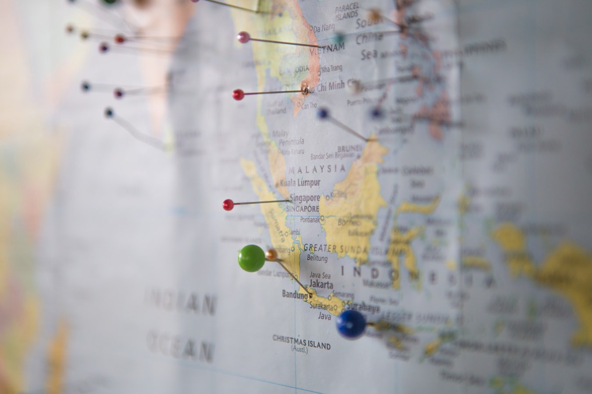

# GoogleMap 现在也是 Angular 组件了

[原文链接](https://medium.com/angular-in-depth/google-maps-is-now-an-angular-component-821ec61d2a0)

[原作者:Tim Deschryver](https://medium.com/@timdeschryver?source=post_page-----821ec61d2a0----------------------)

译者:[尊重](https://www.zhihu.com/people/yiji-yiben-ming/posts)

