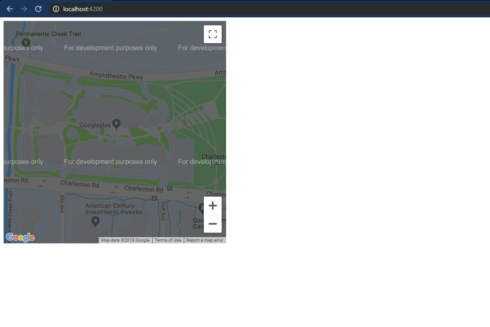
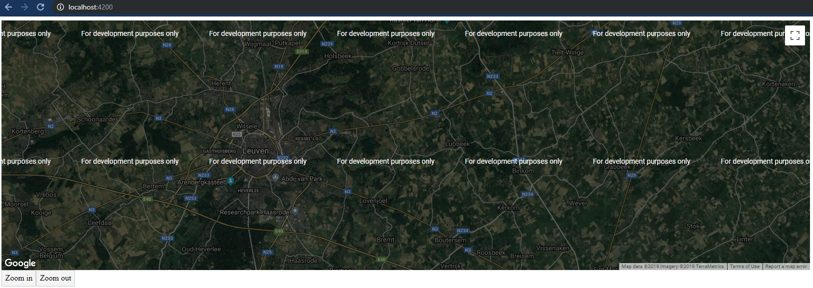
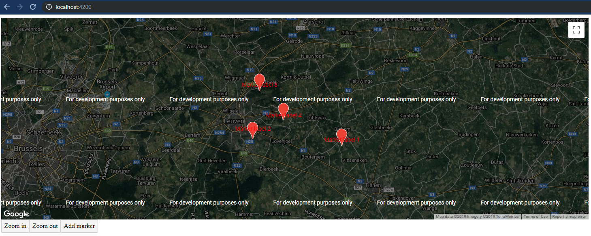

# GoogleMap 现在也是 Angular 组件了

[原文链接](https://medium.com/angular-in-depth/google-maps-is-now-an-angular-component-821ec61d2a0)

[原作者:Tim Deschryver](https://medium.com/@timdeschryver?source=post_page-----821ec61d2a0----------------------)

译者:[尊重](https://www.zhihu.com/people/yiji-yiben-ming/posts)


Angular V9.0.0 -rc.0 版本官宣了第二个官方组件 `@angular/component` - 对 Google Map 进行官方封装的地图组件。在本文中，我们将从0开始了解 `Google Maps Component`。

> 今年的早些时候，Angular 官方将原先 `angular/material` 的 repo 名称修改为了 `angular/component`,这一做法的目的是强调其目标并不仅仅是 `Material Design Component`。在 V9.0.0 版本中就包含了项目组的决意 -  一个以易用为基本考量封装的 [Google Maps JavaScript API](https://developers.google.com/maps/documentation/javascript/tutorial) Angular 组件。

我非常期待 Angular 项目组拓宽 `angular/Component` 仓库的范畴，创造出更多官方组件。而我们已经在 [v8.2.0](https://github.com/angular/components/releases/tag/8.2.0) 版本中看到了 [YouTube Player](https://github.com/angular/components/tree/master/src/youtube-player) 组件。

对现有 JavaScript API 的封装集成有助于提高开发者的工作效率，非常期待在未来有更多的官方组件发布。

## Setup Angular

Google Maps 模块可以通过 `@angular/google-maps` 安装:

```bash
npm install @angular/google-maps
```

安装完成后，我们需要将 `GoogleMapsModule` 添加到 `AppModule` 的 `import` 声明中：

```typescript
import { BrowserModule } from '@angular/platform-browser'
import { NgModule } from '@angular/core'
import { GoogleMapsModule } from '@angular/google-maps'
import { AppComponent } from './app.component'
@NgModule({
  declarations: [AppComponent],
  imports: [BrowserModule, GoogleMapsModule],
  providers: [],
  bootstrap: [AppComponent],
})
export class AppModule {}
```

`GoogleMapsModule` 导出了供使用的组件：

- `GoogleMap`: 对 `GoogleMap` 的封装，通过 `google-map` 选择器进行调用。
- `MapMarker`: 用于在地图上添加标记，通过 `map-marker` 选择器进行调用。
- `MapInfoWindow`: 标记的信息窗口，通过 `map-info-window` 选择器进行调用。

## Loading the Maps Javascript API

在正式使用之前，我们还需要导入 Maps API。导入 API 的过程可以直接通过向 `index.html` 文件中添加脚本标签的方式实现。

```html
<!DOCTYPE html>
<html lang="en">
  <head>
    <meta charset="utf-8" />
    <title>Map</title>
    <base href="/" />
    <meta name="viewport" content="width=device-width, initial-scale=1" />
    <link rel="icon" type="image/x-icon" href="favicon.ico" />
    <script src="https://maps.googleapis.com/maps/api/js?key=YOUR_API_KEY"></script>
  </head>
  <body>
    <app-root></app-root>
  </body>
</html>
```

如果在正式的产品环境中使用 Google Map，还需要创建一个 API key，阅读[此文档](https://developers.google.com/maps/documentation/javascript/get-api-key)了解如何创建一个 API key。

## Usage GoogleMap

通过将 Google Maps 组件添加到模板中的方式，我们已经可以在开发环境中看到和使用 Google Map 。默认情况下的 Map 组件只包含基本的默认功能，比如 放大/缩小和拖拽。

```html
<google-map></google-map>
```



## Input properties

我们可以使用 `@Input()` 属性自定义默认地图的样式。最常用的属性已经被作为 `@Input` 属性添加到地图组件中了，我们可以设置地图的大小，设置地图的中心点以及地图的缩放级别。

| Property  | Description                                                                                                                          |
| --------- | ------------------------------------------------------------------------------------------------------------------------------------ |
| `height`  | Sets the initial height                                                                                                              |
| `width`   | Sets the initial width                                                                                                               |
| `center`  | Sets the initial center                                                                                                              |
| `zoom`    | Sets the initial zoom                                                                                                                |
| `options` | Sets the options, for more info see the [docs](https://developers.google.com/maps/documentation/javascript/reference/map#MapOptions) |

如果希望全面使用 Google Maps 的 API，可以使用 `options` 属性进行控制。使用显示的属性要优于使用隐式的 `options` 属性。需要注意 `options` 属性拥有 typescript 接口 [Map Options interface](https://developers.google.com/maps/documentation/javascript/reference/map#MapOptions)

```typescript
export class AppComponent implements OnInit {
  zoom = 12
  center: google.maps.LatLngLiteral
  options: google.maps.MapOptions = {
    mapTypeId: 'hybrid',
    zoomControl: false,
    scrollwheel: false,
    disableDoubleClickZoom: true,
    maxZoom: 15,
    minZoom: 8,
  }

  ngOnInit() {
    navigator.geolocation.getCurrentPosition(position => {
      this.center = {
        lat: position.coords.latitude,
        lng: position.coords.longitude,
      }
    })
  }

  zoomIn() {
    if (this.zoom < this.options.maxZoom) this.zoom++
  }

  zoomOut() {
    if (this.zoom > this.options.minZoom) this.zoom--
  }
}
```



## Output properties

`GoogleMap` 组件将所有 Google Maps API 事件作为 `@Output()` 属性暴露出来：

| Property            | JavaScript API Method | Description                                                                                                                 |
| ------------------- | --------------------- | --------------------------------------------------------------------------------------------------------------------------- |
| `boundsChanged`     | `bounds_changed`      | This event is fired when the viewport bounds have changed                                                                   |
| `centerChanged`     | `center_changed`      | This event is fired when the map center property changes                                                                    |
| `mapClick`          | `click`               | This event is fired when the user clicks on the map                                                                         |
| `mapDblclick`       | `dblclick`            | This event is fired when the user double-clicks on the map. Note that the click event will also fire, right before this one |
| `mapDrag`           | `drag`                | This event is repeatedly fired while the user drags the map                                                                 |
| `mapDragend`        | `dragend`             | This event is fired when the user stops dragging the map                                                                    |
| `mapDragstart`      | `dragstart`           | This event is fired when the user starts dragging the map                                                                   |
| `headingChanged`    | `heading_changed`     | This event is fired when the map heading property changes                                                                   |
| `idle`              | `idle`                | This event is fired when the map becomes idle after panning or zooming                                                      |
| `maptypeidChanged`  | `maptypeid_changed`   | This event is fired when the mapTypeId property changes                                                                     |
| `mapMousemove`      | `mousemove`           | This event is fired whenever the user's mouse moves over the map container                                                  |
| `mapMouseout`       | `mouseout`            | This event is fired when the user's mouse exits the map container                                                           |
| `mapMouseover`      | `mouseover`           | This event is fired when the user's mouse enters the map container                                                          |
| `projectionChanged` | `projection_changed`  | This event is fired when the projection has changed                                                                         |
| `mapRightclick`     | `rightclick`          | This event is fired when the DOM contextmenu event is fired on the map container                                            |
| `tilesloaded`       | `tilesloaded`         | This event is fired when the visible tiles have finished loading                                                            |
| `tiltChanged`       | `tilt_changed`        | This event is fired when the map tilt property changes                                                                      |
| `zoomChanged`       | `zoom_changed`        | This event is fired when the map zoom property changes                                                                      |

在本文中描述上面表格中的每一个事件不太可能，所以本文中将使用 `click()` 事件作为一个例子。如果你对完整的事件感兴趣，我推荐你阅读完整的 [Google Maps API Docs](https://developers.google.com/maps/documentation/javascript/reference/map)，以及 Angular 对原生事件的[实现源码](https://developers.google.com/maps/documentation/javascript/reference/map)。

```html
<google-map (mapClick)="click($event)"></google-map>
```

```typescript
export class AppComponent implements OnInit {
  click(event: google.maps.MouseEvent) {
    console.log(event)
  }
}
```

## MapMarker Input Properties

当地图就位后，就可以在地图上添加 marker 了。只有 marker 被添加在 `google-map` 标签之内时才能正常使用，否则在地图上将看不到 marker。

就像 `MapControl`，大多数常用的选项都被直接设置为 `@Input()` 属性，但是也有可能通过设置 `options` 的方式更全面地控制 marker，`options` 同样拥有接口 [MapMarker](https://developers.google.com/maps/documentation/javascript/reference/marker)。

```html
<google-map>
  <map-marker
    *ngFor="let marker of markers"
    [position]="marker.position"
    [label]="marker.label"
    [title]="marker.title"
    [options]="marker.options"
  >
  </map-marker>
</google-map>
```

```typescript
export class AppComponent implements OnInit {
  addMarker() {
    this.markers.push({
      position: {
        lat: this.center.lat + ((Math.random() - 0.5) * 2) / 10,
        lng: this.center.lng + ((Math.random() - 0.5) * 2) / 10,
      },
      label: {
        color: 'red',
        text: 'Marker label ' + (this.markers.length + 1),
      },
      title: 'Marker title ' + (this.markers.length + 1),
      options: { animation: google.maps.Animation.BOUNCE },
    })
  }
}
```



marker 的完整 `@Input()` 属性包括：

| Property    | Description                                                                                                                                |
| ----------- | ------------------------------------------------------------------------------------------------------------------------------------------ |
| `title`     | Sets the title, visible on hover                                                                                                           |
| `position`  | Sets the position                                                                                                                          |
| `label`     | Sets the label                                                                                                                             |
| `clickable` | If the marker should listen to mouse and touch events, default is `true`                                                                   |
| `options`   | Sets the options, for more info see the [docs](https://developers.google.com/maps/documentation/javascript/reference/marker#MarkerOptions) |

### Output properties

`MapMarker` 组件同样将 Google Maps API 事件作为 `@Output` 属性暴露出来：

| Property           | JavaScript API Method | Description                                                           |
| ------------------ | --------------------- | --------------------------------------------------------------------- |
| `animationChanged` | `animation_changed`   | This event is fired when the marker's animation property changes      |
| `mapClick`         | `click`               | This event is fired when the marker icon was clicked                  |
| `clickableChanged` | `clickable_changed`   | This event is fired when the marker's cursor property changes         |
| `cursorChanged`    | `cursor_changed`      | This event is fired when the marker's cursor property changes         |
| `mapDblclick`      | `dblclick`            | This event is fired when the marker icon was double clicked           |
| `mapDrag`          | `drag`                | This event is repeatedly fired while the user drags the marker        |
| `mapDragend`       | `dragend`             | This event is fired when the user stops dragging the marker           |
| `draggableChanged` | `draggable_changed`   | This event is fired when the marker's draggable property changes      |
| `mapDragstart`     | `dragstart`           | This event is fired when the user starts dragging the marker          |
| `flatChanged`      | `flat_changed`        | This event is fired when the marker's flat property changes           |
| `iconChanged`      | `icon_changed`        | This event is fired when the marker icon property changes             |
| `mapMousedown`     | `mousedown`           | This event is fired for a mousedown on the marker                     |
| `mapMouseout`      | `mouseout`            | This event is fired when the mouse leaves the area of the marker icon |
| `mapMouseover`     | `mouseover`           | This event is fired when the mouse enters the area of the marker icon |
| `mapMouseup`       | `mouseup`             | This event is fired for a mouseup on the marker                       |
| `positionChanged`  | `position_changed`    | This event is fired when the marker position property changes         |
| `mapRightclick`    | `rightclick`          | This event is fired for a rightclick on the marker                    |
| `shapeChanged`     | `shape_changed`       | This event is fired when the marker's shape property changes          |
| `titleChanged`     | `title_changed`       | This event is fired when the marker title property changes            |
| `visibleChanged`   | `visible_changed`     | This event is fired when the marker's visible property changes        |
| `zindexChanged`    | `zindex_changed`      | This event is fired when the marker's zIndex property changes         |

> 完整的 API 文档在 [Google Maps API Docs](https://developers.google.com/maps/documentation/javascript/reference/marker)，以及 Angular 对原生事件的[实现源码](https://github.com/angular/components/blob/master/src/google-maps/map-marker/map-marker.ts#L46)。

## MapInfoWindow

最后要介绍的是 `MapInfoWindow`，用于在 marker 上弹出一个窗口的组件。为了展示弹出的窗口，需要在 `google-map` 的模板中添加如下代码：

```html
<map-info-window>Hello Google Maps</map-info-window>
```

上述代码不会产生任何效果，为了让 `info window` 显示出来，需要通过点击 `marker` ，联动打开 `info window`。通过将 `mapClick()` 事件绑定在 marker 上，并将 `marker` 的引用传递给对应的 `openInfo` 方法，这样就可以打开 `info window` 了。

```html
<map-marker
  #markerElem
  *ngFor="let marker of markers"
  [position]="marker.position"
  [label]="marker.label"
  [title]="marker.title"
  [options]="marker.options"
  (mapClick)="openInfo(markerElem)"
>
</map-marker>
```

最后，需要在组件中添加一个 `MapInfoWindow` 组件的引用，通过调用 [@ViewChild decorator](https://angular.io/api/core/ViewChild)即可实现。
此时已经拥有了对 info window 和 marker 的引用，就可以通过 `infoWindow.open()` 函数打开 info window 了。

```typescript
export class AppComponent implements OnInit {
  @ViewChild(MapInfoWindow, { static: false }) infoWindow: MapInfoWindow

  openInfo(marker: MapMarker, content) {
    this.infoWindow.open(marker)
  }
}
```

### Input properties

| Property  | Description                                                                                                                                         |
| --------- | --------------------------------------------------------------------------------------------------------------------------------------------------- |
| `options` | Sets the options, for more info see the [docs](https://developers.google.com/maps/documentation/javascript/reference/info-window#InfoWindowOptions) |

### OutPut properties

| Property          | JavaScript API Method | Description                                                                                     |
| ----------------- | --------------------- | ----------------------------------------------------------------------------------------------- |
| `closeclick`      | `closeclick`          | This event is fired when the close button was clicked                                           |
| `contentChanged`  | `content_changed`     | This event is fired when the content property changes                                           |
| `domready`        | `domready`            | This event is fired when the `<div>` containing the InfoWindow's content is attached to the DOM |
| `positionChanged` | `position_changed`    | This event is fired when the position property changes                                          |
| `zindexChanged`   | `zindex_changed`      | This event is fired when the InfoWindow's zIndex changes                                        |

### Methods and getters

通过使用 `infoWindow` 属性，我们拥有了对 `MapInfoWindow` 组件的引用，也就可以调用组件的下述方法和 getter 函数：

| Property      | Description                                                                                                                                                    |
| ------------- | -------------------------------------------------------------------------------------------------------------------------------------------------------------- |
| `close`       | Closes this InfoWindow by removing it from the DOM structure                                                                                                   |
| `getContent`  | Returns the content of the InfoWindow                                                                                                                          |
| `getPosition` | Returns the position of the InfoWindow                                                                                                                         |
| `getZIndex`   | Returns the z-index of the InfoWindow                                                                                                                          |
| `open`        | Opens the MapInfoWindow using the provided MapMarker as the anchor. If the anchor is not set, then the position property of the options input is used instead. |

### Dynamic content

总是在 `info window` 中放置静态内容显得有点呆板。可以使用模板变量的方式向 `info window` 中插入动态内容，如下所示：

```html
<map-info-window>{{ infoContent }}</map-info-window>
```

```typescript
export class AppComponent implements OnInit {
  @ViewChild(MapInfoWindow, { static: false }) infoWindow: MapInfoWindow
  infoContent = ''

  openInfo(marker: MapMarker, content) {
    this.infoContent = content
    this.infoWindow.open(marker)
  }
}
```

> 完整的 API 文档在 [Google Maps API Docs](https://developers.google.com/maps/documentation/javascript/reference/info-window)，以及 Angular 对原生事件的[实现源码](https://github.com/angular/components/blob/master/src/google-maps/map-info-window/map-info-window.ts#L35)。

## Putting it together

即将到来的 Angular 新版本带给开发者许多全新的改变。我们可能已经期待 Ivy 许久，但除此之外 `@angular/components` 也值得期待。

除了新的 `MapComponent` 之外，Angular 项目组还将剪贴板的 API 融合到了 Angular CDK 中，
你可以在[这篇文章](https://timdeschryver.dev/posts/use-the-new-angular-clipboard-cdk-to-interact-with-the-clipboard)中一探究竟。

因为官方 Angular Component 还是一个新生儿，所以还请谅解当前阶段文档和例子的匮乏。不过，因为对 Map 组件的实现都遵从了 Google Maps API 标准，所以开发者可以从[Google Map 的 JavaScript API 文档中](https://developers.google.com/maps/documentation/javascript/tutorial)获取相关信息。

下述代码包含了本文中全部相关内容：

```html
<google-map
  height="500px"
  width="100%"
  [zoom]="zoom"
  [center]="center"
  [options]="options"
  (mapClick)="click($event)"
>
  <map-marker
    #markerElem
    *ngFor="let marker of markers"
    [position]="marker.position"
    [label]="marker.label"
    [title]="marker.title"
    [options]="marker.options"
    (mapClick)="openInfo(markerElem, marker.info)"
  >
  </map-marker>

  <map-info-window>{{ infoContent }}</map-info-window>
</google-map>

<button (click)="zoomIn()">Zoom in</button>
<button (click)="zoomOut()">Zoom out</button>
<button (click)="logCenter()">Log center</button>
<button (click)="addMarker()">Add marker</button>
```

```typescript
import { Component, OnInit, ViewChild } from '@angular/core'
import { MapInfoWindow, MapMarker, GoogleMap } from '@angular/google-maps'

@Component({
  selector: 'app-root',
  templateUrl: './app.component.html',
  styleUrls: ['./app.component.css'],
})
export class AppComponent implements OnInit {
  @ViewChild(GoogleMap, { static: false }) map: GoogleMap
  @ViewChild(MapInfoWindow, { static: false }) info: MapInfoWindow

  zoom = 12
  center: google.maps.LatLngLiteral
  options: google.maps.MapOptions = {
    zoomControl: false,
    scrollwheel: false,
    disableDoubleClickZoom: true,
    mapTypeId: 'hybrid',
    maxZoom: 15,
    minZoom: 8,
  }
  markers = []
  infoContent = ''

  ngOnInit() {
    navigator.geolocation.getCurrentPosition(position => {
      this.center = {
        lat: position.coords.latitude,
        lng: position.coords.longitude,
      }
    })
  }

  zoomIn() {
    if (this.zoom < this.options.maxZoom) this.zoom++
  }

  zoomOut() {
    if (this.zoom > this.options.minZoom) this.zoom--
  }

  click(event: google.maps.MouseEvent) {
    console.log(event)
  }

  logCenter() {
    console.log(JSON.stringify(this.map.getCenter()))
  }

  addMarker() {
    this.markers.push({
      position: {
        lat: this.center.lat + ((Math.random() - 0.5) * 2) / 10,
        lng: this.center.lng + ((Math.random() - 0.5) * 2) / 10,
      },
      label: {
        color: 'red',
        text: 'Marker label ' + (this.markers.length + 1),
      },
      title: 'Marker title ' + (this.markers.length + 1),
      info: 'Marker info ' + (this.markers.length + 1),
      options: {
        animation: google.maps.Animation.BOUNCE,
      },
    })
  }

  openInfo(marker: MapMarker, content) {
    this.infoContent = content
    this.info.open(marker)
  }
}
```
