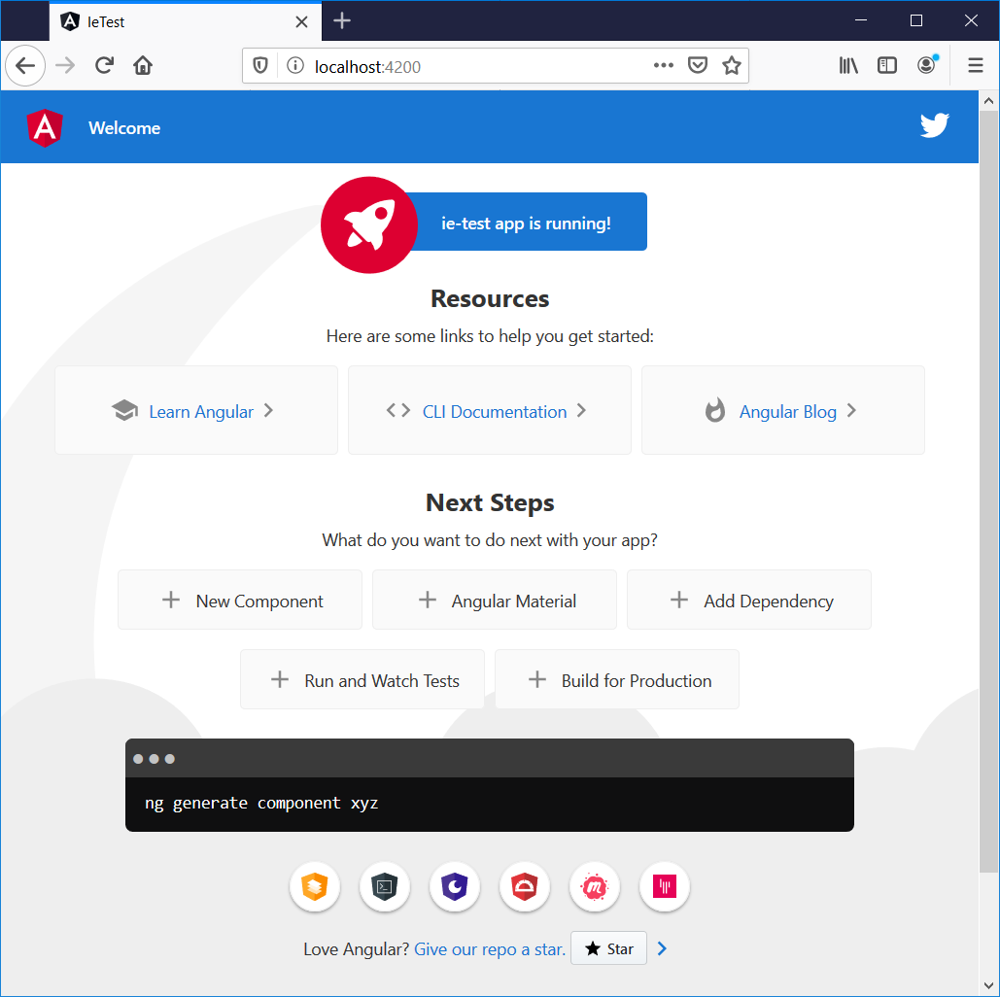
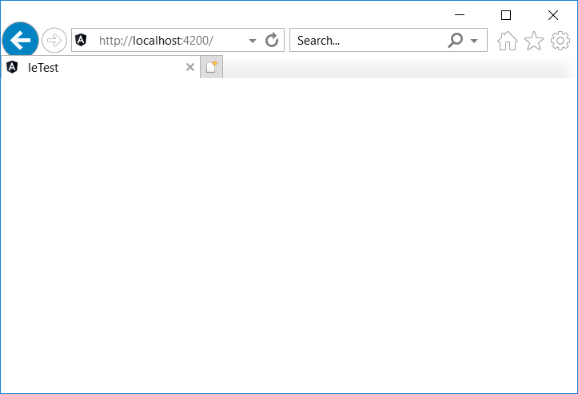
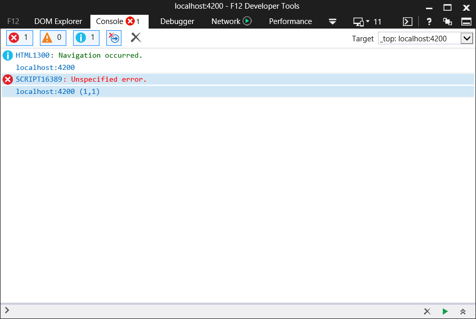
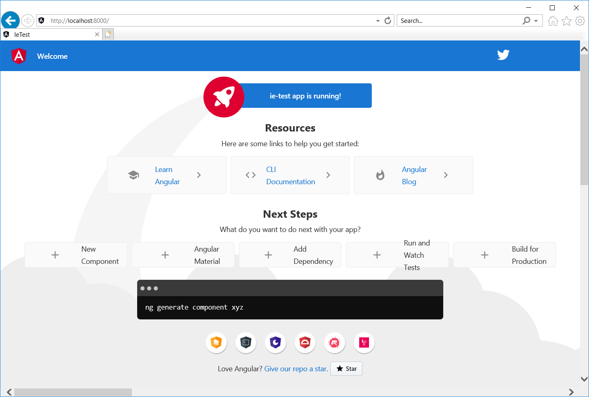
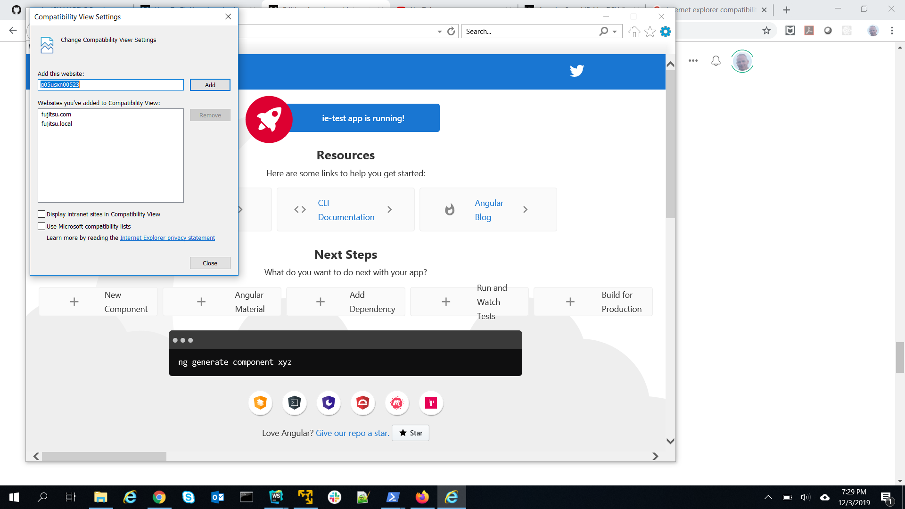

# Angular 与 IE浏览器

Angular 8 和 Angular 9 支持 IE 浏览器的解决方案

[原文链接](https://medium.com/angular-in-depth/angular-and-internet-explorer-a6e4b5a5dae1)

[原作者:Todd Palmer](https://medium.com/@palmer_todd?source=post_page-----a6e4b5a5dae1----------------------)

译者:[尊重](https://www.zhihu.com/people/yiji-yiben-ming/posts)


本文将陈述如何让 Angular 8.x 和 Angular 9.x 应用支持在 IE 浏览器上使用的解决方案。如果你希望在让老版本的 Angular 应用支持 IE 浏览器，可以阅读我的[之前发布的相关文章](https://medium.com/angular-in-depth/angular-and-internet-explorer-5e59bb6fb4e9)

本文将讨论以下话题：

- 使用 Angular CLI 创建一个基本的 Angular 应用
- IE 浏览器运行 Angular 应用时的错误
- 在 **Production** 模式下，如何确保 Angular 应用支持 IE 浏览器
- 在 **Development** 模式下，如何确保 Angular 应用支持 IE 浏览器

如果你只想知道如何让 Angular 应用正常地运行于 IE 浏览器中，你可以直接下拉页面到 **The Cure** 部分阅读，如果你还想了解其背后的相关细节，则请继续阅读下文。

## Getting Started

首先，使用 Angular CLI 创建并伺服一个 demo 应用：

```bash
ng new ie-test
cd ie-test
ng serve
```

打开除了 IE 之外的任何一个浏览器并指向 `http://localhost:4200` 地址，你都会看到一个熟悉的的 Angular 起始页面。比如。在 FireFox 浏览器中，你会看到如下页面：



## The Symptom

但如果我们打开 IE 浏览器并定位到同样的地址，你会看到如下结果:



事实上，只有有一些东西正常运作了，比如 tab 页面的 title 标签是正确的。此时，我们打开浏览器控制台并重载页面，我们看到一个异常 **Unspecified error** 。



## The Cure

为了让 IE 浏览器也可以正常工作，我们需要执行以下步骤：

1. 在 **polyfill.ts** 文件中反注释一些引入描述
2. 安装一些 **npm** 包
3. 修改 **browserslist** 文件

下面是每一个步骤的详细内容。

### Polyfill imports

首先打开 polyfills 文件 `ie-test\src\polyfills.ts`。
文件中包含两行注释过的代码，需要将其反注释：

```typescript
// import 'classlist.js';  // Run `npm install --save classlist.js`.
// import 'web-animations-js';  // Run `npm install --save web-animations-js`.
```

### Install npm packages

注意到上述反注释的内容中包含两句包安装的指令，因此需要执行：

```bash
npm install --save classlist.js
npm install --save web-animations-js
```

### Modify browserslist

打开 browserlist 文件 `ie-test\browserslist`。
通过 Angular CLI 创建的默认 browserlist 文件如下所示：

```
# This file is used by the build system to adjust CSS and JS output to support the specified browsers below.
# For additional information regarding the format and rule options, please see:
# https://github.com/browserslist/browserslist#queries

# You can see what browsers were selected by your queries by running:
#   npx browserslist

> 0.5%
last 2 versions
Firefox ESR
not dead
not IE 9-11 # For IE 9-11 support, remove 'not'.
```

你需要做的是修改上述文件内容的最后一行，移除 `not`，移除后的最后一行内容看起来是：

```
IE 9-11 # For IE 9-11 support, remove 'not'.
```

## Production 模式下的 IE 浏览器

现在，在 `ng serve` 指令下生成的应用仍然无法在 IE 浏览器中运行。还需要进行一些操作。

但是，如果你的目标仅仅是在 Production 模式下应用可以在 IE 浏览器中正常运行，上述操作就已经足够了。只需要构建一个 Production 的应用包并在 **dist/ie-test** 文件夹中启动一个 web 服务就可以证明。

```bash
ng build --prod
```

需要注意的是，当你运行构建命令时，将会生成 **ES5 bundles**：

```bash
$\ie-test> ng build --prod
Generating ES5 bundles for differential loading...
ES5 bundle generation complete.
chunk {0} runtime-es2015.edb2fcf2778e7bf1d426.js (runtime) 1.45 kB [entry] [rendered]
chunk {0} runtime-es5.edb2fcf2778e7bf1d426.js (runtime) 1.45 kB [entry] [rendered]
chunk {2} polyfills-es2015.2987770fde9daa1d8a2e.js (polyfills) 36.4 kB [initial] [rendered]
chunk {3} polyfills-es5.ef4b1e1fc703b3ff76e3.js (polyfills-es5) 123 kB [initial] [rendered]
chunk {1} main-es2015.77c5c44e21b70d1ec41a.js (main) 169 kB [initial] [rendered]
chunk {1} main-es5.77c5c44e21b70d1ec41a.js (main) 190 kB [initial] [rendered]
chunk {4} styles.3ff695c00d717f2d2a11.css (styles) 0 bytes [initial] [rendered]
Date: 2019-12-03T23:28:06.809Z - Hash: 89a94328c69b68370cb8 - Time: 43148ms
```

现在就可以启用一个 web 服务来测试了。举例来说，我通过 `npx` 使用 [local-web-server](local-web-server) 启动 web 服务。

> 如果你还没有使用过 **npx**, 可以阅读 [Kat Marchán](https://medium.com/u/6a658354eb94?source=post_page-----a6e4b5a5dae1----------------------)的相关文章：[Introducing npx: an npm package runner](https://medium.com/@maybekatz/introducing-npx-an-npm-package-runner-55f7d4bd282b)

在完成 Production 模式的构建后，运行：

```bash
cd .\dist\ie-test\
npx local-web-server
```

现在，在 IE 浏览器中打开 Angular 应用，可以看到如下结果



**注意**

如果你还是无法在 IE 浏览器正常地看到应用，你需要在 IE 浏览器中将 **Compatibility View Settings** 设置中的 **Display intranet sites in Compatibility View** 配置关闭。



## Internet Explorer in Development

此时，如果你使用 `ng serve` 命令，仍然会在 IE 浏览器中看到一个空白的页面。因为 `ng serve` 不会自动生成 **ES5 bundle** 。

修复这个问题有两种方法：

1. 修改 tsconfig.json 文件
2. 创建一个 ES5 配置文件

###  Modify tsconfig.json 

tsconfig.json 文件在 Angular 项目工作区的根目录下。打开文件：

```json
{
  "compileOnSave": false,
  "compilerOptions": {
    "baseUrl": "./",
    "outDir": "./dist/out-tsc",
    "sourceMap": true,
    "declaration": false,
    "downlevelIteration": true,
    "experimentalDecorators": true,
    "module": "esnext",
    "moduleResolution": "node",
    "importHelpers": true,
    "target": "es2015",
    "typeRoots": [
      "node_modules/@types"
    ],
    "lib": [
      "es2018",
      "dom"
    ]
  },
  "angularCompilerOptions": {
    "fullTemplateTypeCheck": true,
    "strictInjectionParameters": true
  }
}
```

上述配置中， `target: es2015` 代表着文件将被编译为 es2015，而我们需要将其修改为 ES5。

```json
"target": "es5",
```

现在再重新运行 `ng serve`，打开 IE 浏览器，你会发现在 development 模式下应用可以正常展示了。

### Creating an ES5 Configuration

如果你喜欢直接修改 tsconfig.json 的方式，那也可以创建一个 ES5 配置文件确保 IE 浏览器和 `ng serve` 一起使用。

本文中我不会详细介绍这部分的内容，如果你对此感兴趣，可以阅读 [Ali Kamalizade](https://medium.com/u/3a534b5053e6?source=post_page-----a6e4b5a5dae1----------------------) 的相关文章 [How To Fix Your Angular App When It’s Not Working in IE11](https://medium.com/better-programming/how-to-fix-your-angular-app-when-its-not-working-in-ie11-eb24cb6d9920)

## Summary

只要开发者知道 **polyfills.ts** 和 **browserslist** 文件的相关内容，让 Angular 适配 IE 并不困难。