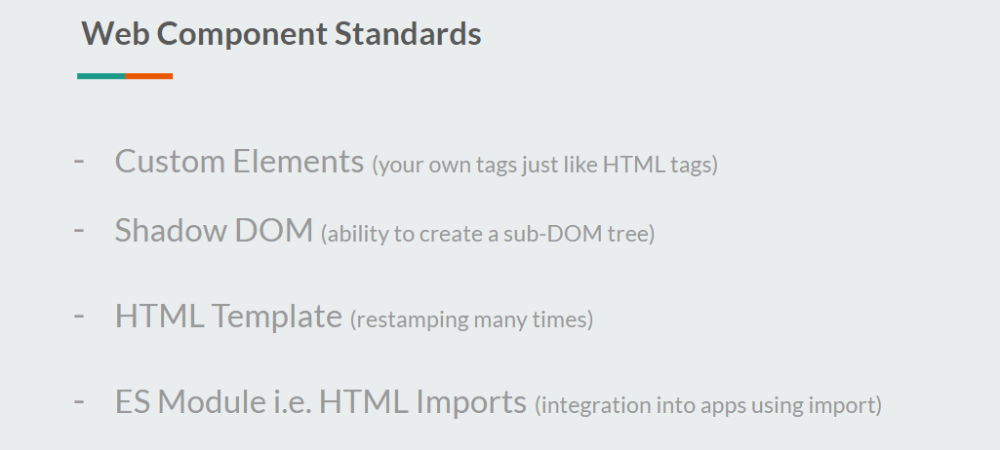
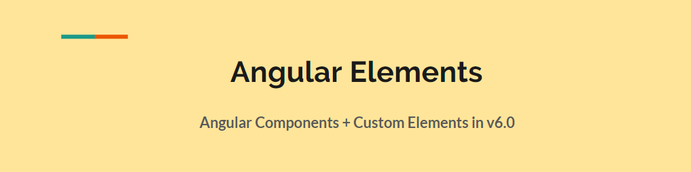
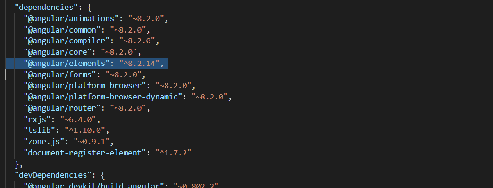
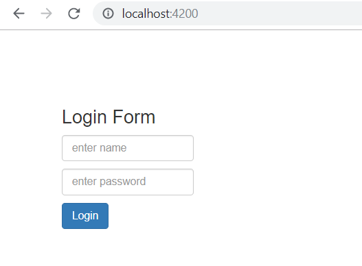
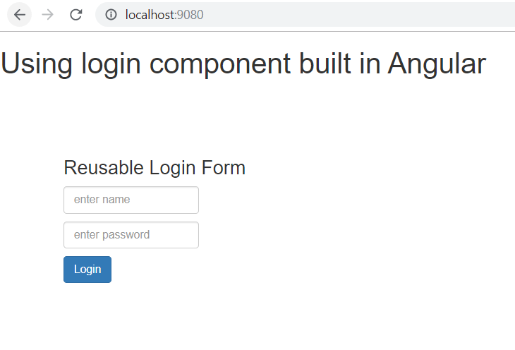
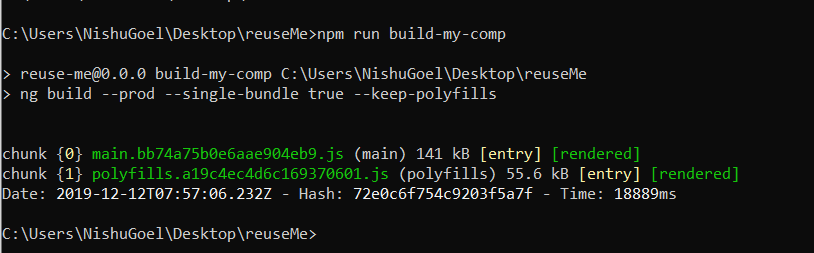
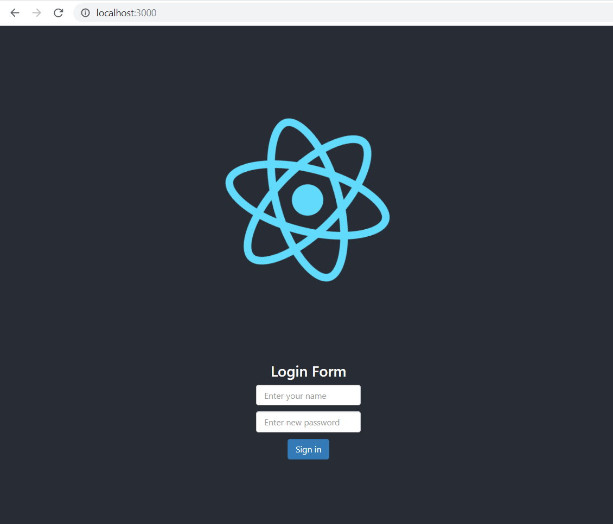

# 使用 Angular 打造框架无关的 web 组件

[原文链接](https://medium.com/angular-in-depth/creating-framework-agnostic-web-components-with-angular-6cc6466d5c06)

[原作者:Todd Palmer](https://medium.com/@nishu0505?source=post_page-----6cc6466d5c06----------------------)

译者:[尊重](https://www.zhihu.com/people/yiji-yiben-ming/posts)


稍等，框架无关的 Web Component？那是什么？
本文将通过一个实例来阐述 `框架无关的 Web Component` 的含义。

> 本文将分享以下内容：
> 
> Web Component 的需求
> 
> Web Component 的特性
> 
> 什么是 Angular Element
> 
> 如何使用 Angular Element 创建 Web Component
> 
> 如何将创建好的 Web Component 使用在基于原生 JavaScript/ React 或其他框架搭建的项目中。

我所在公司的的状况有点像是停车场，我不会持续投入在一个项目中，而是不断的交付许多短期的项目，这些项目就像是在停车场里来来往往的车辆。每个项目的技术选型则完全依据项目的要求决定。

这也就是说，一个开发人员可能会写七个月的 Angular 项目之后，再去写半年时间的 React/Vue 项目，而这样的状况会非常常见。

基于这样的状况，如果已经在使用 Angular 作为框架的项目中实现了一个 loader 组件，我肯定不会希望再为相似的需求只是框架选型不同再重写这一 loader 组件（比如以 React 的方式）。高可用性毫无疑问是每个开发者都会追求的部分。

希望上面的小故事可以帮助你理解，为什么我会选择 web compoennt 这一技术，而非对同一个功能进行多框架实现。

## Web components though?

那么到底什么是 Web Component 呢？

如果用尽可能通俗易懂的方式解释 Web Component - 通过任意的技术创建一个可重用的自定义元素，并通过该元素将相关功能运用于你的网页应用中。

MDN 文档中的对 Web Component 的描述如下：

> Web Components is a suite of different technologies allowing you to create reusable custom elements — with their functionality encapsulated away from the rest of your code — and utilize them in your web apps.

Web Component 最有趣的地方是，其只基于 web 标准工作，而不会涉及任何的第三方库。

明确了基本的概念，现在了解一下其内容。

就像我之前提到的，Web Component 遵循 Web 标准并依照这些标准工作。这些Web组件规范为：

- Custom Element
- Shadow DOM
- HTML Template
- ES Module i.e HTML Imports

以上每一个标准都可以独立使用。
为了在任意的框架/库/原生 JavaScript 中使用 Web compoennts, 需要将上述四种标准和通过已选框架所实现的希望重复使用的自定义元素结合起来。



下面让我们逐个了解这四个标准。

## Custom Element

Custom Element 允许开发者创建自定义的 HTML Tag，自定义的 HTML Tag 与原生的 HTML 元素无二，并包含其独有的行为表现。

可以通过如下方式创建一个 Custom ELement：

```
class MyElement extends HTMLElement {
  […]
}
customElements.define("my-element", MyElement);
```

如果你想了解更多有关 Custom Element 的知识，以及两种可创建的 Custom Element， 可以阅读[这个文档](https://developers.google.com/web/fundamentals/web-components/customelements)。

## Shadow DOM

Shadow DOM 是指自定义元素支持样式封装（Shadow DOM 不会与 DOM 中其他元素的 ID 和 class 冲突）。Shadow DOM 通过创建一个 Sub-DOM 的方式完成这种隔离。

Web Component 的元素作为原 DOM 元素的孩子插入进主 DOM，并拥有属于自己的封装样式。

通过使用 `<slot>` 元素作为 Custom Elemet 的占位符，封装才得以实现。
通过如下的方式，custom element 被添加到了一个 Sub-DOM 中：

```html
<section>
  <div>
    <slot></slot> //Content of the custom element gets placed here
  </div>
</section>


// Custom Element
<my-element>
  <button>Custom button</button>
</my-element>
```

如果你想了解更多有关 DOM API，Shadow DOM 和 slot 的内容，阅读这个[文档](https://developers.google.com/web/fundamentals/web-components/shadowdom)

## HTML Template

借助于 Web Component 的标准，web Component 可以在运行时再加载模板的内容。其背后技术并不复杂，只是借用了 `<template></template>` 标签的魔法而已。
放置于 `<template></template>` 中的内容可以在运行时渲染，并且可以通过 Js 语句克隆和插入。

在 JS 中获取到模板的标签之后，可以通过如下方法激活：

```javascript
var clonedObj = document.importNode(templateRef.content, true);
```

然后就可以将其作为子 DOM 树附加到 DOM 中。

## HTML Import i.e. ES Module Specification

本特性帮助开发者将自定义元素和不同的 JS 应用集成起来，下述代码描述了相关的使用脚本定义的接口。

```html
<script type=”module”>
import {example} from ‘@example/example’;
</script>
```

借助于上述的代码，才算可以将自定义 tag 用于我们的应用中：

```html
<example>…</example>
```

现在我们已经拥有了对 Web Component， custom Element， Shadow DOM 的基本理解。下面就借助 Angular 创建一个自定义元素，并将其运用于使用其他框架的项目中。

## 使用 Angular 创建一个 Web Component

从 Angular V6 版本之后，我们就可以将 Angular 组件转化为 web Component 并将其置于任何框架或 JavaScript 代码中使用了。

这一功能被封装为 [Angular Element](https://next.angular.io/guide/elements)。Angular Element 帮助开发者以创建 Angular Component 的方式同步创建 Web Component。

如果你希望更深入的了解 Angular Element，可以查看 [Rob Wormald](https://twitter.com/robwormald) 的相关演讲。



首先，我们需要安装 `@angular/elements`

```bash
ng add @angular/elements
```



```bash
npm install --save @webcomponents/webcomponentsjs
```

```typescript
import ‘@webcomponents/custom-elements/src/native-shim’;
import ‘@webcomponents/custom-elements/custom-elements.min’;
```

安装 `@angular/element` 的过程还会添加 polyfills 文件，polyfills 很轻量但是其对浏览器的支持也比较有限。
因此，上述代码中的两段 polyfills 最好手动启动，这样就可以避免在安装 `@angular/element` 时自动安装自带的 polyfills。

下面，让我们创建一个传统的 Angular 组件（将被用作 web Component）：

```typescript
@Component({
  templateUrl: './custom-elements.component.html',
  styleUrls: ['./custom-elements.component.scss']
})
export class ComponentName {
  title = 'custom-elements-demo';
}
```

选择器的名称将会作为 web-component 的名称。另外，你可能也想给它一个通用名称，因为该 web component 将是可复用组件。

下一步就是在应用的 module 中创建自定义元素。第一步是在 NgModule 中的 **entryComponents** 中声明组件。

> 注意，在 Angular V9 中，借助于Ivy，我们不再需要将 component 显示地指定为 entryComponent。

在 module 类中，一如下方是定义自定义 element component：

```typescript
 entryComponents: [CustomElementDemoComponent],

  })
  
  export class FeatureModule {
  constructor(private injector: Injector) {
  }

  ngDoBootstrap() {
      const customElement = createCustomElement(CustomElementDemoComponent, { injector: this.injector });
      customElements.define('custom-element', customElement);
  }
  }
```

在 module 中，通过使用 Angular Element 的 `createCustomElement` 方法，利用注入的服务将 Angular Component 包装为 web component。
`customElements.define` 方法将组件注册在浏览器上。
上述方法均执行于 `ngDoBootstrap` 方法中，因为该流程应当被手动启动，而不是由 Angular 引导数组启动。

```html
<custom-element></custom-element>
```

当上述动作完成后，就可以在任意的 Angular 组件模板中使用 `<custom-element>` 标签了。
为了确保 Angular 组件可以正确地识别自定义元素，我们还需要在 AppModule 的 NgModule 中，向 schemas 数组添加 **CUSTOM_ELEMENTS_SCHEMA**。

现在，自定义元素已经准备就绪，可以在任何 Angular 项目中直接使用。



### 等等，只能在 Angular 项目中使用吗？

不知你是否还记得，在本文的开头我提到过将会在跨框架 或 使用原生 JavaScript 搭建的应用中使用这些 web component。诚然，Angular 官方并不支持独立的用于 Angular 项目之外的 web component，但是通过非官方的方式，还是可以做到让 Angular element 用于 Angular 框架之外。

这里介绍一个社区项目，`npx-build-plus`。该项目允许开发者创建所需要的 polyfills 和 可选的 single-bundle 开关（用于创建对 web component 的 single bundle  以实现对外使用的功能）。

如果你对这个项目感兴趣，可以阅读[相关系列博客](https://www.softwarearchitekt.at/aktuelles/angular-elements-part-i/)。

现在将 `npx-build-plus` 加入到我们的 web component 项目中：

```bash
ng add ngx-build-plus
```

该指令将会更新 `angular.json` 文件中的 build target 为 ngx-build-plus:build，并更新相关的 polyfills 脚本。还记得我们之前需要手动向 web component 项目中添加 polyfills 文件吗？现在有了 ngx-build-plus,这一步可以省略啦，只要执行下述语句即可：

```bash
ng g ngx-build-plus:wc-polyfill
```

为了使用 single-bundle 标签，修改 package.json 文件中的构建 web component 的脚本：

```json
“build-my-comp”: “ng build --prod --single-bundle true --keep-polyfills”
```

默认情况下，single-bundle 标签默认设置为 false，因此我们需要在构建脚本中将其显示地声明为 true。
此时如果你直接通过 npm 运行 `build-my-comp` 指令，可能会遇到如下的错误信息

> Schema validation failed with the following errors: Data path “.budgets[1].type” should be equal to one of the allowed values.

为了解决这个问题，需要将 `angular.json` 文件中的下述内容移除：

```json
{
“type”: “anyComponentStyle”,
“maximumWarning”: “6kb”,
“maximumError”: “10kb”
}
```

解决完问题之后，就会得到一个 `main` bundle，并可以将其用于任何 JavaScript 项目或是 xx框架项目中（确保 polyfills 的正常使用）。

为了进行测试，创建一个demo项目，在 `index.html` 文件中包含下述内容：

```html
<script src=”main.js”></script> 
<body>
<custom-element></custom-element>
</body>
```

借助于 `static-server` 启动服务，打开浏览器的相关地址，你就会发现之前创建的 web component 运行在了一个非 Angular 的项目中。



现在，这个 web component 就可以用于任何框架中并已经足以发布了。

在通过 `npm run build-my-comp` 指令后，构建出的 web component 建包含在一个 bundle中，如下所示：



## 在 React 中使用创建的 web component

创建一个新的 React 项目，并在其 index.html 文件中加入 web component 的 `main.js` 脚本：

```
//Inside index.html

            <script src="https://unpkg.com/@nishugoel/prod-card@0.0.5/main.js"></script>
//Use the custom element in the App.js file  
            <prod-card username='Enter your name' password='Enter new password' btnname='Sign in'></prod-card>
```

## 安装 webcomponent.js

```bash
npm install --save @webcomponents/webcomponentsjs
```

将所需的 polyfill 放入 `custom-elements-es5-adapter.js` 和`webcomponents-bundle.js` 文件中。

最终将自定义元素用于 `app.js` 文件，并对 web component 使用你期待的属性绑定。



一切搞定！

在后续的文章中，我将会介绍 web component 的属性/事件绑定等与数据交互有关的内容，敬请期待。