# 构建微前端 Angular Elements

[原文链接](https://itnext.io/building-micro-frontend-applications-with-angular-elements-34483da08bcb)

[原作者:Lionel Robbin](https://itnext.io/@lionelpannaisamy?source=post_page-----34483da08bcb----------------------)

译者:[尊重](https://www.zhihu.com/people/yiji-yiben-ming/posts)

现在，流行的单页面应用都在逐渐单片化，并使用服务端微服务架构。单片应用的思路逐渐壮大，非单片应用逐步被拆分为单片应用，并由多个不同的开发团队负责开发，这样的技术思路很先进但也增加了维护难度。
但大趋势是，将大型前端应用程序划分为多个微前端应用程序。通过这样的方式，不同的开发团队可以完全解耦自己负责自己的微前端应用即可，最终将这些微应用集成在一起提供给客户。

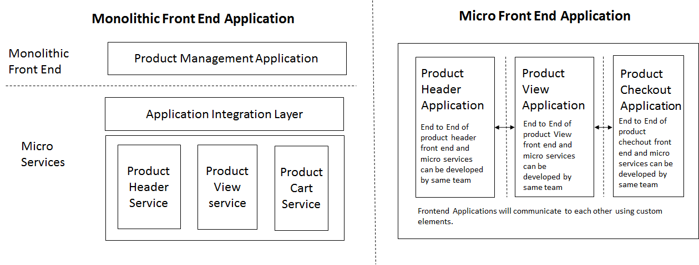

## 创建 Angular Elements

Angular elements 是 自定义 elements。Angular Elements 将 Angular component 打包在自定义的 elements 中并让其自启动（self-bootstrapping）。Angular Element 可以被包含在任何 web 应用中，用于创建可复用的微程序。

举个例子，作为 Demo 的产品管理原型应用使用 Angular Element 构建微前端的概念。应用的页面分为三个区域，每一个区域通过微前端应用渲染而成，并通过 custom elements 进行数据交换。

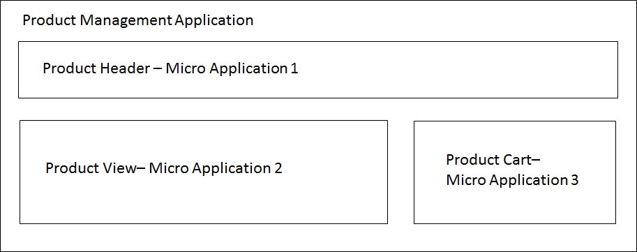

通过 Angular Element 创建微前端应用的方式是一致的，本文的源码地址放在本文的最后。

### 初始化项目

```bash
ng new product-view
```

### 使用正确的 polyfill 设置项目

```bash
npm install @webcomponents/custom-elements
```

### 创建组件

创建 `ProductViewComponent` 组件渲染主视图，并负责与其他微前端应用交换数据。`ViewEncapsulation.Emulated` 属性将模拟样式封装，确保 Angular 创造范围样式并使组件的样式选择器不会影响到页面的其他组件样式。

```bash
ng g component ProductViewComponent
```

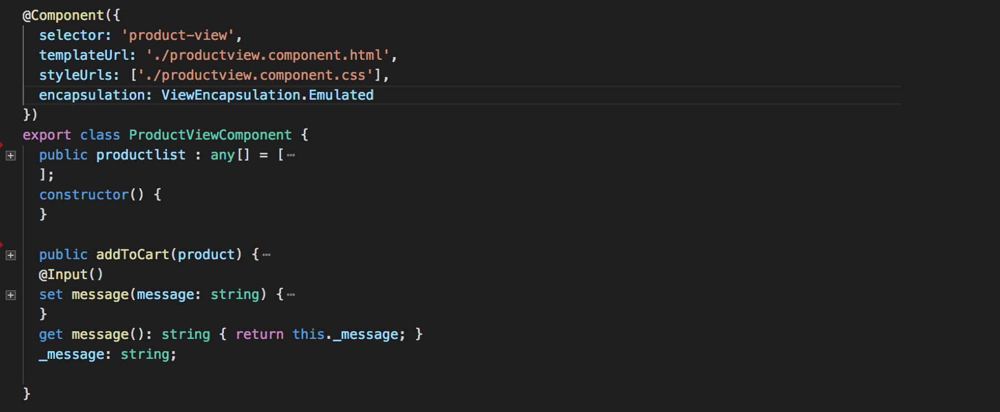

### 注册 Custom Elements

[@angular/elements ](https://twitter.com/angular/elements)提供了名为 `createCustomElement()` 的 API，用于将组件的依赖项一起转换为自定义元素。`customElements.define()` 函数会将自定义的元素标签注册在浏览器中。`ngDoBootstrap()` 则通知 Angular 使用当前 module 进行启动。

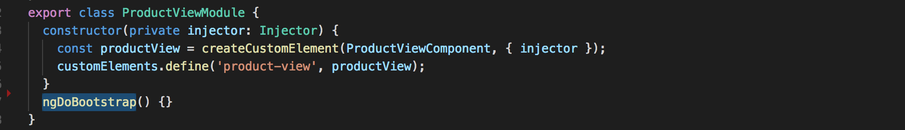

### 微前端应用之间的交互

Angular 的 Input 和 Output 属性将会用于向自定义 element 组件传递数据。在 `ProductViewComponent` 组件中创建 (product-card) 的元素实例，并将产品的细节数据发送给 `Product Cart` 的微前端应用。`Product Cart` 组件的 `Input` 方法接收到产品的细节信息并将其展示在 cart 应用中。以同样的方式从 `ProductCartComponent` 将产品的可用性信息发回给 `product-view custom elements`。

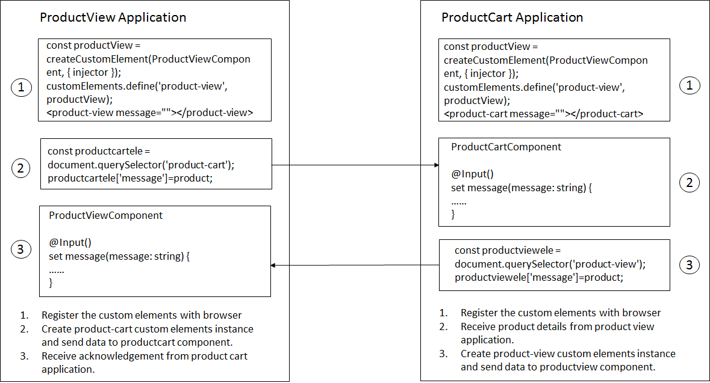

## Build and publish as Module

构建微前端应用为可复用模块/包的方式和构建 Angular 模块类似。

- gulp-inline-ng2-template，用于将 HTML 和 CSS 文件转化为 JavaScript ES5/ES6 和 Typescript 文件。
- Typescript & Angular compiler（NGC）用于编译。
- rollupjs 用于打包。

### 1.Public API

创建一个具有一个入口的 `Index.ts` 文件，用于将微应用所需的模块和组件引入其中。用户可以使用这些共有 API 导入，将微应用到任何父应用中。

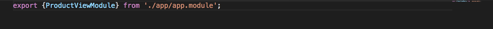

### 2.Gulp configuration

将所有 HTML 和 CSS 文件转化为行内模板以生成可用的 ES5 文件。

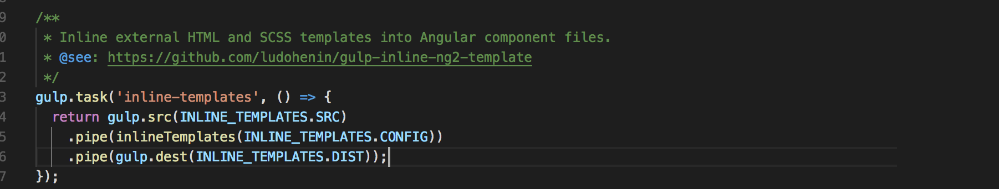

### 3.Typescript 配置

`tsconfig_build.json` 通过 Typescript 和 NGC 阅读 `compilerOptions` 和 `angularCompilerOptions` 属性以控制编译器选项。

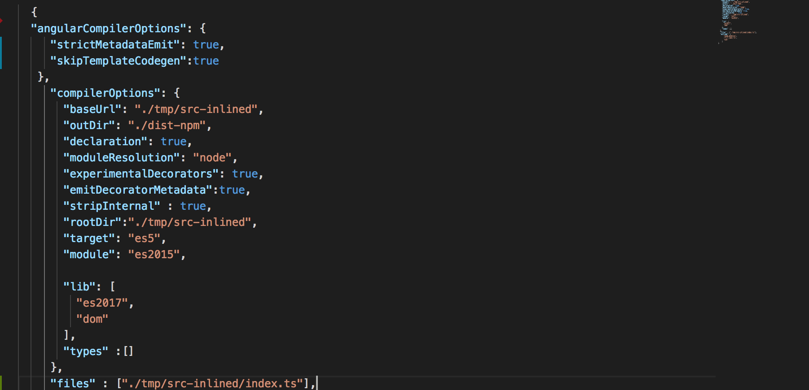

- `strictMetadataEmit`: true，Angular 编译器会校验 `.metadata.json` 文件，该文件用于与管理 AOT 兼容性的包绑定。
- `skipTemplateCodegen`: true， Angular 禁止发出 angular 的 `.ngfactory.js` 和 `.ngstyle.js` 文件。
- `declaration`:true，生成类型定义的 d.ts 文件。
- `module`: "es2015",使用 import/export 模块代码生成。
- `target`: "es2015",代码生成为 es5 的模式。

### 4. Rollup 配置

Rollup 的模块打包器与 Angular 的模块打包器相类似。应用的入口文件被命名为 `index.js` 并将所有编译后的内容导入到名为 `mf-pv.umd.js` 的文件中。

下述是简要的 rollup 配置：

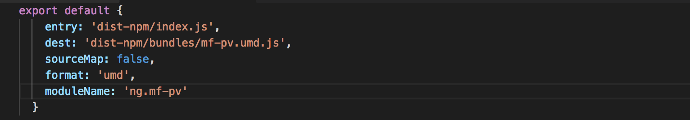

### 6. 构建

构建脚本将运行 gulp/ngc 和 rollup任务将在 dist-npm 目录下编译和打包模块。

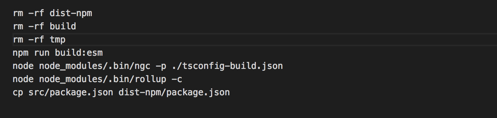

### 7. 发布到NPM

发布 dist-npm 目录的内容。`dist-npm/package.json` 文件包含了所有需要的发布到 NPM 的细节。

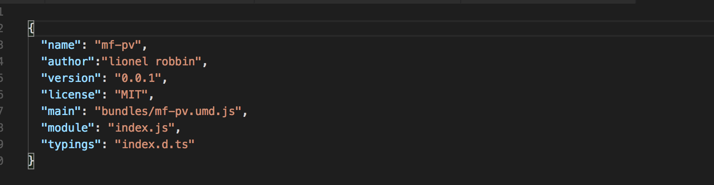

## 运行独立的微前端应用

确保微前端应用可以独立运行后，每个团队的都可以开发自己的微前端应用不受其他团队干扰，与此同时，通过与其他团队协定通讯合约的方式使用自定义元素属性进行微前端应用之间的交互。

使用 `ng build — prod — output-hashing=none` 在 `dist/product-view` 目录中构建和生成文件。

`server.js` 文件用语启动相关服务：

```bash
node server.js
```

`index.html` 文件中的自定义元素标签将会被浏览器所识别，并加载微前端应用。

## 运行集成版本的微前端应用

作为 Demo 的产品管理应用将会集成所有的微前端应用并将整个应用渲染给用户使用。但前提条件是将微前端应用作为依赖引入到产品管理应用中：

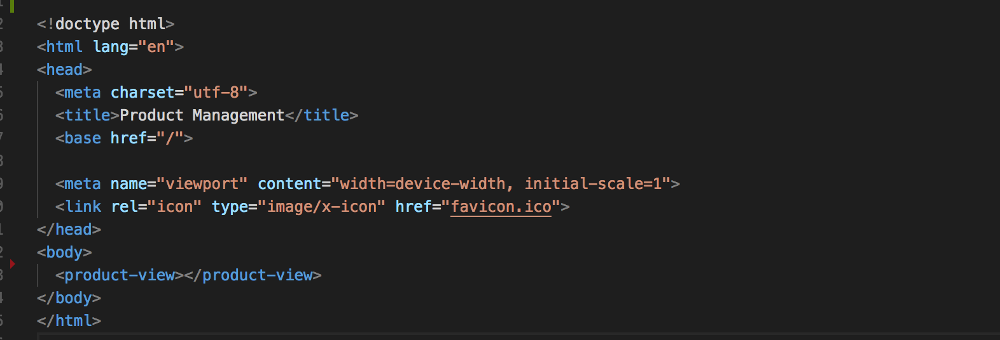

被导入的微前端应用模块将在产品管理应用中正确地渲染内容，而微前端应用之间则通过 `message` 属性进行数据交互。

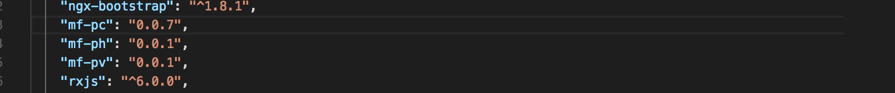

使用 `ng serve` 指令运行产品管理应用。

## 完整的代码

1. **Product Management(Integrated all three micro frontend applications)** [github](https://github.com/learnfrontend-dc/productmgt.git) [demo](https://productmgt-dc.herokuapp.com/)
2. **Product Header (micro frontend application)** [github](https://github.com/learnfrontend-dc/product-header.git) [demo](https://product-header.herokuapp.com/)
3. **Product View (micro frontend application)** [github](https://github.com/learnfrontend-dc/product-view.git) [demo](https://product-view-dc.herokuapp.com/)
4. **Product Cart (micro frontend application)** [github](https://github.com/learnfrontend-dc/product-cart.git) [demo](https://product-cart-dc.herokuapp.com/)

## 总结

虽然微前端架构提供了维护性/技术自由性/独立部署上的好处，但是为了成功地将该架构落地，还有一些关键点需要注意。

- 对应用的模块进行尽可能深层次地分析。
- 对跨微应用的信息交换进行良好的接口设计。
- 对每个微应用的集成点都要提供测试策略
- 微应用需要具有独立的功能。
- 交流是减少项目组之间冲突的唯一方式

感谢阅读本文，希望对你有所帮助。
