# 如果用 Angular 创建一个图标库

创建灵活且可摇树优化的 SVG 图标库的终极指南

[原文链接](https://medium.com/angular-in-depth/how-to-create-an-icon-library-in-angular-4f8863d95a)

[原作者:Kevin Kreuzer](https://medium.com/@kevinkreuzer?source=post_page-----4f8863d95a----------------------)

译者:[尊重](https://www.zhihu.com/people/yiji-yiben-ming/posts)


现在，几乎每一个 SPA 应用中都会使用到 icons。常规来说，开发人员会使用 UI 框架所提供的 icons，比如使用 Material 的 icon 库，或者采用专用的 icon 库（font-awesome）。

但是，到某个时候，图标需要和产品的品牌相匹配。当这个时间到来时，设计师或是产品经理就会要求开发制作一个自定义的 icon 库。

## SVG VS IconFont

第一个任务是找到适合于你的 icon 的格式： `SVG` 还是 Iconfont？

这不是一个非黑即白的问题，它的答案取决于你的需求，现在，大多数开发者更倾向于使用 `SVG` 而不是 IconFonts。原因是：

- `SVG` 标签可以包含多个颜色，而 IconFont 则不支持。
- 虽然无论 `SVG` 还是 IconFont 都是以向量为基础的格式，但是浏览器会将 fonts 解析为文本，这也是为什么 `SVG` 通常看起来更加锐利。
- `SVG` 可以通过设置大小的方式进行定位。Icon fonts 则通过伪元素插入页面，定位难度相对较高。
- 辅助功能上来说，`SVG` 拥有内置的语义。
- 通过使用 `SVG`，不再需要额外的 HTTP 请求； `SVG` 会作为 JavaScript 打包的一部分，事实上 `SVG` 就是代码。

但是 Icon Fonts 也不是一无是处，比如，Icon Fonts 比 `SVG` 小一些。除此之外，Icon Font 拥有强大的浏览器支持，对于使用 Icon Fonts 的开发人员而言更容易进行集成。

如果你需要对旧浏览器的支持，Icon Fonts 是你的不二选择。其他大多数场景下，使用 `SVG` 都是更好的选择，`SVG` 在大多数场景比较下都更合适。

## 起步 - 创建 Icon 库

使用 Angular CLI 命令初始化 icon 库：

```bash
ng new dinosaur-icons --create-application=false
cd dinosaur-icons
ng generate library dinosaur-icons
ng generate application dinosaur-icons-showcase
```

> 如果你对如何深入提升 library 的设置（比如发布全自动化），推荐你阅读下面的文章。

[The ultimate guide to set up your Angular library project](https://blog.angularindepth.com/the-ultimate-guide-to-set-up-your-angular-library-project-399d95b63500)

通过上述一通操作，创建了一个 library 项目。接下来，我们需要将 icons 添加到项目的 icons 文件夹中。

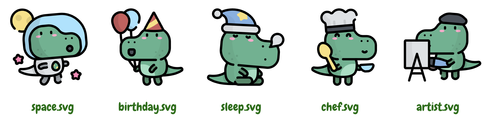

在 SPA 应用中，icons 通常被添加到 `assets` 文件夹中提供加载。但是场景不太一样，我们是一个 库 而不是一个单页应用，将 icons 添加到 `assets` 文件夹中并不能满足我们的诉求。

当然，我们可以通过在 `angular.json` 文件中增加一些配置的方式，将库中的 `assets` 文件夹复制到 SPA 应用的 `assets` 文件夹中，已达成目标。但是我还是希望通过 library 的实现完成这种 icon 的调用。

## Shipping Icons

此时，我们的 Library 已经完成了；用户可以通过传递 icon 名称到 `dinosaur-icon` 组件的方式完成对 icon 的展示。

```html
<dinosaur-icon name="space"></dinosaur-icon>
```

SVG Icons 都是些代码。因此，最简单的调用方式就是通过将 SVG 作为代码引入。

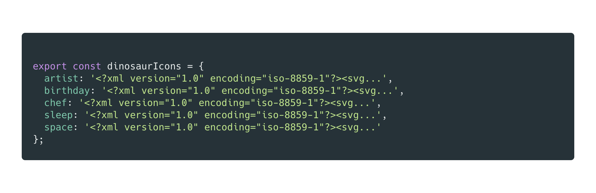

定义完 icons 之后，就可以创建组件进行展示了。

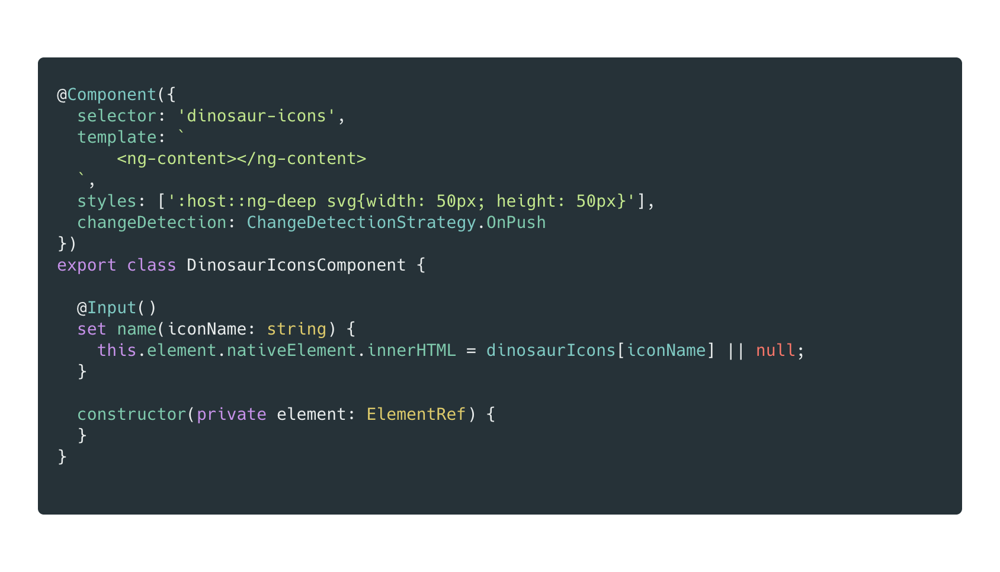

正如之前所说的，我们希望用户通过向 icon 组件传递 icon 名称属性的方式控制 icon 的展示。
我们在组件中注入了 `ElementRef` 并将获取到的 SVG 内容作为 `ElementRef` 的 `nativeElement` 的 `innerHTML`。

现在，只需要将 `DinosaurIconsModule` 模块添加到 `AppModule` 的 `imports` 字段中，并将下述代码添加到 `app.component.html` 模板文件中，icon 即可正常展示：

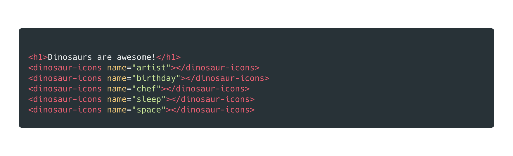

现在，让我们试试运行应用。


Ok！小恐龙们现在跃然网上！我们已经实现了一个可用于 SPA 应用的 icon 库。现在让我们将 icon 库发布到网上。

稍等~我们真的已经可以发布了吗？

## You got em all!

虽然 Icon 是已经可以展示了，但是性能如何呢？

为了回答这个问题，我们将在 SPA 应用中使用的 icon 标签减少为 3个:分别是 `artist`,`birthday`,`chef` 这三个icon。


虽然页面看起来有点不太整体，但是没关系，我们的目标是解答刑恩那个问题。为了分析通过 Webpack 进行构建的 SPA 应用的性能，我们可以使用一个名为 `Webpack bundle analyzer` 的工具。

> `webpack-bundle-analyzer` 工具能够 webpack 输出的文件大小通过可交互的放大缩小的 treemap 进行可视化展示。

首先将 `webpack-bundle-analyzer` 安装为开发依赖 

```bash
npm i -D webpack-bundle-analzyer
```

并在 `package.json` 文件中加入下述脚本内容：

```bash
"analyze": "ng build dinosaur-icons-showcase --prod --stats-json && webpack-bundle-analyzer ./dist/dinosaur-icons-showcase/stats-es2015.json"
```

当执行该脚本后，脚本将会在浏览器中打开一个可缩放的 tree-map 图。

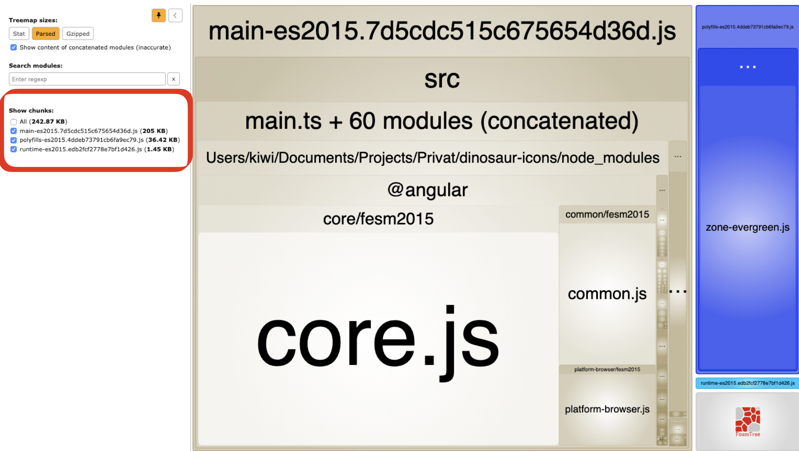

打包后的总大小是 `242.87kb`。一个全新的 Angular SPA 应用（通过 Angular CLI 创建的）大约是 `170kb`。所以说刚刚创建的 icon library 大约 `78.87kb`。

思路理清了一些。但是还有一个问题，到底是哪些 icon 被包含进最终的 bundle 中了呢？毕竟我只在应用中使用了三个 icon。

为了回答这个问题，我们需要定位到 `dist` 文件夹并检查 `main bundle` 中的内容。每一个 SVG icon 都喊一个独一无二的标识符 - id。在 main bundle 中搜索一下我们没有使用到的 icon 的标识符：

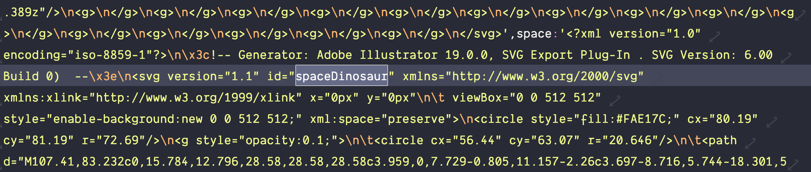

糟糕，虽然应用中并没有用到 `space` icon，但是我们却将其囊括在最终的打包范围中了。这样的状况和最佳状况相去甚远。幸运的是现在我们的 library 只包含5个 icons，想象一下它包含 300 个时的情况。

当前，我们使用了不可摇树优化的方案发布了 icon library。Angular 构建优化工具无法分辨出 icon 的使用状况。

每一个使用我们的 icon library 的开发者都会自动将我们所有的 icon 加入到最终的 bundle 中，不论你只用了一个 icon 还是使用了全部的 icon。如果你大范围使用 icon 的话可能不太受影响，但是很明显，icon library 可以做的更好。

## Treeshakable icons

在最近几个月内，我一直专注于优化项目的打包大小以及 Angular 应用的摇树优化。在学习摇树优化的过程中，我总结了非常重要的一点：

> “If you want to enable tree shaking you need to be explicit about your intends”

> 使用摇树优化的前提是意图必须是明确的。

假设你是一个摇树优化器，需要去将未使用的代码从应用中摇树优化掉，你肯定会选择一个保守的方案 - 只将那些你确认不会使用到的代码摇树掉。毕竟摇树掉实际会被使用的东西肯定会酿成灾祸。

在我们现在的方案中，摇树优化器无法得知 icon 真实的使用状况。我们导出了包含所有 icons 的对象。为了理解哪一个 icon 被使用，摇树优化器需要分析我们的实现逻辑：但是这并不是摇树优化器被设计使用的目标。

我们明确我们的使用意图，帮助摇树优化器正常运作。

## Tell the Treeshaker what you want to do 📣

首先，我们需要重构 `dinosaur-icons.ts` 这个文件，降一个对象导出拆分为多个常量。使用多个常量的方式可以确保导入 icon 时按需导入，单个导入总是显式的，此时就等于明确地告知摇树优化机制 SPA 应用中 使用了哪些 icons。

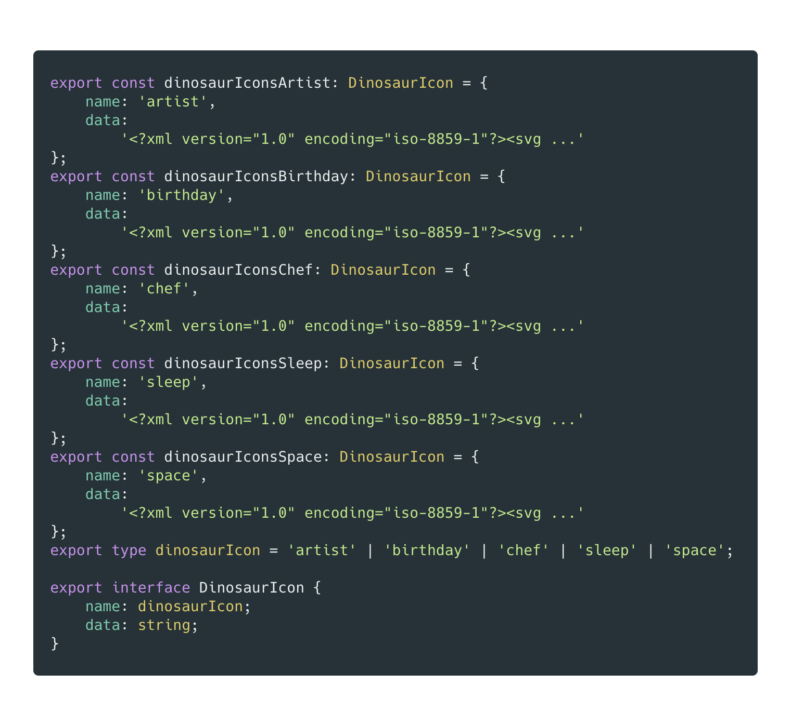

除了将 icon 的定义从一个对象重构为多个常量之外。我们还添加了一个 `name` 属性，一些类型和一个接口。我们现在看看为什么这么做。

因为重构的缘故，`dinosaur-icon` 组件也因此受到影响。依据新的接口，已经无法再基于 key 从 icons 对象中获取 SVG 了。我们需要创建包含图标的注册表。

本质上来说，这种注册表就是一个 `Map`。这意味着，对 icon 的使用者在使用之前先要对 icon 进行注册。这也是 `name` 这个属性的作用，我们将使用 `name` 属性作为将 icon 添加到注册表中的 key。

让代码来说话：

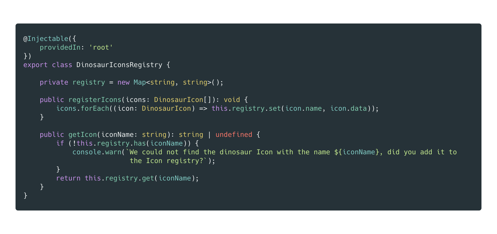

注册表的本质是一个 `Map`，包含了 key 和 `SVG` 数据，两者均为 string 类型。除此之外，服务还提供了两个公有方法，一个用于注册 icons，另一个则用于为指定的 icon 获取原始的 `SVG` 数据。

ok，现在让我们调整 `dinosaur-icon.component.ts` 组件的内容，使用上新创建的 icon 注册表功能。

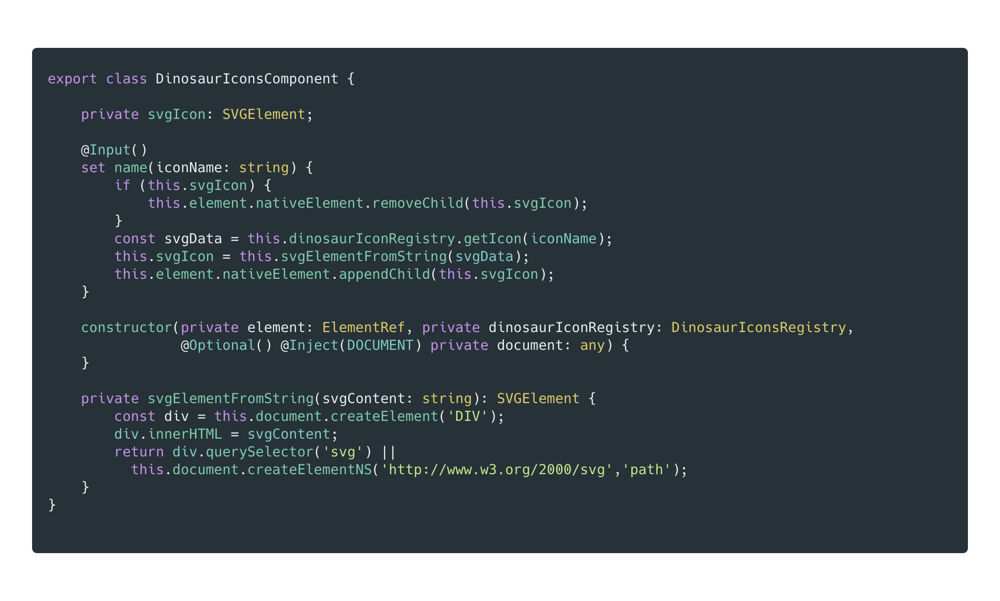

组件中的主要区别在 `name` setter 函数。`name` setter 仍然接收 `iconName` 作为入参。之后将 `iconName` 传给 `dinosaurIconRegistry`  并获得原始的 `SVG` 数据（假设 icon 已经于注册表中注册）。

再将原始的 `SVG` 数据传给组件的 `svgElementFromString` 方法，该方法将返回一个包含 icon 的 `SVGElement`。当获取到 `SVGElement`时，就可以将其添加到 `ElementRef` 的 `nativeElement` 中了。

> 如果有人动态地修改了 icon，我们需要移除现有的 element 并使用新的 element 替换之。因此我们需要在内部使用 `svgIcon` 这个变量存储 element 以便清除。

## Consum the tree shakable library

通过上述的操作，我们的 Icon library 已经可以支持摇树优化了，让我们证明一下。

在使用新 Icon Library 之前，我们首先需要将需要的 icons 注册一下。注意！我们需要显式地提出对 Icon 的需求。

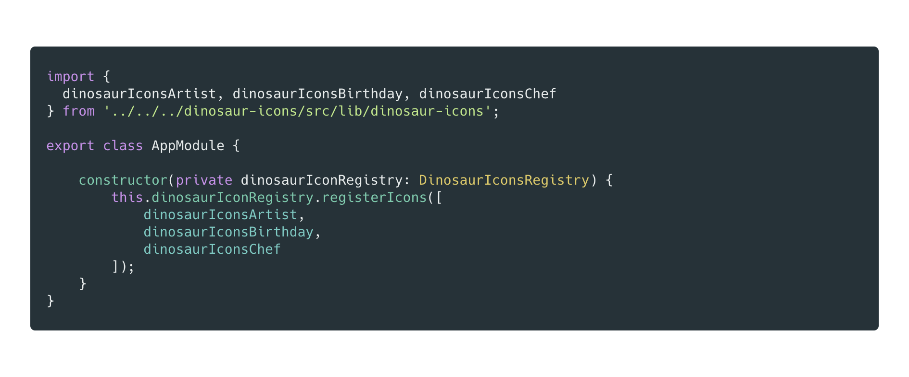

借助于依赖注入，我们可以使用 `DinosaurIconsRegistry` 注册我们的 Icons。

因为在 SPA 应用中只会使用到三个 icons，`Artist`,`Birthday`,`Chef`，因此我们只需要注册三个 icons 即可。

> 在真实场景中，使用懒加载功能模块进行 icons 的注册是更合理的方案。

因为我们没有修改 `dinosaur-icon.componnet.ts` 组件的 API，所以也就不需要对 `app.component.html` 文件进行修改。

现在让我们再看看应用的展示：


展示正常，下面就证明一下摇树优化也生效就一切OK了。让我们再运行一次分析的脚本命令：

```bash
npm run analyze
```

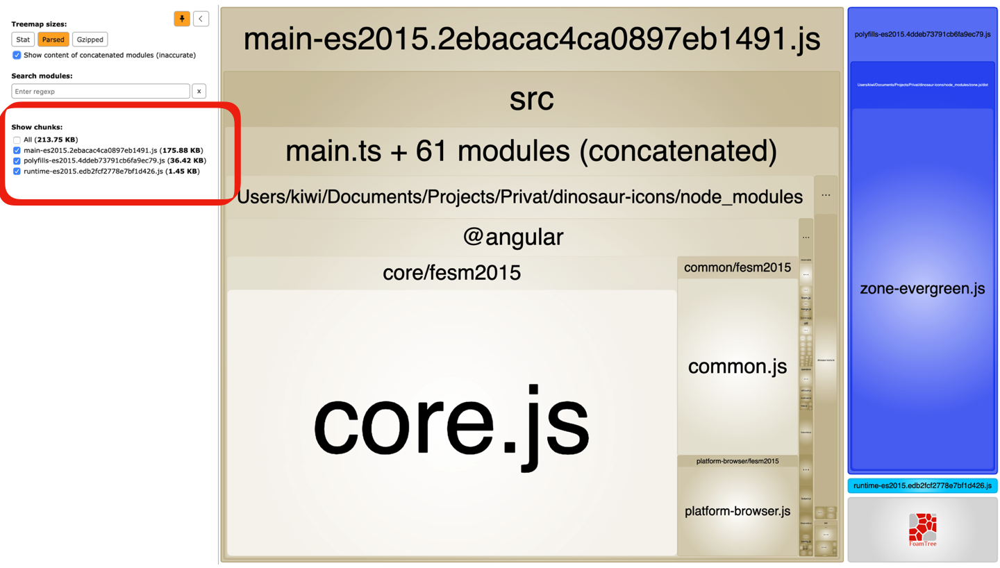

从最终的打包大小来看，包大小的确缩小了，因为没有使用到的 `sleep` 和 `space` icon 应该被摇树优化掉，这也是应当的逻辑结果。与此同时，我们再确认一下在最终包的内容中不再包含 `sleep` 和 `space` icon 的相关代码。

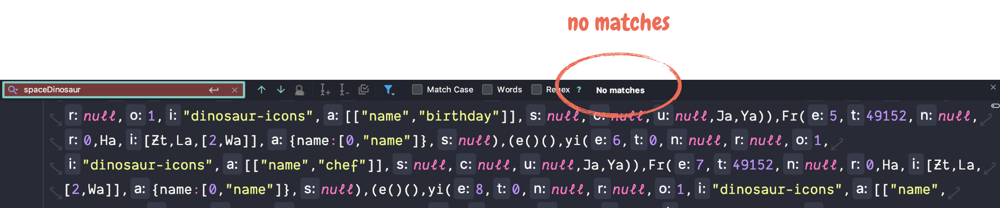

太好了，找不到与 `spaceDinosaur` 想匹配的信息。现在，我们的 Icon library 既用户友好又支持摇树优化。

不过，现在还没到结束，我们的 Icon library 还可以继续优化。

## Improve your Icon library by using svg-to-ts

通过摇树优化掉两个未被使用的 icon，我们减少了 `29kb` 的打包大小。之所以我们可以摇树掉这么多内容是因为我们的 `SVG` 文件包含大量冗余和无用的信息。我们应当在将 `SVG` 转化为交付的代码前就对其进行优化。

Icon Library 的另一个缺陷在于其对 `dinosaur-icons.ts` 内容的纯手工创建。如果你的设计师要求你明天之前将所有的icon的颜色调整为红色，你该怎么办？

如果可以用新 icons 替换老 icons，只生成带有所有常量和需要的 Typescript 接口和类型的 `dinosaur-icons.ts` 文件就好了。通过这样的方式，Icon library 会变得更容易使用同时也更灵活。

好消息是，我们编写了一个名为 `svg-to-ts` 的开源库处理以上两个需求。

[svg-to-ts](https://www.npmjs.com/package/svg-to-ts)

现在让我们试用一下。
首先将 `svg-to-ts` 安装为开发依赖。

```bash
npm i -D svg-to-ts
```

可以通过在命令最后加上 `-h` 的标志位以获取更多试用帮助。

```any
Options:
  -V, --version                  output the version number
  -t --typeName <string>         name of the generated enumeration
                                 type (default: "myIcons")
  -f --fileName <string>         name of the generated file 
                                 (default: "my-icons")
  -p --prefix <string>           prefix for the generated svg
                                 constants (default: "myIcon")
  -i --interfaceName <string>    name for the generated interface 
                                 (default: "MyIcon")
  -s --srcDirectory <value>      name of the source directory 
                                 (default: [])
  -o --outputDirectory <string>  name of the output directory 
                                 (default: "./dist")
  -h, --help                     output usage information
```

该库允许用于指定 Icon 所在的位置以及希望文件生成的位置。除此之外，library 还支持对 `constants` 添加前缀，以及命名 `Interface` 和 `type`。

当然，我们也不是总是希望加入这些信息。因此，准备一个 `generate-icons` 的脚本用于自动生成 Icons 就很有必要了：

```json
"generate-icons": "svg-to-ts -s projects/dinosaur-icons/icons -o projects/dinosaur-icons/src/lib -f dinosaur-icons -p dinosaurIcons -t dinosaurIcon -i DinosaurIcon",
```

有了这样的工具，我们就可以在想要的时候重新生成 Icons 了。此外，Icon 自带优化，必要的 Typescript 接口自动生成。

## Check out the source

如果你想要亲自体会本文中提及的应用，可以在[这个repo](https://github.com/kreuzerk/dinosaur-icons)中找到所有源码。

## Conclusion

当开发者在创建一个 Icon Library 时，好看的 Icon 并不是唯一重要的内容。作为一个 Library，性能也是非常重要的一点。确保你的 API 以 "对摇树优化友好" 的方式进行设计和创造，保持显示申明和调用格外重要。

`svg-to-ts` 是一个优化 `SVG` 以及自动将 Icons 转化为 代码的优秀工具。在创建所需的 Typescript 接口和类型方面，其也是一把好手，推荐试用。


