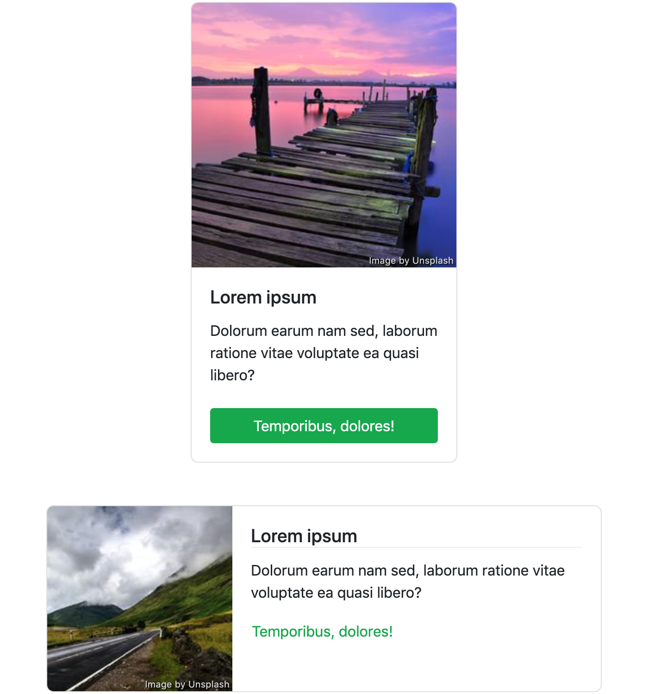

# Angular 中的自适应组件和父级驱动行为

[原文链接](https://medium.com/angular-in-depth/adaptive-components-parent-driven-behavior-in-angular-7969f63bbb08)

[原作者:Levent Arman Özak](https://medium.com/@ozak?source=post_page-----7969f63bbb08----------------------)

译者:[尊重](https://www.zhihu.com/people/yiji-yiben-ming/posts)

如果想要完全掌握 Angular 中的 智能/非智能/有状态/无状态 组件, 单向数据流, 内容投影, 视图和 DOM 操作, 以及依赖注入等知识，毫无疑问需要花费大量的时间。但是这些知识及其更深层次的信息则是构建一个稳定高扩展却又保持灵活的组件架构所必须的内容。在你钻研学习的过程中，当你不断地将新学到的知识运用到实际应用中时，新的问题和需求会不断地向你涌来。是不是应该通过一个输入属性设置这个样式？父组件是否需要知道其子组件的工作方式？类似的疑问会不断地冲击你的知识体系。

> 智能/非智能/状态/无状态的区别就在于组件自身是否产生数据逻辑

有些时候，某些简单的问题的解决方法，可能与你心中期待的最佳实践相冲突。这些解决方案甚至可以被定性为 [anti-patterns](https://stackoverflow.com/questions/980601/what-is-an-anti-pattern),但是却可以帮助你构建应用。

在本文中，我将会阐述一个便利但是可能不合规矩的方法：使用自适应组件，其根据其祖先组件，一个指令，或者一个依赖树中的可注入内容改变自身的展示和行为。从其表现上来说，你可能会觉得它就是一个非智能组件，但是事实上，自适应组件并不完全是一个非智能组件。

请注意，本文中描述的内容仅仅是对我想法的检验，而不是一个广泛的建议，依据我的想法所创建的功能可能并不够好。


## A Sample Case

为了探索自适应组件的功能，我们将会构建两个 card 组件：一个垂直组件和一个水平组件。下图展示了两个组件的展示结果：



从结果上来说，即使视图和结构上有都有一些区别，但是从组建成员的角度来说，两个组件是一样的：他们都包含一个图片，一个标题，一个文本，以及一个触发事件。正因为如此，将其抽象出一个 card 抽象类毫无疑问是一个更合理的方法，方便组件共享成员。查看下述代码：

```typescript
abstract-card.ts 
import { ContentChild, ElementRef, Input } from '@angular/core';
import { CardTitleComponent } from './card-title.component';

export abstract class AbstractCard {
  @Input() action = () => {};

  @Input() color = 'primary';
}
```

```typescript
// app.component.ts
import { Component, Inject } from '@angular/core';
import { DOCUMENT } from '@angular/common';

@Component({
  selector: 'app-root',
  template: `
    <app-card-horizontal [color]="cardColor" [action]="cardAction">
      <app-card-image [src]="cardImgH"></app-card-image>
      <app-card-title>{{ cardTitle }}</app-card-title>
      {{ cardText }}
      <app-card-button>{{ cardCTA }}</app-card-button>
    </app-card-horizontal>
    <app-card-vertical [color]="cardColor" [action]="cardAction">
      <app-card-image [src]="cardImgV"></app-card-image>
      <app-card-title>{{ cardTitle }}</app-card-title>
      {{ cardText }}
      <app-card-button>{{ cardCTA }}</app-card-button>
    </app-card-vertical>
  `,
})
export class AppComponent {
  cardAction = () => (this.document.location.href = 'https://unsplash.com');

  cardColor = 'success';
  
  cardCTA = 'Temporibus, dolores!';
  
  cardImgH = 'https://picsum.photos/192';
  
  cardImgV = 'https://picsum.photos/286';
  
  cardText = 'Dolorum earum nam sed, laborum ratione vitae voluptate ea quasi libero?';
  
  cardTitle = 'Lorem ipsum';

  constructor(@Inject(DOCUMENT) private document: Document) {}
}
```

```typescrpt
// card-horizontal.component.ts
import { ChangeDetectionStrategy, Component, forwardRef } from '@angular/core';
import { AbstractCard } from './abstract-card';

@Component({
  selector: 'app-card-horizontal',
  changeDetection: ChangeDetectionStrategy.OnPush,
  template: `
    <div class="card mb-3">
      <div class="row no-gutters">
        <div class="d-none d-sm-block col-sm-auto">
          <ng-content select="app-card-image"></ng-content>
        </div>
        <div class="col">
          <div class="card-body">
            <ng-content select="app-card-title"></ng-content>
            <p class="card-text"><ng-content></ng-content></p>
            <ng-content select="app-card-button"></ng-content>
          </div>
        </div>
      </div>
    </div>
  `,
  providers: [
    {
      provide: AbstractCard,
      useExisting: CardHorizontalComponent,
    },
  ],
})
export class CardHorizontalComponent extends AbstractCard {}
```

```typescript
// card-vertical.component.ts
import { ChangeDetectionStrategy, Component, forwardRef } from '@angular/core';
import { AbstractCard } from './abstract-card';

@Component({
  selector: 'app-card-vertical',
  changeDetection: ChangeDetectionStrategy.OnPush,
  template: `
    <div class="card" [style.width.rem]="width">
      <ng-content select="app-card-image"></ng-content>
      <div class="card-body">
        <ng-content select="app-card-title"></ng-content>
        <p class="card-text"><ng-content></ng-content></p>
        <ng-content select="app-card-button"></ng-content>
      </div>
    </div>
  `,
  providers: [
    {
      provide: AbstractCard,
      useExisting: CardVerticalComponent,
    },
  ],
})
export class CardVerticalComponent extends AbstractCard {
  width = 18;
}
```

有一些非常重要的知识点需要澄清一下。首先，对抽象类的拓展使用到了依赖注入系统。通过将 `providers` 的元数据放在 `CardVerticalComponent` 和 `CardHorizontalComponent` 组件的类装饰器中的方式，将抽象类注入到组件中。其次，`ng-content` 的 `select` 属性其实和 css 选择器的工作方式类似，用于帮助 Angular 找到投影内容在 DOM 中正确的放置位置。最后，这些 cards 包含一些完全不同的业务内容，但是没必要一一赘述了。

现在，大家都已经熟悉案例的状况了，是时候了解子组件并其如何适应其父组件的过程了。

## 当父组件存在时，在 Angular 组件上设置样式

这其实是一个基本且常见的需求。共享组件（原子组件）通常会在组件树中被多次使用但是需要做一些适配性质的样式调整，而这些调整通常由依赖树的某个祖先组件所决定。查看下述的 cart image 组件：

```typescript
// card-image.component.ts
import { ChangeDetectionStrategy, Component, Input } from '@angular/core';

@Component({
  selector: 'app-card-image',
  changeDetection: ChangeDetectionStrategy.OnPush,
  template: `
    
    <span *ngIf="ready && attribution">
      Image by <a [href]="attribution.href">{{ attribution.text }}</a>
    </span>
  `,
})
export class CardImageComponent {
  @Input() alt = '';

  @Input() attribution = {
    href: 'https://unsplash.com',
    text: 'Unsplash',
  };

  @Input() placement: 'top' | 'side' = 'side';

  @Input() src = 'https://picsum.photos/200';

  ready = false;

  get classes(): string {
    return 'card-img-' + this.placement;
  }
}
```

这个组件可以用于垂直和水平两种布局中，组件的 `placement` 属性根据布局的模式设置为 `side` 或者 `top`。研究一下这种场景，我们有如下的选项:

1. 保持 `CardImageComponent` 不变，但是不仅需要忍受重复的工作，还需要注意组件 API 的一些小细节。
2. 添加分隔的 card image 组件 或者添加一个属性指令用于垂直和水平布局，但是需要忍受组件 API 的拓展以及一些可能的 重复/无用 代码。
3. 让组件变得更聪明。

让我们回顾一下组件看看那些部分可以进行修改。

```typescript
// card-image.component.ts
import {
  ChangeDetectionStrategy,
  Component,
  Input,
  Optional,
} from '@angular/core';
import { CardVerticalComponent } from './card-vertical.component';

@Component({
  selector: 'app-card-image',
  changeDetection: ChangeDetectionStrategy.OnPush,
  template: `
    
    <span *ngIf="ready && attribution">
      Image by <a [href]="attribution.href">{{ attribution.text }}</a>
    </span>
  `,
})
export class CardImageComponent {
  @Input() alt = '';

  @Input() attribution = {
    href: 'https://unsplash.com',
    text: 'Unsplash',
  };

  @Input() src = 'https://picsum.photos/200';
  
  ready = false;
  
  classes = `card-img-${this.vertical ? "top" : "side"}`;

  constructor(@Optional() public vertical: CardVerticalComponent) {}
}
```

上述代码中完全移除了 `placement` 属性并使用依赖注入代替之。当 card image 组件在垂直的 card 中使用时，插入的实例会将 vertical 的值映射为 true， `` 元素将会使用 `card-img-side` 样式类。换句话说，`Optional` 装饰器将使用 `null` 代替未提供的依赖项。因此，当 card image 组件用于一个垂直 card 组件中时，`vertical` 属性的值则会为 `false`，而 `` 元素则会采用 `card-img-top` 样式类。

## 基于上下文设置 Angular 组件的 样式（如何使用 host-context）

在使用水平布局时，组件样例的标题包含一个下划线。因此在水平 card 组件中，需要向 `<h5>` 元素上添加一个 `border-bottom` 属性，垂直 card 组件则不需要。使用全局 CSS 规则是一个解决方案，但是全局 CSS 在修改和移除时很难追溯，并且很容易变成冗余的代码。下述代码展示了我的解决方案：

```typescript
// card-title.component.ts
import { ChangeDetectionStrategy, Component } from '@angular/core';

@Component({
  selector: 'app-card-title',
  changeDetection: ChangeDetectionStrategy.OnPush,
  template: `
    <h5 class="card-title">
      <ng-content></ng-content>
    </h5>
  `,
  styles: [
    `
      :host-context(app-card-horizontal) h5 {
        border-bottom: 1px solid #eee;
      }
    `,
  ],
})
export class CardTitleComponent {}
```

`:host-context()` CSS 函数仅在其参数与元素的祖先相匹配且任何后代也可以作为目标时才选择host元素

> The :host-context() CSS function selects the host element only if parameter matches element’s ancestor(s) and any descendant can also be targeted.

这个函数的好处是显而易见的：border 属性只会添加到 水平 card 的 heading 元素上，该规则很容易发现和修改。除此之外，你还需要记住一些现阶段的事实：

1. `View encapsulation` 是该选择器正常运作的必要条件（`None` 无法支持选择器的正常运行）。即使 [:host-context()](https://developer.mozilla.org/en-US/docs/Web/CSS/:host-context())是 shadow DOM 的原生 CSS 伪类函数，它仍然还处于实验性阶段，浏览器支持并不够好。但是好消息是，`emulated encapsulation` 生效时，Angular 会在底层使用一个简单的选择器替换它，选择器的作用域是一个包含代理id的属性。

2. Angular 编译器可能不会校验其规则（未确认），所以编译器也就无法检测你是否还需要这个功能（tree shaking）。通俗点来说，这条 CSS 规则无论是否内联，都不会因为应用中是否包含水平的 card 实例而被摇树优化掉。

## 在 Angular 的父级组件中使用属性

迄今为止，我们还只是基于存在/不存在祖先组件来决定子组件的样式。其实还可以利用父组件的属性和方法：

```typescript
// card-button.component.ts 
import { ChangeDetectionStrategy, Component } from '@angular/core';
import { AbstractCard } from './abstract-card';
import { CardHorizontalComponent } from './card-horizontal.component';

@Component({
  selector: 'app-card-button',
  changeDetection: ChangeDetectionStrategy.OnPush,
  template: `
    <button class="btn" [ngClass]="classes" (click)="parent.action()">
      <ng-content></ng-content>
    </button>
  `,
})
export class CardButtonComponent {
  private horizontal = this.parent instanceof CardHorizontalComponent;

  get classes(): string {
    return this.horizontal
      ? `btn-link text-${this.parent.color} text-left p-0`
      : `btn-${this.parent.color} btn-block mt-4`;
  }

  constructor(public parent: AbstractCard) {}
}
```

事实上，`CardButtonComponent` 在引用到 card `color` 后才会设置其 CSS 样式类，并通过点击事件调用其 `action` 属性。子组件的特征由祖先组件所决定。注意一下实际使用 `AbsctractCard` 类的过程： 因为两个 card 组件都对抽象类进行了拓展并将其置于元数据提供商中，我们可以将其注入到子组件中并为其共享接口保障类型安全的引用。

虽然直接使用祖先属性可能看起来很棒，但是还有一些注意事项：

1. 如果子组件的 `ChangeDetectionStrategy` 属性被设置为 `OnPush`，其不应当在父级属性变化时重新渲染。为了实现这一功能，我们需要一个工具方法（不会再本文中详细介绍），但是你可以在 [StackBlitz 项目](https://stackblitz.com/edit/adaptive-components?file=src%2Fapp%2Futils.ts)中找到一个可运行的 demo。

2. 父组件的箭头函数类属性可以通过子组件调用，因为 `this` 永远指向其属性所属的类的实例（我们的例子中是 `AppComponent`）。但是在调用这些方法时，时刻警惕[闭包](https://developer.mozilla.org/en-US/docs/Web/JavaScript/Closures)的作用。

3. 在子组件中给父组件属性设置新值通常来说不是一个好主意，因为出现问题时很难定位问题的位置，毕竟对属性的覆写可能会有意外发生。遵从单项数据流的设计思路会更有利于应用的稳定性。

## 总结

多亏了 Angular 的依赖注入机制，基于祖先组件/指令/服务的特性创建自适应组件成为可能。在我当前正在维护的应用中多处使用到了本文中提到的实现方案，这些组件都在正常运行。但是在你实践我的方案之前，请记住，我对本文中的方案的缺点非常清楚，该方案仅在 Angular 中得到过验证，并不推荐广泛应用到项目中。

你可以在这个 [StackBlitz 项目](https://stackblitz.com/edit/adaptive-components?embed=1&file=src/app/app.component.ts)中找到本文的全部实现。祝你好运。


