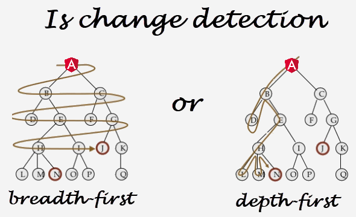
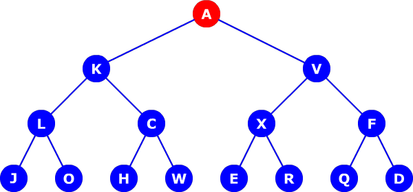
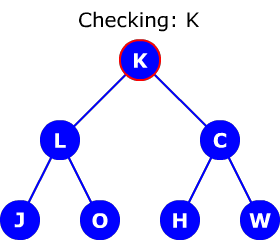

# [翻译] 有人认为变更检测是深度优先，有人认为是广度优先，通常两者都是对的

> 原文: [He who thinks change detection is depth-first and he who thinks it’s breadth-first are both usually right](https://blog.angularindepth.com/he-who-thinks-change-detection-is-depth-first-and-he-who-thinks-its-breadth-first-are-both-usually-8b6bf24a63e6)
>
> 原文作者: [Max Koretskyi](https://blog.angularindepth.com/@maxim.koretskyi)
>
> 原技术博文由`Max Koretskyi`撰写发布，他目前于[ag-Grid](https://angular-grid.ag-grid.com/?utm_source=medium&utm_medium=blog&utm_campaign=angularcustom)担任开发大使
> 译者按：开发大使负责确保其所在的公司认真听取社区的声音并向社区传达他们的行动及目标，其作为社区和公司之间的纽带存在。
>
> 译者: [dreamdevil00](https://github.com/dreamdevil00); 校对者: [sunny](https://segmentfault.com/u/lx1036/articles)

> 

曾经有人问我 Angular 中的变更检测是深度优先还是广度优先。这主要是指 Angular 首先检查当前组件的兄弟组件(广度优先)还是子组件(深度优先)。我之前没有考虑过这个问题，所以我只是在用我的直觉和内在的知识。我觉得它是深度优先。稍后，为了验证我的断言，我创建了一个组件树，并在 `ngDoCheck` 钩子中放了些日志逻辑:

```
@Component({
    selector: 'r-comp',
    template: `{{addRender()}}`
})
export class RComponent {
    ngDoCheck() {
        // holds all calls in order and is logged to console
        calls.ngDoCheck.push('R');
    }
```

令我惊讶的是，结果显示，一些兄弟组件首先被检查，如下图所示:


这里你可以看到， Angular 检测了 `K` 然后是 `V`， `L` 然后是 `C`，等等。难道是我错了, 这真的是广度优先算法? 额, 不完全是。在上述陈述中首先要注意的是，这不是个完全地广度优先算法。广度优先算法的常规实现是检查 **同级的所有兄弟组件**，而在上图中，你可以看到该算法确实检查了同级组件 `L` 和 `C`，但是没有检查 `X` 和 `F`，就往下到了 `J` 和 `O`。同样，广度优先的图遍历算法的实现是很明确的，但我在源代码中没找到。于是，我决定进行另一个实验，将日志逻辑放在自定义函数中，当变更检测对表达式求值时调用该函数：

```
@Component({
    selector: 'r-comp',
    template: `{{addRender()}}`
})
export class RComponent {
    addRender() {
        calls.render.push('R');
    }
}
```

这次得出了不同的结果:


这是一个完全的深度优先图遍历算法。那么， 这里发生了什么? 事实上很简单， 我们来看一下。

## 变更检测操作

要理解行为上的差异，我们需要查看变更检测机制在检查组件时执行的操作。如果你已经阅读了 [关于变更检测的我的其他文章](https://blog.angularindepth.com/these-5-articles-will-make-you-an-angular-change-detection-expert-ed530d28930) ， 你可能知道下列变更检测执行的关键操作:

- 更新子组件的属性

- 调用 **子组件** 的 `NgDoCheck`  和  `NgOnChanges` 生命周期钩子

- 更新 **当前组件** 的 DOM

- **对子组件执行变更检测**

我在上面强调了一个有趣的细节——当 Angular 检查当前组件时，调用了**子组件**的生命周期钩子，但是渲染**当前组件** 的 DOM。这是个很重要的区别。如果我们把日志放到 `NgDoCheck` 钩子里，这恰恰是使它看起来就像是算法执行深度优先的原因。当 Angular 检查当前组件时，它会调用所有同级的子组件的生命周期钩子。假设 Angular 现在检查 `K` 组件， 调用了 `L` 和 `C` 组件的 `NgDoCheck` 生命周期钩子。 那么， 我们会得到下图:


看起来像是 广度优先 算法。不过， 记住: Angular 仍然在检测 `K` 组件的过程中。因此，在完成了 `K` 组件的所有操作之后，并没有继续检查同级的 `V` 组件，若检查的话就是广度优先的实现。相反，它继续检查 `L` 组件，`L` 组件是 `K` 的子组件。这是变更检测算法的深度优先实现。就像我们现在知道的，它会调用 `J` and `O` 组件的 `ngDoCheck`，这正是所发生的事情:


结果我的直觉终究没有让我失望。变更检测机制在内部的实现为深度优先， 但是包含首先在兄弟组件上调用`ngDoCheck` 生命周期钩子。顺便说一下， 我已经在 [If you think `ngDoCheck` means your component is being checked — read this article](https://blog.angularindepth.com/if-you-think-ngdocheck-means-your-component-is-being-checked-read-this-article-36ce63a3f3e5) 中深入地描述了这部分逻辑。

## Stackblitz demo

[这里](https://stackblitz.com/edit/depth-or-breadth-first) 你可以在不同地方看到带有日志逻辑的演示
