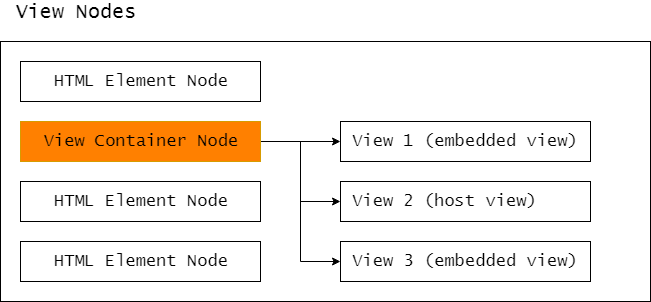

# [翻译] 在Angular中使用DOM：新认知以及优化技术

> 原文：[Working with DOM in Angular: unexpected consequences and optimization techniques](https://blog.angularindepth.com/working-with-dom-in-angular-unexpected-consequences-and-optimization-techniques-682ac09f6866)  
> 作者：**[Max Koretskyi](http://twitter.com/maxim_koretskyi)**  
> 原技术博文由 `Max Koretskyi` 撰写发布，他目前于 [ag-Grid](https://angular-grid.ag-grid.com/?utm_source=medium&utm_medium=blog&utm_campaign=angularcustom) 担任开发者职位  
> 译者：**[秋天](https://github.com/jkhhuse)**；校对者：**[Sunny Liu](https://segmentfault.com/u/lx1036/articles)**  


我最近在 **[NgConf workshop](https://www.youtube.com/watch?v=vz9cNCkaPsY)** 中分享了 Angular 操作 DOM 的一些高级用法，从 `templateRef` 和 `DOM query` 到 `view container` 与 `dynamic component`。如果还没有观看这个分享视频，那么建议你抽时间看一下，分享中穿插了一系列的示例，可以帮助你更好的理解这些概念。另外，还有一个在 **[NgViking](https://www.youtube.com/watch?v=qWmqiYDrnDc)** 中简短的分享，也是关于这个本主题的。

如果你觉得视频太长或者更喜欢阅读文章而不是观看视频，那么本篇文章已经总结了视频中涉及的关键内容。我将首先解释这些工具方法的用法，以及如何使用他们来在 Angular 中操作 DOM，随后将介绍一些优化手段，这部分内容在 `NgConf workshop` 中没有涉及。

你可以在 `[github](https://github.com/maximusk/dom-manipulation-workshop)` 仓库中找到文本的所有示例。

## 先了解一下视图引擎( View Engine )

假设你需要从 DOM 中删除一个子元素，目前已经存在了父组件，父组件的模板中包含有一个子组件 `A` ，现在要做的是把 `A` 从父组件中移除：

```ts
@Component({
  ...
  template: `
    <button (click)="remove()">Remove child component</button>
    <a-comp></a-comp>
  `
})
export class AppComponent {}
```

解决上述需求，一个**错误**的方法是：使用 `Renderer` 或者 `native DOM API` 来直接删除 `<a-comp>` DOM 元素：

```ts
@Component({...})
export class AppComponent {
  ...
  remove() {
    this.renderer.removeChild(
       this.hostElement.nativeElement,      // parent App comp node
       this.childComps.first.nativeElement  // child A comp node
     );
  }
}
``` 

你可以从[这里](https://stackblitz.com/github/maximusk/dom-manipulation-workshop/tree/s2?file=src%2Fapp%2Fapp.component.ts)看到代码实现。如果使用浏览器的审查元素功能，查看页面 DOM 节点情况，你会发现 `<a-comp>` 组件已经从 DOM 元素中移除了：


然而，如果你查看控制台的输出，你会发现打印的结果中，仍然显示子节点的数量为 `1` 而不是 `0`。变更检测好像没有检测出子组件已经被移除了，下面是控制台输出的日志：


为什么会出现这样的状况呢？因为 Angular 内部使用了一种数据结构来描述组件，通常称它为 `View` （后文统一翻译为视图） 或者 `ComponentView`。下图展示了视图与 DOM 之间的关联关系：


每个视图由多个节点（ `view nodes` ）构成，这些节点都包含有 DOM 元素的引用，当我们直接更改 DOM 元素时，视图节点并没有改变。下图演示了从 DOM 树中删除了组件 `<a-comp>` ：


所有的变更检测操作，包括 `ViewChildren` 都运行在视图上，并非在 `DOM` 上。Angular 仍然会检测到 `<a-camp>` 组件存在（译者注：因为只是删除了 DOM 中的元素，视图中的引用仍在），打印出子组件数量仍为为 `1`。此外，变更检测也仍然会把 `<a-camp>` 组件作为检测对象。 

> 上面的示例说明：不能仅仅从 DOM 中删除子组件，你应该避免删除任何由框架创建的 HTML 元素，否则框架无法感知到你删除了哪些元素。不过，你可以删除 Angular 框架无法感知到元素，例如由第三方库创建的元素。

为了解决上述示例的**“缺陷”**，我们需要使用 Angular `View Container`（视图容器）。

## View Container

`View Container` 能够保证发生在其内部的 DOM 操作更加安全（译者注：保证 `View` 与 DOM 同步），Angular 中所有内置的指令中都有用到它。它是一种特殊类型的 `view node`，它既存在于视图之中，也可以作为视图的容器，挂载其他视图：



如上图所示，它能够接纳两种类型的视图：内嵌视图和宿主视图。

它们是 Angular 仅有的视图类型，它们之间的最大不同是用于创建它们的载体（译者注：API 的输入不同）不同。内嵌视图仅仅可以添加到 `view container` 中，而宿主视图除此之外，还可以添加到任意 DOM 元素中（这个元素通常被称之宿主元素）。

内嵌视图从模板创建，使用 `TemplateRef` 方法，宿主视图从视图创建，使用 `ComponentFactoryResolve` 方法。例如，用来启动 Angular 应用（ `AppComponent` ）的入口组件，在内部表示为附加到组件的宿主元素（`<app-comp>`）的宿主视图。

`View Cotainer` 提供了动态创建、操作、移除视图的 API，我们称它为动态视图，是相对框架中使用静态组件模板创建的视图。Angular 静态视图没有使用到 `view container`，它是在子组件中的指定节点存放一个子视图的引用。下图是静态视图的示例：


从图中得知，视图中没有 `view container` 节点，子视图的引用直接关联到 `A`组件。

## 动态操作视图

在开始创建和添加视图到 `view container` 之前，首先要把 `view container` 添加到组件的模板中，初始化它。任何元素都可以作为 `view container`，不过大部分情况下，都使用 `<ng-container>` 元素，因为它在渲染时被渲染为一个注释节点，因此 DOM 树中不会出现 `<ng-container>` 元素。

转换元素为 `view container`，可以在 `view query` 时使用 `{read: ViewContainerRef}`：

```ts
@Component({
 …
 template: `<ng-container #vc></ng-container>`
})
export class AppComponent implements AfterViewChecked {
  @ViewChild('vc', {read: ViewContainerRef}) viewContainer: ViewContainerRef;
}
```

获得 `view container` 的引用后，那么就可以用它来创建动态视图了。

## 创建内嵌视图（Embedded view）

创建内嵌视图，需要一个 `template`，在 Angular 中，我们使用 `<ng-template>` 元素来包装 DOM 元素，并且定义它为模板。并且可以通过 `view query` 的 `{read: TemplateRef}` 属性得到这个模板的引用：

```ts
@Component({
  ...
  template: `
    <ng-template #tpl>
        <!-- any HTML elements can go here -->
    </ng-template>
  `
})
export class AppComponent implements AfterViewChecked {
    @ViewChild('tpl', {read: TemplateRef}) tpl: TemplateRef<null>;
}
```

获得 `template` 引用后，可以使用 [`createEmbeddedView`](https://angular.cn/api/core/ViewContainerRef#createembeddedview) 方法来创建和添加一个内嵌视图到 `view container` 之中。

```ts
@Component({ ... })
export class AppComponent implements AfterViewInit {
    ...
    ngAfterViewInit() {
        this.viewContainer.createEmbeddedView(this.tpl);
    }
}
```

你可以在 `ngAfterViewInit` 生命周期钩子中实现你的逻辑，因为 `view query` 在 `ngAfterViewInit` 周期时才初始化。此外，对于内嵌视图，你可以定义一个上下文对象 (contenxt object)，来绑定 `<ng-template>` 中的值。可以参考 **[createEmbeddedView()](https://angular.cn/api/core/ViewContainerRef)**  和 **[NgTemplateOutlet](https://angular.cn/api/common/NgTemplateOutlet)** 来理解这个上下文对象。（译者注：`NgTemplateOutlet` 与 `createEmbeddedView` 功能上是相同的）

## 创建宿主视图（host view）
 
创建宿主视图，需要使用 `component factory` 方法，更多关于动态创建组件的知识，可以查看这篇文章：[Here is what you need to know about dynamic components in Angular](https://blog.angularindepth.com/here-is-what-you-need-to-know-about-dynamic-components-in-angular-ac1e96167f9e)。

在 Angular中，我们使用 [`ComponentFactoryResolve service`](https://angular.cn/api/core/ComponentFactoryResolver) 来获取 `component factory` 的引用：

```ts
@Component({ ... })
export class AppComponent implements AfterViewChecked {
  ...
  constructor(private r: ComponentFactoryResolver) {}
  ngAfterViewInit() {
    const factory = this.r.resolveComponentFactory(ComponentClass);
  }
 }
}
```

当我们拿到 `component factory` 的引用后，可以使用它来初始化组件，创建宿主视图并且添加它到 `view container` 中，即把 `component factory` 引用传递到 `createComponet` 方法：

```ts
@Component({ ... })
export class AppComponent implements AfterViewChecked {
    ...
    ngAfterViewInit() {
        this.viewContainer.createComponent(this.factory);
    }
}
```

**[点击这里](https://stackblitz.com/github/maximusk/dom-manipulation-workshop/tree/s4?file=src%2Fapp%2Fapp.component.ts)**，可以查看完整的创建宿主视图的示例。

## 移除一个视图

任何添加到 `view container` 的视图，都可以使用 `remove` 或者 `detach` 方法来移除它。这些方法在从 `view container` 中移除视图的同时，也会从 DOM 删除对应的元素。它们之间的区别是：`remove` 方法会销毁视图，此后这个视图无法再次被添加到 `view container` 中；`detach` 方法移除的视图，在后续还可以被重新添加到 `view container` 之中。这些特性，我们可以利用来优化 DOM 的操作。

所以正确的移除一个子组件或者 DOM 元素的方式，是需要首先创建嵌入视图或者宿主视图，并把它们添加到 `view container` 中，并且使用 `view container` 中提供的 `remove` 或者 `detach` 等方法来移除它。

## 优化技术

在开发中，会遇到这样的场景：我们需要重复的隐藏和显示某个组件或者模板元素，类似下图展示的那样：


如果我们简单的利用上文中学到的知识来解决这个问题，代码如下：

```ts
@Component({...})
export class AppComponent {
  show(type) {
    ...
    // a view is destroyed
    this.viewContainer.clear();
    
    // a view is created and attached to a view container      
    this.viewContainer.createComponent(factory);
  }
}
```

这样实现，会导致在切换隐藏和显示组件时，频繁地销毁和重建视图。

在这个特定的示例中，因为它是宿主视图，所以销毁和重新创建视图使用了 component factory 和 `createComponent` 方法。如果我们使用 `createEmbeddedView` 和 `TemplateRef`，那么就是内嵌视图被销毁和重建：

```ts
show(type) {
    ...
    // a view is destroyed
    this.viewContainer.clear();
    // a view is created and attached to a view container
    this.viewContainer.createEmbeddedView(this.tpl);
}
```

理想状况下，我们仅需要创建一次视图，在后续的隐藏/显示过程中，可以复用这个视图。`ViewContainerRef` API 中提供了这样的方法，它支持添加视图到 `view container` 且在移除视图时不会彻底销毁这个视图。

## ViewRef

`ComponentFactory` 和 `TemplateRef` 实现了 **view** 接口的创建视图的方法，都可以用来创建一个视图。事实上，`view container` 在调用 `createComponent` 和 `createEmbbedView` 方法时以及传递输入数据时，隐藏了一些细节。我们也可以自己利用这些方法来创建宿主视图或者内嵌视图，并且获得视图的引用，在 Angular 中这个视图的引用即是：[`ViewRef`](https://angular.cn/api/core/ViewRef) 以及它的子类。

## 创建一个宿主视图

下面是使用 `component factory` 来创建一个宿主视图，并且获得返回的引用的示例：

```ts
aComponentFactory = resolver.resolveComponentFactory(AComponent);
aComponentRef = aComponentFactory.create(this.injector);
view: ViewRef = aComponentRef.hostView;
```

在宿主视图下，`create` 方法返回的 `ComponentRef` 中包含有组件关联的视图，可由 `hostView` 属性获得。

获得视图引用后，我们就可以使用 `insert` 方法来添加到 `view container` 中。结合上文提到的 `detech` 方法的特性，可以得出优化的方法为：

```ts
showView2() {
    ...
    // Existing view 1 is removed from a view container and the DOM
    this.viewContainer.detach();
    // Existing view 2 is attached to a view container and the DOM
    this.viewContainer.insert(view);
}
```

再提示一下，我们这里使用的是 `detach` 方法，而不是 `clear` 或者 `remove` 方法，为的就是保证视图的引用没有被销毁，可以重复使用，不用再次创建。相关的示例在[这里](https://stackblitz.com/github/maximusk/dom-manipulation-workshop/tree/s5?file=src%2Fapp%2Fapp.component.ts)。

## 创建一个内嵌视图

内嵌视图是利用 `ng-template` 进行创建的，创建的视图，由 `createEmbeddedView` 方法返回：

```ts
view1: ViewRef;
view2: ViewRef;
ngAfterViewInit() {
    this.view1 = this.t1.createEmbeddedView(null);
    this.view2 = this.t2.createEmbeddedView(null);
}
```

这个例子与上一个示例类似，也可以通过 `detach` 和 `insert` 来实现优化，具体示例，可以参考[这里](https://stackblitz.com/github/maximusk/dom-manipulation-workshop/tree/s6?file=src%2Fapp%2Fapp.component.ts)。

（译者注：这里概念容易弄混，上文与下文提到的两种创建内嵌/宿主视图的方式的区别就是：create 的行为时是否由 view container 发起，实际使用效果没有差别。）

