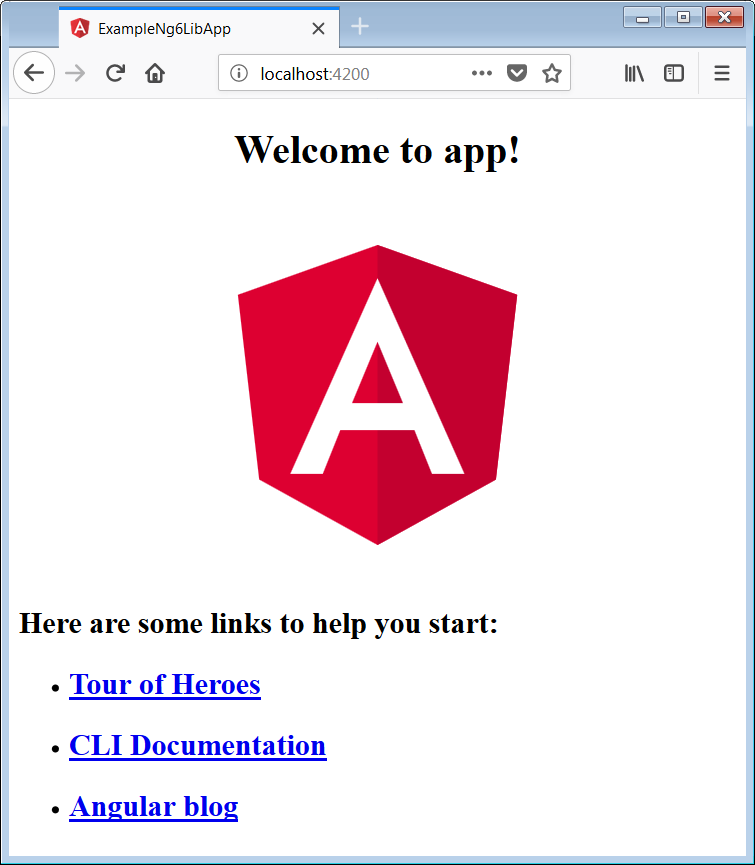
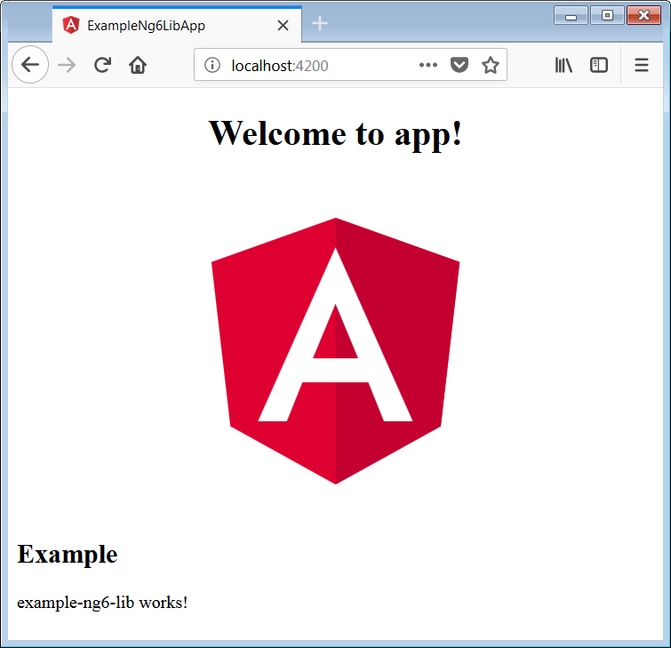
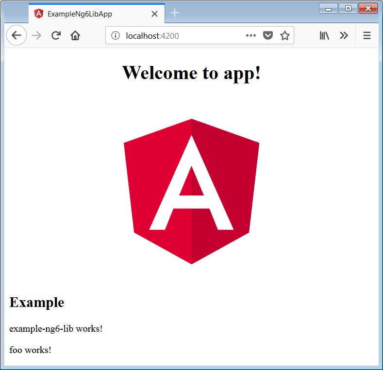

# [翻译] Angular Libary 系列之 使用 Angular CLI 创建 Library

感谢 Angular CLI 和 ng-packagr 的融合，开发者可以更为轻松地创建 Angular 库了。

> 原文链接： [The Angular Library Series - Creating a Library with Angular CLI](https://blog.angularindepth.com/creating-a-library-in-angular-6-87799552e7e5)

> 原文作者： [Todd Palmer](https://blog.angularindepth.com/@palmer_todd?source=post_header_lockup)
> 
> 译者：[尊重](https://www.zhihu.com/people/yiji-yiben-ming/activities)；校对者：[秋天](https://github.com/jkhhuse)
>
> 译者按： 本文使用 库 指代 Angular Library 的概念。
> 
> 本文是 Angular Libaray 系列的第一篇文章，本系列共有三篇文章，涵盖从创建到打包再到发布的全套流程。
> 
> 为了行文方便，以下均以我/我们指代原作者。

<p align="center"> 
    
</p>

> 更新：本文最初是为 Angular v6 所写。因为 Angular v7 已经发布有一段时间了，我特意检查了本文中所有的示例，他们在 Angular v7 中仍然有效。

Angular 6 中针对 Angular CLI 进行了许多改进。其中我最期待的是新特性是 Angular CLI 与 [ng-packagr](https://github.com/ng-packagr/ng-packagr) 的集成用以更方便地生成和构建 Angular 库。ng-packagr 是由 [David Herges](https://medium.com/@davidh_23) 创造的用于将自制的库转化为 [Angular Package Format](https://docs.google.com/document/d/1CZC2rcpxffTDfRDs6p1cfbmKNLA6x5O-NtkJglDaBVs/preview) 的优秀工具。

在本文中，我们将详细地介绍创造 Angular 库的每个细节。此外，我将重点介绍一些对于库开发有益的规则和经验以避免在开发过程中再踩不必要的坑。

为了方便，我在 Github 上创建了一个包含全部代码的仓库 [t-palmer/example-ng6-lib](https://github.com/t-palmer/example-ng6-lib)，希望可以帮助你更好地理解 Angular 库的构建。

## 介绍

当我们使用 `ng new` 命令时，Angular CLI 将为我们生成一个新的工作区（**workspace**）。

在 Angular **工作区**中我们将拥有两个项目：

- 一个库项目（projects 目录）

这是由组件和服务组成的库。其包含了我们将会上传到 npm 的代码。

- 一个应用项目（src 目录）

该项目作为 Library 的测试工具存在。有的时候这个应用项目也会被用作文档和库的使用用例。

默认情况下，Angular CLI 还会为我们生成第三个用于 e2e 测试的项目（e2e 目录），但是在本文中我们并不会谈及它。

现在我们已经知晓了所创建的的 Angular **工作区**项目结构，让我们为本教程设定一些目标：

### 目标

- 使用 Angular CLI 创建一个与预期的 Angular 库同名的**工作区**， 即 **example-ng6-lib**。

- 我们将会拥有一个用于测试 example-ng6-lib 库的应用并将其命名为：**example-ng6-lib-app**。

- 在我们的 example-ng6-lib 工作区中生成一个名为 example-ng6-lib 的 Angular 库。

- 我们的 Angular 库将使用 enl 的前缀以提醒其为 Ng6 库的示例。
  
- 我们会通过将 **example-ng6-lib** 库引入到 **example-ng6-lib-app** 应用中的方式来测试库的功能。

## Angular 6

在写这篇技术博客的时候，Angular 6 还是非常新鲜的东西，因此有一些更改会影响本教程的内容。

Angular CLI 的版本号已与 Angular 主版本号进行了同步：从 v1.7 直接跳转到了 v6.0.0。

Angular CLI 的配置文件已经由 angular-cli.json 替换为了 angular.json。

Angular CLI 现在生成的**工作区**直接支持多项目结构。

## 创建一个 Angular 工作区

我们的第一个目标是创建一个名为 **example-ng6-lib** 的 **Angular 工作区**。

### 针对 Angular 7

Angular 7 增加了一个非常有用的命令选项 `--createApplication` ，如果你正在使用 Angular 7，你应当遵从下面这篇文章描述的方式:
[Angular Workspace: No Application for You!](https://blog.angularindepth.com/angular-workspace-no-application-for-you-4b451afcc2ba)，不要使用下文介绍的针对 Angular 6 使用的重命名工作区方式。

### 针对 Angular 6

应对于本工作区内项目的运作，我们需要用一点拐弯抹角的方式创建工作区。我们需要创建一个名为 **example-ng6-lib-app** 的工作区再将其重命名为 **example-ng6-lib**。

```bash
ng new example-ng6-lib-app
rename example-ng6-lib-app example-ng6-lib
cd example-ng6-lib
ng serve
```

如果你需要支持 IE 浏览器，可以阅读我的另一篇文章 [Angular and Internet Explorer](https://blog.angularindepth.com/angular-and-internet-explorer-5e59bb6fb4e9)

当我们将浏览器指向 [http://localhost:4200/](http://localhost:4200/) 时，我们将会看到熟悉又喜爱的 Angular 起始页面。

<p align="center"> 
    
</p>

## Angular 6 配置文件： angular.json

在我们开始创建 Library 之前让我们先看看新的 Angular 配置文件： **angular.json**。

老版的配置文件 angular-cli.json 已经由 angular.json 文件替换，其内容也有所改变。

这里需要注意的是 **projects** 对象。对象中的每个项目都有一个专门的条目。

```json
"projects": {
  "example-ng6-lib-app": {
    ...
  },
  "example-ng6-lib-app-e2e": {
    ...
  }
},
```

目前我们拥有两个项目：

- **example-ng6-lib-app**：这是我们用于测试库的应用。

- **example-ng6-lib-app-e2e**：这是用于 e2e 测试的默认项目。在本文中，你可以毫无副作用地忽视这个项目。

记得我们使用 Angular CLI 创建了名为 **example-ng6-lib-app** 的工作区。

然后 CLI 为我们创建了名为 **example-ng6-lib-app** 的默认应用。这样的操作为我们将库命名为 **example-ng6-lib** 留下了操作空间。当我们创建了库之后就会看到另外一个项目被添加到了 angular.json 文件下的 projects 对象中。

> 注意！一定要使用 Library-app (如 example-ng6-lib-app) 这样格式的名称来创建工作区，随后将其重命名为你的库的名字。

## 创建一个库模块

现在我们能在工作区内创建一个名为 **example-ng6-lib** 的新库了。

```bash
ng generate library example-ng6-lib --prefix=enl
```

注意到我们在命令中使用了 `--prefix` 标签，其目的是让库组件变得更加有辨识度（注：就像 ng-zorro 所做的 nz-xxx 一样）。如果我们不对其进行配置，Angular CLI 将使用 `lib` 作为默认前缀标签。

> 注意！在创建 Library 时总是显示地使用 prefix 标签进行配置。

Angular CLI generate 命令的一大优点是它对文件进行的操作：

```bash
$ ng generate library example-ng6-lib --prefix=enl
CREATE projects/example-ng6-lib/karma.conf.js (968 bytes)
CREATE projects/example-ng6-lib/ng-package.json (191 bytes)
CREATE projects/example-ng6-lib/ng-package.prod.json (164 bytes)
CREATE projects/example-ng6-lib/package.json (175 bytes)
CREATE projects/example-ng6-lib/src/test.ts (700 bytes)
CREATE projects/example-ng6-lib/src/public_api.ts (191 bytes)
CREATE projects/example-ng6-lib/tsconfig.lib.json (769 bytes)
CREATE projects/example-ng6-lib/tsconfig.spec.json (246 bytes)
CREATE projects/example-ng6-lib/tslint.json (317 bytes)
CREATE projects/example-ng6-lib/src/lib/example-ng6-lib.module.ts (261 bytes)
CREATE projects/example-ng6-lib/src/lib/example-ng6-lib.component.spec.ts (679 bytes)
CREATE projects/example-ng6-lib/src/lib/example-ng6-lib.component.ts (281 bytes)
CREATE projects/example-ng6-lib/src/lib/example-ng6-lib.service.spec.ts (418 bytes)
CREATE projects/example-ng6-lib/src/lib/example-ng6-lib.service.ts (142 bytes)
UPDATE angular.json (4818 bytes)
UPDATE package.json (1724 bytes)
UPDATE tsconfig.json (471 bytes)
```

以下是对于生成 Library 指令行为结果的一个简单总结：

- 在 angular.json 文件中为我们的库添加了一个新的 example-ng6-lib 项目。

- 将 ng-packagr 的依赖项添加到 package.json 文件中。

- 在 tsconfig.json 文件中添加对 example-ng6-lib 构建路径的引用

- 在 projects/example-ng6-lib 文件夹下创建库的初始源代码。

因为这个专栏名称叫做 Angular In Depth，所以让我们深入每一项去仔细了解一下。

### 在 angular.json 文件中的 example-ng6-lib 项目

查看 angular.json 文件会发现我们在 `projects` 对象下创建了一个名为 example-ng6-lib 的新项目。

```json
"projects": {
  "example-ng6-lib-app": {

  },
  "example-ng6-lib-app-e2e": {

  },
  "example-ng6-lib": {
    "root": "projects/example-ng6-lib",
    "sourceRoot": "projects/example-ng6-lib/src",
    "projectType": "library",
    "prefix": "enl",
    "architect": {
      "build": {
        "builder": "@angular-devkit/build-ng-packagr:build",
        "options": {
          "tsConfig": "projects/example-ng6-lib/tsconfig.lib.json",
          "project": "projects/example-ng6-lib/ng-package.json"
        },
        "configurations": {
          "production": {
            "project": "projects/example-ng6-lib/ng-package.prod.json"
          }
        }
      },
      "test": {
        "builder": "@angular-devkit/build-angular:karma",
        "options": {
          "main": "projects/example-ng6-lib/src/test.ts",
          "tsConfig": "projects/example-ng6-lib/tsconfig.spec.json",
          "karmaConfig": "projects/example-ng6-lib/karma.conf.js"
        }
      },
      "lint": {
        "builder": "@angular-devkit/build-angular:tslint",
        "options": {
          "tsConfig": [
            "projects/example-ng6-lib/tsconfig.lib.json",
            "projects/example-ng6-lib/tsconfig.spec.json"
          ],
          "exclude": [
            "**/node_modules/**"
          ]
        }
      }
    }
  }
},
```

这里需要注意一些关键元素:

`root`  
其指向我们的库项目的根文件夹。

`sourceRoot`  
其指向我们的库项目的源代码位置。

`projectType`  
其特别指出了这是一个 `library` 项目，而不像是其他两个类型名称为 `application` 的应用项目。

`prefix`  
这是将会用于我们的组件选择器的前缀标识符。记得我们在创建库时制定了 **enl** 作为指定前缀。你可能熟悉 **app** 的前缀，其标识出哪些组件属于主应用程序。

`architect`  
此对象的内容用于指定 Angular CLI 如何处理项目的构建，测试和 lint。值得注意的是，构建部分中的构建器使用了 **ng-packagr**。

### package.json 文件中的 ng-packagr 依赖项

在生成 Library 时 Angular CLI 意识到他需要 **ng-packagr** 这个包，因此他将其添加到了工作区的 package.json 文件中 **devDependencies** 依赖中。

```json
"ng-packagr": "^3.0.0-rc.2",
```

### 在 tsconfig.json 文件中的构建路径

当测试 **example-ng6-lib** 时,我们希望能够像日常使用的方式那样引入他，而不是仅仅作为整个应用中的一组文件。通常，当我们使用第三方库时，我们使用 npm install 指令安装，并将其安装到我们的 **node_modules** 文件夹中。

即使在当前的情况下，example-ng6-lib 不会安装到 **node_modules** 文件夹中，但是他会被构建到工作区的 `dist` 文件夹下的某个子文件夹中。Angular CLI 将这个文件夹添加到 tsconfig.json 文件中，这样 example-ng6-lib 就可以像一个 Library 一样以常见的方式被测试应用所引用了。

下述是在 tsconfig.json 文件中添加的路径：

```json
"paths": {
  "example-ng6-lib": [
    "dist/example-ng6-lib"
  ]
}
```

### example-ng6-lib 的源代码

库的 `src` 文件夹被包含在 `projects/example-ng6-lib` 文件夹中。在库中，Angular CLI 创建了一个包含服务和组件的新模块。除此之外还包含了更多文件：

`package.json`

这是专门用于库的 package.json 文件，也是库作为 npm 包发布所使用的 package.json 文件。当用户通过 npm 安装库时，该文件用于指定其依赖项。

`public_api.ts`

该文件作为入口文件存在，他用于描述库中哪个部分是外部可见的。现在你可能会产生疑问：“这难道不是 `export` 在模块中所起到的作用吗？”。从表层上看是的，但是这比模块的导出要复杂一些。我们将在稍后更详细地观察它。

`ng-package.json`

这是 **ng-packagr** 的配置文件。在 CLI 和 ng-packagr 没有集成的时代我们需要尽可能地熟悉该文件的内容，但是现在，在拥有新版 Angular CLI 的情况下，我们只需要知道该文件是用于告知 ng-packagr 去哪找到入口文件以及去哪构建库的内容即可。

## 构建库

在使用我们新生成的库之前我们首先需要构建它：

```bash
ng build example-ng6-lib
```

该命令会将库构建于下述文件夹中：

```bash
example-ng6-lib-app\dist\example-ng6-lib
```

从 Angular v6.1 开始，Angular 总是以生产模式构建我们建立的库。如果你仍在使用 v6.0.x 版本，则需要在构建库时增加 `--prod` 标识。

## 在应用中使用库

在构建库的理念中有一个很重要的点：我们通常有一个与库一起构建的应用以便对库进行测试。

我们将会使用 **example-ng6-lib-app** 对刚刚构建的库进行测试。

让我们在 example-ng6-lib-app 应用中对库进行简单的测试。我们将会引入 example-ng6-lib 的模块，然后再构造由 Angular CLI 为库创建的默认组件。

### 导入 example-ng6-lib 模块

让我们修改 **src\app\app.module.ts** 文件中的 **AppModule** 模块。

向 `imports` 数组中添加 **ExampleNg6LibModule** 模块。你的 IDE 可能会自动地帮你以文件路径方式引入该模块，但是你需要阻止这样的行为，并使用库的名称向应用中引入模块：

```ts
import { ExampleNg6LibModule } from 'example-ng6-lib';
```

这才是满足测试目的的导入方式，因为在按名称导入库时，Angular CLI 会首先在 **tsconfig.json** 路径中查找，再在 node_modules 中查找库文件。

> 注意！你的测试应用中遵循按名称的方式引入库，而不是以文件路径的方式去引入

现在的 **app.module.ts** 应该是如下的样子:

```ts
import { BrowserModule } from '@angular/platform-browser';
import { NgModule } from '@angular/core';

import { AppComponent } from './app.component';
import { ExampleNg6LibModule } from 'example-ng6-lib';

@NgModule({
  declarations: [
    AppComponent
  ],
  imports: [
    BrowserModule,
    ExampleNg6LibModule
  ],
  providers: [],
  bootstrap: [AppComponent]
})
export class AppModule { }
```

### 展示 example-ng6-lib 组件

为了直观简单地观察库的使用，让我们将 Angular CLI 生成库时生成的默认组件添加到于 **src\app\app.component.html** 的 AppComponent 模板中。

你可以简单地替换 AppComponent 模板的下半部分为：

```html
<enl-example-ng6-lib></enl-example-ng6-lib>
```

 此时 **src\app\app.component.html** 文件应该是如下这样：

 ```html
 <div style="text-align:center">
  <h1>
    Welcome to {{ title }}!
  </h1>
  
</div>
<h2>Example</h2>
<enl-example-ng6-lib></enl-example-ng6-lib>
```

## 运行应用

就像寻常的那样使用如下方式运行应用：

```bash
ng serve
```

现在将浏览器指向 [http://localhost:4200/](http://localhost:4200/)，我们可以在页面的底端看到对于库组件的测试。

<p align="center"> 
    
</p>

## 扩展我们的 Library

现在我们知道了如何构建库并在应用中使用库中定义的组件。让我们扩展我们的库 看看需要做些什么以添加一个新组件。

以下是我们将要执行的步骤：

1. 在库中创造一个新的组件
2. 将新添加的组件加入到库模块的 exports 属性中
3. 将新添加的组件加入到入口文件中
4. 在执行完上述步骤后重新构建库
5. 在应用中使用新的组件

### 创建一个库组件

当需要为库生成组件的时候我们需要使用 `--project` 标识来告诉 Angular CLI 在库项目中生成组件。现在我们在库里生成一个简单的组件并命名为 foo：

```bash
ng generate component foo --project=example-ng6-lib
```

我们可以在控制台里查看 Angular CLI 实际进行的操作：

```bash
CREATE projects/example-ng6-lib/src/lib/foo/foo.component.html (22 bytes)
CREATE projects/example-ng6-lib/src/lib/foo/foo.component.spec.ts (607 bytes)
CREATE projects/example-ng6-lib/src/lib/foo/foo.component.ts (257 bytes)
CREATE projects/example-ng6-lib/src/lib/foo/foo.component.css (0 bytes)
UPDATE projects/example-ng6-lib/src/lib/example-ng6-lib.module.ts (347 bytes)
```

现在我们的库拥有了一个新的组件，并且 Angular CLI 将其添加到了库模块文件`projects\example-ng6-lib\src\lib\example-ng6-lib.module.ts` 的 `declarations` 属性中。

### 将组件从库的模块中导出

我们需要将 **Foo Component** 组件添加到库模块的导出中。如果不对组件进行正确的导出，当我们想向测试应用中添加新生成的组件时，就会生成一个模板解析错误 `"enl-foo" is not a known element`。

所以我们需要将 `FooComponent` 添加到 **example-ng6-lib.module.ts** 的 `exports` 数组中。而添加后的 `ExampleNg6LibModule` 文件应如下所示：

```ts
import { NgModule } from '@angular/core';
import { ExampleNg6LibComponent } from './example-ng6-lib.component';
import { FooComponent } from './foo/foo.component';

@NgModule({
  imports: [
  ],
  declarations: [
    ExampleNg6LibComponent,
    FooComponent
  ],
  exports: [
    ExampleNg6LibComponent,
    FooComponent
  ]
})
export class ExampleNg6LibModule { }
```

### 将组件添加到入口文件中

之前我们提到过有一个用于定义库 API 的入口文件：

```bash
projects\example-ng6-lib\src\public_api.ts
```

我们需要在我们的入口文件中添加以下内容以告知 ng-packagr 这个组件类应该暴露给使用库的用户：

```ts
export * from './lib/foo/foo.component';
```

你可能觉得这样的操作是不是有些冗余，因为之前已经将新的组件添加到 Library 模块文件的导出属性中了。的确如果不将组件添加到入口文件中也可以在应用的模板中使用 `<enl-foo></enl-foo>`。然而这样的做法会导致 **FooComponent** 类本身并没有被导出。

我已经进行了如下的尝试这样你就可以不用再重蹈覆辙：在没有将 foo.component 文件添加到入口文件的条件下，我尝试将 FooComponent 组件类的引用以类似 `fooComponent: FooComponent;` 的方式添加到 **app.component.ts** 文件中。在重新构建库后，我重新执行了 `ng serve` 并很快发现执行失败并报了一个错误 `Module has no exported member 'FooComponent'`。

所以记住规则：

> 对于组件：  
> 使用导出以保证元素可见。  
> 并将其添加进入口文件以保证类可见。  

所以进行正确的操作后，**public_api.ts** 入口文件应该像如下这样：

```ts
/*
 * Public API Surface of example-ng6-lib
 */

export * from './lib/example-ng6-lib.service';
export * from './lib/example-ng6-lib.component';
export * from './lib/example-ng6-lib.module';
export * from './lib/foo/foo.component';
```

### 重新构建库

在对库进行修改之后，我们需要重新构建库：

```bash
ng build example-ng6-lib
```

迄今维持我们所有的操作都是纯手动的，这一点也不酷。事实上，**Angular CLI** 在 `6.2` 版本中增加了一个增量构建的功能。每当有文件发生了修改，**Angular CLI** 将会进行部分构建并抛出修改后的文件。使用这个新的观察功能你只需要执行如下指令：

```bash
ng build example-ng6-lib --watch
```

### 使用新构建的组件

最后，在 **app.component.html** 的最后一行添加自定义元素 `<enl-foo></enl-foo>`。最后的文件如下所示：

```html
<div style="text-align:center">
  <h1>
    Welcome to {{ title }}!
  </h1>
  
</div>
<h2>Example</h2>
<enl-example-ng6-lib></enl-example-ng6-lib>
<enl-foo></enl-foo>
```

最后打开浏览器定位到 [http://localhost:4200/](http://localhost:4200/):

<p align="center"> 
    
</p>

我们就看到新定义的库组件。

## 展望未来

在本系列的[第2部分](https://blog.angularindepth.com/creating-a-library-in-angular-6-part-2-6e2bc1e14121)中，我们将会讨论构建，打包和在另一个应用中使用生成的库。