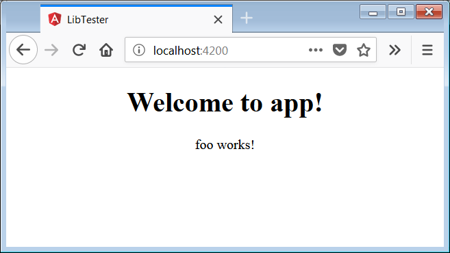

# [翻译] Angular Libary 系列之 构建和打包

构建，打包并在其他的 Angular 应用中真正使用创造的 Angular 库。

> 原文链接： [The Angular Library Series - Building and Packaging](https://blog.angularindepth.com/creating-a-library-in-angular-6-part-2-6e2bc1e14121)

> 原文作者： [Todd Palmer](https://blog.angularindepth.com/@palmer_todd?source=post_header_lockup)

> 译者按：本文使用 库 指代 Angular Library 的概念。
> 
> 本文是 Angular Libaray 系列的第二篇文章，本系列共有三篇文章，涵盖从创建到打包再到发布的全套流程。
> 
> 为了行文方便，以下均以我/我们指代原作者。
>
> 译者：[尊重](https://github.com/sawyerbutton)，校对者：[Ice Panpan](https://github.com/TanYiBing)
<p align="center"> 
    
</p>

> 原作者按：[如果你是 Angular In Depth 的粉丝，请在推特上支持我们](https://blog.angularindepth.com/fan-of-angular-in-depth-and-my-writings-support-us-on-twitter-e3bfcbabb4b1)

在 Angular Library 系列的第二篇文章中，我们将会讨论以下内容：

1. 探索构建库的过程。
2. 使用 npm pack 打包库。
3. 在其他 Angular 应用中从真正意义上使用我们的库。（在系列文章的第一篇中我们是在与创造的库同一工作区内的项目中使用库本身，而本文会在工作区外的项目中使用创造的库）

## 快速回顾一下

在系列的[第一篇文章](https://blog.angularindepth.com/creating-a-library-in-angular-6-87799552e7e5)中，我们使用 Angular CLI 创建了一个工作区。然后我们使用 Angular CLI 创建了一个 Angular 库并将其命名为 **example-ng6-lib**。经过上述操作，我们的工作区中生成了两个项目：

- 在 projects/example-ng6-lib 目录下的库项目。
- 在 src/app 目录下的主应用项目

我们可以将库引入到主应用中并使用库中新添加的组件对库进行测试。

为了方便你理解上一篇的内容，我创建了一个 Github 仓库 [t-palmer/example-ng6-lib](https://github.com/t-palmer/example-ng6-lib)，其包含了[上一篇文章](https://blog.angularindepth.com/creating-a-library-in-angular-6-87799552e7e5)中的全部代码。

## 构建我们的库

现在让我们通过添加一个用于简化构建的脚本，开始我们的 Angular 库探索之路的第二站。向根目录下的 package.json 文件夹中添加一个 build_lib 脚本：

```json
"scripts": {
  ...
  "build_lib": "ng build example-ng6-lib",
  ...
},
```

现在我们可以通过 `npm run build_lib` 指令去构建我们的库了。
该指令会在工作区的 **dist** 目录下创建一个名为 **example-ng6-lib** 的子目录。

在完成对于库的构建之后，我们可以使用 `ng build` 对主应用进行构建。
该指令会在工作区的 **dist** 目录下创建一个名为 **example-ng6-lib-app** 的子目录。

## package.json 文件

太糟糕了，不想要更多的 package.json 文件了。

是的，在库构建完成后，当前工作区内至少已经有3个 package.json 文件了。这些 package.json 文件可能会让你觉得困惑为难，所以我们现在理顺这些 package.json 文件的思路。

### 根目录下的 package.json 文件

这个 package.json 是库工作区的**主 package.json 文件**。我们用该文件来列出主应用和库都需要的依赖项。运行和构建主应用和库所依赖的所有包都必须列举在该文件中。

当我们在开发过程中使用 **npm install** 指令时，新加入的包将会添加到该文件中。

### 库项目中的 package.json 文件

**库项目中的 package.json 文件**位于 **projects\example-ng6-lib** 目录下，其用于告知 **ng-packagr** 将什么信息放入库项目的发布版 package.json 文件中。其 package.json 文件中有三个重要的部分需要注意：

- 名称

这里的名称是指库的名称。未来如果某位用户引入库中的模块，这个名称就是出现在 `from` 部分内的引号中的名称。举例来说大概就是：

```ts
import { ExampleNg6LibModule } from 'example-ng6-lib';
```

- 版本号

版本号对于库而言格外重要，版本号能够帮助用户判断他们是否在使用库的最新版本。使用 npm 包的开发者通常会默认你遵循[版本号语义化](https://semver.org/)规则。

- 依赖项

此项目中只包含用于运行库所必须的依赖项。因此，你将会看到 **dependencies** 和 **peerDependencies**，但是没有 **devDependencies**。

你同样应该在该 package.json 文件中添加那些常见的 npm 内容比如：License，作者，仓库地址等。

值得注意的是，当你使用 **npm install** 指令时，新安装的包只会被添加到根目录下的 package.json 文件中而不是在库项目的 package.json 文件中。因此，当你安装一个库所需要的包时，你需要将包名称手动添加到库项目的 package.json 文件依赖项中。在后续的文章中我们将会讨论 **dependencies** 和 **peerDependencies** 的区别。

## 库的发布版本 package.json 文件


当我们构建库时**库的发布版本 package.json 文件** 由 **ng-packagr** 生成于 **dist\example-ng6-lib** 文件目录下。该 package.json 文件会随着我们的库一并发布。

使用我们的库的开发者将会使用 `npm install` 指令安装该文件中所涉及的那些依赖项。

因为发布版本的 package.json 文件由 **ng-packagr** 生成，故而我们不应直接对其进行修改。如果你希望对发布版本的 package.json 文件进行修改，需要更新 projects\example-ng6-lib 目录下的 **库项目的 package.json** 文件。**ng-packagr** 以 **库项目的 package.json** 文件为基准去生成发布版本的package.json 文件。

> 记住！永远不要直接对发布版本的 package.json 文件作出修改。

## 打包库

打包库是指将生成的发布文件进行打包以生成一个 tgz 文件用以手动分享或发布于 npm。

让我们使用 **npm pack** 指令在根目录下的 package.json 文件中创建一个脚本，该脚本用于打包生成的库。

```json
"scripts": {
  ...
  "npm_pack": "cd dist/example-ng6-lib && npm pack",
  ...
},
```

现在我们只需要使用指令 `npm run npm_pack` 就可以完成对库的打包啦😁！
这条命令用于将文件目录指向工作区的 **dist** 文件夹并执行 **npm pack** 指令，命令将会在同一目录下生成一个形如 **example-ng6-lib-0.0.1.tgz** 的包文件。

就像是任何一个优秀的程序员那样，我很厌倦做重复的事情。所以我创造了一个新的脚本包含 build_lib 和 npm_pack 两个脚本的内容。将下述内容加入到主目录下的 package.json 文件中的脚本对象中去：

```json
"package": "npm run build_lib && npm run npm_pack"
```

现在看看**主目录下的 package.json 文件**，和构建打包相关的脚本如下：

```json
"scripts": {
  ...
  "build_lib": "ng build example-ng6-lib",
  "npm_pack": "cd dist/example-ng6-lib && npm pack",
  "package": "npm run build_lib && npm run npm_pack"
},
```

注意，执行 **package 脚本**将会顺序执行 **build_lib 脚本** 和 **npm_pack 脚本**。

确保在这一步时，你已经成功使用如下指令完成对你的库的构建和打包：

```bash
npm run package
```

package 脚本做了两件事：

1. 在 dist/example-ng6-lib 目录下构建了库。
2. 在同一目录下使用 **npm pack** 指令将库打包为一个 npm 包，其形如：example-ng6-lib-0.0.1.tgz。

需要注意！即使生成的包是 tgz 文件，你也不能以 tgz 格式直接压缩 dist 目录作为包。

> 总是使用 npm pack 创建 tgz 文件

## 在其他 Angular 应用中使用库

现在我们已经构建和打包了一个 Angular 库，让我们创建一个新的测试工作区用来模拟其他人如何在真实的项目中使用我们的库。

### 创建一个测试工作区

在创造新的测试工作区之前，先确定文件目录不在你的 example-ng6-lib 工作区内。确保测试工作区在 example-ng6-lib 工作区的父级目录下。然后使用 Angular CLI 创建一个新的工作区作为已有的 example-ng6-lib 工作区的兄弟工作区。

```bash
ng new lib-tester
cd lib-tester
ng serve
```

如果你需要提供对IE浏览器的支持，查看这篇文章 [Angular 与 IE](https://blog.angularindepth.com/angular-and-internet-explorer-5e59bb6fb4e9)。

当我们打开浏览器并指向 [http://localhost:4200/](http://localhost:4200/)，我们看到默认的 Angular 初始页面。

### 安装库

现在我们已经搭建好了测试应用并希望在应用中使用库的内容。我们需要执行以下指令：

```bash
npm install ../example-ng6-lib/dist/example-ng6-lib/example-ng6-lib-0.0.1.tgz
```

打开 lib-tester 工作区的下的 package.json 文件，你会看到 example-ng6-lib 已经被添加到项目的依赖项中了。我的 package.json 文件如下所示：

```json
"dependencies": {
  "@angular/animations": "^6.0.3",
  "@angular/common": "^6.0.3",
  "@angular/compiler": "^6.0.3",
  "@angular/core": "^6.0.3",
  "@angular/forms": "^6.0.3",
  "@angular/http": "^6.0.3",
  "@angular/platform-browser": "^6.0.3",
  "@angular/platform-browser-dynamic": "^6.0.3",
  "@angular/router": "^6.0.3",
  "core-js": "^2.5.4",
  "example-ng6-lib": "file:../example-ng6-lib/dist/example-ng6-lib/example-ng6-lib-0.0.1.tgz",
  "rxjs": "^6.0.0",
  "zone.js": "^0.8.26"
},
```

如果你查看测试工作区内的 node_modules 文件目录，你会看到一个和库相对应得 **example-ng6-lib** 文件夹。

警告：距离我第一次创造库已经很久了，那时候我还不清楚 npm 中可能存在的风险，所以我想：”等等，我是不是可以用 npm 直接安装库项目的 dist 目录而非其打包的文件？这样的话是不是当我更新我的库时，测试应用也一并可以获取那些更新“。除非你的头特别铁，又喜欢和奇怪的第三方引入错误作斗争，否则一定不要像我刚刚说的那样做。我警告过你了😎。

> 总是！安装库的 .tgz 包而不是库的 dist 目录。

### 引入库模块

为了使用库中的组件，我们首先需要向 App module 中添加库的 module。

为此我们需要在 **src\app\app.module.ts** 文件中作出两处修改：

1. 引入 **ExampleNg6LibModule** 模块

```ts
import { ExampleNg6LibModule } from 'example-ng6-lib';
```

2. 将 **ExampleNg6LibModule** 模块加入到 **AppModule** 的 `imports` 数组中。

现在 **app.module.ts** 应如下所示：

```ts
import { BrowserModule } from '@angular/platform-browser';
import { NgModule } from '@angular/core';

import { AppComponent } from './app.component';
import { ExampleNg6LibModule } from 'example-ng6-lib';

@NgModule({
  declarations: [
    AppComponent
  ],
  imports: [
    BrowserModule,
    ExampleNg6LibModule
  ],
  providers: [],
  bootstrap: [AppComponent]
})
export class AppModule { }
```

### 使用一个库中的组件

现在我们就可以像系列文章的第一篇那样，使用库中的 **enl-foo** 组件了。在 lib-tester 应用中修改 **AppComponent** 组件的 html 模板文件并展示源自于库的 **foo** 组件。修改后的 **app.component.html** 文件如下所示：

```html
<div style="text-align:center">
  <h1>
    Welcome to {{ title }}!
  </h1>
  <enl-foo></enl-foo>
</div>
```

最后我们将浏览器指向熟悉的 [http://localhost:4200/](http://localhost:4200/) 地址，我们可以看到 lib-tester 应用正确地显示了源自于库中的 foo 组件。

<p align="center"> 
    
</p>

到此为止，你应该已经学会了如何对库进行构建和打包。

## 期待

在本系列的[第三部分](https://blog.angularindepth.com/the-angular-library-series-publishing-ce24bb673275)中，我们将会讨论一些轻松的话题，帮助你将库发布到 npm 上以供下载。