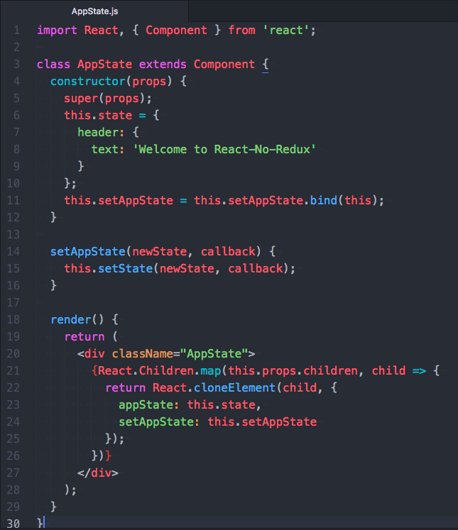
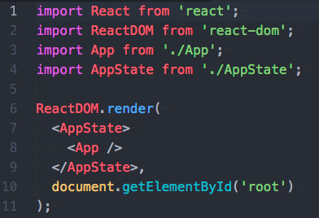
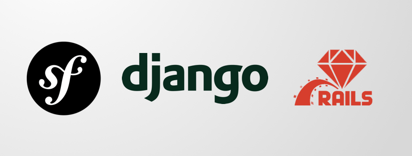

# [翻译] 你到底需不需要redux-反方观点

> 原文链接： **[You Might Not Need Redux](https://medium.com/@dan_abramov/you-might-not-need-redux-be46360cf367)**
>
> 原文作者： **[Dan Abramov](https://medium.com/@dan_abramov)**
>
> 原文链接： **[You Probably Don’t Need Redux](https://medium.com/@blairanderson/you-probably-dont-need-redux-1b404204a07f)**
>
> 原文作者： **[Blair Anderson](https://medium.com/@blairanderson)**
>
> 原文链接： **[Goodbye Redux](https://hackernoon.com/goodbye-redux-26e6a27b3a0b)**
>
> 原文作者： **[Jack R. Scott](https://hackernoon.com/@jackrobertscott)**

> 译者按：本系列文章分为 **你到底需不需要redux-反方观点** 和 **你到底需不需要redux-正方观点** 两部分，翻译这一系列文章的初衷是译者在去年的 **ngChina** 开发者活动中咨询了有关状态管理的问题，当时咨询的问题是 **项目中是否真的需要NGRX这样的状态管理工具**，虽然当时没有得到完全正面的答复，但是会后译者还是觉得形如 NGRX Redux 之类的状态管理工具/包 **对于项目是否真的需要** 这一论题是难以一言以蔽之的，故而翻译系列文章来传递来自多方多角度的观点，关于状态管理的争论必然将持续存在，谨望各位阅读此文的开发者能从中获得启发，获得自己的理解

> 译者：[尊重](https://github.com/sawyerbutton)，校对：[]()

## 你可能并不需要 Redux

开发人员经常在真正需要 Redux 之前就选择其作为项目的状态管理工具。“没有 Redux 的话我们的项目应该如何扩张规模呢？” 这是不加思索的开发者经常说的一句话，但后续却因为 Redux 引入其项目代码中的中间层部分而感到困扰。“为什么我非得经由三个文件才能让一个简单地功能正常运行起来呢？我是想不开吗？！” 类似的场景是这些开发者们的真实写照。

我完全理解开发者们因为这些困境去抱怨 Redux，React，函数式编程，不可变性以及一些其他让他们不舒服的概念/工具的心情。将 Redux 与不需要模板代码也可以执行状态更新的方法 进行比较是很自然的事情，并且得出 Redux 只是复杂的代名词的结论也“理所当然”。某种程度来说，Redux 的设计就是这样的。

事实上，Redux 给与了你做出取舍的机会。Redux 会要求你：

* 将应用程序状态描述为普通对象和数组
* 将系统中的变化描述为普通对象
* 将处理变化的逻辑描述为纯函数

无论是否使用 React，上述要求都不是构建一个应用所必需的。但事实上这些定义是非常强的约束，在使用它们之前，即使是部分用在你的应用中，都应该认真地考虑下。

那么你有充足的理由使用 Redux 吗？

上述这些“限制条件”之所以吸引我是因为它们会通过 以下方式 帮助项目的开发构建：

* 将状态保存到本地存储，开箱即用
* 在服务器上预渲染状态，并以HTML格式将状态发送到客户端，开箱即用
* 将用户操作序列化并将其与状态快照一起添加到自动错误报告中，以便产品开发人员可以**重播**它们以复现错误
* 通过网络传递操作对象以实现协作环境，避免对代码的编写方式进行重大更改
* 维护一个撤消历史记录或实施乐观改变，避免对代码的编写方式进行重大更改
* 在开发的状态历史之间旅行，并在代码改变时从行动历史中重新评估当前状态，即 TDD (测试驱动开发)
* 为开发工具提供全面的检查和控制功能以便产品开发者能够为其应用构建自定义工具
* 在复用大多数业务逻辑的同时提供备用的UI

如果你正在使用[可扩展的终端](https://hyperterm.org/)，[JavaScript调试器](https://hacks.mozilla.org/2016/09/introducing-debugger-html/)或[其他类型的Web应用程序](https://twitter.com/necolas/status/727538799966715904)，对 Redux 进行尝试是值得的，就算不使用 redux，对其背后的理念进行一些思考也是好事(这些概念并不是[新](https://github.com/evancz/elm-architecture-tutorial)[概念](https://github.com/omcljs/om))。

但是如果你是 React 的初学者，不要一开始就使用 Redux。

一开始时你需要去学习[以 React 的方式思考](https://twitter.com/necolas/status/727538799966715904)。当你觉得你真的需要 Redux 或者 你想尝试新鲜玩意的时候，再回来试试 Redux 也不迟。但是注意要谨小慎微地对待 Redux,就像你对待任何高度自洽(highly opinionated)的工具时一样。

如果你觉得你在强行 ”以 Redux 的方式“ 进行开发时，这可能是你或你的团队太把 Redux 当回事的信号。它只是工具箱中的一个工具，[一个疯狂的实验而已](https://www.youtube.com/watch?v=xsSnOQynTHs)。

最后，不要忘了就算你不使用 Redux，你也可以使用 Redux 中所涉及的理念。比如：考虑以下具有本地状态的 React 组件：

```javascript
import React, { Component } from 'react';

class Counter extends Component {
  state = { value: 0 };

  increment = () => {
    this.setState(prevState => ({
      value: prevState.value + 1
    }));
  };

  decrement = () => {
    this.setState(prevState => ({
      value: prevState.value - 1
    }));
  };
  
  render() {
    return (
      <div>
        {this.state.value}
        <button onClick={this.increment}>+</button>
        <button onClick={this.decrement}>-</button>
      </div>
    )
  }
}
```

这样的组件写法完全没问题。我再重复一遍，他一点问题都没有。

使用本地状态一点问题都没有。

Redux 所提供的取舍是提供中间层以解耦”事情何时变化“与”事情如何变化“。

这总是一件好事吗？并不是，Redux 提供的一笔交易。

比如，我们可以从我们的组件中抽取出一个 reducer:

```javascript
import React, { Component } from 'react';

const counter = (state = { value: 0 }, action) => {
  switch (action.type) {
    case 'INCREMENT':
      return { value: state.value + 1 };
    case 'DECREMENT':
      return { value: state.value - 1 };
    default:
      return state;
  }
}

class Counter extends Component {
  state = counter(undefined, {});
  
  dispatch(action) {
    this.setState(prevState => counter(prevState, action));
  }

  increment = () => {
    this.dispatch({ type: 'INCREMENT' });
  };

  decrement = () => {
    this.dispatch({ type: 'DECREMENT' });
  };
  
  render() {
    return (
      <div>
        {this.state.value}
        <button onClick={this.increment}>+</button>
        <button onClick={this.decrement}>-</button>
      </div>
    )
  }
}
```

你会发现我们在没有执行 npm install 的情况下就使用了 Redux，多么神奇！

你是否应该对你的状态组件使用 Redux 或其相关概念吗？可能并不一定。事实上，除非你有计划通过使用中间层让应用获益，你并不需要 Redux。按照新时代的说法，制定计划是成功的关键。

[Redux 库](https://redux.js.org/)仅仅是一组帮助器，用以将 reducers 挂载到单个全局存储对象上而已。你完全可以根据自己的喜好，或多用，或少用。

只是记住，如果你因为使用 Redux 付出了汗水或其他东西，确保你也因此获得了相应的回报。

---

## 你可能并不需要 Redux

> 作者按：我从评论区中获取了超棒的评论，因此我在文章的最后添加了一些相关的链接。

每天都要提醒你自己，听从自己的直觉。

不要相信炒作。

不要过度优化。

不要因为某些包/库很流行就在你的项目中加入他们。

你是否遇到过这样的状况：你的同事们都想要或正在使用 Redux，而你却仍然不知道其中缘由。也许你是一名还在熟悉 React 的高级工程师。亦或者你已经阅读过了 Redux，并在文档中留下了你的怨念。

我写这篇文章的原因是，我曾经是一个初级工程师。我仍然记得我学习 React 时的开心时光和学习 Redux 时遭受的痛苦。我现在还在指导初级工程师/编程初学者，高阶的 React 知识（Redux/Route）毫无疑问是造成 React 学习曲线陡峭的第一缘由。**我们应该怎么办**

### 应用状态

启动一个 create-react-app 项目并创建一个名为 `AppState` 的文件。`AppState` 文件用于在构建应用程序时保留应用所有状态（数据）。

<p align="center"> 
    
</p>

让我们过一遍这个文件：

* 构造函数设定了组件的属性，默认状态和绑定函数
* 函数 `setAppState` 是对 `setState` 的封装，用于允许潜在的记录和类似的功能
* 函数 `render` 则是一个简单的用于 传递状态 并向其 children 提供回调函数的 div 元素

### 更新顶层渲染

<p align="center"> 
    
</p>

现在打开 index.js 文件将 `App` 封进之前创建的组件 `AppState` 中。

这是用于在应用程序的顶层维护状态并传递回调以进行更新的一种基本模式。因为这就是 React 的模式，所以你可以现在就在任何一个版本的 React 中使用之。

该模式最棒的地方在于：其在 AppState 的状态逻辑中建立了清晰简单的联系，保持组件的渲染和基本状态简单明了。

**[代码地址](https://github.com/blairanderson/react-no-redux)**

**[demo地址](https://www.blairanderson.co/react-no-redux/)**

### 比较 Redux 和 组件状态，为什么要比较？

无论是 Redux 还是组件状态，其目标都是创建一种模式以帮助你和你的工作伙伴知晓 在应用逐渐增长的情况下 去哪里增加状态。一些状态的例子比如：

* Ajax 的响应数据（哪一个用户在登录?）
* 页面是否正在加载？已经加载完成了吗?
* 从该组件渲染完成已经经过了多少时间？

创建一个模式去维护状态可以帮助你在应用中跨组件去共享数据。如果你事先没有考虑好创建一个模式去维护状态，那么应用的每一个新组件都毫无疑问地会增加应用的复杂度。

### Movin’ On Up

对于共享状态的需求最好的解决方案就是”将状态存放在更高的地方“。React 的渲染过程是自顶向下的，因此状态也应当被放置在应用的顶端并传递给子组件。这样的状态管理模式允许你将状态于一处更新，而更新效果由别处展示。

### 状态到底是什么

状态是 React 组件中最关键的部分，其用于定义应用当前状况。

你的厨房现在是脏乱还是整洁？它可能现在是脏乱的，但是如果你清理它，那么厨房的状态就会变成整洁。在 React 组件中，我们通过内建方法 `setState` 持续追踪应用的状态。

更新状态：

```javascript
//with a function(best)
this.setState(function(prevState, props) {   
  return {dirty: false}; 
});
//or with an object(ok but buggy with big apps)
setState({dirty: false})
```

之后你就能在应用中看到值：

```javascript
{this.state.dirty && <div>this kitchen is totally dirty</div>}
```

那么 Redux 会做什么呢？Redux 保持应用的状态并提供一种模式用于将状态插回到应用顶层的组件中。问题是 Redux 增加了一些不是真正必要的新概念，除非你的应用程序在开发过程中因为没有人遵循单一的模式而变得很大且真的很难处理，否则你并不一定需要它。

我再次重申，[我没有反对 Redux](https://medium.com/@blairanderson/hi-mark-ill-add-your-link-to-the-end-of-the-article-8f0ab879b474)。我只是希望你不要过早地接触使用 Redux，因为在不必要的情况下使用 Redux 将会让你的同事们感到困惑和恼怒。

希望你也去看看下面的文章：

[全栈 React：Redux 以及 Redux为什么对你会有益处](https://www.fullstackreact.com/articles/redux-with-mark-erikson/)

[React 异步样例（不含 Redux）](https://medium.com/@blairanderson/react-async-example-without-redux-ba7337d6545f)

如果你还感兴趣的话，可以阅读下面这篇 [新的React 错误捕获解决方案](https://medium.com/@blairanderson/react-v16-new-error-handler-example-d62499117bfa)

---

## 再见 Redux

完整分析之：为何我们过去需要 Redux，为何现在不再需要 Redux

<p align="center"> 
    
</p>

在过去的几年中，互联网技术已经转向于前端 JavaScript 框架的研究 前端框架已经成为了一种为Web端和移动端应用程序打造更好的用户体验的方法。这是特别酷的一件事🔥，我个人特别喜欢这些框架带给我们的灵活性。

> 但是某种意义上来说，这些灵活性太大了一些。

为了真正了解为何出现这样的情况，让我们回到过去看看在框架存在之前网络应用都是如何被构建的。

### ⏳JavaScript 之前的大陆

在最开始几个前端框架面世之前（比如最出名的 AngularJs，Backbone 和 Ember），会通过在服务端渲染模板并将整个 Html 页面发送到浏览器的方式进行网页构建。那个时候最流行的框架包括：

<p align="center"> 
    
</p>

* Django(Python) - 于 2005年7月21日初次发布，距今13年
* Ruby on Rails - 于 2005年12月13日初次发布，距今13年
* Symphony(PHP)- 于 2005年10月22日初次发布，距今13年

这些框架随着 MVC（Model-View-Controller 应用开发架构） 的概念被创造出来。Model 代表了数据的”样貌“，views 是描述如何展示数据的模板，而 controllers 链接两者。

虽然过去也使用 Javascript，但是我们讨论更多像是 jQuery sliders 插件以及一些其他的库，它们会附带一些完全没必要的反弹特效...

基于这些框架所开发的 App 都有一些问题，但是从总体来说，他们都还算运行良好。然后有一天， Ryan Dahl 产生了一个特别棒的想法，从更多地角度去使用 JavaScript 而不是仅仅用他们去制造愚蠢的动画效果。他开发出了第一版本的 Node.js，Node 允许开发者脱离浏览器环境在服务器上写 JavaScript。

* Node.js - 于 2009年5月27日初次发布，距今9年

突然，开发者们开始欣赏 JavaScript 真正的能力，只用少量的代码就能完成许多实现的能力。这样的状况激活了其他开发者的大脑，他们开始考虑 JavaScript 身上存在的可能性。人们不仅仅开始为 Node.js 构筑更加强大的工具，甚至开始创建有趣的前端框架。在这之后的数年中，Node 给 JavaScript 的开发带来了雪球效应。

<p align="center"> 
    
</p>

* Express.js（后端）- 于 2010年11月16日初次发布，距今8年
* Backbone.js （前端）- 于 2010年10月12日初次发布，距今8年
* AngularJs（前端）- 于 2010年10月20日初次发布，距今8年
* Ember.js（前端）- 于 2011年12月8日初次发布，距今7年。

Node 带来的潮流对网络应用的开发方式产生了巨大的影响。过去完全由服务端处理的MVC 框架被分为两个部分，一个用来处理 MC（Models 和 Controllers）的服务端，和一个使用上述 JavaScript 框架打造的用于处理 View 的前台客户端。这些早期框架中的一部分同样在 View 中包含 Models 和 Controllers。双份的 Models 和 Controllers，其中一些在前端，一些在后端，这听起来会是很大的代码量！🙇🏽‍

### 🤦‍Facebook 所遇到的问题

每个开发者都对这样的欣欣向荣的时代感到快乐。只要你愿意动脑子好好思考和学习这些新的知识，每件事都正常工作并且相对而言易于理解。

然后有些事情发生了...

Facebook在快速扩张并且成为了世界上最大的网络应用。你可以想象的到，成为世界上最大的网络应用必然意味着一些挑战。其中最让人头疼的问题是，在头部栏目中展示正确的通知数量。

<p align="center"> 
    
</p>

当用户开始使用 Facebook 应用时，会期待应用的通知功能能够正常更新。但是通常情况并非如此。我不知道是否在那个时期使用过 Facebook 或者你是否还记得，这些通知功能一直不正常...出现这样的问题是因为，网页应用很难识别中应用中的一部分发生了变化（比如：你阅读了一条信息）并且向另一个区域展示那个变化（比如：将未读信息的数量减一）。

这还不是世界上最糟糕的事情，这个问题可以通过重载页面解决 - 但是 Facebook 拥有超过 1000 个活跃的员工，他们决定是时候将这个问题放在台面上好好对待了。所以他们重新思考了前端框架处理信息的方式并且决定创造属于他们的框架 - React。

* React（前端）- 2013年3月初次发布，距今5年

这个新框架擅长于渲染 HTML 并专注于此，并没有提供太多关于如何开发应用的指导。除此之外，Facebook 的创造者们还推出了 Flux，而 Flux 则最终演变成我们称之为 Redux（Redo-Flux）的产物。下面的视频连接描述了再 2014/2015 年度 网络大会上[介绍并解释的 Flux 和 React](https://youtu.be/nYkdrAPrdcw)

### 🍐 之后事情开始变得糟糕

Redux 的工作方式是通过在一个 JavaScript 的对象中存储应用的所有动态信息。当应用的某个部分需要展示某些信息时，他会从服务端请求相应的数据，更新这个 JavaScript 对象，然后再向用户展示这些数据。通过将所有信息存储在一个地方的方式，无论你在应用的哪个部分去查看这些信息，应用总是能够展示正确的信息。通过这样的方式，Facebook 的通知问题也被解决了。

突然间，出现了一个新的构建网络应用的框架；React 的 Redux 实现。Facebook 设法去解决了他们的问题，而每个人也因此得到了幸福的生活..应该是这样的剧本才对吧?

✋ 并不完全是。

问题是开发者们（包括我自己）开始使用单个对象去存储所有的应用信息，每一份由服务端所提供的信息。的确Redux 这样的方式能够保持所有的信息总是最新的，但是它却有三个主要的缺点：

1. 你需要编写很多额外的外码以让Redux正常工作，而这会消耗你大量的时间
2. 通过将所有的信息放置在一个地方，你会面对名为”陈旧数据“的问题，这意味着你的应用中可能会包含很多你不需要的信息，而这些信息来源于信息之前的状态。
3. 对于新的开发者学习曲线一下就拉满了，并且逐渐导致新的工程师很难去适应前端网页开发。

我们设法将 2005年那种使用 MVC 框架通过一些简单的模板向用户展示数据的相对简单的任务 转换成了 使用超过后端10倍的代码量所实现的单片前端应用。比如，我最近开发了一个简单的应用并使用[WakaTime](https://wakatime.com/)来测量我写代码的时间。结果如下:

* React Redux 前端仓库 - 花费32小时
* Express + Mongoose 后端仓库 - 花费4小时

你可能觉得我在开玩笑🤯，我在前端项目上花费了相对于后端8倍的时间。让我们深入了解一下需要写那么多额外的代码的原因。下面是一个例子，描述了我向前端仓库添加一个基础的数据获取请求（比如：获取所有的用户）的业务功能所需要遵从的步骤。

`🚧 警告：下列步骤因太过于技术指向，所以你不必担心你跟不上我的节奏`

1. 创建一个组件去展示用户列表（此时没有什么问题）
2. 创造一个 `fetch` 请求API
3. 在状态中添加一个域
4. 添加一个新的 action 用于更新数据的状态
5. 添加一个新的 thunk 方法用于执行 fetch 请求并且通过使用刚刚创建的新 action 更新数据状态
6. 使用 `connect()` 方法向组件中添加刚刚新创建的 thunk 方法，这个流程会被封装在一个 dispatch 方法中
7. 通过 `connect()` 方法从 Redux 状态中抽取出数据
8. 在组件的 prop 类型中申明 thunk 方法和抽取出的数据域
9. 在 `componentDidMount()` 方法中请求 thunk 方法
10. 最后将数据渲染进 DOM 中

天哪..十个步骤...回到 Ruby on Rails 的美妙好时光，我所需要做的事只有 把数据放进我的 Html 模板中然后就没有然后了，这也能创造同样的结果。因此我意识到有些事情需要被改变。

### ☝️一个新方法

Redux 能够帮助你的前端项目保持状态同步，然而它也带来了它自己的问题（如上所述)。当你在思考这个问题的时候，你不禁会考虑 Redux 实际上给我们带来了多少额外的功能？

基本是，我们重写了我们整个前端项目仅仅是为了解决一些琐碎的问题。

无论如何，Facebook 也意识到这一点，并且实际上开始研究一种名为 GraphQL 的新技术来帮助解决这个问题。GraphQL 在今年可是一个流行词，但是我不确定是不是每个人都真的理解**为什么**它这么酷。

GraphQL 一点都不像 Redux。再次重申，Facebook已经推出了一款令人惊叹的产品，但未能说清楚为什么这款产品中的新功能如此重要；因此我将会花几分钟向你介绍一些背景。

总体来说，GraphQL 是一辆轿车，而 Redux 则是一匹马。

#### Redux 为什么是一匹马？

我之所有用汽车和马来形容 GraphQL 和 Redux 的原因，是因为读者能很好地区分出这两者的不同，汽车和马是完全不同的存在，一个是有轮子的机械，一个是有四条腿的动物。但是，他们存在的意义和目标是相同的，比如：载着人前往他们想去的地方。汽车行驶在街道上并使用汽油作为燃料，然而马则是能够跃过石头的伟大动物。汽车和马都有自己所拥有的优势和使用场景，但是就结果来说，汽车能帮助你更快地抵达你所期望的目的地。

#### 那么，什么是 GraphQL呢？

GraphQL 的官方文档将 GraphQL 描述为 ”GraphQL 是一种用于 APIs 的查询语言“，只是这样描很不清晰。本质上，官方所说的查询语言的含义是，GraphQL 实际上取代了可能有数百个HTTP端点的API。因为这项技术还很年轻，文档和技术支持都还有些难以理解，学习曲线也有些陡峭。为了帮助读者简单地理解 GraphQL，这里有一个例子。

GraphQL 将会替换端点，比如：

* GET /users/1234567890
* POST /cars
* PUT /example/endpoints

使用者仅在需要时创建的自定义查询：

```JavaScript
{
  user(id: "1234567890") {
    name,
    email
  }
}
```

将会返回；

```JAVASCRIPT
{
  "user": {
    "name": "Luke Skywalker",
    "email": "luke@iamyourfather.com"
  }
}
```

稍等，自定义查询，你不禁会思索，这个功能会花费大量时间去实现吧。

索性事实并非如此。原因是 通过只请求你所需要的数据的方式，突然之间，你就不需要为同样的功能写很多的服务请求，这样意味着你不再需要为这些服务器请求写很多的代码了。因此，你可以从不需要实现的代码中节省大量的时间。

#### 🤷‍但是 GraphQL 如何代替 Redux 呢？

这是一个很棒的问题。简单来回答，并没有代替。然而，GraphQL 的功能是鼓励你，不要将应用中的信息存储在 Redux 给与你的单一对象中。这是因为每一个查询是自定义，并且只设计于用于应用的某一部分而不是整个应用。这可能是用来存储数信息的一个不那么符合逻辑的反模式，在应用程序的广义数据源中存储特定于应用程序的单个部分的信息。

通过使用 GraphQL，你移除了你对于 Redux 的依赖并且因此移除了大量不需要的代码。

同样值得注意的是，GraphQL 和 Redux 是可以在一个应用里共存的。如果你已经在应用中使用了 Redux，那么慢慢地将 GraphQL 集成到应用中会更加合适。这里有些[文档](https://s3.amazonaws.com/apollo-docs-1.x/redux.html)将会帮助你将 GraphQL 和 Redux 应用在一个应用中。

使用 Redux 变成了一个选择。使用它去解决一些琐碎的任务并理解其带来的问题和开销，或者用其他技术去替换这些任务。

#### 好的，那我们应该用什么呢？

在当时，Redux的确是一个解决问题的好方法。然而，随着它的问世，web 开发已经进入了指数级发展的阶段，随着这些进步，web sockets 领域的进步和发展也应声而至。

Web sockets 是服务端和客户端之间的开发式链接，服务端可以告知客户端何时进行更新。好消息是，GraphQL 直接以名为 subscriptions 的方式开箱支持 Web sockets。我们可以直接使用这些订阅去更新应用的希望保持状态同步一部分。

主要的区别是，不是 由客户端通知应用某些部分需要更新（比如使用 Redux），而是由服务端通知客户端某些数据需要被更新。这两个流程都会产生同样的结果。这里有[几个](http://thecodebarbarian.com/a-nodejs-perspective-on-mongodb-36-change-streams.html)[例子](https://mongoosejs.com/docs/api.html#model_Model.watch)可以帮助你了解如何在项目应用 web sockets 或者 subscriptions 配合 MongoDB 或 Mongoose。

### 🚀未来一片光明

GraphQL 已经开发了有一段时间了，现在处于可以舒适地用于生产的阶段。我不想说谎，现在文档还是很难去理解，需要对于 JavaScript 的深刻了解并了解服务端的工作方式。假设你还没有准备好去学习或觉得还很难理解其根本，至少你需要了解 GraphQL 存在的意义及其目标。这个链接指向一个非常流行的 [GraphQL 教程](https://graphql.org/learn/)。

市面上还有很多能立刻集成到你的应用产品中的很棒的库。不用担心，你不必要一次性把事情都做完，随着时间推移和琢磨，这些库能够帮助你的应用逐渐实现转变。[Apollo](https://www.apollographql.com/) 是一家正在专注于此的公司。

本文就准备到此为止了。我希望通过本文，可以帮助你了解一些复杂的概念，不要被概念所困扰。