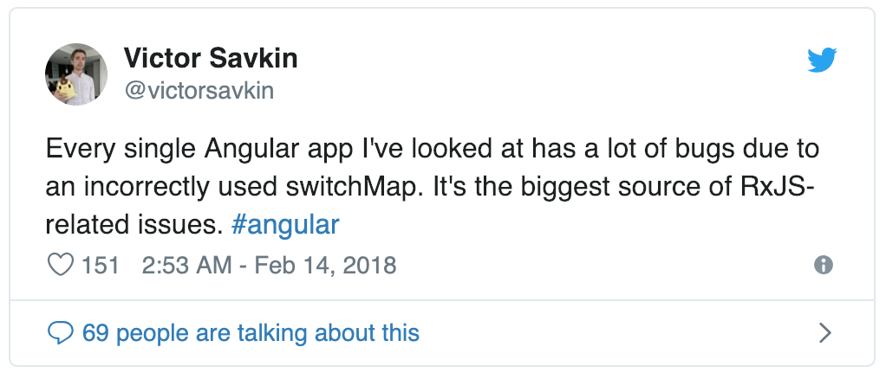

# [翻译] RxJS: 避免 switchMap 的相关 Bug

>原文链接：[RxJS: Avoiding switchMap-Related Bugs](https://blog.angularindepth.com/switchmap-bugs-b6de69155524)
>
>原文作者：[Nicholas Jamieson](https://blog.angularindepth.com/@cartant?source=post_header_lockup)
>
>译者：[vaanxy](https://github.com/vaanxy)；校对者：暂无

前一阵子，[Victor Savkin](https://medium.com/@vsavkin) 发送了一则推文，是关于在 Angular 应用中的 Ngrx effects 中误用 `switchMap` 而引发的一个不易察觉的 bug：

#### 这个 bug 是什么呢？

让我们通过购物车这个例子来看下这个 effect `switchMap` —  以及一个 epic — 在这个 epic  中误用了 `switchMap` ，接着我们再考虑使用一些其他可供选择的操作符。

> 译者注：epic 是 `redux-observable` 中一种函数的统称，[该函数接收一个 actions 的流并返回一个 actions 的流。 **Actions in, actions out.**，它是 `redux-observable` 最基础的核心之一](https://redux-observable.js.org/docs/basics/Epics.html)。

这是一个误用了 `switchMap` 的 NgRx effect：

~~~typescript
@Effect()
public removeFromCart = this.actions.pipe(
  ofType(CartActionTypes.RemoveFromCart),
  switchMap(action => this.backend
    .removeFromCart(action.payload)
    .pipe(
      map(response => new RemoveFromCartFulfilled(response)),
      catchError(error => of(new RemoveFromCartRejected(error)))
    )
  )
);
~~~

这是一个等价的 `redux-observable` epic

~~~typescript
const removeFromCart = actions$ => actions$.pipe(
  ofType(actions.REMOVE_FROM_CART),
  switchMap(action => backend
    .removeFromCart(action.payload)
    .pipe(
      map(response => actions.removeFromCartFulfilled(response)),
      catchError(error => of(actions.removeFromCartRejected(error)))
    )
  )
);
~~~

我们的购物车列出了用户想要购买的物品，并且每一项都包含了一个按钮可将物品从购物车中移除。点击该按钮会给 effect/epic 发送一个 `RemoveFromCart` 的 action，effect/epic 会和应用的后端进行通讯并且我们会看到物品从购物车中被移除了。

大多数时候，这个函数的执行结果会和我们预期的一样。而然使用 `switchMap` 引入了竞争状况（race condition）。

> 译者注: [race condition 释义 wiki 链接](https://en.wikipedia.org/wiki/Race_condition#Software)

如果用户在购物车中点击了好几个物品的移除按钮，那么会发生什么情况将取决于按钮被点击的速度。

如果当 effect/epic 正在和后端进行通讯时(即，原先的移除请求正在提交中)，一个移除按钮被点击了，使用  `switchMap` 将会中止这个正在提交的移除请求。

所以说，根据按钮点击得速度，应用可能会发生以下几种情况：

- 从购物车中删除了所有被点击的物品；
- 从购物车中删除了部分被点击的物品；
- 在后台中删除了部分被点击的物品，但是在前台的购物车中并没有反映出来。

很明显，这是一个 bug。

不幸的是，当要使用打平操作符（flattening operator）时 `switchMap` 总是第一个被推荐使用的，但它并不能在所有的场景下都被安全的使用。

RxJS 有四大打平操作符可供选择：

- `mergeMap` （亦称为 `flatMap`）；
- `concatMap`；
- `switchMap`；
- `exhaustMap`；

让我们来看一下这些操作符之间的区别以及哪一个操作符更适合购物车这一场景。

#### mergeMap/flatMap

如果使用 `mergeMap` 来替代 `switchMap`，effect/epic 将会同时处理每一个被派发的 action。也就是说，正在提交中的移除请求不会被中止；这些后台请求会同时发生，当完成之后，响应的 action 会被派发出去。

需要重点注意的是，由于在同时处理这些 actions，响应的返回次序可能会和发送次序不一致。例如，如果用户依次点击了第一、第二个物品的移除按钮，第二个物品有可能会先于第一个物品被移除。

对于我们的购物车而言，移除次序并不重要，因此使用 `mergeMap` 来替代 `switchMap` 能够修复这个 bug。

#### concatMap

物品从购物车中移除的次序可能并不重要，但是也有很多 actions，对他们来说次序是很重要的。

例如，如果我们的购物车中有一个按钮能够增加物品的数量，那么被派发出去的 actions 以正确的次序被处理是很重要的。不然的话，在前端购物车里数量会和后台购物车里的数量不同步。

对于那些很看重次序的 actions 来说，我们应该使用 `concatMap`。 `concatMap`等价于使用 `mergeMap` 时将其 concurrency 参数设置成1。也就是说，一个使用 `concatMap` 的 effect/epic  每次只会处理一个后端请求，actions 会按照它们被派发出去的顺序依次进行排队。

`concatMap` 是一个安全，保守的选择。如果你不确定该在 effect/epic 用哪个打平操作符，那么请使用 `concatMap`。

> 译者注：`concatMap` 的实现就是使用 `mergeMap` ，并将其 concurrency 参数设置成1，[详见源码](https://github.com/ReactiveX/rxjs/blob/be19ce94f769d210b89e75444158278a87b48c1c/src/internal/operators/concatMap.ts#L69-L74)。

#### switchMap

当使用 `switchMap`，你会发现当同类型的 action 被派发时，原先正在提交的后台请求会被中止。这使得 `switchMap` 对于增，改、删 action 来说不太安全。然而对于读取的 action 来说，它也可能会引入 Bug。

`switchMap` 是否适用于读取的 action 取决于当同类型的另一个 action 被派发时，是否仍然需要原先的后台响应。让我们来看一下一个可能会引入 bug 的 `switchMap` 使用场景。

如果我们购物车中的每一个物品有一个详情按钮，用于在行内显示一些详情信息，并且 effect/epic 使用 `switchMap` 处理这些详情 action，这样会引入争用条件。如果用户点击了多个物品的详情按钮，这些物品的详情信息是否会显示取决于用户点击这些按钮的速度。

和 `RemoveFromCart` action一样，使用 `mergeMap` 能够修复这个 bug。

`switchMap` 应该仅在以下情况中使用：effects/epics 中的读取 action 并且当同类型的另一个 action 被派发时，我们并不需要保留原先的后端响应。

让我们来看一个 `switchMap` 有用的场景。

如果我们的购物车应用需要显示包含运费的物品总价，每次购物车里的内容发生变化都会派发一个 `GetCartTotal` action。在 effect/epic 中使用 `switchMap` 来处理 `GetCartTotal` action 是完全合适的。

如果当 effect/epic 正在处理一个 `GetCartTotal` action时购物车里的内容发生了变化，原先正在提交的请求所对应的响应就没有用了，因为这个响应的内容将会是购物车发生变化前的所有物品的总价，所以中止这个提交中的请求没有任何问题。事实上，比起让这个提交中的请求完成后再忽略掉其对应的过期响应，或者更糟糕是将这个过期的响应渲染出来，利用 `switchMap` 中止这个提交中的请求是更合适的选择。

#### exhaustMap

`exhaustMap` 可能是最不被人熟知的打平操作符，但是解释它的原理却很简单；可以认为它是和 `switchMap` 相对的。

如果使用 `switchMap`，由于更倾向于最近被派发的 actions，原先那些被挂起的后端请求会被中止。而然，如果使用 `exhaustMap`，当已经存在正在提交中的请求时，被派发出的 action 都会忽略掉。

让我们来看一个 `exhaustMap` 有用的场景。

有这么一类特别的用户开发者们应该很熟悉：“无休止的按钮点击者”。这类用户每当点击按钮后发现没有任何响应时，他们会一次又一次地重复点击这个按钮。

如果在我们的购物车中有一个刷新按钮，effect/epic 使用 `switchMap` 来处理刷新，那么每点击一次刷新按钮都将会中止当前正在提交的刷新请求。这并没有多大意义并且“无休止的按钮点击者”们会在刷新发生之前不断地长时间地点击这个刷新按钮。

如果 effect/epic 使用 `exhaustMap` 来处理购物车的刷新事件，正在提交的刷新请求将会看到这些无休止的点击被忽略了。

#### 总结

总结一下，当你需要在 effect/epic 中使用打平操作符时你应该：

- 当 actions 既不应该被中止，也不应该被忽略，并且其次序也必须保持不变，请使用 `concatMap`。它也是个保守的选择，因此其行为总是可以被预测的。
- 当 actions 既不应该被中止，也不应该被忽略，并且其次序并不重要，请使用 `mergeMap`。
- 和读取相关的 actions，并且当有同类型的 action 发出时这些原有 actions 应该被中止，请使用 `switchMap`。
- 当有同类型的 action 发出时，原有的 actions 应该被忽略，请使用 `exhaustMap`。

#### 使用 TSLint 避免 switchMap 的误用

我在 `rxjs-tslint-rules` 包中增加了一条 `rxjs-no-unsafe-switchmap` 规则。

该条规则能够识别 NgRx effects 以及 `redux-observable` epics，决定它们的 action 类型，然后根据 action 的类型搜索具体的动词（如`add`，`update`，`remove` 等）。它包含一些实用的默认值，如果这些默认值太笼统，你也可以[对它们进行配置](https://github.com/cartant/rxjs-tslint-rules#rxjs-no-unsafe-switchmap) 。

启用这条规则之后，我对我去年写的一些应用运行了 TSLint，我发现了好几个 effects 以不太安全的方式在使用 `switchMap`。 所以谢谢你的推文，Victor。
