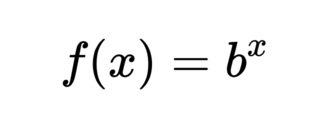
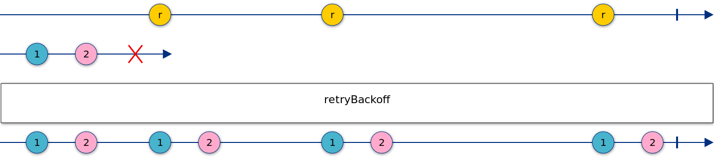
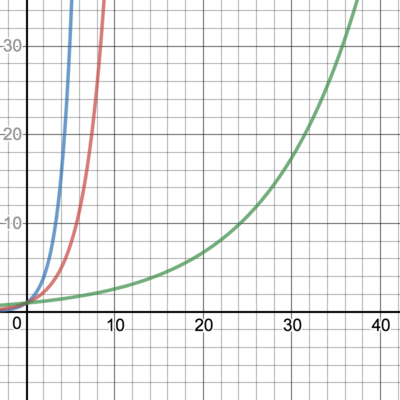
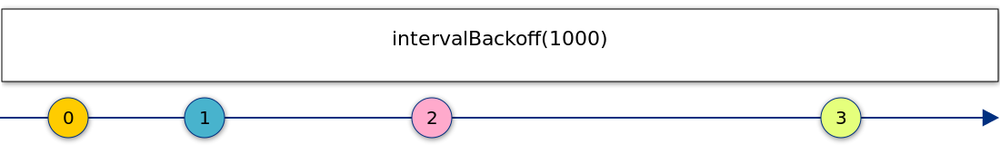

# [翻译] 指数退避场景下 RxJS 的妙用

> 原文链接：[Power of RxJS when using exponential backoff](https://blog.angularindepth.com/power-of-rxjs-when-using-exponential-backoff-a4b8bde276b0?source=---------8---------------------)
>
> 原文作者：[Alex Okrushko](https://blog.angularindepth.com/@alex.okrushko?source=post_header_lockup)
>
> 译者：[vaanxy](https://github.com/vaanxy)；校对者：[dreamdevil00](https://github.com/dreamdevil00)

大多数现代化的 Angular 网页应用与后台服务通讯时均采用 Ajax 请求。这些请求涉及到多个网络组件（例如路由，交换器等）同时还与服务器状态有关，并且任何一步都不能出错才能保证这些请求发送成功。然而，有些时候并不是这样子。

为了处理这些情况， 网页应用通常会实现重试逻辑，重新发送这些请求直到请求发送成功或者达到了请求最大尝试次数。在大多数场景下，简单的重试操作足够达到我们的目的，但是有些时候我们需要更高级的方法。

### 什么是指数退避？

指数退避是一种算法，该算法每次指数级增长重试的推迟时长。本文将深入探讨两个使用了指数退避的自定义 RxJS操作符（两者皆是  `backoff-rxjs` [包](https://www.npmjs.com/package/backoff-rxjs)中的一部分）并且还会涵盖两者的用例：

- `**retryBackoff**`, 操作符在发生错误时进行重试
- `**intervalBackoff**`, 操作符发出连续数字（sequential numbers）

#### 指数函数

在本文中，我已经多次使用了 *指数* 这个字眼，但是它意味着什么呢？从数学角度来说，它是一个函数，其形式如下所示：

在我们的案例中，随着新的值不断被发射出来（上述函数中的x）它们之间的延迟时间也将越来越长。将其翻译成代码中的函数，其形式如下所示：

~~~typescript
function calculateDelay(iteration, initialInterval) {
 return Math.pow(2, iteration) * initialInterval;
}
~~~

如果迭代从 0 开始，初始间隔为 1000 毫秒，则发射值将为 1000 ，2000 ，4000 ，8000 …

既然指数的含义明白了， 就进入第一个用例吧。

------

### 1. retryBackoff

指数退避最常见的使用场景便是当发生错误时进行重试。Google Cloud Storage (GCS)是一个很好的例子，当请求失败并进行重试时，它要求采用[这种策略](https://cloud.google.com/storage/docs/exponential-backoff) 。

在编写 `backoff-rxjs` 之前我找到一些指数退避进行重试的例子，如[这个 gist](https://gist.github.com/hzsweers/7902e3a0286774630f4f) 或者是[这个 stackoverflow 的回答](https://stackoverflow.com/a/41873022/1167879)，但是没有一个足够灵活以满足我的需求；因此我创造了`retryBackoff`。

`retryBackoff` 接收一个数字作为初始延迟时长，它亦可接收一个 `RetryBackoffConfig` 来对其进行更多配置。 RxJS 使用弹珠图（[marble diagrams](http://reactivex.io/rxjs/manual/overview.html#marble-diagrams)）来可视化操作符是如何工作的，以下便是该操作符的弹珠图。

注意到 `retryBackoff` 操作符的行为和 `retry` 操作符很相似并且可以简化成如下形式：

~~~typescript
message$ = of('Call me!').pipe(
    switchMap(() => this.service.callBackend()),
    retryBackoff(1000),
);
~~~

#### RetryBackoffConfig

如果需要对 `retryBackoff` 进行更多自定义配置，该操作符也可接收一个 `RetryBackoffConfig` ，其形式如下所示：

~~~typescript
export interface RetryBackoffConfig {
  initialInterval: number;
  maxRetries?: number;
  maxInterval?: number;
  shouldRetry?: (error: any) => boolean;
  backoffDelay?: (iteration: number, initialInterval: number) => number;
}
~~~

举个例子，如果我们想要将 最大重试次数设置为 12 ，我们可以按照以下形式进行调用：

~~~typescript
message$ = of('Call me!').pipe(
    switchMap(() => this.service.callBackend()),
    retryBackoff({
        initialInterval: 100, 
        maxRetries: 12,
    }),
);
~~~

让我们来看一下 `RetryBackoffConfig` 的属性

- `initialInterval` —初始延迟时长，与此同时，接下来所有的延迟时长均是基于该值计算得到的；这是唯一一个必填项
- `maxRetries` — 最大重试次数
- `maxInterval` —两次重试之间的最大时间间隔
- `shouldRetry` — 你可以在该函数内对错误进行分析来决定是否继续重试（返回  `true`）还是停止重试（返回 `false`）
- `backoffDelay` — 该函数用于自定义延迟时长的计算。

最后两个函数（`shouldRetry`  和  `backoffDelay`）我觉得需要提供一些更多的信息

#### shouldRetry 函数

有时候，当我们得到特定错误时我们希望停止重试，例如，如果返回的状态码为404，这一点小变化会导致该请求永远不会成功。

~~~typescript
// Determine if the error matches our expected type
// http://www.typescriptlang.org/docs/handbook/advanced-types.html#user-defined-type-guards
function isHttpError(error: {}): error is HttpError {
  // This is a type guard for interface
  // if HttpError was a class we would use instanceof check instead 
  return (error as HttpError).status !== undefined;
}

message$ = of('Call me!').pipe(
    tap(console.log),
    switchMap(() => this.service.callBackend()),
    retryBackoff({
      initialInterval: INIT_INTERVAL_MS,
      maxInterval: MAX_INTERVAL_MS,
      shouldRetry: (error) => {
        // error could be anything, including HttpError that 
        // we want to handle from sevice.callBackend()
        if (isHttpError(error)) {
          // If this is HttpError and status is not 404
          // then continue retrying
          return error.status !== '404';
        }
        // should retry for the rest of the types of errors.
        return true;
      },
    }),
)
~~~

#### backoffDelay 函数

默认情况下，每个间隔之间的延迟时长将增加一倍，但有时需要更平滑的退避。通过 `backoffdelay` 属性，我们可以提供自定义延迟时长的计算函数，例如：

`backoffDelay: (iteration, initialInterval) => Math.pow(**1.5**, iteration) * initialInterval` ,
或者我们可以降低延时的增长速率。
`backoffDelay: (iteration, initialInterval) => Math.pow(**1.1**, iteration) * initialInterval`

蓝线: y = 2^x, 红线: y = 1.5^x, 绿线: y = 1.1^x

#### 示例

StackBlitz中提供了完整的应用示例

[**exponential-backoff-retries-example — StackBlitz**](https://stackblitz.com/edit/exponential-backoff-retries-example?embed=1&file=app/app.component.ts&hideExplorer=1)

------

### 2. intervalBackoff

你有没有想过当你睡觉的时候你的应用在做什么？在许多保持打开的选项卡中，它是否仍在努力使用宝贵的资源查询您的服务器？

指数退避的**第二个用例**是通过指数增加每个请求之间延迟时间来减少请求的频率。当应用程序检测到没有用户活动时这项技术可能会派上用场（例如，没有鼠标移动）。

让我们看下这段代码。

~~~typescript
import {fromEvent} from 'rxjs';
import {sampleTime, startWith, switchMap} from 'rxjs/operators';
import {intervalBackoff} from 'backoff-rxjs';
import {service} from './service';

const newData$ = fromEvent(document, 'mousemove').pipe(
  
    // There could be many mousemoves, we'd want to sample only
    // with certain frequency
    sampleTime(1000),

    // Start immediately
    startWith(null),

    // Resetting exponential interval operator
    switchMap(() => intervalBackoff(1000)),
    switchMap(() => service.getData()),
  );
~~~

现在让我们来分解下，看看发生了什么：

- *`document` 上追踪的 mousemove* 事件用于指示用户的活跃状态
- 当鼠标移动时，该事件会非常频繁地触发，因此我们使用 `sampleTime` 作为这些事件的过滤器
- `sampleTime` 仅在指定的时间到期时才发出第一个值。如果我们需要立即发射出第一个值（在大多数情况下我们需要这么做），那么 `startwith` 操作符可以帮助我们做到这一点。
- 现在我们来到了 `intervalbackoff` ，它是一个[可管道的操作符(pipeable operator)](https://blog.angularindepth.com/rxjs-understanding-lettable-operators-fe74dda186d3)，工作原理类似于 `interval` 操作符，但是，它没有使用相同的延迟时长，而是在每次延迟后会将下一次的延迟时长加倍。
- 一旦 `intervalBackoff` 发射出值我们就可以调用服务了。 

注意，每次检测到 *mousemove* 事件后将会重置 `intervalBackoff`。

下面是 `intervalBackoff` 的弹珠图：

与 `retryBackoff` 类似， `intervalBackoff` 同样也是可配置的，它可接收一个配置对象而不仅仅是一个初始的延迟时长。

~~~typescript
export interface IntervalBackoffConfig {
  initialInterval: number;
  maxInterval?: number;
  backoffDelay?: (iteration: number, initialInterval: number) => number;
}
~~~

#### 示例

使用 `intervalBackoff` 的应用示例：

[**exponential-backoff-interval-example — StackBlitz**](https://stackblitz.com/edit/exponential-backoff-interval-example?file=app/app.component.ts)

------

### 总结

指数退避是一个非常有用的策略，它至少有2大用例： **interval backoff**  以及 **retry backoff**。 `backoff-rxjs` 为这两大用例提供了 pipeable 的操作符，并且它们仅仅是[现有 RxJS 操作符的组合](https://blog.angularindepth.com/rxjs-combining-operators-397bad0628d0)。

源码: <https://github.com/alex-okrushko/backoff-rxjs>

------

鸣谢 [**Ben Lesh**](https://medium.com/@benlesh), [**Max NgWizard K**](https://medium.com/@maximus.koretskyi) 和 [**Nicholas Jamieson**](https://blog.angularindepth.com/@cartant) ，谢谢他们审核了本文以及相关的操作符，并且提供了非常有价值的反馈。

同时，我对读者的反馈也感到好奇（可能还存在其他我尚未提及的指数退避的场景？），也欢迎大家提问或者发表相关评论👇

如果你想讨论更多，你可以在推特上找到我 [@AlexOkrushko](https://twitter.com/AlexOkrushko)。我的私信是对外开放的。