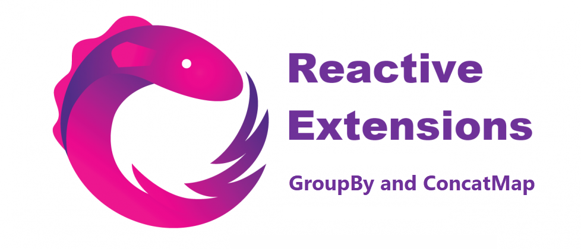
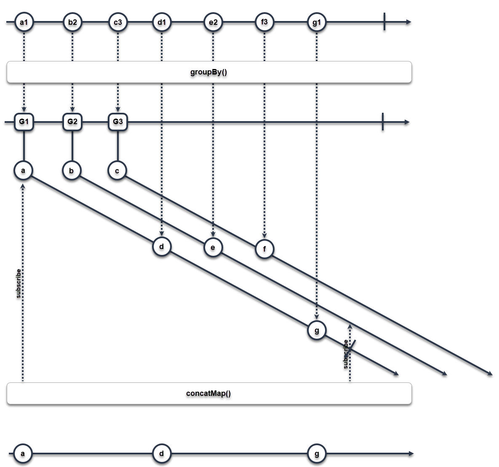

# 阅读 RxJS 源码我学到了这些关于 `groupBy` 操作符的知识

### 构建基于一定准则的数据分组管道时所隐藏的陷阱

> 原文：[Here is what I’ve learn about groupBy operator by reading RxJS sources](https://blog.angularindepth.com/those-hidden-gotchas-within-rxjs-7d5c57406041?source=---------1---------------------)
> 
> 作者：[Kiran Holla](https://blog.angularindepth.com/@kiranjholla?source=post_header_lockup)
> 
> 译者：[vaanxy](https://github.com/vaanxy)；校对者：[dreamdevil00](https://github.com/dreamdevil00)




------

可能大多数开发者已经听说过响应式编程，而在 JavaScript 世界中，尤指 **RxJS**。**RxJS** 是一个特别强大的库，让我们能够处理操作流式数据。该模式可以被用于处理异步事件，也能够创建处理数据的*管道（pipelines）*，这些处理过程也许不需要异步执行。RxJS 库提供了许多特性/操作符让开发者能够把业务逻辑分解成简单的代码片段，并将这些代码组合到一起让我们能够处理和实现非常复杂的数据变换工作。

------

#### RxJS 让我挠破了头的日子...

RxJS 虽然赋予了我们强大的功能，但其陡峭的学习难度也确实让人感到沮丧。虽然 RxJS 确实有着良好的文档，包括详细的操作符级别的文档以及 API 参考手册，一些棘手的场景仍会让你感到措手不及。我最近在设置数据处理*管道*用于将数据流转换为分类集时亲身体验到了这一点。

这是些输入数据的示例：

```typescript
const records = [
  { id: 'a', category: 1 },
  { id: 'b', category: 2 },
  { id: 'c', category: 3 },
  { id: 'd', category: 1 },
  { id: 'e', category: 2 },
  { id: 'f', category: 3 },
  { id: 'g', category: 1 },
  { id: 'h', category: 2 }
];
```

应得的输出如下：

```typescript
const result = [
  // Category 1
  { key: 1, value: { id: 'a', category: 1 } },
  { key: 1, value: { id: 'd', category: 1 } },
  { key: 1, value: { id: 'g', category: 1 } },
  // Category 2
  { key: 2, value: { id: 'b', category: 2 } },
  { key: 2, value: { id: 'e', category: 2 } },
  // Category 3
  { key: 3, value: { id: 'c', category: 3 } },
  { key: 3, value: { id: 'f', category: 3 } }
];
```

------

#### 数据管道

我打算创建一个*管道*，它将接受一系列数据点，根据一些属性对其进行分类，然后依次将分类结果的集合进行输出。虽然该功能使用一些函数式编程技巧和库能够非常容易的实现，而我选择 RxJS 是因为数据点的来源是异步的。

我提出的解决方案应该是很简单的：将一个 observable 流通过管道输送至 `groupBy` 操作符，紧接着跟上一个 `concatMap` 操作符用于最后获取序列数据集合。我曾以为基于 [Reactivex.io](http://reactivex.io/) 文档给出的关于 `groupBy` 和 `concatMap` 操作符的相关信息，这应该是一个简单的解决方案。

`groupBy` 操作符将会根据数据源中的每一个 *键（key）*分别创建独立的 Observable 流。每一个 Observable 流都会有属于该 *键（key）* 的独立数据元素。紧跟在后面的  `concatMap` 操作符将这些独立的 Observable 流一个接一个地全部合并到一个单一的流中以形成输出。

#### 概念证明

为了检验我想出的这个方法是否有效，我基于一些网上的示例编写了一段简单的概念证明代码，如下所示。

```typescript
const records = ['a', 'b', 'c', 'd'];
const pipedRecords = new Subject();
const result = pipedRecords.pipe(
  concatMap(
    group => group.subject$.pipe(
      take(2),
      map(x => ev.key + x)
    )
  )
);
const subscription = result.subscribe(x => console.log(x));
records.forEach(
  x => pipedRecords.next({key: x, subject$: interval(1000)})
);
pipedRecords.complete();
// Expected & Actual Output:
// a0
// a1
// b0
// b1
// c0
// c1
// d0
// d1
```

这段概念证明代码的运行结果令人感到鼓舞。我似乎确实实现了我的需求，我感到我使用  `concatMap`  操作符来整理一系列来自 Observable 的值，这一方法应该是有效的。

------

#### 现在来看看实际使用

这是我所想出的最终代码的超级简化版：

```typescript
const pipedRecords = new Subject();
const result = pipedRecords.pipe(
  groupBy(
    x => x.category
  ),
  concatMap(
    group$ => group$.pipe(
      map(obj => ({ key: group$.key, value: obj }))
    )
  )
);
const subscription = result.subscribe(x => console.log(x));
records.forEach(x => pipedRecords.next(x));
pipedRecords.complete();
```

#### 输出

这是代码的输出结果：

```typescript
const result = [
  { key: 1, value: { id: 'a', category: 1 } },
  { key: 1, value: { id: 'd', category: 1 } },
  { key: 1, value: { id: 'g', category: 1 } }
];
```

很明显，一些地方出现了问题，因为我创建的*管道*所返回的数据行数明显少于我的输入。

------

#### 一些探查工作

在 [ReactiveX.io](http://reactivex.io/) 上翻阅  [RxJS API 参考手册](https://rxjs-dev.firebaseapp.com/api) 一无所获后，我决定深入至RxJS源码，尝试去理解其背后真正的工作原理。

通过阅读 `groupBy` [操作符](https://github.com/ReactiveX/rxjs/blob/master/src/internal/operators/groupBy.ts#L138)的[源码](https://github.com/ReactiveX/rxjs/blob/master/src/internal/operators/groupBy.ts#L138)，我得知 `groupBy` 其内部会为源流（source stream）中找到的每一个 *key* 创建一个新的 `Subject` 实例。所有属于这个 *key* 的值都会被 `Subject` 实例立刻发射出来。

所有的 `Subject` 实例都会被包装进 `GroupedObservable ` 实例中并被 `groupBy` 操作符向下游发射出去。该  `GroupedObservable` 实例的流会作为 `concatMap` 操作符的输入。

`concatMap` 操作符内部会调用 `mergeMap` 操作符，并且将 `mergeMap` 的`并发数(conccurency)`这一传入参数设置为1，这意味着每次同时仅会有一个 Observable 源被订阅。在这种情况下 `mergeMap`  操作符将仅会订阅一个 Observable，因为我们传入给它的 `conccurency` 参数只允许它这么做，其他所有的 Observables 会被*缓存*起来，直到第一个 Observable 完成了工作（completed）。

#### 关于`RxJS Subject`的简短说明

到了这个阶段，我们必须理解 Subject 实例可以被认为是*热启动*的 Observable（*hot* Observables），也就是说，无论是否有订阅者他们都会生产通知。

因此，如果一个 observer 在一个 `Subject` 已经发射数据后对其进行订阅，那么这个 observer 会错过在这订阅前所有产生的值。

#### 这意味着什么？

`groupBy` 操作符为每一个 *key* 发射一个  `Subject`  实例，并使用这些 `Subject` 立刻发射出独立的值。然而，`mergeMap` 操作符从第一个 `Subject` 实例开始，在任何时间点依次只订阅了其中一个实例。

下图能帮助我们更好的进行理解：



属于第二第三组的值：b，c，d，e，f 因此而丢失了，concatMap() 操作符也因此从来没有见到过他们。

由上图可知，`mergeMap` 仅会在第一个 `Subject` 完成工作后（completed）才开始订阅第二个以及之后的 `Subject` 。然而，第二个以及之后的 `Subject` 从源流中一接受到值就立刻将他们发射出去了。

由于 `mergeMap` 操作符直到整个源流耗尽后才会订阅任何后续的 `Subject` 实例，所以这些来自后续 `Subject` 实例的值都不能被它所看到，并且实际上都已经丢失。

#### 如何修复这个问题？

考虑到调研这个问题我所花费的时间，修复该问题则显得非常简单。我仅是强制 `groupBy` 操作符去使用 `ReplaySubject` 来替代 `Subject` 实例就解决了这个问题。`ReplaySubject` 与 `Subject` 非常相似，它们只有1个至关重要的不同点。`ReplaySubject` 总是会确保任何新的 observers 将会接收到所有在其订阅前已经发出的值，以及订阅后未来将会被发射出来的值。因此，使用 `ReplaySubject` 能帮助我们保证在订阅过程中不会丢失任何值。

`groupBy` 操作符接收一个 `subjectSelector` 参数，该参数允许我们将切换 `Subject` 实例切换成 `ReplaySubject` 实例。

以下代码能够如期运行：

```typescript
const pipedRecords = new Subject();
const result = pipedRecords.pipe(
  groupBy(
    x => x.category,
    null,
    null,
    () => new ReplaySubject()  // Use ReplaySubject instead
  ),
  concatMap(
    group$ => group$.pipe(
      map(obj => ({ key: group$.key, value: obj }))
    )
  )
);
const subscription = result.subscribe(x => console.log(x));
records.forEach(x => pipedRecords.next(x));
pipedRecords.complete();
```

#### OK，但为什么概念证明能够正常运行呢？

概念证明和实际代码的区别在于 Observables 的 *热启动（hot）*和*冷启动（cold）*。

在实际代码之中，我的 Observable 流是在 `groupBy` 操作符内部生成的。`groupBy` 操作符使用这些 `Subject` 来发射值。`Subject` 是*热启动*的 Observable。不管是否有被订阅，它们都会生成通知。

而在概念证明中使用了 `interval` 来模型 Observable 流。但是 `interval` 创建的是*冷启动*的 Observable，它们只会在被订阅的时候才开始生成通知。

区别就在于此。在概念证明中，`concatMap` 操作符没有丢失任何值，因为这些值是直到对应的 Observable 被订阅时才被发射出来的。

------

### 总结

总之，这一次的经历在一开始令人非常沮丧，但很快就变成了一种美妙的学习经历。

Reactive Extensions 以及 RxJS 是非常强大的工具，但在使用 Observable 有几个细微差别，很容易让尚未入门的人感到不快。然而一旦您克服了阅读任何新代码时的迷惑期，你会惊喜的发现使用 RxJS 库书写的代码非常容易阅读和理解。

尝试一下吧。你不会失望的；比起通过阅读他们的文档所可能获得的收获，尝试本文的内容后，最终你可能会学到更多关于 RxJS 的知识。
